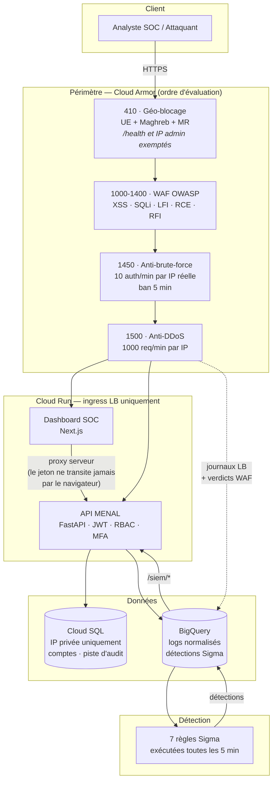

# MENAL Zero Trust — Exploitation, onboarding et démonstration

> **Ce document consolide et remplace `07_ONBOARDING_APPLICATION.md`, `08_RUNBOOK.md`,
> `GUIDE_DEMO.md`, `GUIDE_DEMO_ELSON.md`, `STATUT_DEV.md`, `ETAT_ELSON_STAGING.md`,
> `indexe-dev.md` (état au 19/08/2026).**

**État constaté au 19/08/2026.** Environnement de référence : `menal-zero-trust-staging`
(europe-west1). `menal-zero-trust-dev` reste disponible pour les essais manuels mais n'est
plus la cible de démonstration ni de validation depuis le 2 août 2026.

Ce document a un statut différent de celui des sept documents qu'il remplace : ce n'était
pas sept photographies indépendantes de l'état du projet, mais sept documents rédigés à des
dates différentes (30/07 pour `indexe-dev.md`, 2-3/08 pour `STATUT_DEV.md`, 7/08 pour
`ETAT_ELSON_STAGING.md`, 10/08 pour `GUIDE_DEMO_ELSON.md`), qui se recoupent largement sur
l'avancement du multi-tenant Elson et se contredisent par endroits — pas parce que l'un des
deux mentait, mais parce que l'état du projet avait changé entre-temps. La règle appliquée
ici est simple : **l'information la plus récente fait foi**, et les audits croisés du 11/08
et du 18/08 (`10_AUDIT_ECARTS_DOCUMENTATION_2026-08-11.md`,
`11_AUDIT_EXPERTS_SIGMA_RESEAU_IAM_MFA_2026-08-18.md`) priment sur les affirmations plus
anciennes qu'ils corrigent explicitement.

Sommaire :
1. [État d'avancement du projet](#1-état-davancement-du-projet)
2. [Onboarding d'une application sur le socle](#2-onboarding-dune-application-sur-le-socle)
3. [Runbook opérationnel](#3-runbook-opérationnel)
4. [Guide de démonstration MENAL](#4-guide-de-démonstration-menal)
5. [Guide de démonstration Elson et état staging](#5-guide-de-démonstration-elson-et-état-staging)

---

## 1. État d'avancement du projet

### 1.1 Repères chronologiques

| Date | Événement |
|---|---|
| 30/07 | Revue d'architecture initiale sur `dev` (`indexe-dev.md`) : infrastructure opérationnelle mais chaîne SIEM structurellement vide, JWT signé avec le secret par défaut codé en dur (CRITIQUE), dashboard Streamlit non fonctionnel, WIF trop permissif. Six anomalies critiques (C1-C6) et neuf durcissements (H1-H9) corrigés dans la foulée. |
| 31/07 | Réconciliation du dépôt (~90 fichiers déjà déployés mais jamais committés, commit `e8922d2`) ; MFA TOTP ajouté à l'API et au dashboard (commit `7dd8d79`) ; projet `menal-zero-trust-staging` provisionné pour de vrai (141 ressources Terraform) ; deux bugs Terraform réels découverts sur un projet neuf (agent de service BigQuery Data Transfer absent, nom du connecteur VPC trop long) et corrigés. |
| 01/08 | Modèle ATT&CK-BERT réel déployé en ONNX fp32 sur staging (872 vecteurs 768D, la variante int8 testée et rejetée par un gate d'accord de classement) ; trois bugs préexistants d'`enrich-job` corrigés (jamais un seul mapping produit avant cette session) ; incident `cve_findings` vidée par un `apply -target` (111 lignes perdues, leçon retenue : toujours lire le plan Terraform en entier). |
| 02/08 | `staging` devient l'environnement de référence du pipeline CI-SEC-CD ; pipeline vert de bout en bout ; trois défauts réels interceptés par les portes (Gitleaks muet par clone superficiel, CVE CRITICAL réelle bloquée sur `node-tar`, géo-blocage rendant le smoke test aveugle) ; chaîne SIEM auditée maillon par maillon et corrigée ; principe cardinal Zero Trust tenu par la création de `sa-enrich-job`. |
| 03/08 | SLO instrumentés (disponibilité 99 %, latence P95 < 1 s, retard d'enrichissement) ; restauration Cloud SQL **réellement exécutée** (RTO 32 min 45 s, RPO 0) ; runbook rédigé (§3 de ce document). |
| 07/08 | Onboarding Elson : infrastructure déclarée en Terraform (module `app-service`, `environments/staging/elson.tf`) ; Elson **réellement déployée** sur GCP staging derrière le socle MENAL (`elson.menal-sarl.com`) ; isolation SQL prouvée (REVOKE/GRANT croisés + durcissement) ; déploiement fait manuellement, `ELSON_DEPLOY_ENABLED=false`. Détail en §5. |
| 10/08 | Correction de `GUIDE_DEMO_ELSON.md` : la version du 02/08 affirmait qu'Elson ne tournait pas sur GCP, ce n'était plus vrai depuis le 07/08 ; démo de brute-force chronométrée (détection confirmée en 6 min 15 s). |
| 11/08 | Audit croisé documentation ↔ réalité (`10_AUDIT_ECARTS_DOCUMENTATION_2026-08-11.md`) : quatre constats critiques — `ml-embed` tourne sous `sa-pipeline` qui détient `bigquery.dataEditor` au niveau **projet** (écart Zero Trust non corrigé) ; l'enrichissement ATT&CK-BERT n'est **pas** joint au scoring d'incident malgré ce qu'affirme sa documentation ; les logs de deny pare-feu et NAT sont documentés comme actifs mais **non configurés** ; la clé tenant (`service`) du SIEM est partielle, pas absente — voir la correction détaillée en §5.2. |
| 18/08 | Audit par quatre profils experts indépendants (`11_AUDIT_EXPERTS_SIGMA_RESEAU_IAM_MFA_2026-08-18.md`) : confirme que les écarts IAM (`sa-pipeline`) et réseau (logs deny) du 11/08 sont **toujours ouverts** ; ajoute qu'il n'existe **aucune segmentation réseau réelle entre tenants** (isolation aujourd'hui purement applicative) ; qu'`/auth/mfa/verify` n'est **pas** couvert par la règle anti-bruteforce Cloud Armor (seul un `slowapi` applicatif filtre) ; que `mfa_secret` est stocké en clair en base ; et que le nom « Sigma » des règles de détection n'est pas justifié techniquement (SQL BigQuery custom, pas de moteur Sigma réel) — assumé et documenté dans le rapport PFE, mais présenté de façon plus flatteuse dans le code/UI. |

### 1.2 Ce qui est acquis et vérifié

| Critère | Preuve |
|---|---|
| Pipeline CI-SEC-CD vert de bout en bout sur `staging` | Exécutions GitHub Actions ; §1.1 (02/08) |
| Les portes de sécurité bloquent réellement | Trois défauts réels interceptés le 02/08, dont une CVE CRITICAL |
| Infrastructure entièrement décrite en Terraform, `plan` vide | Convergence vérifiée sur staging |
| Chaîne SIEM alimentée et exacte de bout en bout (hors clé tenant, cf. §1.3) | Audit maillon par maillon, §1.1 |
| Principe cardinal Zero Trust tenu pour `enrich-job` | `sa-enrich-job` scopé table par table |
| Détection réelle sur trafic réel, enrichie par un vrai modèle | T13/T14 sur staging ; §4-§5 |
| Sauvegardes et récupération à un instant donné | Cloud SQL : 7 sauvegardes, PITR 7 jours, restauration testée (RTO 32 min 45 s, RPO 0) |
| SLO chiffrés et instrumentés | Disponibilité 99 %, latence P95 < 1 s, SLI de retard d'enrichissement — Cloud Monitoring |
| Runbook d'incident | §3 de ce document — astreinte toujours à désigner |
| Elson intégrée derrière le socle, isolation base prouvée | §5.4-§5.5 |
| MFA TOTP fonctionnel, aucun chemin de bypass identifié sur le flux principal | `api/tests/test_mfa.py` (18 tests) ; §1.3 pour la nuance sur l'endpoint `/auth/mfa/verify` |

### 1.3 Écarts encore ouverts au 19/08/2026

Table consolidée : backlog assumé de `STATUT_DEV.md`/`07_ONBOARDING_APPLICATION.md` +
constats non corrigés des audits du 11/08 et du 18/08. Classée par gravité déclarée dans les
audits quand elle existe.

| # | Écart | Nature | Depuis |
|---|---|---|---|
| 1 | `sa-pipeline` (donc `ml-embed`) détient `bigquery.dataEditor` au niveau **projet** | CRITIQUE / IAM — écart Zero Trust connu, jamais corrigé | 11/08, confirmé ouvert 18/08 |
| 2 | Logs de deny pare-feu et NAT documentés comme actifs mais non configurés (0 ligne) | CRITIQUE / réseau — perte de visibilité forensique sur le mouvement latéral | 11/08, confirmé ouvert 18/08 |
| 3 | Clé tenant (`service`) partielle dans le SIEM : fiable pour R1 seulement, 75-90 % NULL sur R2/R3/R6 ; absente d'`api_metrics`, `alert_enrichment`, `cve_findings` | ÉLEVÉ / multi-tenant — voir correction détaillée §5.2 | 11/08 |
| 4 | Aucune segmentation réseau réelle entre tenants MENAL/Elson (VPC, connecteur, Cloud SQL partagés ; `allow_internal` autorise tout trafic inter-subnet) — isolation aujourd'hui purement applicative (SA, DB, secrets dédiés) | ÉLEVÉ / réseau multi-tenant — à traiter avant un 3ᵉ client | 18/08 |
| 5 | `/auth/mfa/verify` non couvert par la règle Cloud Armor anti-bruteforce (`auth_paths` par défaut) ; `mfa_secret` stocké en clair en base | ÉLEVÉ / AppSec | 18/08 |
| 6 | ATT&CK-BERT non joint au scoring d'incident malgré l'affirmation contraire de `ATTACK-BERT_Integration_SIEM_ZeroTrust.md` §5.3 — le modèle reste informationnel (KPI agrégé), pas décisionnel | CRITIQUE / documentation-réalité | 11/08 |
| 7 | Cloud SQL zonal (`db-f1-micro`, sans réplica) — seul SPOF structurel de la base | Arbitrage coût/risque à décider explicitement | connu depuis juillet, non résolu |
| 8 | Canal d'alerte unique, adresse personnelle non vérifiée ; **aucune astreinte désignée** | L'alerting est lui-même un point unique de défaillance | connu depuis le runbook (03/08) |
| 9 | Pas d'environnement de production (`terraform/environments/prod/` vide) | La chaîne dev→staging→prod n'a jamais été déroulée | depuis l'origine |
| 10 | Isolation inter-environnements de la CI incomplète | La condition d'accès fédéré WIF porte sur le dépôt, pas sur la branche/tag | connu |
| 11 | Couverture de tests dashboard 2,99 % lignes (toutes les pages `src/app/*` à 0 %) | CI dashboard verte « par construction », sans rien vérifier réellement | mesuré 11/08 |
| 12 | Nom « Sigma » des règles de détection non justifié techniquement (SQL BigQuery custom, pas de moteur Sigma standard) | Assumé et documenté dans le rapport PFE, mais présentation produit plus flatteuse que la doc technique | 18/08 |
| 13 | Requêtes planifiées BigQuery : ~78 Go/jour facturés pour un dataset de 24 Mo | Plus de 99 % du volume est le minimum forfaitaire par table, multiplié par les exécutions ; fusionner les 7 règles ramènerait le poste sous le palier gratuit | connu depuis 02/08 |
| 14 | Rétention 90 j des partitions BigQuery toujours commentée (limite d'un binaire Terraform 32 bits) | Coût nul aujourd'hui, croissance non bornée | connu |
| 15 | `scripts/hotfix.sh` contourne toujours le CI, codé en dur sur `menal-zero-trust-dev` (ne peut pas cibler `staging` malgré ce qu'affirmait une version antérieure de ce document) | À supprimer une fois `ml-embed` intégré au pipeline CI | corrigé en formulation le 11/08 |

Les points 1, 2 et 6 sont ceux que l'audit du 11/08 qualifie de critiques et qui bloquent une
présentation sans nuance du multi-tenant et de l'enrichissement sémantique comme des acquis
« terminés » : ils sont réels, connus, et pas corrigés à ce jour. Les points 4 et 5 sont les
ajouts de l'audit du 18/08, qui ne remplacent aucun constat antérieur mais les complètent.

---

## 2. Onboarding d'une application sur le socle

Procédure pour placer une application (Elson ou toute autre application MENAL) derrière le
socle : Load Balancer, Cloud Armor, journalisation, détection et tableau de bord SOC. Elle
décrit ce que la plateforme sait faire **aujourd'hui**, et à quelles conditions — ce n'est pas
un plan de migration d'Elson : l'état d'Elson réel est traité en détail au §5.

### 2.1 Prérequis côté application

Une application ne peut pas être intégrée telle quelle. Ces cinq points ne sont pas
négociables — non par formalisme, mais parce que chacun casse le socle s'il est ignoré.

| # | Prérequis | Pourquoi |
|---|---|---|
| 1 | **Sans état sur le disque local** | Cloud Run détruit et recrée les instances sans préavis. Tout ce qui doit survivre va en base ou dans un bucket |
| 2 | **Configuration par variables d'environnement**, secrets via Secret Manager | Un secret dans une image se retrouve dans le registre, puis dans chaque copie de l'image |
| 3 | **Un secret par usage**, jamais un secret partagé entre plusieurs mécanismes | Une rotation devient sinon un choix entre tout casser et ne rien tourner |
| 4 | **Écoute sur `$PORT`**, healthcheck HTTP répondant sans dépendance externe | La sonde doit dire « ce conteneur est vivant », pas « toute la chaîne va bien » — sinon une panne de base fait redémarrer en boucle des conteneurs sains |
| 5 | **Schéma de base reconstructible depuis le dépôt** (migrations versionnées) | Sans cela, aucun environnement n'est reproductible, et la reprise après incident est une opération manuelle non testée |

À vérifier également : pas d'identifiants par défaut, pas de compte d'administration créé
automatiquement avec un mot de passe connu.

### 2.2 Ce que la plateforme apporte, et ce qu'elle n'apporte pas

**Apporté automatiquement**, sans modification de l'application :

- TLS managé, redirection HTTP→HTTPS, IP anycast globale ;
- Cloud Armor : géo-blocage (UE + Maghreb + Mauritanie), règles OWASP (XSS, SQLi, LFI, RCE,
  RFI), limitation de débit anti-DDoS et anti-force-brute au bord sur les chemins
  d'authentification ;
- journalisation centralisée vers BigQuery (flux F4) et normalisation ;
- règles de détection R1–R7 sur le trafic, avec étiquetage MITRE ATT&CK — nommées « Sigma »
  dans le code, mais implémentées en SQL BigQuery custom, pas dans le format standard SigmaHQ
  (nuance §1.3 point 12) ;
- enrichissement sémantique ATT&CK-BERT des détections — **informationnel aujourd'hui, pas
  encore joint au scoring d'incident** (§1.3 point 6) ;
- restitution dans le tableau de bord SOC (détections, incidents, couverture ATT&CK,
  vulnérabilités) ;
- surveillance et alertes (erreurs, latence, échecs d'authentification, ingestion à l'arrêt).

**Non apporté** — reste à la charge de l'application :

- l'authentification et l'autorisation applicatives (le MFA de la plateforme protège les
  comptes MENAL du tableau de bord, pas les utilisateurs de l'application hébergée) ;
- la validation des entrées : Cloud Armor filtre les charges connues, il ne remplace pas
  un contrôle applicatif ;
- la sécurité de la logique métier ;
- les sauvegardes applicatives au-delà de celles de Cloud SQL ;
- **la segmentation réseau entre applications hébergées** : l'isolation est aujourd'hui
  purement applicative (compte de service, base, secrets dédiés) — pas de séparation réseau
  réelle entre tenants tant qu'un VPC/connecteur/instance Cloud SQL est partagé (§1.3 point 4).

### 2.3 Étapes d'intégration

**2.3.1 Compte de service dédié** — un par application, jamais partagé. Les droits accordés
sont ceux dont elle a besoin et rien de plus : `cloudsql.client` si elle utilise la base,
`secretmanager.secretAccessor` sur ses propres secrets (binding par secret, jamais projet).
**Aucun accès BigQuery** : une application hébergée ne lit pas le SIEM. Depuis le 07/08,
tout cela est porté par **`terraform/modules/app-service`** (SA + secrets « un par usage » +
base/user dédiés + bucket + job de migration), instancié une fois par application — voir
`environments/staging/elson.tf` pour le modèle complet.

**2.3.2 Image et registre** — image construite par le pipeline CI, poussée dans Artifact
Registry, scannée par Trivy (une CVE CRITICAL corrigeable bloque la livraison). Pas de
registre externe : un seul registre de confiance.

**2.3.3 Service Cloud Run** — sur le modèle de `terraform/modules/cloud-run` :
ingress `INGRESS_TRAFFIC_INTERNAL_LOAD_BALANCER` (joignable **uniquement** par le Load
Balancer, jamais par son URL `run.app`), connecteur VPC pour atteindre la base en IP privée,
`cpu_idle = true` pour la facturation à la requête.

**2.3.4 Routage** — **aucune modification du module** : déclarer l'application dans
`extra_services` (terraform.tfvars) — domaine, service par défaut, et pour une app
same-origin les chemins `api_paths` routés vers un second service. Le module génère NEG,
backend, règle d'hôte et certificat managé. L'enregistrement DNS (A → IP du LB) doit exister
**avant** l'apply, sinon le certificat reste en PROVISIONING.

**2.3.5 Journalisation** — le sink Cloud Run ne capte **que** les services listés dans
`cloud_run_services` (terraform.tfvars) : oublier d'y ajouter le nouveau service = app
absente du SIEM, **sans aucune erreur visible**. En renseignant la liste, toujours réinclure
`menal-api-<env>` (elle écrase le fallback historique). Vérifier ensuite que les requêtes
apparaissent dans `access_logs` après normalisation : c'est la condition pour que les règles
de détection voient quoi que ce soit.

**2.3.6 Adapter les règles de détection** — R1 cible `status_code IN (401, 403)` sur
`access_logs`, indépendamment du service : elle fonctionne donc immédiatement pour tout
endpoint d'authentification, avec une colonne tenant fiable à 100 %. Pour R4 (user-agent
scripté sur `/api/`), une application grand public dont toute la surface est sous `/api` doit
être exclue via `r4_excluded_services` (terraform.tfvars) — sinon chaque client scripté
légitime devient une détection. Ajouter aussi l'application à `monitored_services` (alertes,
uptime, SLO par service) et ses chemins d'authentification à `auth_paths` (règle Cloud Armor
1450) — en réincluant les valeurs `menal-api` existantes dans les deux cas. **Ne pas oublier
les endpoints MFA** dans `auth_paths` si l'application en a : `/auth/mfa/verify` de MENAL
elle-même n'y figurait pas (§1.3 point 5), rappel que ce filtrage doit être vérifié
explicitement, pas supposé.

### 2.4 Cas d'Elson — l'onboarding réel

Elson est le **premier cas réel** de cette procédure, en cours depuis le 07/08/2026. L'état
détaillé (architecture déployée, preuve d'isolation, surveillance, CI/CD, limites) est traité
intégralement au §5 pour éviter la duplication. En résumé : infrastructure Terraform
complète et activable (`elson_enabled`), Elson réellement déployée sur `staging` derrière le
même socle que MENAL, isolation SQL prouvée par un job quotidien, déploiement encore manuel
(`ELSON_DEPLOY_ENABLED=false`). La procédure d'activation pas à pas est au §3.8 de ce
document (ex-`08_RUNBOOK.md` §8).

### 2.5 Critères de passage en phase de commercialisation

Ce que la plateforme peut afficher comme acquis, et ce qui manque encore, sont détaillés aux
§1.2 et §1.3. Ce qui suit est le jugement propre à l'onboarding : par ordre d'importance pour
un engagement contractuel qui inclurait l'hébergement d'une application tierce.

1. **Cloud SQL zonal** (§1.3 point 7) — arbitrage coût/risque à assumer explicitement. Avec
   le RTO désormais connu (32 min 45 s mesuré), la question est chiffrée : accepte-t-on
   ~45 min à 1 h d'arrêt en cas de panne de zone, ou paie-t-on la haute disponibilité ?
2. **Segmentation réseau entre tenants** (§1.3 point 4) — à traiter avant l'onboarding d'un
   troisième client : l'isolation purement applicative suffit pour un cas unique (Elson) mais
   ne passe pas l'argumentaire « Zero Trust » devant un auditeur externe au-delà.
3. **Canal d'alerte unique** (§1.3 point 8), sur une adresse personnelle non vérifiée, et
   **aucune astreinte désignée** — le runbook (§3) dit quoi faire, pas qui le fera.
4. **IAM `sa-pipeline`/`ml-embed`** (§1.3 point 1) — écart Zero Trust connu depuis le 11/08,
   toujours ouvert au 18/08. À corriger ou à acter formellement en ADR avant tout audit
   externe, plutôt que de laisser un écart documenté mais non tranché.
5. Les points 9 et 10 (pas de production, isolation CI incomplète) restent ouverts.

---

## 3. Runbook opérationnel

**Dernière validation des chiffres de restauration :** 3 août 2026 (test réel, §3.3).
Ce chapitre est fait pour être suivi **pendant** un incident, pas lu avant. Chaque procédure
donne la commande exacte, ce qu'on attend en retour, et la durée observée — pas estimée.

### 3.0 Réflexes de premier niveau

| Question | Commande |
|---|---|
| L'API répond-elle ? | `curl -s -o /dev/null -w "%{http_code}\n" https://api-staging.menal-sarl.com/health` |
| Le tableau de bord ? | `curl -s -o /dev/null -w "%{http_code}\n" https://dash-staging.menal-sarl.com/login` |
| Quelles alertes sont ouvertes ? | `gcloud alpha monitoring policies list --project=menal-zero-trust-staging --format="value(displayName,enabled)"` |
| Quelle révision est en service ? | `gcloud run services describe menal-api-staging --project=menal-zero-trust-staging --region=europe-west1 --format="value(status.traffic)"` |
| La base est-elle debout ? | `gcloud sql instances describe menal-db-staging --project=menal-zero-trust-staging --format="value(state)"` |

**Attention — `/health` ne teste pas la base de données.** Il renvoie `200` même si Cloud SQL
est injoignable (`api/main.py`, réponse statique). Un `/health` vert **n'est donc pas** une
preuve que la plateforme fonctionne : c'est une preuve que le conteneur est vivant. Pour
savoir si la base répond, interroger un point d'accès qui la lit (`/users/` renvoie `403`
sans jeton mais touche la base) ou regarder le taux de `5xx`.

### 3.1 Retour arrière d'un déploiement

**Quand :** une livraison vient de passer et les erreurs augmentent, ou une régression
fonctionnelle est constatée.

```bash
PROJET=menal-zero-trust-staging; REGION=europe-west1; SERVICE=menal-api-staging

# 1. Lister les révisions, la plus récente en tête
gcloud run revisions list --service=$SERVICE --project=$PROJET --region=$REGION --limit=5 \
  --format="table(metadata.name, metadata.creationTimestamp, status.conditions[0].status)"

# 2. Basculer 100 % du trafic sur la révision précédente
gcloud run services update-traffic $SERVICE --project=$PROJET --region=$REGION \
  --to-revisions=<REVISION_PRECEDENTE>=100

# 3. Vérifier
curl -s -o /dev/null -w "%{http_code}\n" https://api-staging.menal-sarl.com/health
```

Durée : quelques secondes. Le retour arrière ne redéploie rien — il redirige le trafic vers
une révision déjà construite et déjà démarrée.

**Le même geste s'applique au tableau de bord** avec `SERVICE=menal-dashboard-staging`.

**Ne pas** faire de retour arrière par `terraform apply` : les modules `cloud-run`,
`dashboard` et `ml-pipeline` portent un `ignore_changes` sur l'image précisément pour que
Terraform ne se batte pas avec le pipeline de livraison. Un `apply` ne ramènerait pas la
révision précédente, il ramènerait le tag `:latest`, qui n'est pas la même chose.

### 3.2 Panne de base de données

**Symptômes :** `5xx` en hausse, alerte « Pics 5xx » ou « Taux d'erreur API », **mais
`/health` toujours vert** (voir §3.0).

```bash
# Etat, zone, opérations en cours
gcloud sql instances describe menal-db-staging --project=menal-zero-trust-staging \
  --format="yaml(state,gceZone,settings.availabilityType)"
gcloud sql operations list --instance=menal-db-staging --project=menal-zero-trust-staging --limit=5
```

**L'instance est zonale** (`europe-west1-b`, sans réplica) : une panne de zone Google arrête
le service et **aucune bascule automatique n'existe**. C'est un risque accepté, documenté en
§1.3 point 7. Dans ce cas, la seule option est la restauration (§3.3), avec le délai mesuré
ci-dessous.

Si l'instance est `RUNNABLE` mais que l'API échoue quand même, chercher du côté du connecteur
VPC et des connexions :

```bash
gcloud compute networks vpc-access connectors describe menal-vpc-connector-stg \
  --project=menal-zero-trust-staging --region=europe-west1 --format="value(state)"
```

### 3.3 Restauration de la base — procédure validée le 3 août 2026

#### Chiffres mesurés, pas estimés

| Grandeur | Valeur mesurée | Comment |
|---|---|---|
| **RTO** (durée de restauration) | **32 min 45 s** | Opération `CLONE` de 11:16:40 à 11:49:26 UTC, instance `db-f1-micro`, 10 Go |
| **RPO** (perte de données) | **0** au point demandé | 314 lignes attendues, 314 restaurées, 0 manquante, 0 en trop ; les 3 écritures postérieures au point de restauration correctement absentes |
| Fenêtre de restauration disponible | **7 jours** | `transactionLogRetentionDays: 7`, journaux en Cloud Storage |
| Sauvegardes complètes conservées | **7**, quotidiennes à 02:00 UTC | `retainedBackups: 7` |

**Le RTO réel à annoncer est supérieur à 32 min** : il faut y ajouter le temps de détection,
de décision, et la bascule de l'application vers l'instance restaurée. Compter **45 min à 1 h**
de bout en bout tant que ces étapes ne sont pas elles-mêmes chronométrées.

#### Procédure

> **⚠️ Instance partagée multi-app (depuis l'onboarding Elson).** Le clone PITR restaure
> **l'instance entière** : ramener `menal_db` à T-2h ramène AUSSI `elson_db` à T-2h. Avant
> toute bascule vers l'instance restaurée, décider quoi faire de l'autre base : soit la
> fenêtre d'incident est commune (bascule totale assumée), soit il faut extraire la seule
> base sinistrée du clone (`pg_dump` de la base depuis le clone → restore ciblé sur
> l'instance d'origine) et NE PAS basculer l'instance. Ce second chemin n'a jamais été
> chronométré — le tester avant de s'engager sur un RTO multi-app.

**Restaurer toujours vers une instance NEUVE**, jamais par-dessus l'originale : tant que la
cause n'est pas comprise, l'instance d'origine est une pièce à conviction. C'est aussi ce qui
permet de comparer avant de basculer.

```bash
PROJET=menal-zero-trust-staging

# 1. Choisir le point de restauration. IMPÉRATIF : dans le PASSÉ.
#    Une date même de quelques secondes dans le futur est rejetée par l'API
#    ("PITR Timestamp should be before current time") — piège rencontré au test.
PIT="2026-08-03T11:13:00Z"

# 2. Cloner (≈ 33 min). La commande gcloud rend la main au bout de ~10 min
#    avec un message d'attente : ce n'est PAS un échec, l'opération continue.
gcloud sql instances clone menal-db-staging menal-db-restore \
  --project=$PROJET --point-in-time="$PIT"

# 3. Si la commande a rendu la main avant la fin, suivre l'opération :
gcloud sql operations list --instance=menal-db-restore --project=$PROJET --limit=1
gcloud beta sql operations wait --project=$PROJET <OPERATION_ID> --timeout=1800

# 4. Vérifier que l'instance est debout et que la base existe
gcloud sql instances describe menal-db-restore --project=$PROJET --format="value(state)"
gcloud sql databases list --instance=menal-db-restore --project=$PROJET
```

#### Vérifier le contenu sans exposer l'instance

L'instance restaurée est en IP privée : on ne peut pas s'y connecter depuis un poste. **Ne
pas lui ajouter d'IP publique pour vérifier** — cela exposerait une copie complète des données
à Internet, au pire moment. Passer par un export, qui utilise l'API d'administration et ne
demande aucune connectivité réseau :

```bash
BUCKET=menal-restore-verify-$(date -u +%s)
gcloud storage buckets create gs://$BUCKET --project=$PROJET \
  --location=europe-west1 --uniform-bucket-level-access

SA=$(gcloud sql instances describe menal-db-restore --project=$PROJET \
       --format="value(serviceAccountEmailAddress)")
gcloud storage buckets add-iam-policy-binding gs://$BUCKET \
  --member="serviceAccount:$SA" --role="roles/storage.objectAdmin"

gcloud sql export sql menal-db-restore gs://$BUCKET/verif.sql \
  --database=menal_db --table=audit_logs --project=$PROJET

gcloud storage cp gs://$BUCKET/verif.sql .
```

Comparer ensuite avec un export de l'instance d'origine : toutes les lignes antérieures au
point de restauration doivent être présentes, et **aucune postérieure**. C'est ce contrôle,
et non la seule présence du schéma, qui prouve que la restauration a coupé au bon endroit.

#### Basculer l'application

```bash
# Le nom de connexion est une variable d'environnement du service Cloud Run
gcloud run services update menal-api-staging --project=$PROJET --region=europe-west1 \
  --set-env-vars CLOUD_SQL_CONNECTION_NAME=$PROJET:europe-west1:menal-db-restore
```

Puis **reporter le changement dans Terraform** (`modules/cloud-sql`, `modules/cloud-run`),
sinon le prochain `apply` ramènera l'ancienne instance.

#### Nettoyage

```bash
gcloud sql instances delete menal-db-restore --project=$PROJET --quiet
gcloud storage rm -r gs://$BUCKET --quiet
```

Une instance de restauration oubliée est facturée en continu. Le nettoyage fait partie de la
procédure, pas d'un rangement ultérieur.

### 3.4 Réponse aux alertes

Dix politiques sont actives. Ce que chacune veut dire, et par où commencer.

| Alerte | Ce qu'elle signifie | Premier geste |
|---|---|---|
| **Taux d'erreur API > 10 %** | Régression applicative ou dépendance en panne | Journaux Cloud Run de la révision en service ; retour arrière (§3.1) si la livraison est récente |
| **Pics 5xx > 30 / 5 min** | Idem, en plus brutal | Idem, et vérifier la base (§3.2) |
| **Latence P99 > 2 s** | Saturation, ou démarrages à froid en rafale | Vérifier le nombre d'instances ; l'API est à `min_instance_count = 0` |
| **Échecs auth > 20 / 5 min** | Attaque par force brute en cours | Vérifier que R1 s'est déclenchée (`detections`) et que Cloud Armor bannit (règle 1450). Si l'attaque passe, c'est le bord qui a un problème, pas l'application |
| **Cloud SQL CPU > 80 %** | Requête coûteuse, ou instance sous-dimensionnée (`db-f1-micro`) | `gcloud sql operations list` ; regarder les requêtes lentes |
| **API Health Check échoue** | Le conteneur ne répond plus du tout | Retour arrière (§3.1). **Ne pas conclure que la base va bien** parce que cette alerte est muette (§3.0) |
| **Job d'enrichissement ML en échec** | ml-embed injoignable, BigQuery en erreur, ou insertion refusée | §3.5 |
| **Requête planifiée BigQuery en échec** | Une règle de détection ou une normalisation ne tourne plus | §3.6 |
| **Ingestion des journaux à l'arrêt** | Plus aucune requête observée depuis 30 min | Soit l'API est morte, soit la chaîne de journalisation est rompue. Vérifier d'abord que l'API répond |
| **Enrichissement en retard (> 30 min)** | Le résultat n'arrive plus, quelle qu'en soit la cause | §3.5. C'est l'alerte à privilégier : elle mesure le résultat, pas un composant |

### 3.5 Le pipeline ML n'enrichit plus

```bash
PROJET=menal-zero-trust-staging; REGION=europe-west1

# Le job s'exécute-t-il, et réussit-il ?
gcloud run jobs executions list --job=menal-enrich-job-staging \
  --project=$PROJET --region=$REGION --limit=5 \
  --format="table(name,status.completionTime,status.succeededCount,status.failedCount)"

# Que dit le dernier run ? (la mesure de retard y figure en JSON)
gcloud logging read 'resource.type="cloud_run_job"
  AND resource.labels.job_name="menal-enrich-job-staging"' \
  --project=$PROJET --limit=20 --format="value(textPayload,jsonPayload.message)" --freshness=1h

# Le déclencheur tourne-t-il toujours ?
gcloud scheduler jobs describe menal-enrich-trigger-staging \
  --project=$PROJET --location=$REGION --format="value(state,schedule)"

# Combien de détections attendent ? (source de vérité)
bq query --project_id=$PROJET --use_legacy_sql=false \
 'SELECT COUNT(*) AS en_attente FROM `menal_security_staging.detections` d
  WHERE d.timestamp >= TIMESTAMP_SUB(CURRENT_TIMESTAMP(), INTERVAL 2 HOUR)
    AND NOT EXISTS (SELECT 1 FROM `menal_security_staging.alert_enrichment` e
                    WHERE e.detection_id = CONCAT("{\"rule_id\": \"", d.rule_id,
                      "\", \"timestamp\": \"",
                      FORMAT_TIMESTAMP("%Y-%m-%d %H:%M:%E6S+00:00", d.timestamp), "\"}"))'
```

**Le job échoue désormais franchement quand il échoue** — ce n'était pas le cas avant le
2 août, où il sortait en succès même ml-embed injoignable. Un `failedCount` non nul est donc
une information fiable, et `max_retries = 2` reprend automatiquement.

**Une exécution en succès avec un retard qui monte** signifie que le job tourne mais ne
traite rien : regarder `ml-embed` (démarrage à froid du modèle ONNX, ~26 s mesurés) et les
droits BigQuery de `sa-enrich-job`.

**Ne pas relancer le job en boucle pour « débloquer »** : il déduplique. Relancer ne
retraitera pas ce qui est déjà enrichi et ne changera rien au symptôme.

### 3.6 Une règle de détection ou une normalisation ne tourne plus

```bash
# Lister les 12 transferts (7 règles R1-R7 + 5 normalisations F4)
bq ls --transfer_config --transfer_location=europe-west1 \
  --project_id=menal-zero-trust-staging

# Historique d'exécution d'un transfert
bq ls --transfer_run --run_attempt=LATEST \
  --filter='states:FAILED' <RESOURCE_NAME>
```

**Vérifier la fraîcheur des tables plutôt que l'état des transferts** — c'est plus rapide et
c'est ce qui compte :

```bash
bq query --project_id=menal-zero-trust-staging --use_legacy_sql=false \
 'SELECT "access_logs" t, MAX(timestamp) dernier FROM `menal_security_staging.access_logs`
  UNION ALL SELECT "detections", MAX(timestamp) FROM `menal_security_staging.detections`
  UNION ALL SELECT "alert_enrichment", MAX(timestamp) FROM `menal_security_staging.alert_enrichment`
  UNION ALL SELECT "api_metrics", MAX(hour) FROM `menal_security_staging.api_metrics`'
```

`access_logs` doit être frais à quelques minutes. `detections` peut légitimement être ancien :
les règles n'insèrent que s'il y a quelque chose à détecter.

**Piège déjà rencontré :** un `terraform apply -target` a un jour déclenché un remplacement
destructeur en attente sur `cve_findings` et vidé la table (111 lignes perdues). Avant tout
`apply`, **lire le plan en entier**, pas seulement sa fin.

### 3.7 Escalade et points de contact

| Rôle | Qui | Quand |
|---|---|---|
| Astreinte technique | **à désigner** | — |
| Propriétaire GCP | `mansour.cheikh2010@gmail.com` | Décisions IAM, facturation |
| Canal d'alerte | e-mail, canal unique **non vérifié** | — |

> **Deux manques assumés, à traiter avant tout engagement client.** Il n'existe qu'un seul
> canal d'alerte, sur une adresse personnelle dont la vérification n'a jamais été confirmée :
> l'alerting est donc lui-même un point unique de défaillance. Et aucune astreinte n'est
> désignée — ce runbook décrit quoi faire, pas qui le fera à 3 h du matin.

### 3.8 Onboarding Elson — opérations (07/08/2026)

L'infra Elson est déclarée dans `terraform/environments/staging/elson.tf`, désactivée par
`elson_enabled=false`. L'activation se fait **en deux temps**, dans cet ordre strict :

**Temps 1 — refactos socle (déjà commités)** : `terraform plan` doit montrer uniquement les
`moved` du monitoring (aucun destroy). Appliquer. Toute destruction d'une ressource MENAL
dans le plan = arrêt immédiat (moved block ou tfvars raté) — lire le plan EN ENTIER.

**Temps 2 — activation Elson**, préconditions TOUTES remplies :
1. Enregistrement A `elson.menal-sarl.com` → IP du LB staging (`8.232.24.132`) chez le
   registrar — AVANT l'apply, sinon le certificat managé reste en PROVISIONING.
2. Variables GitHub créées : `ELSON_API_SERVICE_NAME`, `ELSON_WEB_SERVICE_NAME`,
   `ELSON_MIGRATE_JOB_NAME`, `ELSON_DOMAIN` (cf. en-tête de `elson-ci.yml`).
3. Premier passage de `elson-ci.yml` sur main : images `elson-backend`/`elson-frontend`
   poussées dans Artifact Registry (le module cloud-run référence `:latest`).
4. Dans `terraform.tfvars` : `elson_enabled=true` + décommenter TOUT le bloc Elson d'un
   coup (`cloud_run_services`, `auth_paths`, `extra_services`, `monitored_services`,
   `r4_excluded_services`) — en réincluant les valeurs menal-api (piège des fallbacks).
5. `terraform apply -target=module.elson_app` (SA/secrets/base/bucket/job), puis apply
   complet.
6. **Isolation SQL (une fois)** — les users Postgres Cloud SQL sont membres de
   `cloudsqlsuperuser`, sans ces REVOKE chaque app lit la base de l'autre :
   ```sql
   REVOKE CONNECT ON DATABASE menal_db FROM PUBLIC;
   REVOKE CONNECT ON DATABASE menal_db FROM elson_user;
   GRANT  CONNECT ON DATABASE menal_db TO api_user;
   REVOKE CONNECT ON DATABASE elson_db FROM PUBLIC;
   REVOKE CONNECT ON DATABASE elson_db FROM api_user;
   GRANT  CONNECT ON DATABASE elson_db TO elson_user;
   ```
   Exécution : **via le job `elson-migrate-staging`** (`src/scripts/sql-isolation.ts`,
   retag `:latest` + `--command "npx,tsx,src/scripts/sql-isolation.ts"`), pas via
   cloud-sql-proxy : l'instance n'a pas d'IP publique, le proxy local ne la joint pas.
   **Durcissement complémentaire** (`src/scripts/sql-isolation-harden.ts`, après un test
   probe qui montrait la persistance de l'accès croisé par héritage) :
   ```sql
   GRANT  ALL ON SCHEMA public TO elson_user;  -- sur elson_db (migrations futures)
   GRANT  ALL ON SCHEMA public TO api_user;    -- sur menal_db
   REVOKE cloudsqlsuperuser FROM api_user;
   REVOKE cloudsqlsuperuser FROM elson_user;
   ```
   Vérification (job, puis logs) : `has_database_privilege` → `CONNECT=true` sur
   `api_user→menal_db` et `elson_user→elson_db` uniquement, probe croisé vers la base
   de l'autre app **REJETÉ**, accès propre toujours OK. Ce job de vérification tourne
   désormais **tous les jours à 4h UTC** (§5.5) — preuve détaillée en §5.5.
7. Basculer `ELSON_DEPLOY_ENABLED=true` (variable GitHub) → le job deploy de `elson-ci.yml`
   migre (job `elson-migrate-staging`) puis déploie les deux services, smoke test compris.
   **État au 19/08 : toujours `false`, le déploiement reste manuel** (§5.4).
8. Premier accès admin Elson : ajouter temporairement `ADMIN_BOOTSTRAP=true` sur
   `elson-api-staging` (`gcloud run services update --update-env-vars`), créer l'admin et
   whitelister son IP via l'UI, puis RETIRER la variable (procédure DEPLOY_CHECKLIST §4b).

Post-activation : vérifier logs Elson dans `access_logs` BigQuery, alertes `[staging][elson]`
dans Cloud Monitoring, règle Armor 1450 active sur `/api/auth`, et smoke MENAL toujours vert.

### 3.9 Ce que ce runbook ne couvre pas encore

| Sujet | État |
|---|---|
| Bascule de zone Cloud SQL | Impossible : instance zonale, pas de réplica (§3.2) |
| Restauration de BigQuery | Aucune procédure. Le SIEM n'a pas de sauvegarde ; les partitions n'ont pas d'expiration configurée |
| Reprise après perte de l'état Terraform | Le versioning du bucket est actif depuis le 2 août, mais la reprise n'a jamais été testée |
| Compromission (fuite de secret, jeton volé) | Aucune procédure de rotation d'urgence documentée |
| Environnement de production | N'existe pas (`terraform/environments/prod/` est vide) |

Ces manques sont réels et connus. Les inscrire ici plutôt que de les taire est le seul moyen
qu'ils soient traités : un runbook qui prétend tout couvrir se fait démentir au premier
incident qu'il n'avait pas prévu.

---

## 4. Guide de démonstration MENAL

> **Public** : soutenance, revue technique, démonstration client.
> **Environnement de démonstration** : `staging` uniquement.
> **Dernière validation de bout en bout** : 31/07/2026 (scénario WAF/brute-force/RBAC/SOC) ;
> **enrichissement ML + CVE validés le 01/08/2026** (§4.5).

### 4.1 En une phrase

MENAL est une plateforme Zero Trust qui place un périmètre de sécurité vérifiable
(WAF OWASP, géo-blocage, anti-brute-force) devant une application métier, et qui
transforme le trafic qu'elle observe en détections exploitables par un SOC.

La démonstration utilise **Elson** — plateforme de crowdsourcing linguistique
(ADST × RIM AI) — comme application protégée : elle a une authentification par
mot de passe, des utilisateurs réels et aucune protection périmétrique propre.
C'est le profil exact que MENAL adresse.

> **Note de périmètre, à énoncer en soutenance.** Elson est réellement déployée sur GCP
> staging depuis le 07/08 (voir §5.2-§5.3 pour le détail et le tour d'infrastructure en
> direct). Le scénario ci-dessous génère volontairement le brute-force contre le point
> d'entrée équivalent de MENAL plutôt que contre Elson directement — choix assumé, pas
> contrainte technique : Elson n'a aucun MFA et traite des données sensibles (voix,
> identifiant national), attaquer son authentification en direct n'apporterait rien que ce
> scénario ne montre déjà, pour un risque réel non nécessaire. La visite de l'infrastructure
> Elson elle-même (IAM, base de données, réseau), en revanche, se fait en direct et sans
> détour — voir §5.5.

### 4.2 Architecture



> Le libellé « 7 règles Sigma » désigne, dans le code et l'UI, sept règles écrites en SQL
> BigQuery directement (`terraform/modules/detection/main.tf`) — pas un moteur Sigma
> standard (YAML SigmaHQ). Le choix est assumé et documenté dans le rapport PFE (§1.3
> point 12) ; à mentionner si la question est posée en soutenance.

#### Principes Zero Trust appliqués

| Principe | Mise en œuvre | Vérifiable par |
|---|---|---|
| Aucune confiance réseau implicite | Cloud Run en `ingress = internal-and-cloud-load-balancing` : seul le LB atteint les services | `gcloud run services describe` |
| Base jamais exposée | Cloud SQL en **IP privée uniquement** (`ipv4Enabled: false`) | `gcloud sql instances describe` |
| Vérifier explicitement | JWT signé HS256 + RBAC par rôle, contrôlé à chaque requête | Acte 3 |
| Moindre privilège | Rôles `admin` / `viewer` / `service`, comptes de service dédiés par composant | Acte 3 |
| Tout est journalisé | Middleware d'audit en base + journaux LB exportés vers BigQuery | Acte 4 |
| Défense en profondeur | Périmètre (Cloud Armor) **et** application (JWT, rate-limit de secours) | Actes 1 et 2 |

### 4.3 Prérequis

```bash
# Compte GCP avec accès au projet de démonstration
gcloud config set project menal-zero-trust-staging

# Mot de passe du compte de démonstration (ne jamais le committer)
export MENAL_PW='<mot de passe admin staging>'
export API=https://api-staging.menal-sarl.com
export DASH=https://dash-staging.menal-sarl.com
```

| Élément | Valeur |
|---|---|
| Dashboard SOC | `https://dash-staging.menal-sarl.com/login` |
| API | `https://api-staging.menal-sarl.com` |
| Compte de démonstration | `admin@menal-sarl.mr` (rôle `admin`) |

> **Avant la démonstration** : lancer un appel à `/health` pour réveiller les
> conteneurs (`min-instances = 0`, donc le premier appel subit un démarrage à
> froid de quelques secondes).
>
> ```bash
> curl -s -o /dev/null -w '%{http_code}\n' $API/health   # attendu : 200
> ```

### 4.4 Scénario de démonstration (≈ 12 minutes)

#### Acte 1 — Le WAF bloque les attaques applicatives *(2 min)*

**Ce qu'on raconte** : le périmètre inspecte chaque requête avant qu'elle
n'atteigne l'application.

```bash
# Charges d'attaque OWASP
curl -s -o /dev/null -w 'LFI  -> %{http_code}\n' "$API/logs/?f=../../../../etc/passwd"
curl -s -o /dev/null -w 'SQLi -> %{http_code}\n' "$API/logs/?id=1%27%20OR%20%271%27=%271"
curl -s -o /dev/null -w 'RCE  -> %{http_code}\n' "$API/logs/?cmd=%3B%20cat%20/etc/passwd"
curl -s -o /dev/null -w 'XSS  -> %{http_code}\n' "$API/logs/?q=%3Cscript%3Ealert(1)%3C/script%3E"
```

**Attendu** : `403` sur les quatre.

**Preuve à montrer** — le verdict vient bien de Cloud Armor, pas de l'application :

```bash
gcloud logging read 'resource.type="http_load_balancer"
  AND jsonPayload.enforcedSecurityPolicy.name="menal-api-waf-staging"' \
  --limit=4 --freshness=5m \
  --format="table(jsonPayload.enforcedSecurityPolicy.priority,
                  jsonPayload.enforcedSecurityPolicy.outcome,
                  httpRequest.status)"
```

La colonne `priority` affiche `1000`–`1400` et `outcome = DENY` : la requête a
été refusée **au bord**, sans jamais atteindre le code applicatif.

> **Point technique à valoriser.** L'ordre des règles est un choix d'ingénierie,
> pas un détail. Cloud Armor applique la **première règle qui correspond** puis
> s'arrête. Une règle de rate-limit en `conform_action = allow` placée *avant* le
> WAF court-circuiterait donc l'intégralité des règles OWASP. C'est précisément
> le défaut qui a été identifié et corrigé : les deux règles de débit (1450,
> anti-brute-force sur l'authentification — acte 2 ; 1500, anti-DDoS général)
> sont volontairement sous le WAF, jamais au-dessus.

#### Acte 2 — L'anti-brute-force protège sans verrouiller le SOC *(3 min)*

**Ce qu'on raconte** : c'est le scénario Elson. Elson expose
`POST /api/auth/login` sans limitation de débit ; on rejoue l'attaque contre
l'équivalent MENAL.

```bash
# 15 tentatives de connexion échouées, comme un attaquant sur Elson
for i in $(seq 1 15); do
  curl -s -o /dev/null -w '%{http_code} ' -X POST $API/auth/token \
    -H 'Content-Type: application/x-www-form-urlencoded' \
    --data-urlencode "username=cible@menal-sarl.mr" \
    --data-urlencode "password=tentative$i"
done; echo
```

**Attendu** : dix `401`, puis `429` — l'IP attaquante est **bannie 5 minutes**.

**Les deux points à souligner :**

1. **La limitation s'applique au bord, sur la vraie IP du client.** C'est le seul
   endroit du chemin qui la connaisse : lorsque le dashboard relaie une
   connexion, la requête traverse deux fois le load balancer et l'API ne voit
   plus qu'une IP de sortie *partagée*.
2. **Conséquence : seul l'attaquant est bloqué.** Une limitation appliquée côté
   application sur cette IP partagée aurait constitué un compteur commun — un
   attaquant non authentifié aurait pu, en une douzaine de requêtes, empêcher
   **tous** les analystes de se connecter à leur propre SOC. C'était le cas, et
   c'est corrigé.

```bash
# Vérifier que le ban est bien appliqué par Cloud Armor (priorité 1450)
gcloud logging read 'resource.type="http_load_balancer"
  AND httpRequest.requestUrl:"/auth/token"' \
  --limit=3 --freshness=3m \
  --format="value(jsonPayload.enforcedSecurityPolicy.priority,
                  jsonPayload.enforcedSecurityPolicy.outcome,
                  httpRequest.status)"
```

**Attendu** : `1450  DENY  429`.

> Le ban dure 5 minutes. **Enchaîner sur l'acte 3 depuis un autre poste**, ou
> prévoir cet acte en fin de démonstration.

#### Acte 3 — Authentification et contrôle d'accès *(3 min)*

```bash
# 3.1 — Sans jeton : tout est refusé
for ep in /users/ /siem/overview /logs/ /alerts/; do
  curl -s -o /dev/null -w "$ep -> %{http_code}\n" $API$ep
done
```
**Attendu** : `403` partout.

```bash
# 3.2 — Connexion : obtention d'un jeton
TOKEN=$(curl -s -X POST $API/auth/token \
  -H 'Content-Type: application/x-www-form-urlencoded' \
  --data-urlencode "username=admin@menal-sarl.mr" \
  --data-urlencode "password=$MENAL_PW" \
  | python -c "import sys,json;print(json.load(sys.stdin)['access_token'])")

curl -s -o /dev/null -w 'avec jeton -> %{http_code}\n' \
  -H "Authorization: Bearer $TOKEN" $API/users/
```
**Attendu** : `200`.

```bash
# 3.3 — Résistance à la falsification du jeton
curl -s -o /dev/null -w 'signature falsifiée -> %{http_code}\n' \
  -H "Authorization: Bearer ${TOKEN%?}X" $API/users/
```
**Attendu** : `401`.

**Quatre attaques sur le jeton sont rejetées** (à énoncer) : signature modifiée,
`alg=none`, escalade de rôle par réécriture du contenu, et jeton expiré.
Un jeton **dépourvu de champ d'expiration** est également refusé — c'était un
défaut identifié et corrigé (un tel jeton était auparavant valable indéfiniment).

**Politique de mot de passe** — minimum 12 caractères :
```bash
curl -s -o /dev/null -w 'mot de passe faible -> %{http_code}\n' \
  -X POST $API/users/ -H "Authorization: Bearer $TOKEN" \
  -H 'Content-Type: application/json' \
  -d '{"email":"test@menal-sarl.mr","password":"1","role_name":"viewer"}'
```
**Attendu** : `422` (auparavant : `201`, le mot de passe `1` était accepté).

#### Acte 4 — Le dashboard SOC *(2 min)*

Ouvrir `https://dash-staging.menal-sarl.com/login`, se connecter avec le compte
de démonstration, puis parcourir :

| Page | Ce qu'elle montre |
|---|---|
| **Vue d'ensemble** | Requêtes, taux d'erreur, échecs d'authentification, détections SIEM sur 24 h |
| **Détections** | Détections Sigma horodatées, avec sévérité et entité |
| **Incidents** | Détections regroupées par entité, avec score de risque |
| **Logs API** | Piste d'audit complète : horodatage, méthode, ressource, statut, utilisateur, IP |
| **Alertes** | Événements de statut ≥ 400, classés par sévérité |

Le dashboard compte en réalité **huit pages** (les quatre ci-dessus, plus
Couverture ATT&CK, Vulnérabilités, Règles, Paramètres/MFA) — un sélecteur de
tenant (MENAL/Elson) est affiché sur plusieurs d'entre elles, mais n'est
réellement appliqué que sur une partie (§5.2, §5.8).

**À souligner** : les tentatives de brute-force de l'acte 2 apparaissent dans
**Logs API** et **Alertes** — la boucle observation → détection → visualisation
est bouclée en direct devant le jury.

> **Point d'ingénierie.** Le dashboard est un proxy côté serveur : le jeton JWT
> est déposé dans un cookie `httpOnly` / `Secure` / `SameSite=lax` et ne transite
> jamais par le JavaScript du navigateur. Une faille XSS sur le dashboard ne
> permet donc pas de voler la session.

#### Acte 5 — Les détections Sigma *(2 min)*

Sept règles s'exécutent en BigQuery toutes les 5 minutes :

| Règle | Détecte |
|---|---|
| R1 | Force brute — plus de 5 échecs d'authentification, même IP, 15 min |
| R2 | Pic de blocages WAF — plus de 10 blocages Cloud Armor en 5 min |
| R3 | Traversée de répertoire — motifs `../` dans les chemins |
| R4 | User-agent suspect (`curl`, `python`, `Go`) sur endpoints sensibles |
| R5 | Latence anormale (> 5 s) sur endpoints critiques |
| R6 | Motifs d'injection SQL dans les paramètres de requête |
| R7 | Accès à des fichiers sensibles (`.env`, `.git`, `/config`) |

```bash
# Détections des dernières 24 h
curl -s -H "Authorization: Bearer $TOKEN" "$API/siem/detections?hours=24" \
  | python -m json.tool | head -30
```

> **À dire honnêtement** : une partie des détections provient de scanners
> d'Internet sondant `/.env` (R7) et de pics de latence (R5). C'est une donnée
> **authentique**, non fabriquée — et c'est exactement ce que voit un SOC réel :
> un bruit de fond permanent d'attaques opportunistes.

**Point fort à mettre en avant : R1 déclenche sur l'attaque de l'acte 2.**
La règle souffrait d'un défaut de conception subtil et instructif : sa fenêtre
d'analyse (5 minutes à l'origine) était **plus courte que la latence d'ingestion**
du pipeline de journaux. Les événements arrivaient dans la table après être
sortis de la fenêtre, si bien que la règle ne s'était **jamais** déclenchée, même
sous attaque réelle. La fenêtre a été portée à 15 minutes, avec une déduplication
— indispensable, faute de quoi une fenêtre plus longue que la période d'exécution
ré-insère la même détection à chaque passage (c'était l'origine des doublons qui
gonflaient tous les compteurs du dashboard).

C'est un bon sujet de question/réponse en soutenance : *une règle de détection
qui ne se déclenche jamais est indiscernable d'une absence d'attaque.* D'où la
nécessité de la tester en rejouant une attaque réelle, et non de se contenter de
la déployer.

### 4.5 Ce qui est démontrable, et ce qui ne l'est pas

Cette section est délibérée. Un jury ou un acheteur technique testera les
affirmations ; annoncer soi-même les limites est plus solide que de se les faire
opposer.

#### Démontrable en direct, avec preuve

- WAF OWASP bloquant réellement (verdict lisible dans les journaux Cloud Armor)
- Anti-brute-force par IP réelle avec bannissement
- Géo-blocage (UE + Maghreb + Mauritanie)
- Authentification JWT résistante à quatre familles d'attaques sur le jeton
- RBAC `admin` / `viewer` effectivement séparés
- Base de données inaccessible depuis Internet (IP privée uniquement)
- Piste d'audit complète et consultable
- Sept règles de détection déployées et ordonnancées (nommées « Sigma », implémentation SQL propre — §4.2)
- Séparation stricte des environnements (projets, comptes de service et secrets distincts)

#### Démontrable depuis le 01/08/2026 — mise à jour

| Sujet | État réel |
|---|---|
| **Enrichissement sémantique ATT&CK-BERT** | **Fonctionnel, vrai modèle, mais informationnel.** `basel/ATTACK-BERT` exporté en ONNX fp32 (l'int8 quantisé a été essayé et rejeté : il ne reproduisait plus les classements MITRE du modèle de référence). 872 vecteurs 768D réels calculés pour le catalogue MITRE. Le job d'enrichissement (`enrich-job`, toutes les 15 min) mappe les détections réelles sur des techniques ATT&CK avec un score de similarité cosinus — ex. `T1003.008` (Credential Access) à 0.72 sur une détection réelle. **Nuance à assumer si la question est posée** : ce résultat n'est aujourd'hui exposé qu'en KPI agrégé (`/siem/enrichment-quality`) et n'est **pas** joint au scoring d'incident par entité (§1.3 point 6) — voir `api/ml-embed/build/export_and_precompute.py` (commit `6509823`). |
| Page *Vulnérabilités* | **Peuplée.** 362 vulnérabilités CRITICAL/HIGH/MEDIUM issues d'un scan Trivy réel des 4 images staging (`menal-api`, `menal-dashboard`, `menal-enrich-job`, `menal-ml-embed`) via `scripts/load_cve_findings.py`. |
| Page *Couverture ATT&CK* | **Peuplée.** 697 techniques / 872 lignes technique×tactique chargées depuis le bundle STIX MITRE Enterprise réel. |
| Règles R3, R6 | Déployées, mais aucune donnée correspondante observée à ce jour — les charges correspondantes sont désormais bloquées **au bord** par le WAF, donc elles n'atteignent plus les journaux applicatifs que ces règles interrogent. À rejouer après reparamétrage. |
| Environnement `dev` | Non démontrable : DNS absent et connecteur VPC défaillant. **Démontrer sur `staging` uniquement.** Le vrai modèle ATTACK-BERT n'est déployé qu'en `staging` — `dev` tourne toujours sur le mock aléatoire. |
| Haute disponibilité | Base `db-f1-micro` mono-zone, hors SLA Cloud SQL. Une maintenance interrompt le service. |
| Multi-tenant | **Partiel, pas inexistant.** Isolation applicative complète (SA, base, secrets par application) depuis l'onboarding Elson (§5) ; isolation réseau et cohérence de la clé tenant dans le SIEM restent des chantiers ouverts — détail exact en §5.2 et §1.3 (points 3 et 4). |

#### Toujours non démontrable — à ne pas promettre

| Sujet | État réel |
|---|---|
| Portée du rôle IAM `sa-pipeline` (T4) | `sa-pipeline` détient `roles/bigquery.dataEditor` au niveau **projet** — `detections` est bien sa table légitime (les 7 règles y écrivent), donc pas un risque d'écriture croisée avec `alert_enrichment` (compte différent, `sa-enrich-job`, scopé table par table). Le vrai risque : ce rôle large permettrait d'écrire dans n'importe quel dataset BigQuery du projet, pas seulement le dataset SIEM — et il est aussi hérité par `ml-embed` (§1.3 point 1), écart confirmé toujours ouvert au 18/08. |

#### Preuve collectée le 31/07/2026

Détection réellement produite par l'attaque de l'acte 2, extraite de BigQuery :

| Horodatage | Règle | Sévérité | Entité | Message | MITRE |
|---|---|---|---|---|---|
| 21:51:03 | R1 | HIGH | `41.188.119.111` | 10 échecs auth depuis 41.188.119.111 en 15 min | TA0006 / T1110 |

Une seule ligne : la déduplication fonctionne. La chaîne complète est donc
vérifiée de bout en bout — attaque → bannissement au bord → journaux du load
balancer → BigQuery → normalisation → règle → détection cartographiée
MITRE → visible dans le dashboard SOC.

### 4.6 Questions probables du jury

**« Votre WAF fonctionne-t-il vraiment, ou est-il seulement configuré ? »**
Montrer les journaux Cloud Armor : la colonne `priority` indique quelle règle a
statué, et `outcome = DENY` prouve le blocage. Un test qui se contente de vérifier
un code HTTP ne prouve rien — un `403` peut venir de l'application.

**« Comment garantissez-vous qu'un attaquant ne bloque pas vos propres analystes ? »**
C'est exactement le défaut qui a été trouvé et corrigé. La limitation est
appliquée au bord sur l'IP réelle, et non côté application sur une IP de sortie
partagée. Décrire les deux topologies (appel direct à un saut, appel relayé à
deux sauts) et pourquoi la seconde rendait le contrôle contre-productif.

**« Que se passe-t-il si le secret de signature JWT n'est pas injecté ? »**
L'API refuse de démarrer hors environnement de développement. Le comportement
est en échec fermé : un défaut de configuration ne peut pas dégrader
silencieusement la sécurité.

**« Votre SOC détecte-t-il de vraies attaques ? »**
Oui, avec une nuance à assumer : les détections présentes proviennent de
scanners opportunistes réels. Les règles ciblant des attaques applicatives
précises sont déployées mais n'ont pas encore rencontré de trafic correspondant.

**« Vos règles “Sigma” sont-elles vraiment du Sigma ? »**
Non, pas au sens du standard SigmaHQ : ce sont sept règles écrites directement
en SQL BigQuery, sans fichier YAML portable ni moteur de traduction. Le nom est
un choix de conception assumé, documenté sans complaisance dans le rapport PFE
— la nuance mérite d'être portée à l'identique dans le discours oral.

### 4.7 Trame vidéo (≈ 6 minutes)

| Temps | Séquence | Capture |
|---|---|---|
| 0:00–0:40 | Problème : Elson, authentification exposée, aucune protection périmétrique | Schéma d'architecture |
| 0:40–1:20 | Architecture MENAL, principes Zero Trust | Diagramme de la section 4.2 |
| 1:20–2:40 | **Acte 1** — le WAF bloque, preuve par les journaux | Terminal partagé |
| 2:40–4:00 | **Acte 2** — brute-force banni, sans verrouiller le SOC | Terminal |
| 4:00–5:10 | **Acte 4** — parcours du dashboard SOC | Navigateur |
| 5:10–6:00 | Limites assumées et feuille de route | Section 4.5 à l'écran |

**Conseils d'enregistrement** : police de terminal en 16 pt minimum ;
« réveiller » les services avant de lancer l'enregistrement ; ne jamais afficher
`$MENAL_PW` ni un jeton en clair à l'écran.

### 4.8 Après la démonstration

Le compte de démonstration reste actif. Pour faire tourner son mot de passe :

```bash
# Générer un mot de passe, puis mettre à jour le compte via l'API
# (POST /users/ impose 12 caractères minimum)
```

Les comptes de test créés pendant une démonstration doivent être supprimés :
l'API n'expose pas encore d'endpoint de suppression, l'opération se fait donc
en base. **C'est une limite connue** — l'impossibilité de révoquer un accès par
l'API est un manque à combler avant toute mise en production.

---

## 5. Guide de démonstration Elson et état staging

**But :** un scénario concret, honnête et rejouable montrant comment la plateforme MENAL
Zero Trust apporte une visibilité SOC à une application réelle (**Elson**), pour une
soutenance ou une démo — et l'état vérifié de son déploiement réel sur staging.

### 5.1 Elson en une page

**Elson** est une plateforme de crowdsourcing gamifiée (ADST × RIM AI) qui construit des
jeux de données **texte + audio** pour l'arabe hassaniya (Mauritanie) : les contributeurs
traduisent des phrases, enregistrent leur voix, s'évaluent mutuellement ; les données
validées alimentent des modèles ASR/MT/TTS. Stack : Next.js + Express + PostgreSQL,
historiquement déployée sur Hetzner (Docker Compose), avec authentification par mot de passe
(`POST /api/auth/login`, `elson-main/backend/src/routes/auth.ts:398`), OTP WhatsApp, rôles
admin/relecteur, et un corpus de données à forte valeur (voix + identité). Décision du
07/08 : Elson est déployée sur Cloud Run derrière le socle MENAL, sous `elson.menal-sarl.com`
(abandon de Hetzner à la bascule).

**Pourquoi c'est un bon cas d'usage pour MENAL** : c'est une application publique, avec
authentification, des rôles à privilèges (admin/relecteur), un actif à protéger clair (le
corpus), et — pendant les périodes de compétition (primes en MRU) — une forte incitation à
la fraude et au brute-force de comptes. C'est exactement le profil que les règles de
détection de MENAL (`terraform/modules/detection/main.tf`) sont conçues pour couvrir : force
brute (R1), pics WAF (R2), traversée de chemin (R3), user-agents suspects (R4), injections
(R6).

### 5.2 État réel de l'intégration — à annoncer clairement

**Depuis le 07/08/2026, Elson est réellement déployée sur GCP staging**, derrière le
même ALB + Cloud Armor que MENAL (`https://elson.menal-sarl.com` — health, ready et web
vérifiés à 200, DB connectée). Le tour d'infrastructure (IAM, base de données, réseau)
présenté en §5.5 porte donc sur l'infrastructure **réellement déployée**, pas sur une cible
théorique.

**Ce qui a été corrigé depuis l'audit initial** (`elson-main/DOCUMENTATION_ELSON.md`, rédigé
le 30/07, commit de correctifs `a94454f` du 07/08) — à ne **plus** présenter comme un point
bloquant si la question est posée :

| Point de l'audit initial (§11) | État vérifié dans le code actuel |
|---|---|
| Compte admin par défaut, mot de passe en clair | ✅ Supprimé — création via script dédié (`create-admin.ts`) |
| `JWT_SECRET` unique gouvernant 7 mécanismes | ✅ Secrets séparés, vérifiés au démarrage en production |
| PgBouncer sans authentification (`AUTH_TYPE=trust`) | ✅ Entièrement retiré |
| Token d'export du corpus non lié à un utilisateur | ✅ Lié à l'utilisateur + usage unique |
| Codes OTP via `Math.random()` | ✅ `crypto.randomInt` + HMAC poivré |
| 3 objets de schéma absents du dépôt (`votes`, `votable_phrases`, `season0_contributors`) | ✅ Versionnés (migration dédiée) |
| État fichier sur disque local | ✅ Migré vers GCS — driver `STORAGE_DRIVER=gcs` déjà **actif** en staging (pas seulement « en cours », correction du 11/08) |

**Ce qui reste réellement ouvert aujourd'hui** — à citer honnêtement si la question est posée :

- **Aucun MFA**, ni pour les comptes utilisateurs ni pour les comptes admin.
- **Politique de mot de passe faible** — 6 caractères minimum, **aucun verrouillage de
  compte** après N échecs (seul un plafond global par IP existe : 200 échecs / 15 min,
  `authLimiter`).
- **Validation d'upload du média communautaire** à re-vérifier — pas de contrôle
  magic-bytes identifié sur `/api/community`, contrairement à l'upload audio de
  contribution qui est rigoureux.
- **Clé tenant du SIEM : partielle, pas absente — précision nécessaire.** Deux formulations
  différentes circulaient dans les versions précédentes de la documentation (l'une disant
  qu'aucune colonne tenant n'existait hors `access_logs`, l'autre que `detections.service`
  existait et était utilisée à ~20 %) ; l'audit croisé du 11/08 (`10_AUDIT_ECARTS...md`, C4)
  tranche : `access_logs.service` est fiable à **100 %**. `detections.service` existe
  également et **est** utilisée par l'API pour filtrer par application
  (`api/app/bigquery.py:73-88`, `api/app/routers/siem.py:73-78`), mais n'est peuplée de
  façon fiable que pour **R1 (100 %)** — R2/R3/R6 sont à **75-90 % NULL**. Trois autres
  tables (`api_metrics`, `alert_enrichment`, `cve_findings`) n'ont **aucune** colonne
  tenant : sur ces tables, une preuve d'audit spécifique à Elson ne peut être extraite
  qu'indirectement (jointure sur l'entité/IP). Conséquence pratique : les pages
  *Vulnérabilités* et *Règles* du dashboard restent globalement fusionnées MENAL+Elson quel
  que soit le sélecteur affiché (§4.4, §5.8).
- **Segmentation réseau, pas seulement clé applicative.** L'audit du 18/08
  (`11_AUDIT_EXPERTS...md`) ajoute un constat non couvert le 11/08 : il n'existe **aucune
  isolation réseau réelle** entre MENAL et Elson — VPC, connecteur serverless et instance
  Cloud SQL sont partagés, et la règle `allow_internal` autorise tout trafic entre les deux
  subnets sans distinction de service source. L'isolation aujourd'hui prouvée (§5.5) est
  **applicative** (SA, base, secrets dédiés), pas réseau.
- Durcissement SQL non modélisé en Terraform : une restauration PITR ou un `google_sql_user`
  recréé peut régénérer un utilisateur avec `cloudsqlsuperuser`, sans garde-fou préventif —
  seule la vérification quotidienne (§5.5) détecte la dérive après coup.
- Connecteur VPC unique partagé par tous les services (SPOF documenté, mesuré à 7 charges de
  travail distinctes sur la plateforme).

**Ce que ce guide démontre en direct** : le tour d'infrastructure réelle d'Elson (§5.5,
sans l'attaquer), **et** le même mécanisme de détection MENAL (WAF → logs → règle → détection
→ tableau de bord) rejoué contre `/auth/token` de l'API MENAL plutôt que contre Elson
directement.

**Pourquoi ne pas attaquer Elson directement, alors qu'elle est en ligne** : choix
délibéré, pas contrainte technique. Elson traite des données réellement sensibles (voix,
identifiant national — `elson-main/DOCUMENTATION_ELSON.md` §13.8) sans MFA, contre des
comptes d'**utilisateurs réels non consentants** — contrairement à MENAL, où le compte
attaqué est un compte de démo dédié et jetable. Une alternative plus chirurgicale existait
et a été considérée : créer un compte de test Elson jetable et le brute-forcer
spécifiquement, ce qui aurait démontré le mécanisme réel sur l'endpoint réel sans exposer
un seul utilisateur. Elle n'a pas été retenue — par choix de prudence sur des données
sensibles, pas parce qu'elle n'aurait rien apporté. Le tour d'infrastructure (IAM, DB,
réseau, §5.5), lui, est sans risque — il n'exploite rien, il observe et interroge ce qui
existe.

### 5.3 Architecture réellement déployée

Elson réutilise entièrement le socle MENAL — aucune ressource réseau, IAM ou détection qui
lui soit propre en dehors de son propre compte de service et de sa propre base logique.

```
Contributeur Elson ──HTTPS──> ALB MENAL (8.232.24.132, meme LB que menal-api)
                                     │  routage par host (elson.menal-sarl.com)
                                     │  meme politique Cloud Armor que MENAL
                                     ▼
                     ┌───────────────┴───────────────┐
                     ▼                                ▼
          Cloud Run elson-web-staging       Cloud Run elson-api-staging
          (front Next.js, /*)               (Express, /api/*, /recordings/*)
          ingress = LB-only                 ingress = LB-only
                     │                                │
                     │        connecteur VPC serverless UNIQUE
                     │        (menal-vpc-connector-stg — partagé avec
                     │         menal-api, dashboard, enrich-job : SPOF connu)
                     └───────────────┬────────────────┘
                                     ▼
                     Cloud SQL menal-db-staging (IP privée, REGIONAL)
                     instance PARTAGÉE avec MENAL — isolation logique :
                     base elson_db / utilisateur elson_user, CONNECT
                     croisé révoqué + cloudsqlsuperuser révoqué (§5.5)
                                     │
                                     ▼
                     logs Cloud Run + LB ──sink──> access_logs (BigQuery)
                     service = "elson-api-staging" ──> mêmes règles de détection
                     que MENAL (5 min) ──> detections ──> enrich-job (15 min)
                     ──> alert_enrichment + dashboard SOC MENAL
```

Matrice de flux (même convention que `05_DOCUMENTS_COMPLEMENTAIRES.md` §1) :

| # | Source | Destination | Autorisé par | Authentifié par |
|---|---|---|---|---|
| E1 | Internet (contributeurs) | ALB MENAL | Cloud Armor (même police que MENAL : géo-blocage, WAF OWASP, anti-brute-force `/api/auth`) | TLS |
| E2 | ALB | `elson-web-staging` / `elson-api-staging` | Ingress LB-only (`INGRESS_TRAFFIC_INTERNAL_LOAD_BALANCER`, identique à MENAL) | — (auth applicative Elson en aval, JWT propre) |
| E3 | `elson-api-staging` | `menal-db-staging` (instance **partagée**, IP privée) | Connecteur VPC serverless partagé + isolation logique par REVOKE/GRANT | IAM (`cloudsql.client`) + SSL obligatoire (`DB_SSL=true`) |
| E4 | Logs Cloud Run + LB | `access_logs` (BigQuery, `service=elson-api-staging`) | Sinks Cloud Logging, communs à toute la plateforme | SA du sink |
| E5 | Règles de détection (mêmes règles que MENAL) | `detections` | Requêtes planifiées, 5 min | `sa-pipeline` (écriture limitée) |
| E6 | `elson-api-staging` | Secret Manager (`elson-jwt-secret`, `elson-db-password`, `elson-otp-pepper`, `elson-api-key-secret`, `elson-audio-url-secret`) | IAM scopé secret par secret (pas de binding projet) | `secretmanager.secretAccessor`, un accès par secret |
| E7 | `elson-api-staging`/`elson-web-staging` | Bucket `${project}-elson-media` | IAM scopé au bucket | `storage.objectAdmin`, ce bucket uniquement |

### 5.4 État opérationnel staging (dernier relevé : 07/08/2026)

#### Accès

| Endpoint | URL | Statut |
|---|---|---|
| Production app (LB + Armor + certs) | `https://elson.menal-sarl.com` | ✅ 200 |
| Health API | `https://elson.menal-sarl.com/api/health` | ✅ 200 |
| Ready (DB connectée) | `https://elson.menal-sarl.com/api/ready` | ✅ 200 (`db: connected`) |
| Front (Next.js standalone) | `https://elson.menal-sarl.com/` | ✅ 200 |

Smoke test exécuté le 07/08 : `health=200 ready=200 web=200` (LB → Cloud Armor → Cloud Run → Cloud SQL).

#### Composants déployés

| Composant | Service/job GCP | Image |
|---|---|---|
| API Express | `elson-api-staging` (Cloud Run) | `elson-backend:latest` |
| Web Next.js | `elson-web-staging` (Cloud Run) | `elson-frontend:latest` |
| Migration / scripts | `elson-migrate-staging` (Cloud Run job) | `elson-backend:latest`, commande par défaut `npx tsx src/scripts/migrate.ts --from-zero` (conforme `elson.tf`) |
| Base PostgreSQL | instance Cloud SQL (IP privée, `ENCRYPTED_ONLY` → `DB_SSL=true`) | `elson_db` (app), `menal_db` (socle) |
| Secrets | Secret Manager, référencés en `env` des services/job | — |

Les services sont créés par Terraform (`terraform/environments/staging/elson.tf`, module
`elson_app`), le tag `:latest` étant mis à jour manuellement après chaque passage CI main
(retag du SHA immutable ; les `apply` Terraform utilisent `ignore_changes` sur image/tag).

#### Surveillance (alignée socle MENAL)

| Contrôle | État |
|---|---|
| Uptime check `elson-api-staging-health` | ✅ créé |
| Alertes `[staging][elson]` (7 policies) | ✅ actives |
| Logs SIEM `access_logs` (BigQuery) | ✅ `service=elson-api-staging` bien ingéré |
| Règle Cloud Armor priorité 1450 (/api/auth) | ✅ active |
| Policies menal-api | ✅ intactes (non écrasées) |

#### CI/CD

- `Elson CI` (`.github/workflows/elson-ci.yml`) : **verte** sur main (Gitleaks + Semgrep + lint non bloquant + tsc + unit + db sandbox + Trivy + push AR via WIF).
- Gate de déploiement : `ELSON_DEPLOY_ENABLED=false` → le job "Migrate + Deploy" reste `skipping`. Les déploiements ont été **faits manuellement** (Terraform + retag `:latest`). État inchangé au 19/08 (§1.3, §3.8).
- ⚠️ Lint Elson en dette préexistante (erreurs eslint) : `continue-on-error: true`, à épurer avant de durcir la porte.

**Procédure de passage en livraison automatique** (si souhaité après validation finale) :
basculer `ELSON_DEPLOY_ENABLED=true` (variable GitHub) — le déploiement devient automatisé
(migrate AVANT deploy, smoke test par défaut). À faire **en même temps** que
`elson_enabled=true` reste côté Terraform (déjà le cas). Ne pas oublier : la CI pousse
`:latest` uniquement si le job deploy tourne (étape « Tag latest »).

#### Restes connus / risques

- **Accès API directe interdit** : le service Cloud Run est de toute façon restreint à l'ingress LB-only (pas d'accès public direct).
- **Extensions** : `CREATE EXTENSION` (`uuid-ossp`, `pgcrypto`) fonctionnent encore en migration en tant que `elson_user` grâce aux `GRANT` public préalables (harden). Vérifier lors d'un futur `--from-zero`.
- **`ELSON_DEPLOY_ENABLED=false`** : pas d'écrasement automatique par la CI.
- **Smoke tests CI** (jobs `deploy`) : à valider une fois `ELSON_DEPLOY_ENABLED=true`.

### 5.5 Tour d'infrastructure en direct — sans attaque

Trois commandes, trois couches, aucune ne modifie quoi que ce soit. Objectif : montrer que
l'isolation applicative n'est pas une affirmation mais un état interrogeable — en rappelant
honnêtement (§5.2) qu'elle reste applicative, pas réseau.

#### IAM — le compte de service d'Elson n'a ni accès BigQuery ni rôle large

```bash
gcloud iam service-accounts list --project=menal-zero-trust-staging \
  --format="table(email,displayName)" | grep elson
# -> sa-elson-staging@menal-zero-trust-staging.iam.gserviceaccount.com

gcloud projects get-iam-policy menal-zero-trust-staging --format=json \
  | python3 -c "import json,sys; p=json.load(sys.stdin)
[print(b['role']) for b in p['bindings'] if any('elson' in m for m in b['members'])]"
# -> roles/cloudsql.client
# -> roles/logging.logWriter
# (rien d'autre au niveau projet — pas de roles/bigquery.*, pas de roles/editor)
```

**À dire** : « Le compte de service d'Elson a exactement deux rôles au niveau projet — se
connecter à Cloud SQL et écrire des logs. Il n'a aucun accès à BigQuery : une application
hébergée ne lit jamais le SIEM qui la surveille. Les accès aux secrets et au bucket média
sont scopés individuellement, jamais au niveau projet — visible dans
`terraform/modules/app-service/main.tf`. » *(Ce niveau de discipline ne s'applique pas
partout : `sa-pipeline`, lui, garde `bigquery.dataEditor` au niveau projet — §1.3 point 1, à
ne pas généraliser si la question est posée sur l'ensemble de l'IAM du projet.)*

#### Base de données — l'isolation croisée est prouvée, pas déclarée

```bash
gcloud run jobs execute elson-sql-isolation-check-staging \
  --region=europe-west1 --project=menal-zero-trust-staging --wait

gcloud logging read 'resource.labels.job_name="elson-sql-isolation-check-staging"
  AND jsonPayload.message="SQL_ISOLATION_CHECK"' \
  --project=menal-zero-trust-staging --limit=1 --freshness=5m --format=json
```

Sortie réelle obtenue en préparant ce guide (10/08, `isolated: true`, 6/6 vérifications `ok`) :
```json
{
  "isolated": true,
  "checks": [
    {"name": "api_user_not_cloudsqlsuperuser",         "ok": true, "detail": "pg_has_role(api_user, cloudsqlsuperuser, member) = false"},
    {"name": "elson_user_not_cloudsqlsuperuser",        "ok": true, "detail": "pg_has_role(elson_user, cloudsqlsuperuser, member) = false"},
    {"name": "cross_connect_rejected_elson_user_menal_db", "ok": true, "detail": "has_database_privilege(elson_user, menal_db, CONNECT) = false"},
    {"name": "cross_connect_rejected_api_user_elson_db",   "ok": true, "detail": "has_database_privilege(api_user, elson_db, CONNECT) = false"},
    {"name": "self_connect_preserved",                  "ok": true, "detail": "has_database_privilege(elson_user, elson_db, CONNECT) = true"},
    {"name": "cross_connect_probe_rejected",             "ok": true, "detail": "tentative de connexion reelle elson_user -> menal_db rejetee"}
  ]
}
```

**À dire** : « Ce job tourne tous les jours à 4h UTC et revérifie six choses concrètes : ni
`api_user` ni `elson_user` n'ont hérité du rôle `cloudsqlsuperuser` par défaut de Cloud SQL
Postgres, une tentative réelle de connexion croisée `elson_user → menal_db` est rejetée,
l'accès légitime `elson_user → elson_db` fonctionne toujours. Ce n'est pas une affirmation
sur un schéma, c'est une connexion réellement tentée et refusée, mesurée il y a quelques
secondes. » *(Limite à assumer si la question vient : ce durcissement n'est pas modélisé en
Terraform — une restauration PITR régénérerait un utilisateur avec les droits par défaut.
Seule cette vérification quotidienne détecte la dérive, après coup.)*

Détail de la procédure appliquée (`elson-main/backend/src/scripts/`), exécutée via le job
`elson-migrate-staging` — **pas** via cloud-sql-proxy (instance sans IP publique, le proxy
local ne la joint pas) :

1. `sql-isolation.ts` — REVOKE/GRANT croisés (`PUBLIC`, `api_user`, `elson_user`) :
   `menal_db` : CONNECT → `api_user` uniquement ; `elson_db` : CONNECT → `elson_user`
   uniquement (procédure complète en §3.8).
2. `sql-isolation-harden.ts` — durcissement après une **vraie tentative croisée réussie** (le
   probe a montré que `REVOKE CONNECT` direct ne suffisait pas) : `GRANT ALL ON SCHEMA public`
   à chaque utilisateur sur sa propre base, puis `REVOKE cloudsqlsuperuser` des deux comptes.

#### Réseau — même périmètre, même WAF, aucune règle dédiée à contourner, isolation applicative seulement

```bash
# Ingress verrouille : confirme LB-only sur les deux services Elson
gcloud run services describe elson-api-staging --project=menal-zero-trust-staging \
  --region=europe-west1 --format="value(status.url)" \
  | xargs -I{} curl -s -o /dev/null -w "acces direct .run.app -> HTTP %{http_code}\n" {}
# -> 404 attendu (identique a menal-api : ingress = internal-and-cloud-load-balancing)

# Meme politique WAF que MENAL, verifiee sur le domaine Elson lui-meme
curl -s -o /dev/null -w "XSS sur elson -> HTTP %{http_code}\n" \
  "https://elson.menal-sarl.com/api/health?x=<script>alert(1)</script>"
# -> 403 attendu (meme security_policy Cloud Armor que menal-api)
```

**À dire** : « Elson n'a pas son propre pare-feu applicatif — elle hérite de la même
politique Cloud Armor que l'API MENAL, du même connecteur VPC serverless. Le NAT, lui,
n'est pas dans son chemin applicatif : l'egress est `PRIVATE_RANGES_ONLY`, donc seul le
trafic vers Cloud SQL (IP privée) passe par le connecteur — le NAT ne sert qu'au pipeline
d'enrichissement IA, qui a besoin de sortir vers l'internet public. Le choix, lui, est le
même : mutualiser le périmètre plutôt que le dupliquer, avec une contrepartie honnête à
assumer sans détour si la question vient (§5.2) : ce connecteur VPC est un point de
défaillance unique partagé aujourd'hui par 7 charges de travail distinctes, et l'isolation
réseau entre MENAL et Elson n'existe pas au-delà de ce partage — seule la couche applicative
(SA, base, secrets) sépare les deux. La résolution réseau (Direct VPC egress, qui
supprimerait le connecteur partagé) est identifiée depuis juillet mais pas implémentée ; la
segmentation par tag/SA entre tenants est identifiée depuis le 18/08 (§1.3 point 4) et non
plus implémentée non plus. »

**Découverte annexe, utile pour les pièges de la démo** (§5.6.3) : le géo-blocage (priorité
410, exemption `/health` uniquement) explique très probablement le trafic CI/CD « invisible »
observé — les runners GitHub Actions sortent typiquement hors UE/Maghreb/Mauritanie. Confirmé
en logs : une requête `/auth/token` refusée en priorité 410, profil cohérent avec un client
automatisé. Autre conséquence du même mécanisme, indépendante de la démo : `/api/health` (le
chemin de liveness d'Elson, différent de `/health`) n'est pas exempté — plusieurs milliers de
blocages mesurés sur les logs des 7 derniers jours, presque tous des vérifications de
disponibilité Google légitimes bloquées par erreur. Impact réel sur la supervision d'Elson,
pas seulement un détail de présentation.

### 5.6 Scénario de démo — réalisable aujourd'hui, sur l'infra MENAL réelle

**Principe :** par choix (§5.2), pas parce qu'Elson serait hors d'atteinte, on génère un vrai
dépassement du seuil de la règle **R1 — force brute** (`> 5 échecs d'authentification /
même IP / 15 min`, `terraform/modules/detection/main.tf`) contre `POST /auth/token` de
l'API MENAL — le même type d'endpoint, le même mécanisme de détection que celui qui
surveille déjà réellement `POST /api/auth/login` d'Elson, puisque les deux applications
partagent le même Cloud Armor et les mêmes règles (§5.3, flux E1/E5).

#### 5.6.1 Lancer la simulation

**Option A — pytest (suite e2e existante)** :
```bash
export GOOGLE_APPLICATION_CREDENTIALS=<clé ou ADC déjà active>
export E2E_RUN_SLOW=1
export GCP_PROJECT_ID=menal-zero-trust-staging
export BQ_DATASET=menal_security_staging
export E2E_API_URL=https://api-staging.menal-sarl.com
export E2E_DASHBOARD_URL=https://dash-staging.menal-sarl.com
pytest tests/e2e/test_04_pipeline_integration.py::TestPipelineIntegration::test_t13_simulated_attack_pipeline -v -s
```

**Option B — commandes directes** (plus simple à faire tourner en direct pendant un
enregistrement, sans environnement Python à préparer ; testée et chronométrée le 10/08 —
détection confirmée en 6 min 15 s) :
```bash
for i in 1 2 3 4 5 6 7 8; do
  curl -s -o /dev/null -w "tentative $i: HTTP %{http_code}\n" \
    -X POST "https://api-staging.menal-sarl.com/auth/token" \
    -H "Content-Type: application/x-www-form-urlencoded" \
    -d "username=demo-live@menal-sarl.mr&password=wrong-$i&grant_type=password"
  sleep 0.5
done
```

Ce que ça fait, dans l'ordre : 8 tentatives de connexion échouées contre `/auth/token`
depuis la même IP → dépassement du seuil R1 → attend (jusqu'à 12 min, sondé toutes les
30 s pour l'option A ; ~5-10 min en pratique pour l'option B) l'apparition d'une ligne
`detections` avec `rule_id = 'R1'`.

⚠️ **Ne pas générer ce trafic depuis un runner CI/CD (GitHub Actions).** Vérifié : ce trafic
n'atteint jamais le pipeline (probable filtrage réseau en amont, avant même Cloud Armor).
Depuis un poste normal, le trafic est reçu et traité normalement.

#### 5.6.2 Ce que le jury voit, couche par couche

1. **Cloud Armor** : les tentatives passent (ce n'est pas du SQLi/XSS, juste des
   mauvais mots de passe) — normal, R1 est une détection applicative, pas une règle WAF.
2. **BigQuery `raw_logs`/`access_logs`** : les 8 requêtes apparaissent, normalisées
   depuis les vrais logs Cloud Run (`modules/logging/main.tf`, flux F4).
3. **BigQuery `detections`** : une ligne `rule_id = R1`, `severity = HIGH`,
   `mitre_tactic = TA0006`, `mitre_technique = T1110` apparaît. Compter **jusqu'à 10 min** :
   la règle s'exécute toutes les 5 min, sur une fenêtre de 15 min qui doit d'abord
   couvrir la latence d'ingestion (sink → normalisation F4 → règle).
4. **Dashboard MENAL** (`https://dash-staging.menal-sarl.com/detections`) : la détection s'affiche
   en temps réel, mappée MITRE ATT&CK.
5. **`/incidents`** : si l'entité (IP) accumule d'autres signaux dans l'heure, un incident
   chaîné apparaît avec un score.
6. **`/coverage`** : la technique T1110 (Brute Force) passe à "observée" dans la
   couverture ATT&CK.

#### 5.6.3 Deux pièges à connaître avant de lancer la démo

**On ne peut pas rejouer la démo deux fois de suite.** R1 déduplique : elle n'insère rien
si une détection R1 existe déjà pour la même IP dans les 15 dernières minutes. C'est
volontaire — sans cela, la même attaque produisait une détection à chaque exécution de la
règle et gonflait tous les compteurs. Conséquence pratique : **attendre 15 min entre deux
démonstrations**, ou changer d'IP source.

**Ne pas dépasser 10 tentatives par minute.** Cloud Armor applique désormais un
`rate_based_ban` au bord sur les chemins d'authentification (10 tentatives/min par IP
réelle, bannissement 5 min — `terraform/modules/load-balancer/main.tf`, priorité 1450). Le
scénario en génère 8, ce qui passe : c'est calibré pour déclencher R1 (seuil > 5) sans
déclencher le bannissement. En ajouter « pour être sûr » ferait bannir l'IP de démonstration
et **empêcherait** la détection applicative d'être alimentée. Si cela arrive : attendre
5 min.

Ce comportement est en soi un point de démonstration : deux couches de défense
indépendantes, l'une au bord qui bloque, l'autre applicative qui détecte et documente.

#### 5.6.4 Variante rapide (sans attendre le cycle complet)

Pour une démo chronométrée, préparer la détection **avant** la présentation (lancer §5.6.1
10–15 min avant), puis en direct : ouvrir le dashboard, montrer la détection déjà présente,
cliquer sur l'incident, montrer le mapping MITRE et le lien runbook
(`05_DOCUMENTS_COMPLEMENTAIRES.md` §3, `RUNBOOK T1110.004`).

### 5.7 Script de présentation (15 min — aligné sur la Definition of Done, `04_METHODOLOGIE_IMPLEMENTATION.md` §7.6)

| # | Preuve | Support |
|---|---|---|
| 1 | Schéma HLD + où Elson s'intégrerait | §5.3 de ce guide |
| 2 | Attaque simulée (brute-force représentatif d'Elson) | §5.6.1 |
| 3 | Incident enrichi, mappé MITRE ATT&CK | Dashboard `/detections`, `/incidents` |
| 4 | Couverture ATT&CK mise à jour | Dashboard `/coverage` |
| 5 | Refus de pipeline (secret injecté volontairement dans une PR) | `.github/workflows/ci.yml` — étape Gitleaks (T7) |
| 6 | Chaîne de promotion dev → staging | `terraform/environments/{dev,staging}` + digest identique (T18) |

### 5.8 Limites à annoncer explicitement pendant la démo

- Le trafic d'attaque (§5.6) est généré **contre l'API MENAL elle-même**, pas contre
  l'instance Elson réelle — bien qu'Elson soit désormais déployée sur ce même socle GCP
  (§5.2, §5.3) et joignable, le choix reste de ne pas l'attaquer activement (données sensibles
  en jeu, aucun MFA). Le tour d'infrastructure (§5.5), lui, porte sur la vraie
  infrastructure Elson, sans filtre.
- Le MFA (TOTP) protège les comptes MENAL ; Elson n'a **aucun** MFA aujourd'hui, ni
  admin ni utilisateur — confirmé dans le code actuel (§5.2) — point à citer comme axe
  d'amélioration si la question est posée. À noter également, côté MENAL cette fois : l'audit
  du 18/08 a trouvé que le propre endpoint MFA de MENAL (`/auth/mfa/verify`) n'est pas couvert
  par la règle Cloud Armor anti-bruteforce (§1.3 point 5) — un défaut symétrique à ne pas
  cacher si la comparaison avec Elson est posée en soutenance.
- **Isolation IAM entre MENAL et Elson : prouvée côté base de données (§5.5), pas
  côté tests automatisés, ni côté réseau.** Le test e2e censé vérifier qu'un compte MENAL ne
  peut pas lire un secret `elson-*` (`tests/e2e/test_03_iam_isolation.py`, `T5`) porte en
  réalité sur un secret MENAL, pas sur un secret Elson — sa description ne correspond pas à
  son implémentation. Ne pas affirmer que cette isolation précise est testée de bout en bout ;
  elle est correcte par construction Terraform (secrets scopés individuellement, §5.5), mais
  pas vérifiée par un test automatisé dédié. Côté réseau, aucune isolation n'existe au-delà du
  partage — §1.3 point 4.
- **Séparation MENAL/Elson dans le SIEM : partielle, pas absente — voir la formulation
  exacte en §5.2.** `access_logs` a une colonne `service` fiable à 100 %. `detections` en a
  une aussi, réellement utilisée par l'API (`tenant_services()`, `api/app/bigquery.py`) —
  mais peuplée sur ~20 % des lignes récentes seulement (100 % pour R1, la règle démontrée en
  démo ; 75-90 % NULL sur R2/R3/R6). `api_metrics` et `alert_enrichment`, eux, n'ont
  vraiment aucune colonne tenant — une preuve d'audit spécifique à Elson sur ces deux
  tables ne peut être extraite qu'indirectement (jointure sur l'entité/IP).
- **Anti-brute-force sur le login Elson : réel aujourd'hui, mais fragile.** La règle Cloud
  Armor 1450 couvre bien `/api/auth` (donc `/api/auth/login`), vérifié sur la politique
  réellement déployée — mais uniquement parce que `terraform.tfvars` surcharge
  explicitement `auth_paths` ; les valeurs par défaut du module ne couvriraient pas ce
  chemin. Un futur refactor qui « nettoierait » cet override par erreur désactiverait la
  protection sans qu'aucun test ne le révèle avant une vraie attaque.
- **IAM `sa-pipeline` a `roles/bigquery.dataEditor` au niveau projet**, et c'est aussi hérité
  par `ml-embed` — écart connu depuis le 11/08, toujours ouvert au 18/08 (§1.3 point 1).
  `detections` est bien sa table légitime (les 7 règles y écrivent) — ce n'est donc pas un
  risque d'écriture croisée avec `alert_enrichment` (qui appartient à `sa-enrich-job`, un
  compte différent, scopé table par table). Le vrai risque : ce rôle large permettrait à
  `sa-pipeline`/`ml-embed` d'écrire dans n'importe quel dataset BigQuery du projet, pas
  seulement dans le dataset SIEM — aujourd'hui sans conséquence pratique (un seul dataset
  existe), mais hérité automatiquement par tout futur dataset créé dans ce projet.
- La détection sémantique (ATT&CK-BERT) tourne sur le **vrai modèle** en staging depuis le
  01/08 : `basel/ATTACK-BERT` exporté en ONNX **fp32**, 872 vecteurs 768D. La variante int8 a
  été testée et **rejetée** par le critère d'acceptation (accord de classement 0/5 en top-1
  MITRE) — un point à citer si l'on interroge la rigueur de la démarche : le garde-fou a joué
  son rôle. Rappel de la nuance déjà posée en §4.5/§1.3 : ce résultat n'est pas encore joint
  au scoring d'incident. En `dev`, l'encodeur reste simulé : **ne pas faire la démo sur
  dev**.

### 5.9 Comment re-tester avant la soutenance

```bash
# Accès public (LB + WAF + certs + DB)
curl -s -o /dev/null -w "%{http_code}\n" https://elson.menal-sarl.com/api/ready   # 200
# SIEM
gcloud logging read 'resource.labels.service_name="elson-api-staging"' --project=menal-zero-trust-staging --limit=5
# Job migrate : logique/état (idempotent)
gcloud run jobs execute elson-migrate-staging --region=europe-west1 --wait
# Isolation SQL (job quotidien, rejouable à la demande — §5.5)
gcloud run jobs execute elson-sql-isolation-check-staging --region=europe-west1 --project=menal-zero-trust-staging --wait
```
