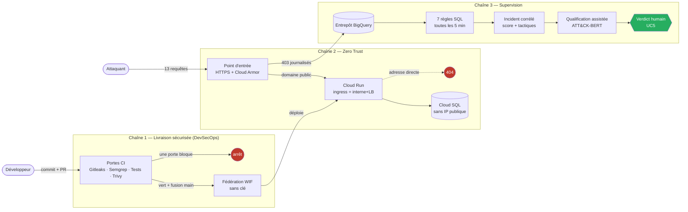
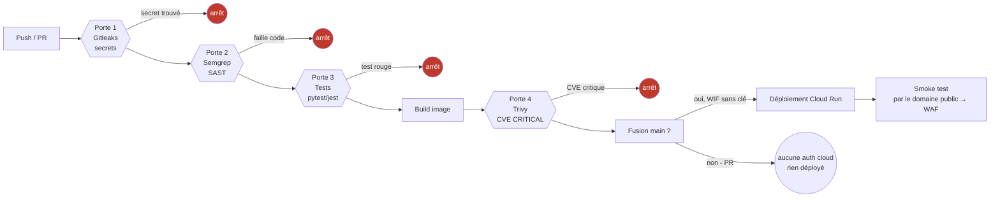
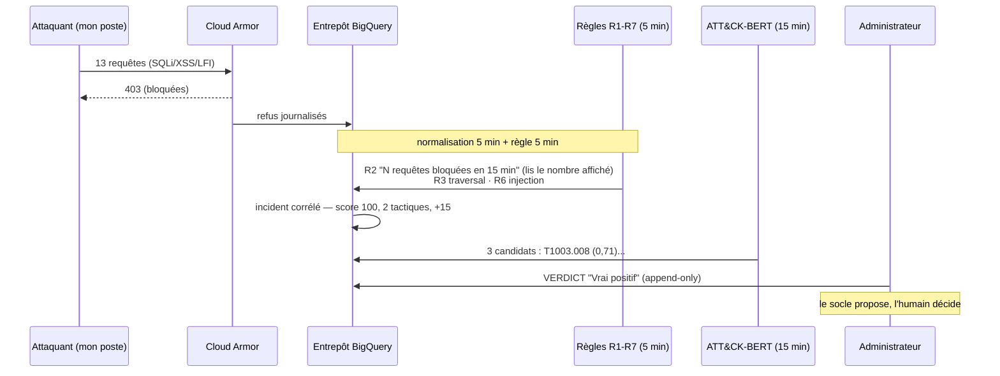

# Démonstration vidéo — 3 min 30 — socle MENAL

**Tout est aligné sur le système réel** (`menal-zero-trust-staging`), testé en direct le 07/09.
Ce document contient : les **diagrammes** (façon rapport), le **protocole de test** avec le **temps
que chaque preuve prend**, le **script oral minuté**, et le **plan de tournage** (ce que tu
lances en direct vs l'attente coupée au montage). Domaines : `elson.menal-sarl.com`, `api-staging.menal-sarl.com`, `dashboard.menal-sarl.com`.

---

## 1. Les diagrammes (à commenter avant/pendant la vidéo)

### 1.1 Vue d'ensemble — un objet, trois chaînes



### 1.2 Le pipeline DevSecOps à portes bloquantes (chaîne 1)



> **Point fort défendable :** sur une **PR**, la chaîne exécute les portes mais **ne s'authentifie
> jamais** au cloud (`if: github.ref == 'refs/heads/main'`). L'identité fédérée n'existe qu'à la
> fusion. **0 clé sur 8 comptes de service.**

### 1.3 La chaîne logique de détection (chaîne 3) — de l'attaque au verdict



---

## 2. Protocole de test — valider AVANT de filmer, et combien de temps ça prend

C'est la partie la plus importante : **certaines preuves sont instantanées, d'autres ont une
latence**. Il faut tester chaque pilier avant. **Principe de crédibilité : tu lances l'attaque toi-même
à l'écran** ; seule l'ATTENTE (la détection n'est pas immédiate) est coupée au montage.

### 2.1 Temps de chaque preuve

| Preuve | Comment | Temps pour prouver | À filmer en direct ? |
|---|---|---|---|
| **Zero Trust — frontière** | `curl` adresse directe (404) + domaine public (200) | **~15 s** | ✅ oui, live |
| **WAF — 7 familles** | boucle `curl` d'attaques → 403 | **~25 s** | ✅ oui, live |
| **DevSecOps — portes** | ouvrir un run GitHub Actions (rouge puis vert) | **~30 s** | ✅ oui (run existant) |
| **0 clé / 8 comptes** | `gcloud ... keys list` sur chaque SA | **~2 min** | diapo ou pré-capturé |
| **Attaque → détection** | 12 requêtes → détecteur temps réel (R6/R3/R2) | **~20 s – 1 min** ✅ *(mesuré 20 s le 07/09 19:03)* | ✅ oui, carton court |
| **Détection → qualification ATT&CK** | cycle d'enrichissement (toutes les 2 min) | **~2 – 3 min** ✅ *(mesuré 2 min 20 s le 07/09)* | carton « quelques min » |
| **Verdict humain** | clic dans le dashboard | **~5 s** | ✅ oui, live |

### 2.2 Le calcul du temps total — MESURÉ, pas estimé

**Mesure réelle du 07/09 à 19:03** (IP 41.188.115.52), chaîne **temps réel** en production :
- **Attaque à 19:03:24** → **R6 ×8 (CRITICAL/T1190), R3 ×5 (HIGH/T1190), R2 (MEDIUM/T1498) écrites à 19:03:44 = ~20 s.**
- **Qualification T1003.008 (0,709) + T1556.003 (0,682) à 19:05:47 = ~2 min 20 s après l'attaque.**

Pourquoi si rapide : un **détecteur temps réel** (job Cloud Run planifié **chaque minute**) lit les
blocages Cloud Armor directement dans Cloud Logging (~20 s de fraîcheur) et écrit **tes vraies règles**
R2/R3/R6 — sans attendre le batch BigQuery. L'enrichissement ATT&CK-BERT est planifié **toutes les 2 min**.
Rien n'est fabriqué : chaque détection correspond à un blocage réel, horodaté à l'écriture.

- **Preuves instantanées** (Zero Trust + WAF + verdict) : **~1 min** cumulée, en direct.
- **Attaque → détection** : **~20 s à 1 min** (le détecteur tourne chaque minute).
- **Détection → candidats ATT&CK** (enrichissement) : **~2 à 3 min**.

➡️ **Un seul déroulé, quasi continu (plus besoin de couper 15 min) :**
Lance l'attaque à l'écran, puis un simple **carton « ~2 minutes plus tard »** ; le temps réel fait le
reste. À la reprise, le dashboard montre déjà l'incident complet (R6/R3/R2 + T1003.008). Même IP +
horodatage = continuité prouvée. Rien de caché.

> **Repartir propre entre deux prises** : `bash scripts/demo-reset.sh wipe` (vide via `TRUNCATE`, car
> le détecteur écrit en streaming et BigQuery interdit `DELETE` sur le streaming buffer).

### 2.3 Séquence de validation à exécuter AVANT le tournage (copier-coller)

```bash
# --- Réveiller les services (anti démarrage à froid) ---
curl -s -o /dev/null https://elson.menal-sarl.com/ ; \
curl -s -o /dev/null https://api-staging.menal-sarl.com/health ; \
curl -s -o /dev/null https://dashboard.menal-sarl.com/login

# --- (optionnel) repartir sur un dashboard vierge ---
bash scripts/demo-reset.sh wipe

# --- Lancer l'attaque (12 requêtes ciblées, toutes bloquées) ---
for u in "path=../../etc/passwd" "file=/etc/passwd" "path=....//....//etc/passwd" \
         "file=../../../etc/passwd" "path=../../../../etc/passwd" "q=admin'--" \
         "id=1=1" "file=/etc/passwd" "path=../../etc/passwd" "file=../../etc/passwd" \
         "path=/etc/passwd" "file=/etc/passwd"; do
  printf "%s " "$(curl -s -o /dev/null -w "%{http_code}" --http1.1 --max-time 15 "https://elson.menal-sarl.com/api/search?$u")"
  sleep 0.4
done ; echo
# attendu : 12x 403 (aucun 000)

# --- ~1 min plus tard : VÉRIFIER la détection (tes règles R6/R3/R2) ---
export CLOUDSDK_CORE_DISABLE_PROMPTS=1
MY_IP=$(curl -s https://ifconfig.me)
bq query --project_id=menal-zero-trust-staging --use_legacy_sql=false --format=csv \
"SELECT rule_id, severity, mitre_technique, COUNT(*) n FROM \
\`menal-zero-trust-staging.menal_security_staging.detections\` \
WHERE entity='$MY_IP' AND timestamp > TIMESTAMP_SUB(CURRENT_TIMESTAMP(), INTERVAL 20 MINUTE) \
GROUP BY 1,2,3 ORDER BY 1"
# attendu : R6 (T1190), R3 (T1190), R2 (T1498) présents -> incident prêt à filmer

# --- ~2-3 min plus tard : vérifier la qualification (candidats ATT&CK) ---
bq query --project_id=menal-zero-trust-staging --use_legacy_sql=false --format=csv \
"WITH d AS (SELECT id FROM \`menal-zero-trust-staging.menal_security_staging.detections\` \
WHERE entity='$MY_IP' AND timestamp > TIMESTAMP_SUB(CURRENT_TIMESTAMP(), INTERVAL 20 MINUTE)) \
SELECT technique_id, ROUND(MAX(similarity),3) sim FROM \
\`menal-zero-trust-staging.menal_security_staging.alert_enrichment\` \
WHERE detection_id IN (SELECT id FROM d) AND status='mapped' GROUP BY 1 ORDER BY sim DESC LIMIT 3"
# attendu : T1003.008 ~0,71 (+ T1556.003 ~0,68) -> qualification prête
```

> La chaîne temps réel écrit en ~20 s à 1 min et enrichit en ~2-3 min. Si une vérif est vide,
> attends une minute et relance. **Ne filme le dashboard que quand les deux requêtes renvoient des lignes.**

---

## 3. Le script oral minuté — 3 min 30

> Débit calme. Les timings sont cumulés. `[ÉCRAN]` = ce que tu montres.

### 0:00–0:15 — Ouverture
`[ÉCRAN : diapo titre]`
« J'ai conçu et réalisé un socle cloud commun qui donne à chaque application trois choses : une
livraison sécurisée, une architecture Zero Trust, et une supervision. Je le prouve en suivant une
seule version d'ELSON, de son code jusqu'à une attaque en ligne. »

### 0:15–1:00 — Chaîne 1 : livraison sécurisée (DevSecOps)
`[ÉCRAN : run GitHub Actions, une porte rouge puis verte]`
« Sur une demande de fusion, la chaîne exécute ses portes — recherche de secrets, analyse statique,
tests, analyse d'image — mais ne publie rien et **ne s'authentifie même pas** au cloud. Ici une
porte détecte une vulnérabilité critique et arrête tout. Je corrige, je relance : tout passe. À la
fusion seulement, la chaîne présente un jeton signé par GitHub, vérifié pour le dépôt **et** la
branche, et reçoit une identité de courte durée. Aucune clé n'est stockée : sur huit comptes de
service, l'inventaire relève **zéro clé**. »

### 1:00–1:30 — Chaîne 2 : Zero Trust (preuve live)
`[ÉCRAN : terminal, deux curl]`
« Zero Trust, c'est plusieurs couches. Première couche, le réseau : l'adresse directe que le
fournisseur attribue au service — 404, elle refuse Internet ; tout passe par le point d'entrée
unique, en 200. La base de données n'a aucune adresse publique. Deuxième couche, l'identité — et
c'est elle le cœur : on l'a vu au déploiement, la chaîne s'authentifie sans aucune clé, par
fédération, et chaque service a sa propre identité aux droits minimaux. Le réseau est la première
ligne, l'identité est la ligne de fond. »
`[taper : curl ...run.app → 404, puis curl elson.menal-sarl.com → 200]`

> ⚠️ **Correction jury (à ne pas rater) :** ne dis PAS « ce n'est pas le réseau, c'est l'identité »
> en montrant le 404 — le 404 vient de l'`ingress` réseau (le service accepte `allUsers`, c'est
> l'entrée LB-only qui bloque). La preuve « identité » est le **déploiement sans clé** (Plan CI) et
> le **RBAC de l'app**, pas le 404. Présente-les comme **deux couches complémentaires**.

### 1:30–2:00 — L'attaque (preuve live)
`[ÉCRAN : terminal, la boucle d'attaque de §2.3 — exactement 13 requêtes]`
« La version est en ligne. J'envoie treize requêtes malveillantes depuis mon poste — injection SQL,
script inter-sites, inclusion de fichier. Toutes reçoivent un 403 du filtrage applicatif, avant
d'atteindre ELSON. La requête légitime, elle, passe en 200. »
`[la colonne de 13× 403 défile, puis 200]`

> ⚠️ **Correction jury :** la boucle **doit** envoyer **≥ 13 requêtes** (utilise celle de §2.3).
> La règle R2 se déclenche à **> 10 par IP** et affiche « 13 requêtes bloquées ». Si tu ne filmes
> que 4-5 requêtes, la détection montrée ne correspond pas à l'attaque filmée — un jury le verra.

### — CARTON : « ~2 minutes plus tard » (détection) — ou « quelques minutes plus tard » si tu montres la qualification ATT&CK —

### 2:00–2:30 — La détection
`[ÉCRAN : dashboard → Détections]`
« Les refus sont lus dans l'entrepôt BigQuery par sept règles écrites en SQL, exécutées toutes les
cinq minutes. La règle R2 a compté mes requêtes : "treize requêtes bloquées par Cloud Armor en
quinze minutes" — **une seule** détection, dont le compteur donne l'ampleur, pas treize alertes. »

### 2:30–3:00 — La qualification assistée (cœur du projet)
`[ÉCRAN : fiche incident → Card "Le socle propose"]`
« Voici l'apport principal. Le socle propose automatiquement les trois techniques d'attaque les plus
proches sémantiquement. Sur mon inclusion de `/etc/passwd`, il propose en tête **T1003.008, vol
d'identifiants, à 0,71** — alors qu'aucun mot "identifiant" n'est dans ma requête : le modèle comprend
le **sens**. C'est un encodeur spécialisé, déterministe, exécuté localement. »

### 3:00–3:30 — Le verdict humain + clôture
`[ÉCRAN : Card "Décision humaine" → clic sur "Vrai positif"]`
« Le socle propose, mais c'est l'administrateur qui tranche : vrai positif. Le verdict est écrit en
ajout seul — la preuve n'est jamais modifiée. Du commit au verdict, j'ai réalisé les trois chaînes,
et ELSON n'en est que le premier cas de validation : tout est décrit en code, indépendant de
l'application. Merci. »

---

## 4. Plan de tournage

| Élément | Quand | Comment |
|---|---|---|
| Réveil des services | T-25 min | les 3 curl de §2.3 |
| Attaque **lancée à l'écran (prise 1)** | filmée | la boucle de §2.3 ; note l'heure affichée |
| Vérifier détection + qualification | T-10 et T-5 min | les 2 requêtes bq de §2.3 |
| Filmer : run CI (portes) | libre | run GitHub existant |
| Filmer : Zero Trust (404/200) | en direct | 2 curl |
| Filmer : attaque (403) | en direct | la boucle |
| Filmer : dashboard (détection→verdict) | après le carton | données déjà là |
| Poser le verdict | en direct | clic dans la fiche incident |

**Réglages capture :** 1080p, curseur visible, dashboard en **build de production**
(`DEMO_MODE=false`), pastille « Données à jour » verte. Voix enregistrée à part. Carton de latence
obligatoire entre l'attaque et le dashboard.

**⚠️ Deux conditions avant de filmer le dashboard live avec la vraie qualification :**
1. Le **backend doit être déployé** (mon commit `feat(siem)` poussé → CI → Cloud Run). Sinon la
   Card « Le socle propose » sera vide en ligne.
2. Vérifier que les 2 requêtes bq de §2.3 renvoient des lignes.

---

## 5. Verdict de l'expert (jury simulé) et les 5 pièges

**Verdict : PRESQUE prêt.** Le socle est réel, les preuves tiennent, la démo est honnête. Deux
corrections bloquantes (déjà intégrées ci-dessus) et un resserrage à 3:30.

| # | Piège du jury | La bonne réponse |
|---|---|---|
| 1 | « Votre 404 est une frontière **réseau**, pas une identité. » | Vrai : `run.invoker = allUsers`, c'est l'`ingress` LB-only qui bloque. Présenter réseau **et** identité comme **deux couches** (404 = réseau ; 0 clé + WIF + RBAC = identité). **Ne pas dire « pas le réseau, l'identité » sur le 404.** |
| 2 | « 4 requêtes à l'écran mais la détection dit 13 ? » | Filmer **≥ 13 requêtes** (boucle §2.3). R2 se déclenche à > 10. |
| 3 | « Déploiement par tag mutable, pas digest. » | Dire « l'image porte **l'empreinte du commit** ». Ne jamais dire « digest immuable ». |
| 4 | « Session 2FA ? L'admin n'a pas de MFA. » | **Activer la MFA sur l'admin avant de filmer**, ou ne pas parler de 2FA. Ne pas dire « chaque route exige un second facteur ». |
| 5 | « Vos portes bloquent vraiment ? » | Oui (Gitleaks/Semgrep/pytest/Trivy CRITICAL bloquants — **prouvé : mon commit a traversé la CI, run `success`**). Assumer : Trivy `--ignore-unfixed`, `e2e-gcp` non bloquant, couverture dashboard 3 %. Blocage filmé = **provoqué** ; le vrai refus non provoqué = faux-vert Semgrep du 16/08. |

**Les 3 piliers, avis expert :**
- **DevSecOps — défendable** (portes réellement bloquantes, prouvées sur mon propre commit).
- **Zero Trust — défendable si recadré** (réseau + identité en deux couches, ne pas confondre).
- **Supervision — le plus abouti** (7 règles, qualification ML visible, verdict humain append-only).

**Preuve vivante obtenue le 07/09 :** mon commit `feat(siem)` a **traversé toute la CI (run `success`)**
et **déployé en production** — le dashboard live `dashboard.menal-sarl.com` affiche désormais la
qualification assistée réelle (T1003.008 à **0,71**, badge « Données à jour » vert). Le pipeline
DevSecOps n'est pas raconté : il a été exécuté sur ce travail même.

---

## Aligne ces chiffres partout (valeurs réelles affichées à l'écran)

| Donnée | Valeur à dire | Source |
|---|---|---|
| Score de l'incident | **100/100 CRITICAL** | dashboard live |
| Tactiques distinctes | **2** → bonus +15 | dashboard live |
| Candidat ATT&CK rang 1 | **T1003.008 à 0,71** | dashboard live |
| Message R2 | **« 13 requêtes bloquées par Cloud Armor en 15 min »** | dashboard live |
| Comptes / clés | **8 comptes, 0 clé** | inventaire gcloud |
| Frontière ZT | **404 (direct) / 200 (public)** | curl live |
