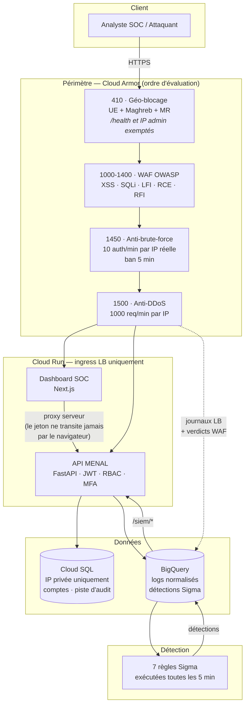

# MENAL Zero Trust — Guide de démonstration

> **Public** : soutenance, revue technique, démonstration client.
> **Environnement de démonstration** : `staging` uniquement.
> **Dernière validation de bout en bout** : 31/07/2026 (scénario WAF/brute-force/RBAC/SOC) ;
> **enrichissement ML + CVE validés le 01/08/2026** (§5).

---

## 1. En une phrase

MENAL est une plateforme Zero Trust qui place un périmètre de sécurité vérifiable
(WAF OWASP, géo-blocage, anti-brute-force) devant une application métier, et qui
transforme le trafic qu'elle observe en détections exploitables par un SOC.

La démonstration utilise **Elson** — plateforme de crowdsourcing linguistique
(ADST × RIM AI) — comme application protégée : elle a une authentification par
mot de passe, des utilisateurs réels et aucune protection périmétrique propre.
C'est le profil exact que MENAL adresse.

> **Note de périmètre, à énoncer en soutenance.** Elson n'est pas hébergée sur
> GCP et n'est pas placée derrière MENAL en production. La démonstration rejoue
> le scénario d'attaque le plus représentatif d'Elson — le brute-force sur
> `POST /api/auth/login` — contre le point d'entrée équivalent de MENAL, qui est
> réellement déployé et protégé. On démontre la **chaîne de défense**, pas une
> intégration Elson en production.

---

## 2. Architecture



### Principes Zero Trust appliqués

| Principe | Mise en œuvre | Vérifiable par |
|---|---|---|
| Aucune confiance réseau implicite | Cloud Run en `ingress = internal-and-cloud-load-balancing` : seul le LB atteint les services | `gcloud run services describe` |
| Base jamais exposée | Cloud SQL en **IP privée uniquement** (`ipv4Enabled: false`) | `gcloud sql instances describe` |
| Vérifier explicitement | JWT signé HS256 + RBAC par rôle, contrôlé à chaque requête | Acte 3 |
| Moindre privilège | Rôles `admin` / `viewer` / `service`, comptes de service dédiés par composant | Acte 3 |
| Tout est journalisé | Middleware d'audit en base + journaux LB exportés vers BigQuery | Acte 4 |
| Défense en profondeur | Périmètre (Cloud Armor) **et** application (JWT, rate-limit de secours) | Actes 1 et 2 |

---

## 3. Prérequis

```bash
# Compte GCP avec accès au projet de démonstration
gcloud config set project menal-zero-trust-staging

# Mot de passe du compte de démonstration (ne jamais le committer)
export MENAL_PW='<mot de passe admin staging>'
export API=https://api-staging.menal-sarl.com
export DASH=https://dash-staging.menal-sarl.com
```

| Élément | Valeur |
|---|---|
| Dashboard SOC | `https://dash-staging.menal-sarl.com/login` |
| API | `https://api-staging.menal-sarl.com` |
| Compte de démonstration | `admin@menal-sarl.mr` (rôle `admin`) |

> **Avant la démonstration** : lancer un appel à `/health` pour réveiller les
> conteneurs (`min-instances = 0`, donc le premier appel subit un démarrage à
> froid de quelques secondes).
>
> ```bash
> curl -s -o /dev/null -w '%{http_code}\n' $API/health   # attendu : 200
> ```

---

## 4. Scénario de démonstration (≈ 12 minutes)

### Acte 1 — Le WAF bloque les attaques applicatives *(2 min)*

**Ce qu'on raconte** : le périmètre inspecte chaque requête avant qu'elle
n'atteigne l'application.

```bash
# Charges d'attaque OWASP
curl -s -o /dev/null -w 'LFI  -> %{http_code}\n' "$API/logs/?f=../../../../etc/passwd"
curl -s -o /dev/null -w 'SQLi -> %{http_code}\n' "$API/logs/?id=1%27%20OR%20%271%27=%271"
curl -s -o /dev/null -w 'RCE  -> %{http_code}\n' "$API/logs/?cmd=%3B%20cat%20/etc/passwd"
curl -s -o /dev/null -w 'XSS  -> %{http_code}\n' "$API/logs/?q=%3Cscript%3Ealert(1)%3C/script%3E"
```

**Attendu** : `403` sur les quatre.

**Preuve à montrer** — le verdict vient bien de Cloud Armor, pas de l'application :

```bash
gcloud logging read 'resource.type="http_load_balancer"
  AND jsonPayload.enforcedSecurityPolicy.name="menal-api-waf-staging"' \
  --limit=4 --freshness=5m \
  --format="table(jsonPayload.enforcedSecurityPolicy.priority,
                  jsonPayload.enforcedSecurityPolicy.outcome,
                  httpRequest.status)"
```

La colonne `priority` affiche `1000`–`1400` et `outcome = DENY` : la requête a
été refusée **au bord**, sans jamais atteindre le code applicatif.

> **Point technique à valoriser.** L'ordre des règles est un choix d'ingénierie,
> pas un détail. Cloud Armor applique la **première règle qui correspond** puis
> s'arrête. Une règle de rate-limit en `conform_action = allow` placée *avant* le
> WAF court-circuiterait donc l'intégralité des règles OWASP. C'est précisément
> le défaut qui a été identifié et corrigé (le rate-limit est passé en priorité
> 1500, sous le WAF).

---

### Acte 2 — L'anti-brute-force protège sans verrouiller le SOC *(3 min)*

**Ce qu'on raconte** : c'est le scénario Elson. Elson expose
`POST /api/auth/login` sans limitation de débit ; on rejoue l'attaque contre
l'équivalent MENAL.

```bash
# 15 tentatives de connexion échouées, comme un attaquant sur Elson
for i in $(seq 1 15); do
  curl -s -o /dev/null -w '%{http_code} ' -X POST $API/auth/token \
    -H 'Content-Type: application/x-www-form-urlencoded' \
    --data-urlencode "username=cible@menal-sarl.mr" \
    --data-urlencode "password=tentative$i"
done; echo
```

**Attendu** : dix `401`, puis `429` — l'IP attaquante est **bannie 5 minutes**.

**Les deux points à souligner :**

1. **La limitation s'applique au bord, sur la vraie IP du client.** C'est le seul
   endroit du chemin qui la connaisse : lorsque le dashboard relaie une
   connexion, la requête traverse deux fois le load balancer et l'API ne voit
   plus qu'une IP de sortie *partagée*.
2. **Conséquence : seul l'attaquant est bloqué.** Une limitation appliquée côté
   application sur cette IP partagée aurait constitué un compteur commun — un
   attaquant non authentifié aurait pu, en une douzaine de requêtes, empêcher
   **tous** les analystes de se connecter à leur propre SOC. C'était le cas, et
   c'est corrigé.

```bash
# Vérifier que le ban est bien appliqué par Cloud Armor (priorité 1450)
gcloud logging read 'resource.type="http_load_balancer"
  AND httpRequest.requestUrl:"/auth/token"' \
  --limit=3 --freshness=3m \
  --format="value(jsonPayload.enforcedSecurityPolicy.priority,
                  jsonPayload.enforcedSecurityPolicy.outcome,
                  httpRequest.status)"
```

**Attendu** : `1450  DENY  429`.

> Le ban dure 5 minutes. **Enchaîner sur l'acte 3 depuis un autre poste**, ou
> prévoir cet acte en fin de démonstration.

---

### Acte 3 — Authentification et contrôle d'accès *(3 min)*

```bash
# 3.1 — Sans jeton : tout est refusé
for ep in /users/ /siem/overview /logs/ /alerts/; do
  curl -s -o /dev/null -w "$ep -> %{http_code}\n" $API$ep
done
```
**Attendu** : `403` partout.

```bash
# 3.2 — Connexion : obtention d'un jeton
TOKEN=$(curl -s -X POST $API/auth/token \
  -H 'Content-Type: application/x-www-form-urlencoded' \
  --data-urlencode "username=admin@menal-sarl.mr" \
  --data-urlencode "password=$MENAL_PW" \
  | python -c "import sys,json;print(json.load(sys.stdin)['access_token'])")

curl -s -o /dev/null -w 'avec jeton -> %{http_code}\n' \
  -H "Authorization: Bearer $TOKEN" $API/users/
```
**Attendu** : `200`.

```bash
# 3.3 — Résistance à la falsification du jeton
curl -s -o /dev/null -w 'signature falsifiée -> %{http_code}\n' \
  -H "Authorization: Bearer ${TOKEN%?}X" $API/users/
```
**Attendu** : `401`.

**Quatre attaques sur le jeton sont rejetées** (à énoncer) : signature modifiée,
`alg=none`, escalade de rôle par réécriture du contenu, et jeton expiré.
Un jeton **dépourvu de champ d'expiration** est également refusé — c'était un
défaut identifié et corrigé (un tel jeton était auparavant valable indéfiniment).

**Politique de mot de passe** — minimum 12 caractères :
```bash
curl -s -o /dev/null -w 'mot de passe faible -> %{http_code}\n' \
  -X POST $API/users/ -H "Authorization: Bearer $TOKEN" \
  -H 'Content-Type: application/json' \
  -d '{"email":"test@menal-sarl.mr","password":"1","role_name":"viewer"}'
```
**Attendu** : `422` (auparavant : `201`, le mot de passe `1` était accepté).

---

### Acte 4 — Le dashboard SOC *(2 min)*

Ouvrir `https://dash-staging.menal-sarl.com/login`, se connecter avec le compte
de démonstration, puis parcourir :

| Page | Ce qu'elle montre |
|---|---|
| **Vue d'ensemble** | Requêtes, taux d'erreur, échecs d'authentification, détections SIEM sur 24 h |
| **Détections** | Détections Sigma horodatées, avec sévérité et entité |
| **Incidents** | Détections regroupées par entité, avec score de risque |
| **Logs API** | Piste d'audit complète : horodatage, méthode, ressource, statut, utilisateur, IP |
| **Alertes** | Événements de statut ≥ 400, classés par sévérité |

**À souligner** : les tentatives de brute-force de l'acte 2 apparaissent dans
**Logs API** et **Alertes** — la boucle observation → détection → visualisation
est bouclée en direct devant le jury.

> **Point d'ingénierie.** Le dashboard est un proxy côté serveur : le jeton JWT
> est déposé dans un cookie `httpOnly` / `Secure` / `SameSite=lax` et ne transite
> jamais par le JavaScript du navigateur. Une faille XSS sur le dashboard ne
> permet donc pas de voler la session.

---

### Acte 5 — Les détections Sigma *(2 min)*

Sept règles s'exécutent en BigQuery toutes les 5 minutes :

| Règle | Détecte |
|---|---|
| R1 | Force brute — plus de 5 échecs d'authentification, même IP, 5 min |
| R2 | Pic de blocages WAF — plus de 10 blocages Cloud Armor en 5 min |
| R3 | Traversée de répertoire — motifs `../` dans les chemins |
| R4 | User-agent suspect (`curl`, `python`, `Go`) sur endpoints sensibles |
| R5 | Latence anormale (> 5 s) sur endpoints critiques |
| R6 | Motifs d'injection SQL dans les paramètres de requête |
| R7 | Accès à des fichiers sensibles (`.env`, `.git`, `/config`) |

```bash
# Détections des dernières 24 h
curl -s -H "Authorization: Bearer $TOKEN" "$API/siem/detections?hours=24" \
  | python -m json.tool | head -30
```

> **À dire honnêtement** : une partie des détections provient de scanners
> d'Internet sondant `/.env` (R7) et de pics de latence (R5). C'est une donnée
> **authentique**, non fabriquée — et c'est exactement ce que voit un SOC réel :
> un bruit de fond permanent d'attaques opportunistes.

**Point fort à mettre en avant : R1 déclenche sur l'attaque de l'acte 2.**
La règle souffrait d'un défaut de conception subtil et instructif : sa fenêtre
d'analyse (5 minutes) était **plus courte que la latence d'ingestion** du
pipeline de journaux. Les événements arrivaient dans la table après être sortis
de la fenêtre, si bien que la règle ne s'était **jamais** déclenchée, même sous
attaque réelle. La fenêtre a été portée à 15 minutes, avec une déduplication —
indispensable, faute de quoi une fenêtre plus longue que la période d'exécution
ré-insère la même détection à chaque passage (c'était l'origine des doublons qui
gonflaient tous les compteurs du dashboard).

C'est un bon sujet de question/réponse en soutenance : *une règle de détection
qui ne se déclenche jamais est indiscernable d'une absence d'attaque.* D'où la
nécessité de la tester en rejouant une attaque réelle, et non de se contenter de
la déployer.

---

## 5. Ce qui est démontrable, et ce qui ne l'est pas

Cette section est délibérée. Un jury ou un acheteur technique testera les
affirmations ; annoncer soi-même les limites est plus solide que de se les faire
opposer.

### Démontrable en direct, avec preuve

- WAF OWASP bloquant réellement (verdict lisible dans les journaux Cloud Armor)
- Anti-brute-force par IP réelle avec bannissement
- Géo-blocage (UE + Maghreb + Mauritanie)
- Authentification JWT résistante à quatre familles d'attaques sur le jeton
- RBAC `admin` / `viewer` effectivement séparés
- Base de données inaccessible depuis Internet (IP privée uniquement)
- Piste d'audit complète et consultable
- Sept règles Sigma déployées et ordonnancées
- Séparation stricte des environnements (projets, comptes de service et secrets distincts)

### Démontrable depuis le 01/08/2026 — mise à jour

| Sujet | État réel |
|---|---|
| **Enrichissement sémantique ATT&CK-BERT** | **Fonctionnel, vrai modèle.** `basel/ATTACK-BERT` exporté en ONNX fp32 (l'int8 quantisé a été essayé et rejeté : il ne reproduisait plus les classements MITRE du modèle de référence). 872 vecteurs 768D réels calculés pour le catalogue MITRE. Le job d'enrichissement (`enrich-job`, toutes les 15 min) mappe les détections réelles sur des techniques ATT&CK avec un score de similarité cosinus — ex. `T1003.008` (Credential Access) à 0.72 sur une détection réelle. Voir `api/ml-embed/build/export_and_precompute.py` (commit `6509823`). |
| Page *Vulnérabilités* | **Peuplée.** 362 vulnérabilités CRITICAL/HIGH/MEDIUM issues d'un scan Trivy réel des 4 images staging (`menal-api`, `menal-dashboard`, `menal-enrich-job`, `menal-ml-embed`) via `scripts/load_cve_findings.py`. |
| Page *Couverture ATT&CK* | **Peuplée.** 697 techniques / 872 lignes technique×tactique chargées depuis le bundle STIX MITRE Enterprise réel. |
| Règles R3, R6 | Déployées, mais aucune donnée correspondante observée à ce jour — les charges correspondantes sont désormais bloquées **au bord** par le WAF, donc elles n'atteignent plus les journaux applicatifs que ces règles interrogent. À rejouer après reparamétrage. |
| Environnement `dev` | Non démontrable : DNS absent et connecteur VPC défaillant. **Démontrer sur `staging` uniquement.** Le vrai modèle ATTACK-BERT n'est déployé qu'en `staging` — `dev` tourne toujours sur le mock aléatoire. |
| Haute disponibilité | Base `db-f1-micro` mono-zone, hors SLA Cloud SQL. Une maintenance interrompt le service. |
| Multi-tenant | Inexistant : l'isolation se fait au niveau projet GCP, soit une pile complète par client. |

### Toujours non démontrable — à ne pas promettre

| Sujet | État réel |
|---|---|
| Isolation IAM `enrich-job` → `detections` (T4) | `sa-pipeline` détient `roles/bigquery.dataEditor` au niveau **projet**, donc peut écrire dans `detections` alors qu'il ne devrait écrire que dans `alert_enrichment`. Zero-trust non respecté sur ce point précis — à corriger avant de l'affirmer en soutenance (IAM à resserrer par table, pas par projet). |

---

### Preuve collectée le 31/07/2026

Détection réellement produite par l'attaque de l'acte 2, extraite de BigQuery :

| Horodatage | Règle | Sévérité | Entité | Message | MITRE |
|---|---|---|---|---|---|
| 21:51:03 | R1 | HIGH | `41.188.119.111` | 10 échecs auth depuis 41.188.119.111 en 15 min | TA0006 / T1110 |

Une seule ligne : la déduplication fonctionne. La chaîne complète est donc
vérifiée de bout en bout — attaque → bannissement au bord → journaux du load
balancer → BigQuery → normalisation → règle Sigma → détection cartographiée
MITRE → visible dans le dashboard SOC.

---

## 6. Questions probables du jury

**« Votre WAF fonctionne-t-il vraiment, ou est-il seulement configuré ? »**
Montrer les journaux Cloud Armor : la colonne `priority` indique quelle règle a
statué, et `outcome = DENY` prouve le blocage. Un test qui se contente de vérifier
un code HTTP ne prouve rien — un `403` peut venir de l'application.

**« Comment garantissez-vous qu'un attaquant ne bloque pas vos propres analystes ? »**
C'est exactement le défaut qui a été trouvé et corrigé. La limitation est
appliquée au bord sur l'IP réelle, et non côté application sur une IP de sortie
partagée. Décrire les deux topologies (appel direct à un saut, appel relayé à
deux sauts) et pourquoi la seconde rendait le contrôle contre-productif.

**« Que se passe-t-il si le secret de signature JWT n'est pas injecté ? »**
L'API refuse de démarrer hors environnement de développement. Le comportement
est en échec fermé : un défaut de configuration ne peut pas dégrader
silencieusement la sécurité.

**« Votre SOC détecte-t-il de vraies attaques ? »**
Oui, avec une nuance à assumer : les détections présentes proviennent de
scanners opportunistes réels. Les règles ciblant des attaques applicatives
précises sont déployées mais n'ont pas encore rencontré de trafic correspondant.

---

## 7. Trame vidéo (≈ 6 minutes)

| Temps | Séquence | Capture |
|---|---|---|
| 0:00–0:40 | Problème : Elson, authentification exposée, aucune protection périmétrique | Schéma d'architecture |
| 0:40–1:20 | Architecture MENAL, principes Zero Trust | Diagramme de la section 2 |
| 1:20–2:40 | **Acte 1** — le WAF bloque, preuve par les journaux | Terminal partagé |
| 2:40–4:00 | **Acte 2** — brute-force banni, sans verrouiller le SOC | Terminal |
| 4:00–5:10 | **Acte 4** — parcours du dashboard SOC | Navigateur |
| 5:10–6:00 | Limites assumées et feuille de route | Section 5 à l'écran |

**Conseils d'enregistrement** : police de terminal en 16 pt minimum ;
« réveiller » les services avant de lancer l'enregistrement ; ne jamais afficher
`$MENAL_PW` ni un jeton en clair à l'écran.

---

## 8. Après la démonstration

Le compte de démonstration reste actif. Pour faire tourner son mot de passe :

```bash
# Générer un mot de passe, puis mettre à jour le compte via l'API
# (POST /users/ impose 12 caractères minimum)
```

Les comptes de test créés pendant une démonstration doivent être supprimés :
l'API n'expose pas encore d'endpoint de suppression, l'opération se fait donc
en base. **C'est une limite connue** — l'impossibilité de révoquer un accès par
l'API est un manque à combler avant toute mise en production.
