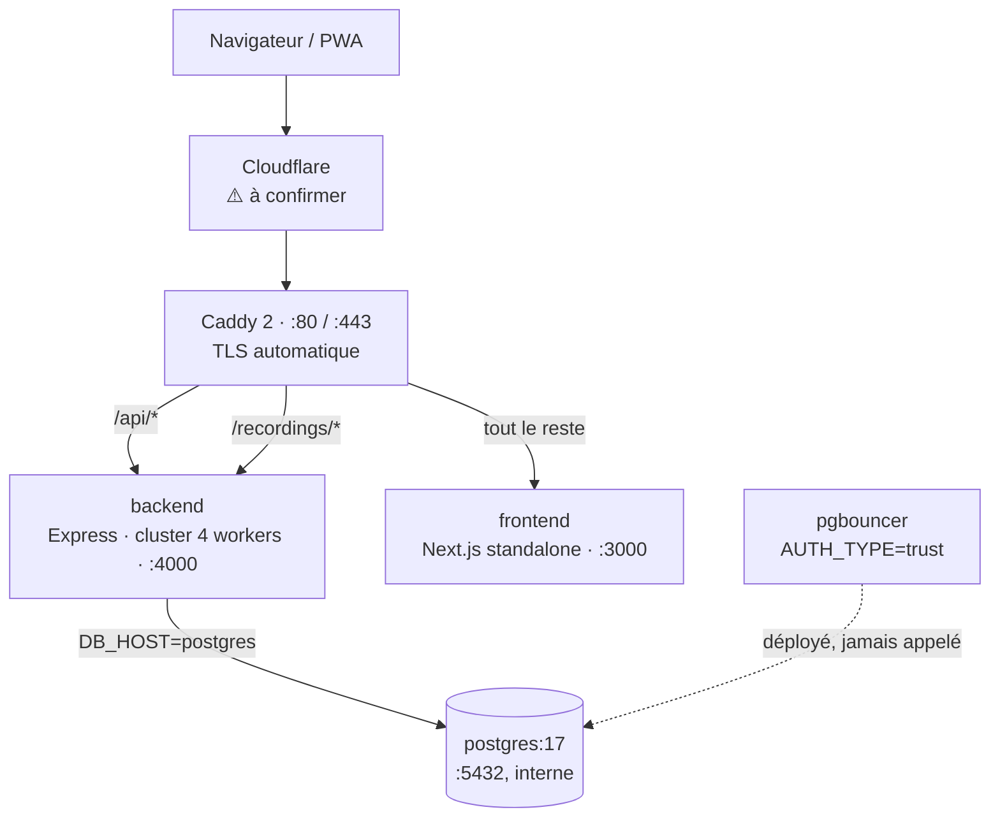
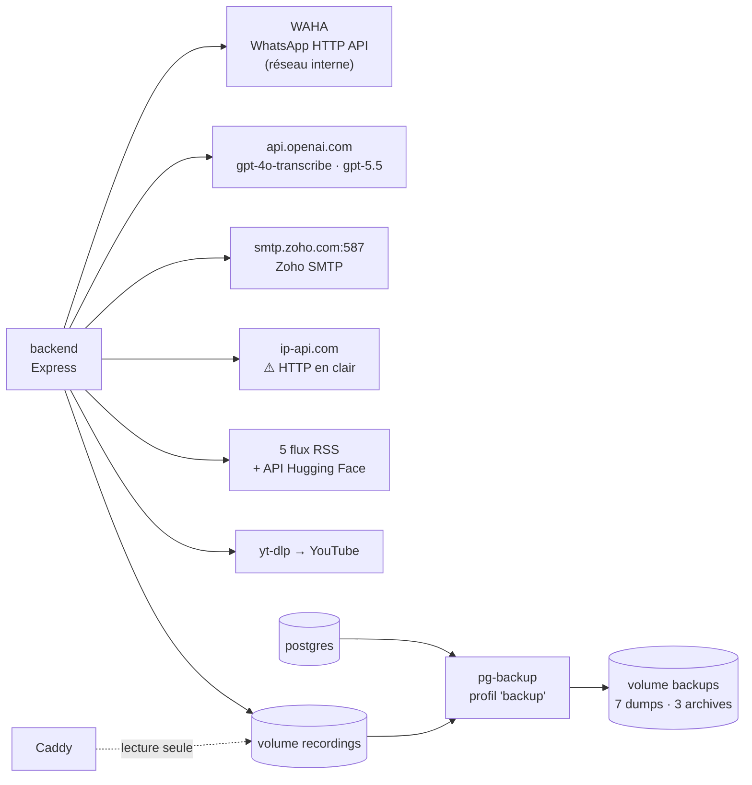
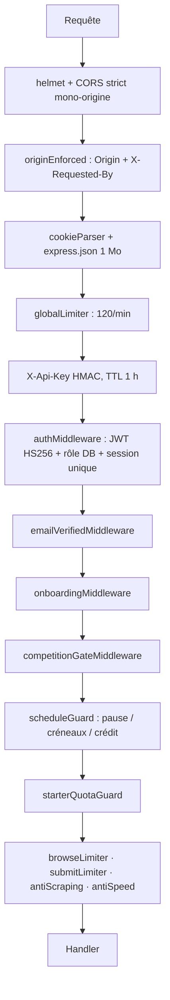
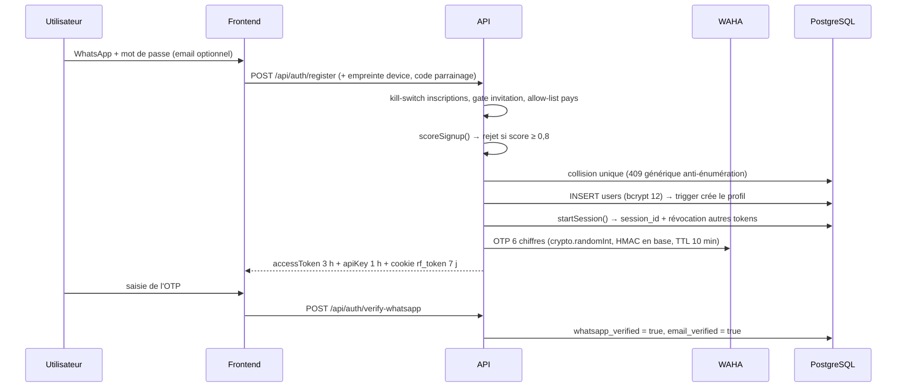
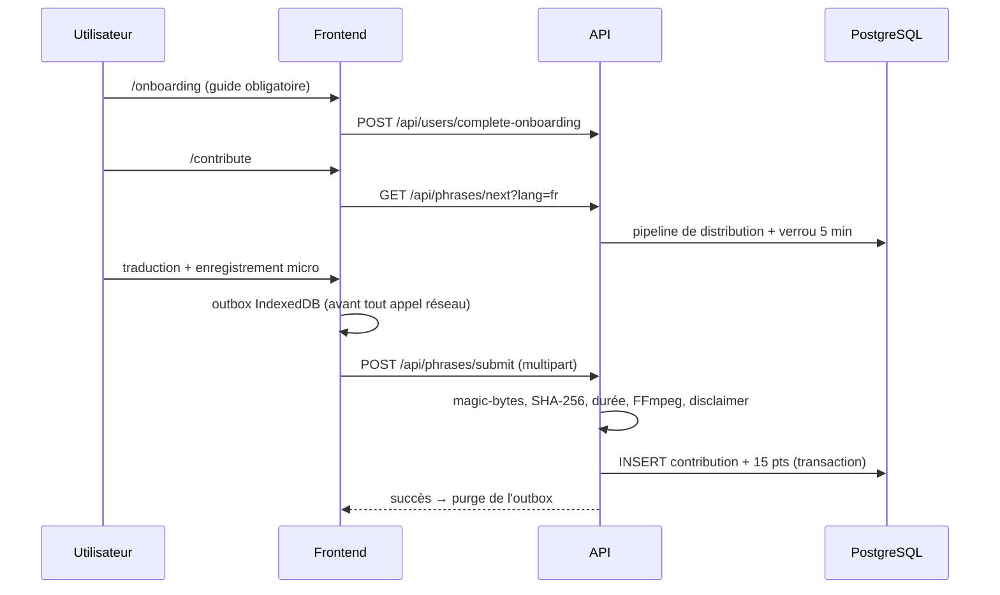
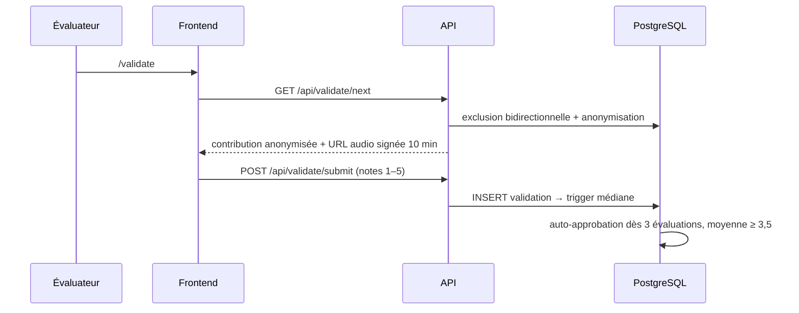
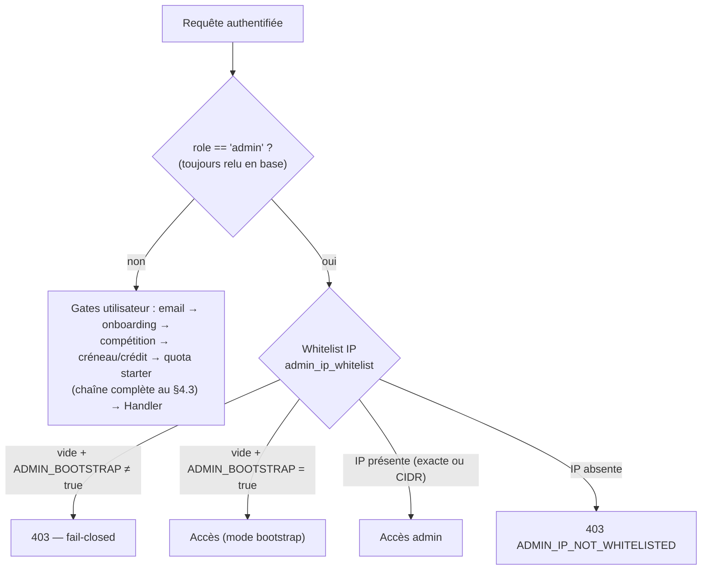

# DOCUMENTATION ELSON — Architecture & Sécurité

> **Document d'audit technique** — établi par lecture exhaustive du dépôt local
> `elson-main` (aucune exécution, aucun déploiement, aucune modification de l'application).
>
> **Règle appliquée** : seul ce qui est réellement présent dans le dépôt est documenté.
> Aucune fonctionnalité, aucun fichier, aucune configuration n'a été inventé. Aucun secret
> n'est affiché (les valeurs sensibles sont désignées par leur nom de variable uniquement).

## Convention de statut

| Statut | Signification |
|---|---|
| ✅ **Vérifié** | Constaté directement dans un fichier du dépôt (chemin cité). |
| ⚠️ **À confirmer** | Dépend de la configuration runtime / du serveur / de `.env`, non observable dans le dépôt. |
| ❌ **Absent** | Rien dans le dépôt ne couvre ce point. |
| 💡 **Recommandé** | Proposition d'amélioration, non présente aujourd'hui. |

**Périmètre analysé** : racine du dépôt, `src/` (frontend), `backend/src/` (API),
`backend/sql/` (74 fichiers SQL), `deploy/`, `docs/`, `public/`, `docker-compose.yml`,
`Caddyfile`, `Dockerfile`, `backend/Dockerfile`.
**Volumétrie** : ~14 200 lignes TypeScript backend, ~20 400 lignes TypeScript/TSX frontend,
225 endpoints HTTP, 54 tables PostgreSQL définies, 17 vues, 15 fonctions/triggers.

---

# 1. Présentation, objectifs et périmètre

## 1.1 Nature du produit

✅ **Vérifié** — `README.md:1-3`

**Elson** est une plateforme de *crowdsourcing gamifiée* destinée à construire des jeux de
données parallèles **texte + audio** pour les langues nationales de Mauritanie, en
commençant par l'**arabe hassaniya**. Les contributeurs traduisent des phrases sources
(EN/FR/AR) vers le hassaniya en écriture arabe, **enregistrent leur voix**, puis évaluent
le travail des autres. Les données de meilleure qualité alimentent des modèles **ASR**
(reconnaissance vocale), **MT** (traduction automatique) et **TTS** (synthèse vocale).

Initiative portée par **ADST** (African Digital Services & Technologies) en partenariat
avec **RIM AI** (`README.md:3`, `backend/src/services/email.ts:56`).

## 1.2 Objectifs fonctionnels observés dans le code

| Objectif | Preuve dans le dépôt | Statut |
|---|---|---|
| Collecter des traductions hassaniya + audio | `backend/src/routes/phrases.ts` (`POST /submit`) | ✅ Vérifié |
| Faire évaluer chaque contribution par la communauté (≥3 évaluateurs, médiane) | `docs/evaluation-explained.md`, `backend/sql/init.sql:180-209` | ✅ Vérifié |
| Produire un corpus exportable prêt pour Whisper | vues `whisper_dataset`, `whisper_training_set`, `whisper_review_set` ; `backend/src/routes/dataset-export.ts` | ✅ Vérifié |
| Organiser une **compétition** avec prix en MRU | `competitionGateMiddleware`, `backend/src/services/email.ts:158` | ✅ Vérifié |
| Annoter des médias (vidéo/audio découpés en shorts) | `backend/src/routes/media.ts`, `backend/src/services/media-ingest.ts` | ✅ Vérifié |
| Relecture experte ("gold standard") + lexique hassaniya | `backend/src/routes/reviews.ts`, table `lexicon` | ✅ Vérifié |
| Espace communautaire (sondages, commentaires, feed vocal) | `backend/src/routes/community.ts` | ✅ Vérifié |
| Veille IA automatisée sur WhatsApp | `backend/src/services/ai-news.ts`, `backend/src/routes/news.ts` | ✅ Vérifié |

## 1.3 Périmètre technique

✅ **Vérifié** — dépôt **monorepo à deux applications** :

1. Une **SPA/PWA Next.js** (frontend, port 3000)
2. Une **API Express** (backend, port 4000)
3. Une **base PostgreSQL** + un **pooler PgBouncer**
4. Un **reverse proxy Caddy** (TLS automatique)
5. Un **conteneur WAHA** (passerelle WhatsApp)
6. Un **service de sauvegarde** `pg-backup` (profil Docker `backup`)

Le tout orchestré par un unique `docker-compose.yml`, déployé sur **Hetzner Cloud**
(`deploy/create-server.sh` : serveur `cx32`, Ubuntu 24.04, Falkenstein).

## 1.4 Hors périmètre du dépôt

| Élément | Statut |
|---|---|
| Fichier `.env` / `.env.example` (le README en exige la copie) | ❌ **Absent** — cf. §8.4 |
| Tests automatisés (unitaires, intégration, e2e) | ❌ **Absent** — cf. §9.5 |
| Pipeline CI/CD (`.github/`, `.gitlab-ci.yml`…) | ❌ **Absent** |
| Politique de confidentialité / mentions légales / DPA | ❌ **Absent** — cf. §7.5 |
| Infrastructure as Code (Terraform, Pulumi) | ❌ **Absent** (uniquement des scripts bash `hcloud`) |
| Configuration Cloudflare (référencée dans les commentaires du code) | ⚠️ **À confirmer** |

---

# 2. Stack technique et dépendances principales

## 2.1 Frontend — `package.json`

✅ **Vérifié**

| Dépendance | Version | Rôle |
|---|---|---|
| `next` | 16.2.0 | Framework (App Router, `output: "standalone"`) |
| `react` / `react-dom` | 19.2.4 | UI |
| `typescript` | ^5 | Typage (`strict: true`) |
| `tailwindcss` + `@tailwindcss/postcss` | ^4 | CSS |
| `lucide-react` | ^0.577.0 | Icônes |
| `three` + `@types/three` | ^0.184 | Fond animé (`src/components/DottedSurface.tsx`) |
| `eslint` + `eslint-config-next` | ^9 / 16.2.0 | Lint |

⚠️ **À confirmer** — `@types/three` est déclaré en **dependencies** (production) alors
qu'il s'agit d'un paquet de types : anomalie mineure de classification.

## 2.2 Backend — `backend/package.json`

✅ **Vérifié**

| Dépendance | Version | Rôle |
|---|---|---|
| `express` | ^5.1.0 | Serveur HTTP |
| `pg` | ^8.13.0 | Client PostgreSQL (pool) |
| `jsonwebtoken` | ^9.0.2 | JWT HS256 |
| `bcryptjs` | ^2.4.3 | Hachage mots de passe (coût 12) |
| `helmet` | ^8.1.0 | En-têtes de sécurité |
| `cors` | ^2.8.5 | CORS strict mono-origine |
| `express-rate-limit` | ^7.5.0 | Limitation de débit (en mémoire) |
| `multer` | ^2.0.2 | Uploads multipart (disque) |
| `zod` | ^3.24.0 | Validation de schémas |
| `nodemailer` | ^6.9.0 | SMTP (Zoho) |
| `cookie-parser` | ^1.4.7 | Cookie `rf_token` httpOnly |
| `archiver` | ^7.0.1 | Export ZIP du dataset |
| `dotenv` | ^16.5.0 | Chargement `.env` |
| `tsx` (dev) | ^4.19.0 | Exécution TS (dev + seed) |

### 2.2.1 Anomalies de dépendances constatées

| Anomalie | Preuve | Impact | Statut |
|---|---|---|---|
| **`ipaddr.js` importé mais non déclaré** | `backend/src/middleware/auth.ts:4` importe `ipaddr.js` ; il n'apparaît dans `backend/package-lock.json:2433` **qu'en dépendance transitive de `proxy-addr`** (via Express) | Le build ne fonctionne que par *hoisting* npm. Si Express/`proxy-addr` change d'implémentation, le module disparaît → l'API **ne démarre plus**, ou la whitelist IP admin casse (échec *fail-closed* = plus aucun accès admin) | ✅ **Vérifié** |
| Aucun SDK OpenAI | Appels `fetch` directs vers `https://api.openai.com/v1/...` (`media.ts:462`, `reviews.ts:41,50`, `ai-news.ts:79`) | Pas de retry/backoff, pas de gestion de quota structurée (seul un cas 429 est traité dans `ai-news.ts:83`) | ✅ **Vérifié** |
| `npm install` au lieu de `npm ci` | `Dockerfile:5`, `backend/Dockerfile:5` | Le lockfile est **ignoré** : les builds ne sont pas reproductibles | ✅ **Vérifié** |
| Images `:latest` non épinglées | `docker-compose.yml:58` (`edoburu/pgbouncer:latest`), `:211` (`devlikeapro/waha:latest`) | Risque de chaîne d'approvisionnement : une mise à jour amont peut casser ou compromettre l'environnement | ✅ **Vérifié** |
| `daily-cap.ts` = code mort | `backend/src/utils/daily-cap.ts` : `checkDailyCap()` n'est appelé **nulle part** (plafond retiré, cf. `validate.ts:66-68`) | Confusion / dette | ✅ **Vérifié** |
| Audit de vulnérabilités des dépendances | Aucun `npm audit`, Dependabot, Snyk, SBOM | Vulnérabilités connues non surveillées | ❌ **Absent** |

## 2.3 Infrastructure

✅ **Vérifié** — `docker-compose.yml`

| Service | Image | Exposition | Notes |
|---|---|---|---|
| `postgres` | `postgres:17-alpine` | interne uniquement (`expose: 5432`) | Tuning explicite : `shared_buffers=512MB`, `max_connections=150`, limite mémoire 2 Go, `shm_size=256mb` |
| `pgbouncer` | `edoburu/pgbouncer:latest` | interne | `POOL_MODE=transaction`, `MAX_CLIENT_CONN=500`, **`AUTH_TYPE=trust`** ⚠️ |
| `backend` | build `./backend` | interne (`4000`) | `WEB_CONCURRENCY=4`, limite mémoire 1 Go, volume `recordings:/data/recordings` |
| `frontend` | build `.` | interne (`3000`) | `NEXT_PUBLIC_API_URL` injecté au **build** |
| `caddy` | `caddy:2-alpine` | **80/443 publiés** | Monte `recordings` en lecture seule |
| `pg-backup` | `postgres:17-alpine` | interne, profil `backup` | Dump DB + tar audio, rétention 7/3 |
| `waha` | `devlikeapro/waha:latest` | interne (`3000`) | Moteur `NOWEB`, volume `waha_sessions` |

**Binaires système requis dans l'image backend** (✅ `backend/Dockerfile:16-18`) :
`ffmpeg`, `ffprobe`, `python3`, `yt-dlp` (téléchargé depuis GitHub *latest* au build —
non épinglé).

---

# 3. Structure du dépôt et rôle des dossiers

✅ **Vérifié** — arborescence réelle (hors `node_modules/`, `.next/`)

```
elson-main/
├── src/                              # ── FRONTEND (Next.js App Router) ──
│   ├── app/
│   │   ├── page.tsx                  #   Accueil applicatif (505 l.)
│   │   ├── layout.tsx                #   Root layout, thème pré-paint, i18n, PWA
│   │   ├── login/                    #   Connexion + inscription + OTP WhatsApp
│   │   ├── onboarding/               #   Guide obligatoire avant participation
│   │   ├── contribute/               #   Traduction + enregistrement audio (626 l.)
│   │   ├── validate/                 #   Évaluation + vote comparatif (514 l.)
│   │   ├── leaderboard/              #   Classement (codes anonymes rotatifs)
│   │   ├── community/                #   Feed communautaire immersif
│   │   ├── dashboard/, credits/      #   Profil, langue ; crédits contributeurs
│   │   ├── my-agenda/                #   Programme (créneaux / crédit temps)
│   │   ├── faq/, rules/              #   Contenu statique i18n
│   │   ├── verify-email/, reset-password/
│   │   ├── studio/                   #   Vitrine "modèle en création"
│   │   ├── admin/                    #   Console admin (1556 l. + 11 panneaux)
│   │   ├── reviewer/                 #   Relecture "gold" (admin)
│   │   ├── media-studio/             #   Ingestion vidéo/audio (admin)
│   │   ├── eval-control/             #   Pilotage de l'évaluation (admin)
│   │   └── news-bot/                 #   Bot de veille IA WhatsApp (admin)
│   ├── components/                   # 23 composants (AudioRecorder, HassaniyaInput,
│   │                                 #   ScheduleBoard, CreditMeter, Navigation…)
│   └── lib/
│       ├── api.ts                    #   Client API unique (1463 l.) — tokens en mémoire
│       ├── i18n.ts / i18n-context.tsx#   Traductions FR/EN/AR (2067 l.)
│       ├── fingerprint.ts            #   Empreinte de device (anti multi-comptes)
│       ├── outbox-db.ts              #   File d'attente durable IndexedDB (audio)
│       ├── gamification.ts, hassaniya.ts
│
├── backend/                          # ── BACKEND (Express / TypeScript ESM) ──
│   ├── src/
│   │   ├── server.ts                 #   Point d'entrée : cluster, middlewares globaux,
│   │   │                             #   5 workers de fond, /recordings, /api/health
│   │   ├── config.ts                 #   Chargement/validation des variables d'env
│   │   ├── db.ts                     #   Pool pg + helpers query/queryOne/execute/transaction
│   │   ├── middleware/
│   │   │   ├── auth.ts               #   JWT, rôle, session unique, admin+IP, gates horaires
│   │   │   ├── security.ts           #   Rate limiters, anti-scraping, anti-vitesse
│   │   │   └── validate.ts           #   Middleware Zod
│   │   ├── routes/                   #   11 routeurs, 225 endpoints
│   │   ├── services/                 #   audio-processor, media-ingest, email, whatsapp,
│   │   │                             #   alert, geoip, ai-news, phrase-pipeline
│   │   ├── utils/                    #   api-key, audio-token, dataset-token, anon, otp,
│   │   │                             #   fraud, audit, cache, schedule, credit-active…
│   │   └── scripts/                  #   seed-flores.ts, test-v5.ts (scripts manuels)
│   ├── sql/
│   │   ├── init.sql                  #   Schéma initial (8 tables seulement)
│   │   ├── seed.sql                  #   20 groupes trilingues de démonstration
│   │   └── migration_v2..v73_*.sql   #   72 migrations additives
│   ├── Dockerfile, docker-entrypoint.sh
│
├── deploy/                           # Scripts d'exploitation (bash / mjs)
│   ├── create-server.sh              #   Provisionnement Hetzner via `hcloud`
│   ├── setup-server.sh               #   Durcissement OS (SSH 2222, UFW, fail2ban…)
│   ├── deploy.sh                     #   rsync + docker compose build/up
│   ├── disk-alert.sh                 #   Alerte disque par mail (cron horaire)
│   └── daily-leaderboard*.mjs, top10_email.html
│
├── docs/                             # evaluation-explained.md, quality-scoring.md
├── public/                           # _landing.html (130 Ko, servi à `/`), sw.js,
│                                     #   manifest.json, logos SVG, 8 samples audio
├── scripts/seed_flores.py            # Import FLORES (Python)
├── docker-compose.yml, Caddyfile, Dockerfile
├── next.config.ts, tsconfig.json, eslint.config.mjs, postcss.config.mjs
└── architecture.excalidraw           # Schéma d'architecture (source Excalidraw)
```

**Point notable** ✅ `next.config.ts:9-13` : la route `/` est **réécrite** vers
`/_landing.html` (page marketing statique de 130 Ko), l'application démarre donc
réellement sur `/contribute` ou `/login`.

---

# 4. Architecture

## 4.1 Vue de déploiement

**(a) Chemin des requêtes entrantes**



**(b) Sorties réseau, stockage et sauvegardes**



✅ **Vérifié** — `docker-compose.yml`, `Caddyfile`

⚠️ **Constat important** : `docker-compose.yml:101-102` fixe `DB_HOST: postgres` /
`DB_PORT: "5432"` pour le backend. Le backend **contourne donc PgBouncer** et se connecte
directement à PostgreSQL avec un pool de 100 connexions par worker
(`DB_MAX_CONNECTIONS: "100"` × 4 workers = 400 connexions théoriques face à
`max_connections=150`). PgBouncer tourne inutilement, avec `AUTH_TYPE=trust`.

## 4.2 Architecture frontend

✅ **Vérifié**

- **Next.js App Router**, `output: "standalone"` (`next.config.ts:4`), `reactStrictMode: false`
  (désactivé volontairement pour ne pas doubler les timers de polling — `next.config.ts:5-8`).
- **Tout composant de page est `"use client"`** : l'application est en pratique une SPA ;
  aucun *Server Component* de données, aucune *Route Handler* Next.js, aucun *Server Action*.
  Toute la donnée transite par `src/lib/api.ts`.
- **Client API unique** (`src/lib/api.ts`) : ajoute systématiquement
  `X-Requested-By: elson-web`, `X-Api-Key` (clé de session en mémoire) et
  `Authorization: Bearer <accessToken>` (mémoire), avec `credentials: "include"`.
  Rafraîchissement *single-flight* sur 401 `TOKEN_EXPIRED` (`api.ts:63-72`).
- **PWA** : `public/manifest.json` + `public/sw.js` (cache `hassaniya-v49-...`, stratégie
  *network-first* pour la navigation, *cache-first* pour les assets ; `/api/*` et
  `/recordings/*` **jamais** mis en cache — `sw.js:46-53`).
- **Résilience offline** : `src/lib/outbox-db.ts` persiste chaque contribution (texte +
  blob audio) dans **IndexedDB** *avant* tout appel réseau, et rejoue à la reprise.
- **i18n** : FR / EN / AR avec support RTL, 2067 lignes de traductions (`src/lib/i18n.ts`).
- **Thème** clair/sombre appliqué avant le premier paint via un script inline
  (`layout.tsx:49-53`).

## 4.3 Architecture backend

✅ **Vérifié** — `backend/src/server.ts`

- **Mode cluster** : en production, le process primaire fork `WEB_CONCURRENCY` workers
  (défaut : `min(cœurs, 4)`) et les redémarre automatiquement en cas de sortie
  (`server.ts:29-49`).
- **Invalidation de cache inter-workers** : chaque worker a son cache mémoire
  (`utils/cache.ts`) ; `invalidateGlobal()` diffuse via IPC (`process.send` →
  primaire → tous les workers) — utilisé pour `session_id` après login.
- **5 workers de fond** (démarrés dans chaque worker HTTP, avec verrouillage atomique via
  `competition_config` pour les tâches à exécution unique) :

| Worker | Fréquence | Rôle | Réf. |
|---|---|---|---|
| `startNotificationDispatcher` | 15 s, lots de 20 | Envoi email + WhatsApp (`FOR UPDATE SKIP LOCKED`) | `server.ts:401` |
| `startAutoActivation` | 60 s | Bascule `competition_status` et `is_activated` par date | `server.ts:549` |
| `startCollusionDetector` | 1 h | Détection de paires validateur↔contributeur suspectes (+30 `fraud_score`, alerte mail) | `server.ts:614` |
| `startNewsBot` | 60 s / 90 min | Digest IA + alertes "hot" sur WhatsApp | `server.ts:689` |
| `startTokenPurge` | 6 h | Purge des `refresh_tokens` révoqués/expirés | `server.ts:724` |
| `resumeOrphanedIngests` | au boot | Reprise des jobs d'ingestion média interrompus | `services/media-ingest.ts:209` |

- **Gestion d'erreur centralisée** (`server.ts:375-390`) : l'erreur technique va aux logs,
  le client reçoit un message générique FR + `code: "TEMP_ERROR"` (aucune fuite de stack).
- **Chaîne de gardes** appliquée aux routes de participation :



✅ **Vérifié** — `routes/phrases.ts:20-91`, `routes/validate.ts:24-28`, `server.ts:113-164`

## 4.4 Architecture base de données

✅ **Vérifié**

- **PostgreSQL 17**, extensions `uuid-ossp` et `pgcrypto` (`init.sql:7-8`).
- **Accès exclusivement paramétré** via `backend/src/db.ts` (`pool.query(text, params)`).
- **Logique métier partiellement en base** — triggers et fonctions :
  `create_profile_on_signup`, `update_contribution_after_validation` (auto-approbation
  à ≥3 validations et moyenne ≥3,5 ; rejet si <2,5), `update_streak`, `update_badges`,
  `update_user_level`, `update_quality_after_validation`, `wmedian` (médiane pondérée),
  `validator_weight`, `point_mult`, `dq_recompute_contribution`, `protect_identity_fields`,
  `expire_stale_locks`, `get_best_translation`.
- **`protect_identity_fields`** (✅ `migration_v4_identity.sql`) : trigger `BEFORE UPDATE`
  sur `users` qui **lève une exception** si `nni`, `whatsapp`, `first_name`, `last_name` ou
  `birthdate` sont modifiés après l'inscription — excellente mesure anti-usurpation.
- **17 vues** dont `leaderboard`, `quality_leaderboard`, `admin_user_list`, `public_stats`,
  `signup_forensics`, `collusion_detector`, `reciprocity_pairs`, `bot_signals`,
  `competition_fairness`, `whisper_*`.
- **Table de configuration dynamique** `competition_config` (clé/valeur) : ~80 clés
  pilotant le comportement à chaud (statut compétition, pauses, stratégie de planning,
  multiplicateurs de points, bascule qualité, bot news, disclaimer, etc.).

### 4.4.1 Gestion des migrations — risque majeur

| Constat | Preuve | Statut |
|---|---|---|
| `init.sql` ne crée que **8 tables** (`users`, `profiles`, `phrases`, `contributions`, `validations`, `tags`, `contribution_tags`, `phrase_locks`, `refresh_tokens`) sur les ~55 utilisées | `backend/sql/init.sql` | ✅ Vérifié |
| **72 migrations** doivent être appliquées **manuellement**, une par une | `README.md:136-140` (`docker compose exec -T postgres psql … -f -`) | ✅ Vérifié |
| **Aucun outil de migration** (pas de table de version, pas de runner, pas d'ordre garanti) | — | ❌ **Absent** |
| **10 numéros de version en doublon** : v25, v37, v38, v39, v40, v48, v49, v50, v53, v54 (chacun ×2 fichiers différents) | `ls backend/sql/` | ✅ Vérifié |
| Le code **anticipe la dérive de schéma** : plusieurs handlers rattrapent les codes PostgreSQL `42P01` (table absente) et `42703` (colonne absente) | `community.ts:35,51,1060`, `validate.ts:408`, `phrases.ts` (`try/catch` sur `lexicon`, `media_transcriptions`) | ✅ Vérifié |
| 🔴 **Trois objets de base de données utilisés par le code n'ont AUCUNE définition dans le dépôt** (voir §4.4.2) | recherche exhaustive dans `backend/sql/*.sql` | ✅ **Vérifié** |

➡️ **Conséquence** : un environnement neuf (recette, GCP, poste de dev) **n'est pas
reproductible** de façon fiable. C'est le principal frein technique à un redéploiement.

### 4.4.2 🔴 Objets de base de données manquants du dépôt

✅ **Vérifié** — recherche exhaustive de `CREATE TABLE` / `CREATE VIEW` sur les 74 fichiers
de `backend/sql/` :

| Objet | Utilisé par le code | Définition dans le dépôt |
|---|---|---|
| **`votes`** (table) | `INSERT INTO votes` (`validate.ts:510`), `SELECT … FROM votes` (`validate.ts:230,501`), vue `leaderboard` via `profiles.total_votes` | 🔴 **AUCUNE** |
| **`votable_phrases`** (vue) | `SELECT vp.* FROM votable_phrases vp` (`validate.ts:227`) — cœur de la phase de vote comparatif | 🔴 **AUCUNE** |
| **`season0_contributors`** | `SELECT username, contributions FROM season0_contributors` sur l'endpoint **public** `/api/public/stats` (`server.ts:300`) | 🔴 **AUCUNE** — seulement mentionnée dans un commentaire (`migration_v23_season0_reset.sql:19` : « already lives in `season0_contributors` ») |

**Implication directe** : ces objets ont été créés **manuellement en production**, hors
versionnement. Sur un environnement reconstruit à partir du dépôt :
- toute la **fonctionnalité de vote comparatif** échoue (`42P01`) — et contrairement à
  d'autres endroits, `validate.ts:226-235` **ne rattrape pas** cette erreur, elle remonte
  donc en 500 ;
- `/api/public/stats` est protégé par un `.catch(() => [])` (`server.ts:302`) et dégrade
  silencieusement.

💡 **Correctif indispensable avant toute migration** : extraire le schéma réel de la
production (`pg_dump --schema-only`) et en faire le schéma de référence versionné.

## 4.5 Services externes

| Service | Usage | Protocole | Réf. | Statut |
|---|---|---|---|---|
| **OpenAI** | Transcription (`gpt-4o-transcribe`), traduction & curation (`gpt-5.5`) | HTTPS, clé `OPENAI_API_KEY` | `media.ts:462`, `reviews.ts:41,50`, `ai-news.ts:79` | ✅ Vérifié |
| **WAHA** (WhatsApp) | OTP d'inscription/reset, notifications, digest, médias | HTTP interne + `X-Api-Key` | `services/whatsapp.ts` | ✅ Vérifié |
| **SMTP Zoho** | Vérification email, reset, bienvenue, notifications, alertes sécurité | SMTP 587 STARTTLS | `services/email.ts`, `services/alert.ts` | ✅ Vérifié |
| **ip-api.com** | Géolocalisation IP à l'inscription (proxy/hosting/pays → score de fraude) | ⚠️ **HTTP en clair** | `services/geoip.ts:40-43` | ✅ Vérifié |
| **Google Fonts** | Inter, Cairo, Noto Kufi Arabic | HTTPS | `layout.tsx:54-59`, `public/_landing.html` | ✅ Vérifié |
| **yt-dlp / YouTube** | Ingestion de vidéos pour l'annotation | HTTPS | `services/media-ingest.ts:123` | ✅ Vérifié |
| **Flux RSS** | 5 sources IA pour le bot de veille | HTTPS | `services/ai-news.ts:10-16` | ✅ Vérifié |
| **Hugging Face API** | Modèles tendance pour le digest | HTTPS | `services/ai-news.ts:62` | ✅ Vérifié |

---

# 5. Fonctionnalités, rôles utilisateurs et parcours

## 5.1 Rôles

✅ **Vérifié**

| Rôle / attribut | Source | Effet |
|---|---|---|
| `user` | `users.role` (défaut) | Contributeur standard |
| `admin` | `users.role` | Accès à ~165 endpoints admin (rôle **relu en base** à chaque requête, jamais depuis le JWT) + whitelist IP obligatoire |
| `moderator` | Autorisé par la contrainte `CHECK` de `init.sql:20` mais **aucun code ne l'utilise** | Rôle mort | 
| `eval_exempt` | `profiles.eval_exempt` | "Relecteur" : évalue librement, ignore le seuil de contributions, exclu du classement |
| `leaderboard_hidden` | `profiles.leaderboard_hidden` | Masqué du classement et des rangs |
| `disqualified` | `profiles.disqualified` | Disqualifié (points/qualité/confiance sauvegardés avant DQ) |
| `community_blocked` | `profiles.community_blocked` | Interdit de publier/commenter |
| `credit_blocked` | `profiles.credit_blocked` | Crédit temps suspendu |
| `is_activated` | `profiles.is_activated` | Autorisé à participer (modes `open` / `invite_only` / `date_auto`) |
| `account_tag` | `profiles.account_tag` | Étiquetage administratif |

## 5.2 Fonctionnalités par domaine

### Contribution (`/contribute`)
✅ **Vérifié** — `routes/phrases.ts`, `services/phrase-pipeline.ts`

- **Pipeline de distribution intelligent** : priorité aux phrases assignées par un admin,
  puis score composite = couverture (0/1/2/3+ traductions) + phase du corpus
  (`coverage` / `quality` / `polish`) + diversité de catégorie + aléa, tirage pondéré
  dans le top 5, verrouillage DB 5 min (`phrase_locks`).
- **Anti-triche bidirectionnel** : une phrase déjà traduite (ou verrouillée) par
  l'utilisateur n'est jamais proposée à l'évaluation, et réciproquement.
- **Soumission atomique** texte + audio (audio **obligatoire**) : validation magic-bytes,
  déduplication SHA-256 de l'audio par utilisateur, contrôles durée (1,5 s – 120 s) et
  taille (≥5 Ko, ≤10 Mo), post-traitement FFmpeg (WAV 16 kHz mono, high-pass 80 Hz,
  loudnorm −16 LUFS, noise gate, rejet du silence à −35 dB).
- **Idempotence** : un rejeu de la file d'attente renvoie `success` sans re-créditer.
- **Coffre "aucun travail perdu"** : toute soumission rejetée est archivée
  (`failed_submissions` + fichier déplacé sous `<uploadDir>/failed/`) pour re-création
  manuelle par un admin.
- **Assistance à la saisie** : `HassaniyaInput` souligne les mots hors lexique, propose
  des corrections (distance de Levenshtein ≤2) et de l'autocomplétion (lexique
  communautaire de 12 000 mots, cache 1 h).
- **Barème** : 15 points par contribution (+5 possible via trigger de série).

### Évaluation & vote (`/validate`)
✅ **Vérifié** — `routes/validate.ts`

- Deux modes servis par le même endpoint : **évaluation** (note texte 1–5 + clarté audio
  1–5 + validité) puis **vote comparatif** entre traductions approuvées.
- Contributeur **anonymisé** pour les évaluateurs (code opaque HMAC visible des admins
  seulement).
- Audio **masqué** aux comptes de niveau <2 (sauf relecteurs) ; sinon **URL signée HMAC
  10 min liée à l'utilisateur**.
- Un "Reject" force les notes au minimum côté serveur (`effTextAccuracy = 1`).
- Barème : 3 points/évaluation, 2 points/vote, × multiplicateur de langue actif.
- **Correction "gold"** possible (`POST /correct`) : texte corrigé + ré-enregistrement audio.

### Relecture experte (`/reviewer`) — admin
✅ **Vérifié** — `routes/reviews.ts` : file de relecture par contributeur, texte corrigé,
correction de la phrase source, alimentation du **lexique validé**, mode vidéo par
segments avec pré-annotation IA (transcription + traduction).

### Media Studio (`/media-studio`) — admin
✅ **Vérifié** — `routes/media.ts`, `services/media-ingest.ts` : ingestion YouTube (yt-dlp)
ou upload (jusqu'à 800 Mo, ou par *chunks* de 30 Mo pour contourner la limite Cloudflare),
**découpage intelligent sur les silences** (FFmpeg `silencedetect`), max 300 segments,
nettoyage automatique des clips sans parole, **pièges "honeypot"** (faux brouillon IA pour
détecter les correcteurs qui ne corrigent pas), reconstitution du transcript complet.

### Communauté (`/community`)
✅ **Vérifié** — `routes/community.ts` : cartes officielles/propositions (1/2 h), sondages,
commentaires, `@mentions` avec notification, likes, **feed vocal immersif anonymisé**,
"exemple à imiter" publié par l'admin. Publication conditionnée par un gate `top N` du
classement, un mode `admin_only`, et un blocage individuel.

### Compétition, planning et crédit temps
✅ **Vérifié** — `middleware/auth.ts`, `utils/schedule.ts`, `utils/credit-active.ts`

Trois stratégies d'ouverture, pilotées à chaud :
1. **`slots`** — créneaux par date/heure/langue (`schedule_slots`), avec bascule
   automatique si la file d'évaluation est vide.
2. **`credit`** — budget horaire quotidien par activité, fenêtre démarrée au premier usage.
3. **`hybrid`** — créneaux gratuits + crédit personnel *facturé à la seconde* hors créneau,
   avec pause/reprise manuelle et facturation côté serveur sur **chaque action réelle**
   (bloquer les pings client ne stoppe pas le compteur).

Plus : **pause qualité** (kill-switch ponctuel), **tournois flash** (isolation mode B :
0 point officiel, classement séparé, volet "ambassadeur" via parrainage).

### Autres
✅ **Vérifié** — parrainage à commission dégressive (`utils/referral.ts`), crédits
contributeurs (citer ses aidants), notifications in-app + email + WhatsApp avec médias,
listes de diffusion, export dataset ZIP/CSV, disclaimer versionné, bot de veille IA.

## 5.3 Parcours principaux

**(1) Inscription et vérification du numéro**



**(2) Onboarding puis contribution (texte + audio)**



**(3) Évaluation croisée**



---

# 6. APIs, authentification, autorisation et gestion des sessions

## 6.1 Inventaire des endpoints

✅ **Vérifié** — 225 routes HTTP réparties en 11 routeurs :

| Routeur | Préfixe | Endpoints | Garde au niveau du routeur |
|---|---|---|---|
| `auth.ts` | `/api/auth` | 14 | `authLimiter` global ; auth par route |
| `phrases.ts` | `/api/phrases` | 9 | auth + email + onboarding + gate compétition + `scheduleGuard("contribute")` + quota starter |
| `validate.ts` | `/api/validate` | 5 | auth + email + onboarding + gate compétition + `scheduleGuard("validation")` |
| `users.ts` | `/api/users` | 106 | `authMiddleware` ; `adminMiddleware` par route |
| `community.ts` | `/api/community` | 42 | `authMiddleware` (sauf `/flash/active`, **public**) |
| `media.ts` | `/api/media` | 29 | `authMiddleware` ; `adminMiddleware` sauf `/next`, `/submit`, `/lexicon`, `/mode` |
| `reviews.ts` | `/api/reviews` | 8 | auth + **admin** (routeur entier) |
| `news.ts` | `/api/news` | 6 | auth + **admin** (routeur entier) |
| `eval-admin.ts` | `/api/eval` | 3 | auth + **admin** (routeur entier) |
| `credits.ts` | `/api/credits` | 3 | `authMiddleware` ; `/admin/all` en admin |
| `dataset-export.ts` | `/api/dataset-zip` | 1 handler | **token signé uniquement** (hors auth) |

**~165 endpoints sont protégés par `adminMiddleware`** (rôle + whitelist IP).

### Endpoints publics (sans authentification)
✅ **Vérifié** — `server.ts:136-164`

| Endpoint | Contenu exposé |
|---|---|
| `GET /api/health` | État DB + horodatage |
| `GET /api/public/stats` | Statistiques globales, config compétition, **jusqu'à 300 pseudos d'utilisateurs en ligne**, liste des contributeurs "saison 0" (pseudo + nombre de contributions) |
| `GET /api/community/flash/active` | Tournoi flash actif (titre, dates, prix) |
| `POST /api/auth/*` | Inscription, login, refresh, reset (14 routes) |
| `GET /api/dataset-zip` | **Corpus validé complet + audio**, protégé par token signé (cf. §11) |

### Obfuscation des chemins admin
✅ **Vérifié** — `server.ts:350-360` : les appels admin passent par `/api/m/*` qui est
réécrit en interne vers `/admin/*`, « pour éviter que "/admin/" apparaisse dans le bundle
JS ». C'est de la **sécurité par obscurité** — l'autorisation réelle repose bien sur
`adminMiddleware`.

## 6.2 Authentification

✅ **Vérifié**

| Mécanisme | Détail | Fichier |
|---|---|---|
| **Identifiants de connexion** | WhatsApp **ou** NNI (10 chiffres) **ou** email + mot de passe | `auth.ts:398-464` |
| **Mot de passe** | bcrypt, coût **12** ; minimum **6 caractères**, aucune règle de complexité | `auth.ts:126,280,899` |
| **Comparaison à temps constant simulé** | `bcrypt.hash()` factice si l'utilisateur n'existe pas | `auth.ts:427` |
| **Access token** | JWT **HS256**, `exp` **3 h** (10800 s codé en dur), claims `sub`, `email`, `role`, `sid` | `middleware/auth.ts:504-510` |
| **Refresh token** | JWT HS256 `type:"refresh"`, `jti` UUID, **7 j**, cookie `rf_token` : `httpOnly`, `sameSite=strict`, `secure` en prod, `path=/api/auth` | `auth.ts:20-47` |
| **Stockage refresh** | SHA-256 en base (`refresh_tokens.token_hash`), purge toutes les 6 h | `auth.ts:39-44`, `server.ts:724` |
| **Rotation + détection de réutilisation** | Un token révoqué déclenche la révocation globale (RFC 6749) **sauf** si même session ou dans une fenêtre de grâce de **3 h** | `auth.ts:529-562` |
| **Session unique par compte** | `profiles.session_id` (UUID) comparé au claim `sid` ; un login révoque tous les refresh tokens et invalide le cache profil sur tous les workers | `auth.ts:59-68`, `middleware/auth.ts:116-119` |
| **Clé de session `X-Api-Key`** | HMAC-SHA256 (`userId:timestamp`), **TTL 1 h**, comparaison `timingSafeEqual`. Exigée sur tout `/api/*` en production | `utils/api-key.ts` |
| **OTP WhatsApp** | 6 chiffres via `crypto.randomInt`, **HMAC-SHA256 avec poivre serveur**, TTL 10 min, cooldown 60 s, max 5/h, max 5 tentatives, comparaison à temps constant | `utils/otp.ts` |
| **Vérification email / reset par email** | code 6 chiffres **`Math.random()`**, SHA-256 **sans poivre**, TTL 30/15 min, max 5 tentatives | `auth.ts:729-733`, `auth.ts:805-811` |
| **Algorithme JWT explicite** | `{ algorithms: ["HS256"] }` partout — protège contre la confusion d'algorithme | `middleware/auth.ts:77`, `auth.ts:484`, `server.ts:200`, `security.ts:23` |
| **Rôle jamais lu depuis le JWT** | Toujours relu en base (cache 10 s par utilisateur) | `middleware/auth.ts:85-105` |
| **2FA / MFA pour les admins** | — | ❌ **Absent** |
| **Verrouillage de compte après N échecs** | — | ❌ **Absent** (seul un plafond par IP existe) |
| **CAPTCHA à l'inscription** | — | ❌ **Absent** |

### Incohérence relevée
⚠️ `config.jwtAccessExpiresIn` et `config.jwtRefreshExpiresIn` (`config.ts:30-31`,
variables `JWT_ACCESS_EXPIRES` / `JWT_REFRESH_EXPIRES`) sont **définis mais jamais
utilisés** : `generateAccessToken`/`generateRefreshToken` codent en dur `10800` et
`604800`. Modifier ces variables d'environnement **n'a aucun effet**.

## 6.3 Autorisation

✅ **Vérifié**



**Points forts** :
- La whitelist IP admin est **fail-closed** par défaut (`middleware/auth.ts:211-219`).
- Support **CIDR IPv6** (essentiel pour les préfixes mobiles rotatifs).
- L'IP réelle est lue dans `CF-Connecting-IP` (non usurpable derrière Cloudflare), avec
  repli sur `req.ip` (`middleware/auth.ts:224-229`).
- Le mode `invisible_validator`, la portée d'évaluation (`eval_scope_users`) et le mode
  "relecteurs uniquement" offrent un contrôle fin.

**Point d'attention** :
⚠️ Le repli `req.ip` s'applique si `CF-Connecting-IP` est absent. Avec
`app.set("trust proxy", 1)` (`server.ts:56`), `req.ip` vient du dernier proxy de confiance.
Si l'application était exposée **sans** Cloudflare/Caddy devant, un client pourrait
influencer `X-Forwarded-For`. ⚠️ **À confirmer** au niveau infrastructure.

## 6.4 Protection CSRF

✅ **Vérifié** — défense en profondeur à 4 niveaux :

1. Cookie `sameSite: "strict"` + `path: "/api/auth"` — il n'est envoyé que sur les routes
   d'authentification, jamais en contexte cross-site.
2. `originEnforced` : toute méthode ≠ GET exige un `Origin` allow-listé **et**
   `X-Requested-By: elson-web` (en-tête personnalisé qu'aucun site tiers ne peut poser
   sans préflight CORS, lui-même bloqué) — `server.ts:87-111`.
3. CORS mono-origine (`allowedOrigins = [config.frontendUrl]`).
4. Access token en **mémoire JS uniquement** (jamais en cookie) : il n'est pas envoyé
   automatiquement par le navigateur.

➡️ **Risque CSRF : faible.** ⚠️ Réserve : `originEnforced` et le gate `X-Api-Key` sont
**entièrement désactivés hors production** (`server.ts:89`, `server.ts:136`). La valeur par
défaut de `NODE_ENV` dans `config.ts:11` est `"development"` : si le conteneur démarrait
sans `NODE_ENV=production`, toutes ces protections disparaîtraient silencieusement.
(`docker-compose.yml:99` fixe bien `NODE_ENV: production` — ✅ Vérifié pour ce
déploiement.)

## 6.5 Limitation de débit

✅ **Vérifié** — `backend/src/middleware/security.ts`

| Limiteur | Fenêtre / plafond | Clé | Note |
|---|---|---|---|
| `globalLimiter` | 60 s / **120 req** | `sub` du JWT, sinon IP réelle | **Les admins ne sont pas limités** (rôle lu dans le JWT — un token admin volé est illimité) |
| `authLimiter` | 15 min / **200 échecs** | IP réelle (`CF-Connecting-IP`) | `skipSuccessfulRequests: true` |
| `registerLimiter` | 1 h / **100** | IP réelle | Plafond volontairement large (CGNAT mauritanien) |
| `submitLimiter` | 60 s / **30** | userId | |
| `browseLimiter` | 60 s / **15** | userId | Alerte email au 3ᵉ dépassement |
| `antiSpeedMiddleware` | **10 s** entre deux soumissions | userId | Map **en mémoire par worker** |
| `antiScrapingMiddleware` | 80 lectures / 5 min **sans** action | userId | Basé sur `audit_log` → **partagé entre workers** |

⚠️ **Limite structurelle** : `express-rate-limit` utilise un store **en mémoire**, non
partagé entre les 4 workers cluster (et perdu au redémarrage). Les plafonds effectifs sont
donc jusqu'à **×4** et remis à zéro à chaque déploiement. Le code le reconnaît pour
`antiSpeedMiddleware` (`security.ts:259-262`). ❌ Aucun store Redis.

---

# 7. Modèle de données, fichiers stockés et données sensibles

## 7.1 Tables (54 définies dans `backend/sql/`)

✅ **Vérifié** — ⚠️ `votes`, `votable_phrases` et `season0_contributors` sont utilisées par
le code **sans définition dans le dépôt** (cf. §4.4.2). `_season0_reset_done` est une table
technique de garde créée par `migration_v23`.

| Domaine | Tables |
|---|---|
| **Identité / session** | `users`, `profiles`, `refresh_tokens`, `otp_codes`, `password_resets`, `email_verifications`, `admin_ip_whitelist`, `user_events` |
| **Corpus** | `phrases`, `phrase_locks`, `phrase_skips`, `phrase_assignments`, `tags`, `contribution_tags`, `lexicon` |
| **Production** | `contributions`, `validations`, `validations_archive`, `votes`, `reviews`, `failed_submissions`, `eval_void_batch` |
| **Média** | `video_datasets`, `video_clips`, `media_ingest_jobs`, `media_transcriptions`, `media_locks`, `media_honeypots`, `media_honeypot_results` |
| **Gamification / compétition** | `competition_config`, `point_multipliers`, `schedule_slots`, `credit_plans`, `credit_windows`, `credit_consumption`, `credit_usage_hourly`, `flash_tournaments`, `flash_tournament_contributions`, `flash_tournament_validations`, `flash_tournament_snapshots`, `flash_tournament_exclusions`, `referrals`, `contributor_credits` |
| **Communauté** | `community_cards`, `community_votes`, `community_comments`, `community_card_likes`, `community_voice_likes`, `community_voice_endorsements` |
| **Notifications** | `admin_notifications`, `admin_notification_recipients`, `app_notifications`, `broadcast_lists` |
| **Traçabilité / divers** | `audit_log`, `disclaimer_acceptances`, `dataset_imports`, `ai_news_seen` |

## 7.2 Champs personnels et sensibles

✅ **Vérifié** — table `users`

| Champ | Sensibilité | Protection constatée |
|---|---|---|
| `password_hash` | 🔴 Critique | bcrypt coût 12 |
| `nni` (identité nationale mauritanienne) | 🔴 **Donnée d'identité officielle** | **Aucun chiffrement au repos**, unicité en base, immuable après inscription (trigger) |
| `whatsapp` | 🟠 Contact direct | Normalisé E.164, immuable, unique |
| `email` | 🟠 | Synthétisé en `wa-<digits>@whatsapp.local` si absent |
| `first_name`, `last_name`, `birthdate` | 🟠 | Immuables après inscription |

✅ **Vérifié** — table `profiles` (forensique anti-fraude, `migration_v17_anti_fraud.sql`)

| Champ | Sensibilité | Note |
|---|---|---|
| `device_fingerprint` | 🟠 Traçage inter-comptes | SHA-256 canvas + WebGL + écran + TZ + UA (`src/lib/fingerprint.ts`) |
| `signup_ip` | 🟠 Donnée personnelle (RGPD) | Indexée pour le clustering |
| `signup_geo` (JSONB) | 🟠 | Pays, ville, ISP, ASN, flags proxy/hosting |
| `signup_ua` | 🟡 | Tronqué à 500 caractères |
| `fraud_score`, `fraud_flags` | 🟠 **Décision automatisée** | Rejet automatique d'inscription si score ≥ 0,8 |

✅ **Vérifié** — table `contributor_credits` (`migration_v40_contributor_credits.sql`)

🔴 **Point RGPD majeur** : cette table stocke le **nom et le numéro WhatsApp de tierces
personnes** (les aidants du contributeur), avec un champ `consent` (`cite` / `anonymous`)
saisi **par le contributeur, pas par la personne concernée**. Jusqu'à 60 entrées par
utilisateur (`routes/credits.ts:32`). Aucune base légale documentée, aucun mécanisme
d'information ou de retrait pour ces tiers.

## 7.3 Fichiers stockés

✅ **Vérifié** — volume Docker `recordings` monté sur `/data/recordings` (`UPLOAD_DIR`)

| Chemin | Contenu | Exposition | Taille max |
|---|---|---|---|
| `<uploadDir>/<userId>/` | Audio des contributions (`.webm`/`.wav`) **+ un sidecar `.json` contenant `user_id`, texte source, traduction, horodatage** | JWT + compétition active + **URL signée HMAC 10 min** (admins exemptés) | 10 Mo (`MAX_AUDIO_SIZE_MB`) |
| `<uploadDir>/media/` | Clips vidéo/audio découpés + vidéo originale recompressée | URL signée (30 min / 2 h) **ou** Bearer admin | 800 Mo à l'ingestion |
| `<uploadDir>/community/` | Images, notes vocales, vidéos communautaires **+ médias de notification** | 🔴 **PUBLIC, sans authentification** (`server.ts:175-178`) | 60 Mo (25 Mo notifs) |
| `<uploadDir>/failed/` | Coffre des soumissions rejetées | Admin | — |
| `<uploadDir>/_tmp/`, `_chunks/` | Fichiers temporaires multer / chunks | — | 30 Mo/chunk |
| `_dataset_uploads/` (ou `DATASET_UPLOAD_DIR`) | CSV de remplacement de dataset | Admin, `mode 0o700`, purge > 1 h | 500 Mo |

🔴 **Nature biométrique des données** : les enregistrements vocaux constituent des
**données à caractère personnel de nature biométrique**. Le dépôt ne contient **aucune**
politique de conservation, de suppression, d'anonymisation ni de portabilité.
❌ **Absent**

## 7.4 Traçabilité — `audit_log`

✅ **Vérifié** — `backend/src/utils/audit.ts`. Champs : `user_id`, `action`, `target_type`,
`target_id`, `details` (JSONB), `ip_address`, `created_at`.

**~40 actions journalisées**, dont : `register`, `register_collision`,
`register_rejected_fraud`, `login`, `logout`, `phrase_served`, `contribution_submitted`,
`validation_submitted`, `vote_submitted`, `self_validation_attempt`,
`audio_duplicate_rejected`, `audio_invalid_magic`, `audio_quality_rejected`,
`submit_without_lock`, `refresh_token_reuse_detected`, `password_reset_*`,
`collusion_auto_detected`, `scraping_alert_sent`, `starter_quota_blocked`,
`phrase_reported`, `flash_tournament_*`, tous les changements de configuration admin.

⚠️ **`audit_log` contient des données personnelles** : `details` embarque `nni`,
`whatsapp`, `email` et l'empreinte device à l'inscription (`auth.ts:246`, `auth.ts:344`),
plus `ip_address` sur chaque entrée. ❌ Aucune politique de rétention/purge (à la
différence de `refresh_tokens`, purgé toutes les 6 h). La table sert aussi de compteur
anti-scraping et de base au plafond quotidien → sa croissance est un **risque de
performance et de conformité**.

## 7.5 Conformité

| Élément | Statut |
|---|---|
| Politique de confidentialité / mentions légales | ❌ **Absent** |
| Registre des traitements, base légale, DPO | ❌ **Absent** |
| Consentement explicite pour l'audio (biométrie) | ⚠️ **Partiel** : mécanisme `disclaimer_enabled` + `disclaimer_acceptances` versionné (`migration_v54_disclaimer.sql`), mais **désactivé par défaut** et son contenu est saisi en base par l'admin |
| Droit à l'effacement / portabilité | ❌ **Absent** (aucun endpoint de suppression de compte) |
| Durée de conservation | ❌ **Absent** |
| Transferts hors UE | ⚠️ Audio et textes envoyés à **OpenAI** ; IP envoyées à **ip-api.com** — aucun DPA documenté |
| Chiffrement au repos (NNI, audio) | ❌ **Absent** |

---

# 8. Variables d'environnement, secrets et configurations

## 8.1 Variables backend

✅ **Vérifié** — `backend/src/config.ts` + `process.env.*`

| Variable | Requise | Défaut | Rôle | Dans `docker-compose.yml` |
|---|---|---|---|---|
| `NODE_ENV` | non | `development` | 🔴 Active/désactive `originEnforced` + gate `X-Api-Key` | ✅ `production` |
| `PORT` | non | `4000` | Port d'écoute | ✅ |
| `WEB_CONCURRENCY` | non | `min(cœurs,4)` | Workers cluster | ✅ `4` |
| `DB_HOST` / `DB_PORT` / `DB_NAME` / `DB_USER` | non | `postgres` / `5432` / `hassaniya` / `hassaniya` | Connexion DB | ✅ |
| **`DB_PASSWORD`** | **oui** | — | 🔴 Secret DB (`${DB_PASSWORD:?...}`) | ✅ |
| `DB_MAX_CONNECTIONS` | non | `100` | Taille du pool **par worker** | ✅ `100` |
| **`JWT_SECRET`** | **oui** | — | 🔴 Signature JWT **+ dérivation de 4 autres secrets** | ✅ (`:?` obligatoire) |
| `JWT_ACCESS_EXPIRES` / `JWT_REFRESH_EXPIRES` | non | `3h` / `7d` | ⚠️ **Lues mais jamais appliquées** | ❌ |
| **`FRONTEND_URL`** | **oui** | `http://localhost:3000` | Origine CORS unique | ✅ |
| `RATE_LIMIT_WINDOW_MS` / `RATE_LIMIT_MAX_REQUESTS` | non | `60000` / `60` | Limiteur global (plancher 120) | ❌ |
| `PHRASE_LOCK_DURATION_MS` | non | `300000` | Verrou de phrase | ❌ |
| `MIN_SUBMISSION_INTERVAL_MS` | non | `10000` | Anti-vitesse | ❌ |
| `MIN_CONTRIBUTIONS_TARGET` | non | `3` | Cible de couverture | ❌ |
| `UPLOAD_DIR` | non | `/data/recordings` | Racine des fichiers | ✅ |
| `MAX_AUDIO_SIZE_MB` | non | `10` | Taille max audio | ❌ |
| `SMTP_HOST` / `SMTP_PORT` / `SMTP_USER` / **`SMTP_PASS`** | non | `smtp.zoho.com` / `587` | 🔴 Secret SMTP ; email désactivé si vide | ✅ |
| `ALERT_EMAILS` | non | `""` | Destinataires des alertes sécurité | ✅ |
| **`API_KEY_SECRET`** | non | dérivé de `JWT_SECRET` | 🔴 Secret HMAC de la clé de session | ❌ |
| `API_KEY` | non | — | Ancien nom, utilisé en repli | ✅ |
| **`AUDIO_URL_SECRET`** | non | dérivé de `JWT_SECRET` | 🔴 Secret des URL audio signées | ❌ |
| **`OTP_PEPPER`** | non | = `JWT_SECRET` | 🔴 Poivre des codes OTP | ❌ |
| **`OPENAI_API_KEY`** | non | — | 🔴 Clé OpenAI ; fonctions IA muettes si absente | ❌ **jamais transmise au conteneur** |
| `WAHA_URL` / `WAHA_SESSION` / **`WAHA_API_KEY`** | non | `http://waha:3000` / `default` / `""` | 🔴 Secret WAHA ; WhatsApp désactivé si vide | ✅ |
| `ADMIN_BOOTSTRAP` | non | — | 🔴 Contourne la whitelist IP admin | ❌ |
| `DATASET_UPLOAD_DIR` | non | `<UPLOAD_DIR>/_dataset_uploads` | Répertoire CSV admin | ❌ |
| `SEED_FLORES` | non | `false` | Seed au boot | ✅ |

## 8.2 Variables frontend

✅ **Vérifié** — une seule : **`NEXT_PUBLIC_API_URL`**, injectée comme `ARG` **au build**
Docker (`Dockerfile:8-9`, `docker-compose.yml:135-136`). Toute modification exige un
**rebuild de l'image frontend**.

## 8.3 Variables des scripts de déploiement

✅ **Vérifié** — `deploy/daily-leaderboard-email.mjs`, `deploy/daily-leaderboard.mjs` :
`BULK_SMTP_HOST`, `BULK_SMTP_PORT`, `BULK_SMTP_USER`, `BULK_SMTP_PASS`,
`BULK_SMTP_FROM`, `EMAIL_TEST`, plus les `SMTP_*` standards.
`deploy/disk-alert.sh:14` **lit `/opt/hassaniya/.env` en clair** pour récupérer
`SMTP_USER`/`SMTP_PASS` et les passe à `curl --user` (visibles dans la table des process).

## 8.4 Gestion des secrets — constats

| Constat | Preuve | Gravité | Statut |
|---|---|---|---|
| **`.env.example` inexistant** alors que le README ordonne `cp .env.example .env` | `README.md:66,90` vs `ls` | 🟠 Moyenne — impossible d'initialiser un environnement sans connaissance tacite | ❌ **Absent** |
| **4 secrets dérivés d'un seul** : `API_KEY_SECRET`, `AUDIO_URL_SECRET`, `OTP_PEPPER` et le token dataset retombent tous sur `JWT_SECRET`, et **aucun n'est présent dans `docker-compose.yml`** → en pratique tous dérivés | `utils/api-key.ts:7-12`, `utils/audio-token.ts:23-28`, `config.ts:29`, `utils/dataset-token.ts:17` | 🔴 **Élevée** — une fuite de `JWT_SECRET` compromet simultanément : sessions, clés d'API, URL audio signées, codes OTP, tokens d'export dataset, codes anonymes du classement, codes de parrainage | ✅ **Vérifié** |
| Le code **avertit lui-même** de cette dérivation | `console.warn("[SEC] API_KEY_SECRET not set…")` | — | ✅ Vérifié |
| `OPENAI_API_KEY` absente de `docker-compose.yml` | `docker-compose.yml:98-120` | 🟡 Fonctionnel : transcription IA, traduction IA et bot de veille **silencieusement inactifs** en Docker | ✅ **Vérifié** |
| Aucun gestionnaire de secrets (Vault, Secret Manager, Docker secrets) — tout en variables d'environnement dans un `.env` sur l'hôte | — | 🟠 | ❌ **Absent** |
| Aucune rotation de secrets documentée | — | 🟠 | ❌ **Absent** |
| Aucun secret en dur trouvé dans le code source | Vérifié par recherche | ✅ Bon point | ✅ Vérifié |
| `.gitignore` couvre `.env*`, `*.sql.gz`, `/users` ("leaked credentials export — sensitive"), `*.pem`, `*.csv` | `.gitignore:33-63` | ✅ Bon point ⚠️ la ligne `/users` suggère qu'un export de credentials a existé localement | ✅ Vérifié |
| **Mot de passe admin par défaut en clair dans le schéma** | `init.sql:283-293` | 🔴 **Critique** — cf. §11.1 | ✅ **Vérifié** |

---

# 9. Installation, lancement local, build, tests et Docker

## 9.1 Prérequis

✅ **Vérifié** — `README.md:54-58` : Docker + Docker Compose (voie recommandée), **ou**
Node.js ≥ 20 + PostgreSQL 17 local.
⚠️ Non documenté dans le README mais **requis** pour le traitement audio/média en local :
`ffmpeg`, `ffprobe`, `yt-dlp`, `python3` (présents uniquement dans l'image Docker backend).

## 9.2 Démarrage Docker complet

✅ **Vérifié** — `README.md:85-97`

```bash
cp .env.example .env      # ❌ ce fichier n'existe pas dans le dépôt
docker compose up -d --build
curl http://localhost/api/health
docker compose logs -f backend
```

`init.sql` est monté sur `/docker-entrypoint-initdb.d/01-init.sql` et ne s'exécute **qu'au
premier démarrage** du volume `pg_data`. Les 72 migrations restent à appliquer à la main.

## 9.3 Développement local

✅ **Vérifié** — `README.md:101-129`

```bash
docker compose up -d postgres          # 1. base
cd backend && npm install && npm run dev   # 2. API :4000 (tsx watch)
npm install && npm run dev             # 3. front :3000 (à la racine)
```

## 9.4 Scripts disponibles

✅ **Vérifié**

| Frontend (racine) | Backend (`cd backend`) |
|---|---|
| `npm run dev` — Next.js dev | `npm run dev` — `tsx watch src/server.ts` |
| `npm run build` — build prod | `npm run build` — `tsc` → `dist/` |
| `npm run start` — serveur prod | `npm run start` — `node dist/server.js` |
| `npm run lint` — ESLint | `npm run lint` — `eslint src/` |
| — | `npm run seed` — seed FLORES |

## 9.5 Tests

| Élément | Statut |
|---|---|
| Tests unitaires | ❌ **Absent** |
| Tests d'intégration / API | ❌ **Absent** |
| Tests end-to-end | ❌ **Absent** |
| Framework de test installé (jest, vitest, playwright…) | ❌ **Absent** |
| Fichiers `*.test.*` / `*.spec.*` | ❌ **Absent** (0 fichier) |
| Script manuel de vérification | ⚠️ `backend/src/scripts/test-v5.ts` — script ponctuel, non exécuté par le CI |
| Pipeline CI | ❌ **Absent** (pas de `.github/`) |
| Traces de tests dans le code | ✅ `community.ts:383` filtre les artefacts `/_e2e/`, ce qui suggère des tests e2e **hors dépôt** — ⚠️ à confirmer |

➡️ **Un dépôt de ~35 000 lignes gérant argent (prix), identité (NNI) et biométrie (voix)
sans aucun test automatisé constitue un risque de régression majeur.**

## 9.6 Docker — analyse des images

✅ **Vérifié**

**Points forts** :
- Build **multi-stage** pour les deux images (`Dockerfile`, `backend/Dockerfile`).
- **Utilisateur non-root** dans les deux runners (uid/gid 1001 : `nextjs`, `api`).
- `postgres` et `pgbouncer` n'exposent **aucun port sur l'hôte** (`expose` seulement).
- Limites mémoire déclarées pour `postgres` (2 Go), `backend` (1 Go), `waha` (768 Mo).
- `healthcheck` sur `postgres` et `pgbouncer` ; Caddy sonde `/api/health` toutes les 10 s.
- `.dockerignore` exclut `node_modules`, `dist`, `.env`, `*.log`.

**Points faibles** :

| Constat | Réf. | Statut |
|---|---|---|
| `npm install` (lockfile ignoré) au lieu de `npm ci` | `Dockerfile:5`, `backend/Dockerfile:5` | ✅ Vérifié |
| Les **devDependencies** sont copiées dans le runner backend (`COPY --from=builder /app/node_modules`) — pas de `npm prune --omit=dev` | `backend/Dockerfile:26` | ✅ Vérifié |
| `yt-dlp` téléchargé depuis GitHub `latest` au build, **sans vérification de somme de contrôle** | `backend/Dockerfile:17-18` | ✅ Vérifié |
| Images de base non épinglées par digest (`node:22-alpine`, `caddy:2-alpine`), deux services en `:latest` | `docker-compose.yml:58,211` | ✅ Vérifié |
| Aucun `read_only`, `cap_drop`, `security_opt`, `no-new-privileges` ni `user:` dans le compose | `docker-compose.yml` | ❌ **Absent** |
| Aucune configuration `logging` (driver/rotation) → logs `json-file` **non bornés** | `docker-compose.yml` | ❌ **Absent** — risque de saturation disque |
| Aucune limite CPU/mémoire sur `caddy` et `frontend` | `docker-compose.yml` | ⚠️ |
| `deploy.sh:43` exécute `docker compose down` — le README **interdit explicitement** cette commande en production (`README.md:175`) : incohérence dangereuse entre la doc et le script | ✅ **Vérifié** |
| Scan de vulnérabilités d'image (Trivy, Grype…) | — | ❌ **Absent** |

---

# 10. Logs, gestion des erreurs et observabilité

## 10.1 Journalisation applicative

✅ **Vérifié** — exclusivement `console.log` / `console.warn` / `console.error`, avec des
préfixes conventionnels : `[CLUSTER]`, `[DB]`, `[API]`, `[CORS]`, `[SECURITY]`, `[ERROR]`,
`[AUDIT]`, `[PURGE]`, `[NOTIF]`, `[AUTO-STATUS]`, `[AUTO-ACTIVATION]`, `[COLLUSION]`,
`[NEWS]`, `[WAHA]`, `[EMAIL]`, `[SEC]`, `[ADMIN-DENY]`, `[ADMIN-BOOTSTRAP]`,
`[media-ingest]`, `[recut]`, `[ingest-resume]`, `[AUDIO]`, `[disk-alert]`.

| Élément | Statut |
|---|---|
| Logger structuré (pino, winston) / logs JSON | ❌ **Absent** |
| Corrélation de requêtes (`request-id`, `trace-id`) | ❌ **Absent** |
| Niveaux de log configurables | ❌ **Absent** |
| Agrégation centralisée (ELK, Loki, Cloud Logging) | ❌ **Absent** — uniquement `docker compose logs` |
| Rotation / rétention des logs | ❌ **Absent** |
| Journal d'accès HTTP (Caddy) | ❌ **Absent** — aucune directive `log` dans le `Caddyfile` |
| Rédaction des données personnelles dans les logs | ❌ **Absent** — cf. §10.4 |

## 10.2 Gestion des erreurs

✅ **Vérifié** — plusieurs bonnes pratiques :

- **Handler d'erreur global** (`server.ts:375-390`) : le détail technique va aux logs, le
  client reçoit `{ error: "<message FR générique>", code: "TEMP_ERROR" }` en 500 — **aucune
  fuite de stack trace ni de message SQL**.
- **Codes d'erreur métier normalisés**, exploités par le client : `TOKEN_EXPIRED`,
  `SESSION_REVOKED`, `MISSING_REQUESTED_BY`, `COMPETITION_NOT_ACTIVE`,
  `COMPETITION_ENDED`, `NOT_ACTIVATED`, `NOT_ACTIVATED_YET`, `EMAIL_NOT_VERIFIED`,
  `ONBOARDING_REQUIRED`, `PAUSED`, `CLOSED`, `CREDIT_EXHAUSTED`, `CREDIT_PAUSED`,
  `CREDIT_BLOCKED`, `LANG_CLOSED`, `EVAL_LOCKED`, `AUDIO_DUPLICATE`,
  `AUDIO_QUALITY_REJECTED`, `AUDIO_SIG_INVALID`, `ALREADY_VALIDATED`, `ALREADY_DECIDED`,
  `CONTRIBUTION_GONE`, `CLIP_GONE`, `TOO_FAST`, `DISCLAIMER_REQUIRED`,
  `STARTER_QUOTA_BLOCKED`, `COMMUNITY_BLOCKED`, `TOP_N_ONLY`, `PROPOSE_COOLDOWN`,
  `REGISTRATION_CLOSED`, `INVITE_REQUIRED`, `INVITE_INVALID`, `COUNTRY_NOT_ALLOWED`,
  `ADMIN_IP_NOT_WHITELISTED`.
- **Anti-perte de travail** : tout 5xx est traité comme *retryable* par l'outbox client ;
  toute soumission refusée est archivée dans `failed_submissions`.
- **Dégradation gracieuse** : `try/catch` autour de la géo-IP, du lexique, des tables
  manquantes (`42P01`/`42703`), de FFmpeg (le code laisse passer la contribution si FFmpeg
  échoue — `phrases.ts:525-530`).
- **Résilience** : redémarrage automatique des workers cluster, `retries: 10` sur la
  connexion DB au boot, reprise des ingestions orphelines.

⚠️ **Réserve** : `console.error("[ERROR]", err.message)` ne journalise **que le message**,
pas la stack — le diagnostic post-mortem est appauvri.

## 10.3 Observabilité

| Capacité | Implémentation | Statut |
|---|---|---|
| Endpoint de santé | `GET /api/health` (vérifie la DB, 200/503) | ✅ Vérifié |
| Sonde active | Caddy `health_uri /api/health`, `health_interval 10s` | ✅ Vérifié |
| Healthchecks conteneurs | `postgres`, `pgbouncer` | ✅ Vérifié |
| Healthcheck `backend` / `frontend` / `caddy` | — | ❌ **Absent** |
| Métriques (Prometheus, `/metrics`) | — | ❌ **Absent** |
| Tracing distribué (OpenTelemetry) | — | ❌ **Absent** |
| APM / suivi d'erreurs (Sentry…) | — | ❌ **Absent** |
| Uptime monitoring externe | — | ❌ **Absent** |
| Alerting sécurité | Emails via `ALERT_EMAILS` : scraping, abus de rate-limit, inscription suspecte, collusion ; cooldown 5 min/type/utilisateur | ✅ Vérifié |
| Alerting capacité | `deploy/disk-alert.sh` — cron horaire, seuil 70 %, dédup 24 h | ✅ Vérifié |
| Tableaux de bord internes | Console admin : `/admin/realtime`, `/admin/x/security`, `/admin/productivity`, `/admin/throughput`, `collusion-report`, `competition-integrity`, `fairness-dashboard`, `credit-tracking` | ✅ Vérifié |
| Rapport quotidien | `deploy/daily-leaderboard*.mjs` + `top10_email.html` (cron) | ✅ Vérifié |

## 10.4 Données personnelles dans les journaux

🔴 ✅ **Vérifié** — les alertes de sécurité par email contiennent en clair :

```
auth.ts:375 → username, email, nni, whatsapp, IP, pays, ville, ISP, flags proxy/hosting
alert.ts:39 → username, prénom, nom, email, rôle
```

Et `audit_log.details` embarque `nni`, `whatsapp`, `email`, `fingerprint` à l'inscription.
❌ Aucune redaction, aucune durée de conservation. **Non conforme au principe de
minimisation.**

---

# 11. Risques de sécurité (grille OWASP)

Chaque risque est noté **Gravité** (Critique / Élevée / Moyenne / Faible) au regard du
contexte : compétition dotée de prix en numéraire, données d'identité nationale, corpus de
grande valeur, biométrie vocale.

## 11.1 🔴 CRITIQUE — Compte administrateur par défaut avec mot de passe en clair

| | |
|---|---|
| **OWASP** | A07 Identification & Authentication Failures / A05 Security Misconfiguration |
| **Preuve** | `backend/sql/init.sql:283-293` |
| **Statut** | ✅ **Vérifié** |

`init.sql` insère un compte `admin` (email `admin@adst.io`, rôle `admin`,
`email_verified = true`) avec un **mot de passe littéral en clair dans le fichier de
schéma** et un **UUID fixe et connu**. Ce fichier est versionné dans le dépôt.

**Scénario d'exploitation** : toute personne ayant lu le dépôt (ou la documentation
publique de la stack) connaît l'identifiant et le mot de passe. Sur tout environnement
fraîchement initialisé où le mot de passe n'a pas été changé, l'authentification admin
réussit du premier coup.

**Atténuation en place** : `adminMiddleware` exige en plus une **IP whitelistée** et
échoue *fail-closed* si la table est vide — sauf si `ADMIN_BOOTSTRAP=true` est laissé
positionné (le code lui-même avertit : `[ADMIN-BOOTSTRAP] user=… accessing admin without
whitelist`).

**Correctifs** 💡 :
1. Retirer le `INSERT` du schéma ; créer l'admin via un script hors dépôt à mot de passe
   généré aléatoirement, ou via une commande d'amorçage exigeant `ADMIN_INITIAL_PASSWORD`.
2. Sur les environnements existants : ⚠️ **à confirmer** que le mot de passe a été changé
   et que `ADMIN_BOOTSTRAP` n'est pas positionné.
3. Ajouter une contrainte forçant le changement au premier login.

## 11.2 🔴 ÉLEVÉE — Mono-secret : `JWT_SECRET` gouverne 7 mécanismes cryptographiques

| | |
|---|---|
| **OWASP** | A02 Cryptographic Failures |
| **Preuves** | `utils/api-key.ts:7-12`, `utils/audio-token.ts:23-28`, `config.ts:29`, `utils/dataset-token.ts:17`, `utils/anon.ts:13,33,65` |
| **Statut** | ✅ **Vérifié** |

En l'absence de `API_KEY_SECRET`, `AUDIO_URL_SECRET` et `OTP_PEPPER` — **aucun des trois
n'est transmis au conteneur backend par `docker-compose.yml`** — tous dérivent
déterministiquement de `JWT_SECRET`, qui sert par ailleurs directement au token d'export
dataset, aux codes anonymes du classement et aux codes de parrainage.

**Impact d'une fuite unique de `JWT_SECRET`** : forge de tokens d'accès et de refresh pour
n'importe quel compte (y compris admin), forge de clés `X-Api-Key`, forge d'URL audio
signées (**exfiltration de tout le corpus audio**), calcul des codes OTP, forge du token
d'export dataset, **dé-anonymisation du classement** et des codes de parrainage.

**Correctifs** 💡 : générer 4 secrets indépendants (`openssl rand -hex 64`), les injecter
explicitement dans le compose, faire échouer le démarrage si l'un manque en production,
documenter une procédure de rotation.

## 11.3 🔴 ÉLEVÉE — PgBouncer en `AUTH_TYPE=trust` sur le réseau partagé

| | |
|---|---|
| **OWASP** | A05 Security Misconfiguration / A01 Broken Access Control |
| **Preuves** | `docker-compose.yml:78`, `docker-compose.yml:101-102` |
| **Statut** | ✅ **Vérifié** |

`pgbouncer` accepte les connexions **sans authentification** (`AUTH_TYPE: trust`) et
relaie vers PostgreSQL avec les identifiants applicatifs complets. Il est joignable par
**tout conteneur du réseau `internal`**, y compris `waha` — une image tierce
(`devlikeapro/waha:latest`) qui pilote un vrai compte WhatsApp et communique avec
Internet.

**Aggravant** : le backend est configuré sur `DB_HOST: postgres` et **n'utilise jamais
PgBouncer**. Le service constitue donc une **surface d'attaque sans contrepartie
fonctionnelle**, tout en laissant croire que le pooling est en place (400 connexions
théoriques du pool applicatif face à `max_connections=150`).

**Correctifs** 💡 : soit supprimer `pgbouncer` du compose, soit l'activer réellement
(`DB_HOST: pgbouncer`) avec `AUTH_TYPE: scram-sha-256` et un `userlist.txt`. Dans les deux
cas, isoler `waha` sur un réseau Docker distinct.

## 11.4 🔴 ÉLEVÉE — Token d'export du dataset non lié à un utilisateur

| | |
|---|---|
| **OWASP** | A01 Broken Access Control |
| **Preuves** | `utils/dataset-token.ts:10-20`, `routes/users.ts:661-668`, `server.ts:143`, `server.ts:364-367` |
| **Statut** | ✅ **Vérifié** |

Le token est un HMAC calculé sur `lang:audio:exp` **uniquement** — ni `userId`, ni IP, ni
usage unique. L'endpoint `GET /api/dataset-zip` est explicitement **exclu du gate
`X-Api-Key`** et **n'est pas couvert par `originEnforced`**, afin de permettre un
téléchargement par navigation directe.

**Scénario** : l'URL complète (avec `sig`) transite dans l'historique du navigateur, les
journaux du proxy, éventuellement un `Referer`. Quiconque l'obtient dans les **5 minutes**
télécharge **l'intégralité du corpus validé** : `metadata.csv` (phrase source, traduction
hassaniya, scores) **plus tous les fichiers audio**. C'est l'actif principal du projet.

**Correctifs** 💡 : inclure `userId` dans la charge signée et le vérifier ; réduire le TTL ;
rendre le token à usage unique (nonce en base) ; journaliser chaque téléchargement dans
`audit_log`.

## 11.5 🟠 ÉLEVÉE — Codes de réinitialisation générés avec `Math.random()`

| | |
|---|---|
| **OWASP** | A02 Cryptographic Failures / A07 |
| **Preuves** | `auth.ts:805` (reset mot de passe), `auth.ts:729` (vérification email) |
| **Statut** | ✅ **Vérifié** |

```
const code = String(Math.floor(100000 + Math.random() * 900000));
const codeHash = crypto.createHash("sha256").update(code).digest("hex");
```

`Math.random()` n'est **pas cryptographiquement sûr** : son état interne est prédictible à
partir de sorties observées. De plus, le hachage est un **SHA-256 sans poivre** (1 million
de pré-calculs suffisent en cas de fuite de la base), alors que le module OTP fait
correctement les deux : `crypto.randomInt` + HMAC poivré (`utils/otp.ts:16-18`).

**Correctifs** 💡 : remplacer par `crypto.randomInt(0, 1_000_000)` et par
`crypto.createHmac("sha256", config.otpPepper)` dans les deux chemins, à l'image de
`utils/otp.ts`.

## 11.6 🟠 ÉLEVÉE — Politique de mot de passe faible, sans verrouillage de compte

| | |
|---|---|
| **OWASP** | A07 Identification & Authentication Failures |
| **Preuves** | `auth.ts:126` (`z.string().min(6)`), `auth.ts:833`, `middleware/security.ts:80-88` |
| **Statut** | ✅ **Vérifié** |

- Minimum **6 caractères**, aucune exigence de complexité, aucune vérification contre les
  mots de passe compromis, aucun blocage des mots de passe triviaux.
- **Aucun verrouillage par compte** après N échecs.
- Le seul garde-fou est `authLimiter` : 200 **échecs** / 15 min **par IP réelle**. Or le
  code documente lui-même que les opérateurs mauritaniens placent « des MILLIERS
  d'abonnés derrière une poignée d'IP CGNAT » (`security.ts:96-99`) — le plafond est donc
  volontairement large.

**Scénario** : depuis quelques IP distinctes, un attaquant peut tester des mots de passe
faibles sur de nombreux comptes (*credential stuffing* / *password spraying*) sans jamais
déclencher de blocage de compte. Dans une compétition dotée de prix, la prise de contrôle
d'un compte de tête de classement a une valeur directe.

**Correctifs** 💡 : minimum 10–12 caractères, contrôle contre une liste de mots de passe
compromis, **compteur d'échecs par compte** avec temporisation exponentielle, alerte
`suspicious_login` (le type d'alerte existe déjà dans `alert.ts:14` mais n'est jamais émis).

## 11.7 🟠 MOYENNE-ÉLEVÉE — Un seul utilisateur peut désactiver le corpus

| | |
|---|---|
| **OWASP** | A01 Broken Access Control / A04 Insecure Design |
| **Preuve** | `routes/phrases.ts:224-248` |
| **Statut** | ✅ **Vérifié** |

`POST /api/phrases/report` exécute directement :

```sql
UPDATE phrases SET is_active = false WHERE id = $1 AND is_active = true
```

**sans seuil, sans quorum, sans revue**. Le commentaire du code l'assume (« hidden
IMMEDIATELY »). Le seul frein est `globalLimiter` (120 req/min/utilisateur).

**Scénario** : un compte authentifié quelconque itère sur les identifiants de phrases et
désactive ~120 phrases/minute, soit **plus de 170 000 par 24 h** — le corpus servi devient
vide et la compétition s'arrête. C'est un déni de service applicatif à faible coût.

**Correctifs** 💡 : exiger N signalements distincts (ou une confirmation admin) avant
désactivation ; limiter à quelques signalements par utilisateur et par jour ; alerter
au-delà d'un seuil.

## 11.8 🟠 MOYENNE-ÉLEVÉE — Blocage automatique de compte par le quota "starter"

| | |
|---|---|
| **OWASP** | A04 Insecure Design (disponibilité / équité) |
| **Preuve** | `routes/phrases.ts:40-91` |
| **Statut** | ✅ **Vérifié** |

Si un utilisateur n'a pas envoyé **10 contributions dans les 30 minutes** suivant sa
première requête, le serveur exécute `UPDATE users SET is_active = false` — le compte est
**désactivé**, ce qui invalide immédiatement toutes ses sessions
(`middleware/auth.ts:107-110`).

**Risques** : une coupure réseau, un micro défaillant ou une simple lenteur suffisent à
bannir un participant légitime ; il n'existe **aucun endpoint de réactivation
automatique** (seul un admin peut rétablir via `/admin/x/users/:id/activate`). Dans une
compétition avec prix, cela expose à une contestation d'équité.

**Correctifs** 💡 : remplacer la désactivation du compte par un simple statut de
quarantaine réversible, informer l'utilisateur en amont, et rendre le quota configurable
(actuellement en dur : `STARTER_QUOTA_MINUTES = 30`, `STARTER_QUOTA_CONTRIBUTIONS = 10`).

## 11.9 🟠 MOYENNE — Répertoire média communautaire public, sans validation de contenu

| | |
|---|---|
| **OWASP** | A01 / A04 — Upload dangereux |
| **Preuves** | `server.ts:170-178`, `routes/community.ts:96-117`, `routes/users.ts:2088-2099` |
| **Statut** | ✅ **Vérifié** |

`/recordings/community/*` est servi **sans aucune authentification** (le code l'assume :
« Community feed media […] is public: unguessable UUID filenames, no competition gate or
signed URL »), avec `Cross-Origin-Resource-Policy: cross-origin`.

Les uploads correspondants (jusqu'à **60 Mo**, 25 Mo pour les médias de notification) :
- n'ont **aucun `fileFilter` multer** ;
- déterminent l'extension à partir du **MIME déclaré par le client** via une table
  `EXT` (`community.ts:100-104`) ;
- ne font **aucune validation magic-bytes** (contrairement à l'audio des contributions,
  `phrases.ts:366-387`) ;
- ne sont soumis à **aucun antivirus** ni quota par utilisateur.

**Atténuations réelles** : l'extension est contrainte par la table de correspondance, et
`express.static` pose `X-Content-Type-Options: nosniff` (`server.ts:252-255`) — un fichier
HTML déposé en `.png` sera servi en `image/png` sans être exécuté. Le **XSS stocké est donc
peu probable**.

**Risque résiduel réel** : **hébergement de contenu arbitraire sur le domaine du projet**
(distribution de malware, contenu illicite, abus de bande passante), et exposition
publique permanente de notes vocales d'utilisateurs.

**Correctifs** 💡 : validation magic-bytes, `fileFilter` explicite, ré-encodage
systématique des images/audio, `Content-Disposition: attachment` pour les types non
prévisualisables, quota par utilisateur, purge programmée.

## 11.10 🟠 MOYENNE — CSP permissive (`unsafe-inline` + `unsafe-eval`)

| | |
|---|---|
| **OWASP** | A03 Injection (XSS) |
| **Preuve** | `Caddyfile:12` |
| **Statut** | ✅ **Vérifié** |

```
script-src 'self' 'unsafe-inline' 'unsafe-eval'
```

Ces deux directives **annulent l'essentiel** de la protection anti-XSS de la CSP. Le reste
de la politique est bon (`default-src 'self'`, `frame-ancestors 'none'`, `object-src`
implicite, `connect-src` restreint).

⚠️ De plus, la CSP n'est définie **que pour `elson.adst.ai`** ; le bloc
`api.elson.adst.ai` (`Caddyfile:54-87`) ne porte ni CSP, ni `Permissions-Policy`, alors
qu'il sert des fichiers média téléversés.

**Atténuations réelles** : React échappe par défaut ; un seul `dangerouslySetInnerHTML`
manipule des données utilisateur (`HassaniyaInput.tsx:114`) et applique un échappement
manuel de `&`, `<`, `>` sur des tokens filtrés en arabe — la surface est étroite. Un second
usage (`layout.tsx:50`) est une constante statique.

**Correctifs** 💡 : passer à une CSP à **nonces** (supportée par Next.js), supprimer
`unsafe-eval`, dupliquer les en-têtes de sécurité sur le bloc API.

## 11.11 🟠 MOYENNE — Sauvegardes non chiffrées, non externalisées, non testées

| | |
|---|---|
| **OWASP** | A08 Software & Data Integrity Failures |
| **Preuve** | `docker-compose.yml:164-207`, `deploy/setup-server.sh:106-112` |
| **Statut** | ✅ **Vérifié** |

Le service `pg-backup` produit `db_<date>.sql.gz` + `audio_<date>.tar.gz` dans un **volume
Docker du même hôte**, avec rétention de **7 dumps DB / 3 archives audio**.

| Manque | Impact |
|---|---|
| Aucune copie hors site / hors hôte | Perte de l'hôte = perte des sauvegardes **et** des données |
| Aucun chiffrement au repos | Un dump contient tous les NNI, WhatsApp, emails, hashs |
| Aucun test de restauration documenté | RTO/RPO inconnus |
| Aucun contrôle d'intégrité (checksum) | Corruption silencieuse possible |
| `tar czf` de l'ensemble des audios à chaque exécution (le commentaire annonce « incremental » — ce n'est pas le cas) | Coût disque et temps croissants |

## 11.12 🟠 MOYENNE — Absence de tests et de CI

| | |
|---|---|
| **OWASP** | A08 / A05 |
| **Statut** | ❌ **Absent** |

Aucun test, aucun CI, aucun scan de dépendances ni d'image, `npm install` non déterministe,
72 migrations manuelles. Sur une base de 35 000 lignes portant des règles anti-fraude et un
barème de points monétisable, chaque déploiement est un pari.

## 11.13 🟡 MOYENNE — Fuites d'informations sur les endpoints ouverts

| Endpoint | Donnée exposée | Réf. | Statut |
|---|---|---|---|
| `GET /api/public/stats` (**sans auth**) | Jusqu'à **300 pseudonymes** d'utilisateurs connectés dans les 5 dernières minutes + liste complète des contributeurs "saison 0" (pseudo + nombre de contributions) | `server.ts:285-302` | ✅ Vérifié |
| `GET /api/community/mention-search?q=` (authentifié) | **Énumération des pseudonymes** par préfixe (`LIKE $1` avec `q + "%"`, 8 résultats) | `community.ts:247-255` | ✅ Vérifié |
| `GET /api/community/` (authentifié) | Pseudonyme **et vote** de chaque votant, liste des membres en ligne | `community.ts:161,182-186` | ✅ Vérifié |
| `GET /api/users/leaderboard` | Correctement **whitelisté** : seuls les champs affichés sortent ; pseudonyme remplacé par un code HMAC rotatif toutes les 2 h (sauf si l'admin désactive l'anonymat) | `users.ts:1088-1106` | ✅ Bon point |

Contrepartie : l'anti-énumération est **excellente** sur l'inscription (409 générique
unique quel que soit le champ en collision, `auth.ts:253-278`) et sur le mot de passe oublié
(réponse générique + délai constant de 500 ms, `auth.ts:783-792`).

## 11.14 🟡 MOYENNE — Géolocalisation IP en HTTP non chiffré

| | |
|---|---|
| **OWASP** | A02 / A08 |
| **Preuve** | `services/geoip.ts:40-43` — `http://ip-api.com/json/<ip>?fields=...` |
| **Statut** | ✅ **Vérifié** |

À chaque inscription, l'**IP de l'utilisateur est transmise en clair** à un tiers, et la
réponse (`proxy`, `hosting`, `countryCode`) **alimente la décision automatisée de rejet**
(`fraud.ts:130-146`, seuil de rejet 0,8). Un attaquant en position d'interception peut
falsifier la réponse pour influencer le score, dans un sens comme dans l'autre.

**Correctifs** 💡 : passer à l'endpoint HTTPS du fournisseur (offre payante) ou à une base
locale (MaxMind GeoLite2), ne jamais faire dépendre une décision de sécurité d'un canal non
authentifié.

## 11.15 🟡 MOYENNE — Surface de déni de service

| Vecteur | Détail | Réf. | Statut |
|---|---|---|---|
| **Limiteurs non partagés** | `express-rate-limit` en mémoire × 4 workers → plafonds effectifs ×4, remis à zéro à chaque redéploiement | `middleware/security.ts` | ✅ Vérifié |
| **Uploads volumineux** | 800 Mo (média), 500 Mo (CSV dataset), 60 Mo (communauté), 30 Mo/chunk — aucun quota par utilisateur, aucune vérification d'espace disque avant écriture | `media.ts:41`, `users.ts:2648`, `community.ts:98` | ✅ Vérifié |
| **Ré-encodage FFmpeg** | Timeouts de 300 s à **1800 s** par job d'ingestion, `maxBuffer` 64 Mo, jusqu'à 300 segments — saturation CPU possible (admin uniquement) | `services/media-ingest.ts:96,176` | ✅ Vérifié |
| **Agrégation lexique** | `SELECT … FROM contributions LIMIT 300000` + toutes les `media_transcriptions` en mémoire pour bâtir le lexique (cache 1 h, mais coût de démarrage à froid par worker) | `media.ts:410-434` | ✅ Vérifié |
| **Boucles HMAC en O(n)** | `resolveReferralCode` charge **tous les utilisateurs actifs** et calcule un HMAC par utilisateur à **chaque inscription** avec code de parrainage ; `resolveLeaderboardCode` fait 84 × n HMAC (admin) | `auth.ts:180,299`, `utils/anon.ts:46-55` | ✅ Vérifié |
| **`audit_log` sans purge** | Table interrogée à chaud (anti-scraping toutes les 8 s/utilisateur) et jamais purgée | `security.ts:186-193` | ✅ Vérifié |
| **Logs conteneurs non bornés** | Aucune configuration `logging` dans le compose | `docker-compose.yml` | ❌ Absent |
| **Alerte capacité** | `disk-alert.sh` (seuil 70 %) — détection, pas prévention | `deploy/disk-alert.sh` | ✅ Vérifié |
| WAF / protection DDoS applicative | Référencée dans les commentaires (Cloudflare) mais absente du dépôt | — | ⚠️ **À confirmer** |

## 11.16 ✅ Injections — aucune vulnérabilité trouvée

| Type | Constat | Statut |
|---|---|---|
| **SQL** | **100 % des requêtes sont paramétrées** via `pool.query(text, params)`. Les seuls fragments dynamiques sont issus de **listes blanches fermées** : nom de vue `whisper_*` (`phrases.ts:681-682`), noms de tables littéraux (`community.ts:419-428`), clauses `ORDER BY` issues d'objets de correspondance (`users.ts:2718-2722`, `community.ts:361-365`), constantes numériques d'intervalle (`security.ts:191`). Les filtres admin construisent des `$n` incrémentaux, jamais de concaténation de valeurs. | ✅ **Aucune injection SQL identifiée** |
| **Commandes OS** | `execFile` avec **tableaux d'arguments** partout (`ffmpeg`, `ffprobe`, `yt-dlp`) — **jamais de shell**, jamais d'interpolation. | ✅ **Aucune injection de commande** |
| **SSRF** | `POST /api/media/ingest` passe une URL fournie par un **admin** à `yt-dlp`, validée seulement par `/^https?:\/\//i` (`media.ts:127`). Un admin peut donc faire émettre des requêtes vers le réseau interne. Le bot de veille récupère des flux RSS et des URL extraites d'une réponse LLM. | 🟡 **Faible** (admin uniquement) |
| **Traversée de chemin** | Bonnes gardes `path.resolve(...).startsWith(root)` dans `media-ingest.ts:231-236,250-253` et `community.ts:547-549`. ⚠️ **Gardes manquantes** dans `dataset-export.ts:72-74`, `reviews.ts:269`, `media.ts:267,514` — mais les valeurs viennent de la base (écrites par le serveur), non directement de l'utilisateur. | 🟡 **Faible** — 💡 ajouter la garde par cohérence |
| **XSS** | React échappe par défaut ; 2 `dangerouslySetInnerHTML` seulement (§11.10) ; en-têtes `nosniff`, `X-Frame-Options: DENY`, `X-XSS-Protection`, `frame-ancestors 'none'` ; les templates email échappent les entrées utilisateur (`email.ts:20-27`) et rejettent les CRLF dans les sujets (**anti-injection d'en-tête SMTP**, `email.ts:30-32`) ; les couleurs CSS communautaires sont validées par regex hexadécimale (`community.ts:137-141`) ; les URL sont filtrées par `cleanUrl` (`community.ts:85-91`). | 🟢 **Faible** |
| **NoSQL / LDAP / XXE / désérialisation** | Aucun composant concerné (pas de MongoDB, pas de parseur XML, pas de désérialisation d'objets). | ✅ Non applicable |

## 11.17 🟢 Fraude et intégrité de la compétition — dispositif substantiel

✅ **Vérifié** — c'est le domaine le plus mûr du projet :

| Contrôle | Implémentation |
|---|---|
| Score de fraude à l'inscription | 14 signaux (NNI/téléphone séquentiels ou répétés, pseudonyme suspect, email jetable — 35 domaines, UA de bot, empreinte absente, proxy/Tor, datacenter, pays ≠ MR) → rejet ≥0,8, alerte ≥0,4 (`utils/fraud.ts`) |
| Détection de multi-comptes | Clustering par `device_fingerprint` et `signup_ip` (`users.ts:3706-3759`, vue `signup_forensics`) |
| Détection de collusion | Worker horaire : paire validateur→contributeur avec ≥5 validations à ≥4,5/5 sur 7 jours → +30 `fraud_score` sur les deux comptes + alerte email (`server.ts:614-685`) ; vue `reciprocity_pairs` |
| Anti-auto-validation | Blocage + journalisation `self_validation_attempt` (`validate.ts:334-345`) |
| Exclusion bidirectionnelle | Un utilisateur ne peut jamais à la fois traduire et évaluer la même phrase (dans les deux sens, verrous inclus) (`validate.ts:181-192`, `phrase-pipeline.ts:151-154`) |
| Déduplication audio | SHA-256 par utilisateur — bloque « un enregistrement → cent phrases » (`phrases.ts:389-418`) |
| Rejet du silence | FFmpeg : pic < −35 dB ou durée < 1,5 s → 422 (`audio-processor.ts:72-81`) |
| Honeypots | Faux brouillon IA servi ~10 % du temps ; réponse **identique** pour ne pas prévenir le tricheur ; compteurs `hp_seen`/`hp_failed` (`media.ts:488-547`) |
| Anonymisation des évaluateurs | Code HMAC opaque, réservé aux admins ; classement à codes **rotatifs toutes les 2 h**, réversibles par l'admin seul (`utils/anon.ts`) |
| Anti-scraping | 80 lectures/5 min sans action → 429 + alerte dédupliquée 6 h, basé sur `audit_log` (**partagé entre workers**) (`security.ts:204-242`) |
| Anti-exfiltration audio | URL signées HMAC 10 min liées à l'utilisateur ; audio masqué aux comptes de niveau <2 ; audit échantillonné 1/10 des accès (`server.ts:239-244`) |
| Quarantaine / disqualification / annulation d'évaluations | `quarantined`, `disqualified` (avec sauvegarde des points), `eval_void_batch` + simulation avant application |
| Immuabilité de l'identité | Trigger `protect_identity_fields` |
| Traçabilité | ~40 actions journalisées dans `audit_log` |

## 11.18 Synthèse — matrice des risques

| # | Risque | OWASP | Gravité | Statut |
|---|---|---|---|---|
| 11.1 | Compte admin par défaut, mot de passe en clair dans `init.sql` | A07/A05 | 🔴 **Critique** | ✅ Vérifié |
| 11.2 | `JWT_SECRET` unique dérivant 7 mécanismes crypto | A02 | 🔴 Élevée | ✅ Vérifié |
| 11.3 | PgBouncer `AUTH_TYPE=trust` (et inutilisé) sur réseau partagé avec WAHA | A05/A01 | 🔴 Élevée | ✅ Vérifié |
| 11.4 | Token dataset ZIP non lié à un utilisateur → exfiltration du corpus | A01 | 🔴 Élevée | ✅ Vérifié |
| 11.5 | Codes de reset via `Math.random()`, hash non poivré | A02/A07 | 🟠 Élevée | ✅ Vérifié |
| 11.6 | Mot de passe ≥6 car., pas de verrouillage de compte | A07 | 🟠 Élevée | ✅ Vérifié |
| 11.7 | `POST /phrases/report` désactive une phrase sans quorum → DoS du corpus | A01/A04 | 🟠 Moy.-Élevée | ✅ Vérifié |
| 11.8 | Quota starter désactivant automatiquement les comptes | A04 | 🟠 Moy.-Élevée | ✅ Vérifié |
| 11.9 | Média communautaire public, upload sans validation de contenu | A01/A04 | 🟠 Moyenne | ✅ Vérifié |
| 11.10 | CSP `unsafe-inline`/`unsafe-eval`, absente du domaine API | A03 | 🟠 Moyenne | ✅ Vérifié |
| 11.11 | Sauvegardes locales, non chiffrées, non testées | A08 | 🟠 Moyenne | ✅ Vérifié |
| 11.12 | Aucun test, aucun CI, aucun scan de dépendances | A08/A05 | 🟠 Moyenne | ❌ Absent |
| 11.13 | Fuites de pseudonymes (stats publiques, mention-search) | A01 | 🟡 Moyenne | ✅ Vérifié |
| 11.14 | Géo-IP en HTTP alimentant une décision de sécurité | A02/A08 | 🟡 Moyenne | ✅ Vérifié |
| 11.15 | DoS : limiteurs par worker, uploads massifs, `audit_log` sans purge, logs non bornés | A04 | 🟡 Moyenne | ✅ Vérifié |
| — | **Dérive de schéma** : 72 migrations manuelles, 10 numéros en doublon, **3 objets DB utilisés sans définition versionnée** (`votes`, `votable_phrases`, `season0_contributors`) | A05/A08 | 🔴 **Élevée** | ✅ Vérifié |
| — | Dépendance `ipaddr.js` non déclarée (risque de verrouillage admin total) | A06 | 🟠 Moyenne | ✅ Vérifié |
| — | PII (NNI, WhatsApp, IP) dans les emails d'alerte et `audit_log`, sans rétention | Conformité | 🟠 Moyenne | ✅ Vérifié |
| — | PII de tiers dans `contributor_credits` sans base légale | Conformité | 🟠 Moyenne | ✅ Vérifié |
| — | Aucune politique de confidentialité / conservation / effacement (audio = biométrie) | Conformité | 🟠 Moyenne | ❌ Absent |
| — | Injections SQL / commandes OS | A03 | ✅ **Aucune trouvée** | ✅ Vérifié |
| — | CSRF | A01 | 🟢 Faible (4 couches) | ✅ Vérifié |

---

# 12. Mesures existantes, éléments manquants et recommandations prioritaires

## 12.1 Mesures de sécurité déjà en place — ✅ Vérifié

**Authentification / sessions**
- bcrypt coût 12 ; JWT HS256 avec `algorithms` explicite ; rôle **toujours relu en base** ;
  refresh token httpOnly `sameSite=strict` haché en base avec rotation et détection de
  réutilisation ; **session unique par compte** avec révocation cluster-wide ; clé de
  session HMAC 1 h ; OTP WhatsApp poivré à comparaison constante ; anti-énumération sur
  inscription et mot de passe oublié ; `bcrypt` factice pour égaliser les temps de réponse.

**Contrôle d'accès**
- `adminMiddleware` = rôle + **whitelist IP fail-closed** avec support CIDR IPv6, lisant
  `CF-Connecting-IP` ; ~165 endpoints admin protégés ; gates métier empilés (email,
  onboarding, compétition, planning, crédit, quota, disclaimer, éligibilité évaluation,
  top-N communauté).

**Transport / en-têtes**
- Caddy : HTTPS automatique, HSTS 2 ans `includeSubDomains; preload`, `X-Content-Type-Options`,
  `X-Frame-Options: DENY`, `Referrer-Policy`, `Permissions-Policy` (caméra/géoloc/paiement
  désactivés, micro `self`), CSP, `-Server`. Helmet côté API.

**Données / fichiers**
- Requêtes 100 % paramétrées ; validation Zod ; validation magic-bytes de l'audio ;
  déduplication SHA-256 ; URL audio signées HMAC liées à l'utilisateur ; audit échantillonné
  des accès audio ; gardes anti-traversée sur les suppressions/recoupages ; trigger
  d'immuabilité de l'identité ; répertoire CSV admin en `0o700` avec purge horaire ;
  coffre `failed_submissions`.

**Anti-abus / intégrité** — cf. §11.17 (dispositif complet).

**Infrastructure**
- Conteneurs non-root ; base sans port publié ; limites mémoire ; healthchecks ;
  durcissement OS scripté (SSH 2222, `PermitRootLogin no`, `PasswordAuthentication no`,
  `MaxAuthTries 3`, UFW deny-in, fail2ban 24 h, `unattended-upgrades`) ;
  pare-feu cloud Hetzner limité à 2222/80/443.

## 12.2 Éléments manquants — ❌ Absent

| Domaine | Manque |
|---|---|
| **Qualité** | Tests unitaires/intégration/e2e, CI, scan de dépendances, scan d'image, SBOM |
| **Base de données** | Outil de migration versionné, schéma de référence consolidé, numérotation unique |
| **Secrets** | `.env.example`, gestionnaire de secrets, secrets distincts, rotation |
| **Observabilité** | Logs structurés, agrégation, corrélation, métriques, tracing, APM, journal d'accès HTTP, uptime externe |
| **Conformité** | Politique de confidentialité, base légale, registre, rétention, droit à l'effacement, DPA (OpenAI/ip-api), chiffrement au repos du NNI et de l'audio |
| **Résilience** | Sauvegardes hors site et chiffrées, test de restauration, RTO/RPO, plan de reprise |
| **Auth** | MFA admin, verrouillage par compte, politique de mot de passe robuste, CAPTCHA, gestion des sessions par l'utilisateur |
| **Runtime** | Store de rate-limit partagé (Redis), durcissement conteneurs (`read_only`, `cap_drop`, `no-new-privileges`), rotation des logs conteneurs |
| **Documentation** | Spécification OpenAPI/Swagger, runbook d'incident, matrice des rôles, schéma d'architecture rendu (seul le `.excalidraw` source est présent) |

## 12.3 Recommandations prioritaires

### P0 — À traiter avant tout nouveau déploiement

| # | Action | Effort | Fichiers concernés |
|---|---|---|---|
| **P0-1** | **Supprimer le compte admin par défaut** de `init.sql` ; créer l'admin par script hors dépôt avec mot de passe aléatoire. Vérifier sur la production que le mot de passe a été changé et que `ADMIN_BOOTSTRAP` n'est pas positionné. | S | `backend/sql/init.sql:283-293` |
| **P0-2** | **Générer 4 secrets indépendants** (`JWT_SECRET`, `API_KEY_SECRET`, `AUDIO_URL_SECRET`, `OTP_PEPPER`), les injecter dans le compose, faire **échouer le démarrage** si l'un manque en production. | S | `config.ts`, `utils/api-key.ts`, `utils/audio-token.ts`, `docker-compose.yml` |
| **P0-3** | **Lier le token dataset ZIP à l'utilisateur** (inclure `userId` dans la charge signée), le rendre à usage unique, journaliser chaque téléchargement. | S | `utils/dataset-token.ts`, `routes/users.ts:661`, `routes/dataset-export.ts` |
| **P0-4** | **Supprimer PgBouncer** du compose (il n'est pas utilisé) **ou** l'activer avec `AUTH_TYPE=scram-sha-256` ; isoler `waha` sur un réseau Docker séparé. Aligner `DB_MAX_CONNECTIONS × workers` sur `max_connections`. | S | `docker-compose.yml` |
| **P0-5** | Remplacer `Math.random()` par `crypto.randomInt` et le SHA-256 nu par un **HMAC poivré** pour les codes email/reset. | S | `routes/auth.ts:729,805` |
| **P0-6** | **Déclarer `ipaddr.js`** dans `backend/package.json` et passer à `npm ci` dans les deux Dockerfiles. | S | `backend/package.json`, `Dockerfile`, `backend/Dockerfile` |
| **P0-7** | Ajouter un **quorum sur `POST /phrases/report`** (N signalements distincts ou revue admin) + plafond par utilisateur/jour. | S | `routes/phrases.ts:224-248` |
| **P0-8** | Committer un **`.env.example`** exhaustif (noms uniquement, valeurs factices) couvrant les 30 variables du §8. | S | racine |

### P1 — Court terme (2 à 6 semaines)

| # | Action | Effort |
|---|---|---|
| **P1-1** | **Reconstruire le schéma de référence** : `pg_dump --schema-only` de la production → schéma baseline versionné (récupère notamment `votes`, `votable_phrases`, `season0_contributors`, absents du dépôt) ; introduire un **outil de migration** (node-pg-migrate, Flyway, Atlas) ; résoudre les 10 doublons de version. **Prérequis absolu de toute migration GCP.** | L |
| **P1-2** | **Renforcer l'authentification** : mot de passe ≥12 caractères, contrôle contre les mots de passe compromis, verrouillage progressif par compte, émission des alertes `suspicious_login` (le type existe déjà), MFA pour les comptes admin. | M |
| **P1-3** | **Sauvegardes** : chiffrement (`age`/GPG), copie hors hôte, contrôle d'intégrité, **test de restauration documenté**, RTO/RPO. | M |
| **P1-4** | Remplacer le blocage du quota starter par une **quarantaine réversible** avec message explicite. | S |
| **P1-5** | **Durcir les uploads communautaires** : magic-bytes, `fileFilter`, ré-encodage, quota par utilisateur, `Content-Disposition` pour les types non prévisualisables. | M |
| **P1-6** | **CSP à nonces**, suppression de `unsafe-eval`, duplication des en-têtes de sécurité sur le bloc `api.*` du `Caddyfile`. | M |
| **P1-7** | **Logs structurés JSON** (pino) + identifiant de corrélation + **redaction des PII** (NNI, WhatsApp, email, IP) + rotation des logs conteneurs (`logging` driver). | M |
| **P1-8** | **Store Redis** pour `express-rate-limit` et `antiSpeedMiddleware` (plafonds réellement globaux) — brique également nécessaire pour toute mise à l'échelle horizontale. | M |
| **P1-9** | **Purge de `audit_log`** (rétention glissante + archivage) et index adaptés aux requêtes anti-scraping. | S |
| **P1-10** | Amorcer les **tests** : suite d'intégration sur `auth`, `phrases/submit`, `validate/submit`, `adminMiddleware`, plus un CI exécutant `lint` + `build` + tests + `npm audit`. | L |
| **P1-11** | Passer la géo-IP en **HTTPS** ou base locale ; ne plus faire dépendre le scoring d'un canal non authentifié. | S |
| **P1-12** | Corriger `deploy/deploy.sh:43` (`docker compose down` contredit la consigne du README). | S |

### P2 — Moyen terme

| # | Action |
|---|---|
| **P2-1** | **Dossier de conformité** : politique de confidentialité, base légale du traitement de la voix (biométrie) et du NNI, registre, durées de conservation, endpoint de suppression de compte/export, DPA avec OpenAI, information des tiers de `contributor_credits`. |
| **P2-2** | **Chiffrement applicatif** du NNI et du numéro WhatsApp (pgcrypto ou chiffrement côté application avec KMS). |
| **P2-3** | Spécification **OpenAPI** générée pour les 225 endpoints + matrice rôles/endpoints. |
| **P2-4** | **Observabilité** : `/metrics` Prometheus, healthchecks sur tous les services, uptime externe, suivi d'erreurs. |
| **P2-5** | Épingler toutes les images par **digest**, vérifier la somme de contrôle de `yt-dlp`, `npm prune --omit=dev` dans le runner, `read_only`/`cap_drop`/`no-new-privileges`. |
| **P2-6** | Supprimer le code mort (`daily-cap.ts`), les variables inertes (`JWT_ACCESS_EXPIRES`), et le rôle `moderator` inutilisé. |
| **P2-7** | Remplacer `AntiScraping.tsx` (blocage clic droit / Ctrl+U — inefficace, dégrade l'accessibilité) par des contrôles serveur exclusivement. |

---

# 13. Prérequis techniques pour un déploiement ultérieur sur un socle GCP sécurisé

> Cette section identifie ce que **le code actuel** exige et ce qui **doit changer**
> avant toute exécution sur GCP. Chaque item est marqué 💡 **Recommandé** (proposition)
> ou ⚠️ **Bloquant** (le code ne fonctionnera pas sans adaptation).

## 13.1 Contraintes issues du code (à traiter en premier)

| Contrainte constatée | Preuve | Conséquence GCP |
|---|---|---|
| **État sur disque local** : audio, clips, médias communautaires, coffre d'échecs écrits via `fs` sur `/data/recordings` | `phrases.ts:488-492`, `community.ts:113-116`, `media-ingest.ts` | ⚠️ **Bloquant pour Cloud Run** (système de fichiers éphémère et non partagé). Choix : (a) réécrire la couche fichiers vers **Cloud Storage** (effort important : chemins, URL signées, `express.static`, ZIP, FFmpeg local) ; (b) conserver un système de fichiers POSIX via **GKE + Filestore** ou **une VM avec disque persistant** (aucune modification de code) |
| **Caches et compteurs en mémoire** : `utils/cache.ts` (Map), `express-rate-limit`, `antiSpeedMiddleware`, cooldowns d'alerte | `utils/cache.ts:16`, `security.ts:133,265` | ⚠️ Toute mise à l'échelle >1 instance rend les plafonds incohérents → **Memorystore for Redis** requis |
| **Invalidation de cache par IPC cluster** (`process.send`) | `utils/cache.ts:60-75`, `server.ts:42-46` | ⚠️ Ne fonctionne **qu'entre workers d'un même process** ; multi-instances = sessions incohérentes (la révocation de session unique ne se propage plus) → Redis Pub/Sub |
| **Workers de fond `setInterval`** (dispatcher notifications, auto-activation, collusion, news bot, purge, reprise d'ingestion) | `server.ts:401-747` | ⚠️ Exigent une instance **toujours active**. Cloud Run : `min-instances=1` + **CPU always allocated** ; sinon extraire ces tâches vers **Cloud Scheduler + Cloud Run Jobs** |
| **Binaires système** : `ffmpeg`, `ffprobe`, `yt-dlp`, `python3` | `backend/Dockerfile:16-18` | 💡 Conserver un build **Docker** (buildpacks exclus). Prévoir CPU/mémoire pour le ré-encodage (jobs jusqu'à 1800 s) |
| **Jobs longs** (ingestion jusqu'à 30 min) | `media-ingest.ts:176` | ⚠️ Dépasse le timeout par défaut de Cloud Run (60 min max configurable) → préférer **Cloud Run Jobs** ou GKE |
| **`NEXT_PUBLIC_API_URL` figé au build** | `Dockerfile:8-9` | 💡 Une image frontend par environnement, ou passage à une configuration runtime |
| **72 migrations manuelles + 3 objets DB absents du dépôt** | `backend/sql/`, §4.4.2 | ⚠️ **Bloquant** : impossible de provisionner Cloud SQL depuis le dépôt. Le schéma de référence doit être extrait de la production (`pg_dump --schema-only`) avant toute migration (cf. P1-1) |
| **Upload jusqu'à 800 Mo** | `media.ts:41` | ⚠️ Cloud Run limite la requête à 32 Mo ; le mécanisme de **chunks 30 Mo** existant (`media.ts:162-197`) est compatible, l'endpoint `/ingest-file` non |

## 13.2 Fondation GCP

💡 **Recommandé**

| Domaine | Prérequis |
|---|---|
| **Organisation** | Hiérarchie de dossiers, projets séparés `elson-prod` / `elson-staging`, **Organization Policies** : `constraints/sql.restrictPublicIp`, `constraints/storage.publicAccessPrevention`, `constraints/compute.requireShieldedVm`, `constraints/iam.disableServiceAccountKeyCreation`, `constraints/compute.vmExternalIpAccess` |
| **Réseau** | VPC dédié, sous-réseaux privés régionaux, **Private Service Access** pour Cloud SQL, **Serverless VPC Access** (si Cloud Run), **Cloud NAT** pour l'egress (OpenAI, ip-api, RSS, YouTube, SMTP), règles de pare-feu en deny-by-default, journaux de flux VPC |
| **Egress maîtrisé** | Le backend appelle 6 destinations externes (§4.5) → allow-list explicite via Cloud NAT + éventuellement **Secure Web Proxy** |
| **IAM** | Un **service account dédié par charge de travail** (backend, frontend, WAHA, jobs), aucun usage du SA Compute par défaut, principe du moindre privilège, **Workload Identity** (GKE) ou identités par service (Cloud Run), pas de clés de SA exportées |
| **VPC Service Controls** | 💡 Périmètre autour de Cloud SQL, Cloud Storage et Secret Manager pour contenir l'exfiltration du corpus |

## 13.3 Exécution

| Option | Adéquation au code actuel | Prérequis |
|---|---|---|
| **A. GKE Autopilot** (recommandé) | ✅ La plus proche du modèle actuel : Filestore pour `/data/recordings`, Deployment backend + StatefulSet WAHA, workers de fond natifs | Cluster privé, Workload Identity, NetworkPolicies (isoler WAHA), PodSecurityStandards `restricted`, HPA, **Filestore** (ou GCS via réécriture) |
| **B. Cloud Run** | ⚠️ Exige les réécritures de §13.1 (GCS + Redis + jobs séparés) | `min-instances ≥ 1`, CPU always allocated, connecteur VPC, `--no-allow-unauthenticated` derrière l'ALB, timeout ajusté |
| **C. Compute Engine + Docker Compose** (lift & shift) | ✅ Zéro modification de code — migration la plus rapide | MIG avec **Shielded VM**, OS Login, pas d'IP externe, disque persistant chiffré CMEK, Ops Agent, patch management |

⚠️ **WAHA** : image tierce détenant une **session WhatsApp persistante** (volume
`/app/.sessions`). À traiter comme un composant à privilèges élevés : namespace/projet
dédié, service account propre, **egress restreint**, NetworkPolicy interdisant l'accès à
Cloud SQL, volume chiffré.

## 13.4 Données

| Composant | Prérequis GCP |
|---|---|
| **Cloud SQL for PostgreSQL 17** | **IP privée uniquement**, `require_ssl`, chiffrement **CMEK** (Cloud KMS), sauvegardes automatiques + **PITR**, **HA régionale**, fenêtre de maintenance, `cloudsql.iam_authentication`, Query Insights. Remplacer PgBouncer par le **Cloud SQL Auth Proxy / connecteur** (pooling côté application aligné : `DB_MAX_CONNECTIONS × workers ≤ max_connections`) |
| **Cloud Storage** (audio) | Bucket régional aligné sur la juridiction retenue, **uniform bucket-level access**, `publicAccessPrevention: enforced`, **CMEK**, versioning, **règles de cycle de vie** (dérivées d'une politique de conservation à écrire), Object Retention Lock pour les archives légales |
| ⚠️ Média communautaire | Aujourd'hui **public sans authentification**. Sur GCS : ne **jamais** rendre le bucket public ; servir via l'ALB + Cloud CDN avec **URL signées** |
| **Memorystore for Redis** | AUTH activé, chiffrement en transit, IP privée — support des rate-limits, du cache et de l'invalidation multi-instances |
| **Secret Manager** | 12 secrets à provisionner : `DB_PASSWORD`, `JWT_SECRET`, `API_KEY_SECRET`, `AUDIO_URL_SECRET`, `OTP_PEPPER`, `SMTP_USER`, `SMTP_PASS`, `WAHA_API_KEY`, `OPENAI_API_KEY`, `ALERT_EMAILS`, `API_KEY` (legacy), `DATASET_UPLOAD_DIR` si distinct. Versionnement, **rotation planifiée**, accès par SA, jamais dans une variable d'environnement en clair d'image |
| **Migration des données** | `pg_dump` → Cloud SQL (ou Database Migration Service) ; `gcloud storage rsync` du volume `recordings` ; **vérification d'intégrité** (nombre de fichiers, sommes de contrôle) ; réconciliation `contributions.audio_url` ↔ objets GCS |

## 13.5 Périmètre et exposition

💡 **Recommandé**

| Composant | Prérequis |
|---|---|
| **Global External Application Load Balancer** | Remplace la terminaison TLS de Caddy ; certificats **managés** ; HTTP/3 ; redirection HTTPS ; **HSTS conservé** |
| **Cloud Armor** | Politique WAF (règles préconfigurées OWASP), **rate limiting au bord** (complète les limiteurs applicatifs), règles géographiques (la compétition est ciblée Mauritanie/diaspora), protection L7 DDoS, **Adaptive Protection** |
| **Cloud CDN** | Cache des assets statiques et de `_landing.html` (130 Ko) ; **exclure impérativement** `/api/*`, `/recordings/*` et `sw.js` (déjà `no-store` côté Caddy) |
| **Identity-Aware Proxy** | 💡 Placer les interfaces admin (`/admin`, `/reviewer`, `/media-studio`, `/eval-control`, `/news-bot`) derrière **IAP** : remplace la fragile whitelist IP par une authentification Google + contexte d'accès. Réduit directement les risques §11.1 et §11.6 |
| **En-têtes de sécurité** | Reporter les en-têtes du `Caddyfile` sur l'ALB (ou conserver Caddy en routeur interne) ; **corriger la CSP** au passage |
| **Cloudflare** | ⚠️ Décider explicitement du maintien : le code lit `CF-Connecting-IP` pour la whitelist IP admin **et** le keying des rate-limits (`middleware/auth.ts:224`, `security.ts:41`). En le retirant, il faut adapter le code à `X-Forwarded-For` tel que produit par l'ALB, **sinon la whitelist admin et les plafonds cassent** |

## 13.6 Observabilité et exploitation

💡 **Recommandé**

| Domaine | Prérequis |
|---|---|
| **Cloud Logging** | Nécessite des **logs structurés JSON** — le code n'émet que du `console.*` non structuré (§10.1) → prérequis P1-7. Sinks vers BigQuery pour l'audit, buckets de logs avec rétention |
| **Redaction PII** | ⚠️ **Obligatoire avant activation** : les logs et emails d'alerte contiennent NNI, WhatsApp, email, IP (§10.4). Prévoir des règles d'exclusion / **Cloud DLP** |
| **Cloud Monitoring** | Uptime check sur `/api/health`, alertes (latence, 5xx, saturation du pool DB, profondeur de la file de notifications, remplissage disque/GCS — remplaçant `disk-alert.sh`), SLO |
| **Error Reporting / Cloud Trace** | Prérequis : instrumentation OpenTelemetry (absente) |
| **Cloud Audit Logs** | Admin Activity + Data Access sur Cloud SQL, Storage et Secret Manager ; sink immuable |

## 13.7 CI/CD et chaîne d'approvisionnement

💡 **Recommandé**

| Étape | Prérequis |
|---|---|
| **Artifact Registry** | Dépôts privés `elson-backend` / `elson-frontend`, **Artifact Analysis** (scan de vulnérabilités), politiques de nettoyage |
| **Cloud Build** (ou GitHub Actions + WIF) | Pipeline : `lint` → `build` → **tests** (à créer) → `npm audit` → build image → scan → push → **migration DB** → déploiement. Fédération d'identité (pas de clé de SA) |
| **Binary Authorization** | N'admettre que des images signées et scannées |
| **Reproductibilité** | ⚠️ Prérequis : `npm ci`, images épinglées par digest, checksum `yt-dlp` (§9.6) |
| **Étape de migration** | ⚠️ Prérequis : outil de migration (P1-1) — aujourd'hui impossible à automatiser |

## 13.8 Conformité et résidence des données

⚠️ **À traiter avant mise en production sur GCP**

| Point | Exigence |
|---|---|
| **Région** | Choisir explicitement la région Cloud SQL / GCS selon la juridiction applicable aux données mauritaniennes et le RGPD (utilisateurs de la diaspora) ; documenter le choix |
| **Nature des données** | Voix (biométrie), **NNI** (identifiant national), WhatsApp, IP, empreinte de device, décision automatisée de rejet à l'inscription → analyse d'impact (AIPD/DPIA) nécessaire |
| **Sous-traitants** | **OpenAI** (audio + textes envoyés), **ip-api.com** (IP), **Zoho** (emails), **WhatsApp/Meta** via WAHA → DPA et information des personnes |
| **Rétention** | Définir et implémenter des durées pour : `audit_log`, `signup_ip`/`signup_geo`, `otp_codes`, `failed_submissions`, fichiers audio, sauvegardes |
| **Droits des personnes** | Endpoints d'export et de suppression de compte (**absents**) |
| **Chiffrement** | CMEK sur Cloud SQL/GCS + 💡 chiffrement applicatif du NNI |

## 13.9 Dimensionnement

⚠️ **À confirmer** — les commentaires du code visent **5 000 utilisateurs simultanés**
(`docker-compose.yml:22`, `Caddyfile:1`, `deploy/create-server.sh:14`), aujourd'hui sur un
`cx32` (4 vCPU / 8 Go). Aucune mesure de charge réelle n'est présente dans le dépôt.
💡 Établir une **campagne de test de charge** avant de dimensionner Cloud SQL (tier,
`max_connections`), Memorystore, et les limites d'autoscaling.

---

# 14. Checklist finale — état de préparation au déploiement

## 14.1 Prérequis fonctionnels

| # | Critère | État |
|---|---|---|
| 1 | Fonctionnalités cœur implémentées (contribution, évaluation, vote, relecture, export) | ✅ **Prêt** |
| 2 | Interface d'administration complète (22 onglets, ~165 endpoints) | ✅ **Prêt** |
| 3 | Internationalisation FR/EN/AR + RTL | ✅ **Prêt** |
| 4 | PWA + résilience hors ligne (outbox IndexedDB) | ✅ **Prêt** |
| 5 | Dispositif anti-fraude et intégrité de la compétition | ✅ **Prêt** |
| 6 | Notifications multicanal (in-app, email, WhatsApp) | ✅ **Prêt** — ⚠️ dépend de `SMTP_*` et `WAHA_API_KEY` |
| 7 | Fonctions IA (transcription, traduction, veille) | ⚠️ **Inactives** : `OPENAI_API_KEY` n'est pas transmise au conteneur (§8.4) |

## 14.2 Prérequis techniques

| # | Critère | État |
|---|---|---|
| 8 | Build reproductible (`npm ci`, images épinglées) | ❌ **Non prêt** — `npm install`, `:latest`, `yt-dlp` non vérifié |
| 9 | Schéma de base provisionnable automatiquement | ❌ **BLOQUANT** — 72 migrations manuelles, 10 doublons de version, `init.sql` incomplet, et **3 objets DB (`votes`, `votable_phrases`, `season0_contributors`) absents du dépôt** : un environnement reconstruit depuis le dépôt a une fonctionnalité de vote non fonctionnelle |
| 10 | Tests automatisés | ❌ **Non prêt** — aucun test |
| 11 | Pipeline CI/CD | ❌ **Non prêt** — absent |
| 12 | Configuration documentée (`.env.example`) | ❌ **Non prêt** — fichier absent alors que le README l'exige |
| 13 | Scripts de déploiement cohérents | ❌ **Non prêt** — `deploy.sh:43` exécute `docker compose down`, explicitement interdit par le README |
| 14 | Dépendances déclarées correctement | ❌ **Non prêt** — `ipaddr.js` non déclaré (risque de verrouillage admin) |
| 15 | Sauvegardes chiffrées, externalisées, testées | ❌ **Non prêt** — locales, en clair, restauration non testée |
| 16 | Observabilité (logs structurés, métriques, alerting) | ⚠️ **Partiel** — alertes email + audit trail ✅ ; logs structurés, métriques, tracing ❌ |
| 17 | Mise à l'échelle horizontale possible | ❌ **Non prêt** — état en mémoire (cache, rate-limits, IPC cluster) |

## 14.3 Prérequis sécurité

| # | Critère | État |
|---|---|---|
| 18 | Pas de credentials par défaut | ❌ **BLOQUANT** — admin + mot de passe en clair dans `init.sql` (§11.1) |
| 19 | Secrets cryptographiques indépendants | ❌ **BLOQUANT** — `JWT_SECRET` gouverne 7 mécanismes (§11.2) |
| 20 | Base de données non joignable sans authentification | ❌ **BLOQUANT** — PgBouncer `AUTH_TYPE=trust` sur le réseau partagé avec WAHA (§11.3) |
| 21 | Actif principal (corpus) protégé par un contrôle d'accès lié à l'identité | ❌ **BLOQUANT** — token ZIP non lié à un utilisateur (§11.4) |
| 22 | Aléa cryptographique pour tous les secrets à usage unique | ❌ **Non prêt** — `Math.random()` pour les codes email/reset (§11.5) |
| 23 | Politique de mot de passe + protection anti-bruteforce par compte | ❌ **Non prêt** — 6 caractères, aucun verrouillage (§11.6) |
| 24 | Intégrité du corpus protégée contre un utilisateur unique | ❌ **Non prêt** — `POST /phrases/report` sans quorum (§11.7) |
| 25 | Aucune injection SQL / commande OS | ✅ **Prêt** — 100 % paramétré, `execFile` sans shell |
| 26 | Protection CSRF | ✅ **Prêt** — 4 couches |
| 27 | Sessions et tokens (rotation, révocation, session unique) | ✅ **Prêt** |
| 28 | Autorisation admin (rôle en base + whitelist IP fail-closed) | ✅ **Prêt** — 💡 renforcer via IAP/MFA |
| 29 | En-têtes de sécurité HTTP | ⚠️ **Partiel** — bons en-têtes, mais CSP `unsafe-inline`/`unsafe-eval` et absente du domaine API (§11.10) |
| 30 | Validation des uploads | ⚠️ **Partiel** — rigoureuse pour l'audio des contributions, **inexistante** pour les médias communautaires (§11.9) |
| 31 | Conteneurs non-root, base non exposée | ✅ **Prêt** — 💡 ajouter `read_only`/`cap_drop` |
| 32 | Durcissement OS et pare-feu | ✅ **Prêt** — scripts `setup-server.sh` / `create-server.sh` |
| 33 | Surveillance des dépendances vulnérables | ❌ **Non prêt** — absente |
| 34 | Résistance au déni de service | ⚠️ **Partiel** — limiteurs applicatifs présents mais par worker ; WAF ⚠️ à confirmer (§11.15) |

## 14.4 Prérequis conformité

| # | Critère | État |
|---|---|---|
| 35 | Politique de confidentialité / mentions légales | ❌ **Non prêt** — absentes |
| 36 | Base légale et consentement (voix = biométrie, NNI) | ⚠️ **Partiel** — mécanisme `disclaimer` versionné présent mais désactivé par défaut |
| 37 | Durées de conservation et purge | ❌ **Non prêt** — seuls les `refresh_tokens` sont purgés |
| 38 | Droit à l'effacement / portabilité | ❌ **Non prêt** — aucun endpoint |
| 39 | Minimisation des PII dans les logs | ❌ **Non prêt** — NNI/WhatsApp/IP en clair dans les alertes et `audit_log` |
| 40 | Encadrement des sous-traitants (OpenAI, ip-api, Zoho, Meta) | ❌ **Non prêt** — aucun DPA documenté |
| 41 | PII de tiers (`contributor_credits`) | ❌ **Non prêt** — aucune base légale, aucune information des personnes |

## 14.5 Verdict

### Résultat global

| Catégorie | Prêt | Partiel | Non prêt |
|---|---|---|---|
| Fonctionnel (7) | 6 | 1 | 0 |
| Technique (10) | 0 | 1 | 9 |
| Sécurité (17) | 6 | 4 | 7 |
| Conformité (7) | 0 | 1 | 6 |
| **Total (41)** | **12** | **7** | **22** |

### 🔴 L'application **n'est PAS prête** pour un déploiement sur un socle GCP sécurisé

**4 points bloquants** doivent être levés avant tout déploiement, sur GCP comme ailleurs :

1. **Compte administrateur par défaut avec mot de passe en clair dans le dépôt** (§11.1)
2. **`JWT_SECRET` unique gouvernant 7 mécanismes cryptographiques** (§11.2)
3. **Base de données joignable sans authentification via PgBouncer `trust`** (§11.3)
4. **Token d'export du corpus non lié à un utilisateur** (§11.4)

**2 points bloquants supplémentaires spécifiques à GCP :**

5. **Le schéma n'est pas provisionnable depuis le dépôt** — 72 migrations manuelles,
   10 numéros en doublon, et surtout **3 objets de base utilisés par le code sans aucune
   définition versionnée** (`votes`, `votable_phrases`, `season0_contributors`) : un
   environnement reconstruit à partir du dépôt a une fonctionnalité de vote comparatif
   cassée (§4.4.1 et §4.4.2)
6. **L'état est local au process** — disque local pour les fichiers, caches et rate-limits
   en mémoire, invalidation par IPC cluster : incompatible avec Cloud Run et avec toute
   mise à l'échelle horizontale sans les adaptations du §13.1

### Nuance importante

⚠️ **L'application est manifestement en exploitation** sur son socle actuel
(Hetzner + Docker Compose + Caddy + Cloudflare, domaine `elson.adst.ai`), avec un niveau
de maturité **élevé** sur son cœur métier : le dispositif anti-fraude, l'anonymisation, la
gestion des sessions, la résilience « aucun travail perdu » et la traçabilité sont
supérieurs à ce qu'on observe habituellement sur un projet de cette taille. Les
commentaires du code témoignent de plusieurs cycles d'audit de sécurité déjà intégrés
(« sec-audit fix #1 » à « #15 », « fix B3 », « E1/E2 », « C1 »).

Le verdict négatif porte donc sur **l'industrialisation** (reproductibilité, tests,
migrations, secrets, conformité) et sur **quelques défauts de configuration ponctuels mais
graves** — non sur la qualité de la logique applicative.

### Chemin le plus court vers un déploiement GCP sécurisé

| Phase | Contenu | Estimation |
|---|---|---|
| **Phase 1 — Correctifs bloquants** | P0-1 à P0-8 (§12.3) : credentials par défaut, secrets séparés, PgBouncer, token dataset, aléa crypto, dépendance manquante, quorum de signalement, `.env.example` | 1 à 2 semaines |
| **Phase 2 — Industrialisation** | Outil de migration + schéma de référence consolidé, CI (lint/build/tests/audit), `npm ci`, images épinglées, premiers tests d'intégration sur les chemins critiques | 3 à 5 semaines |
| **Phase 3 — Adaptation GCP** | Décision d'architecture (**GKE + Filestore** = zéro réécriture ; **Cloud Run** = réécriture GCS + Redis + jobs), Memorystore pour les rate-limits, logs structurés + redaction PII, Secret Manager, Cloud SQL privé CMEK, ALB + Cloud Armor, IAP sur les interfaces admin | 4 à 8 semaines |
| **Phase 4 — Conformité et résilience** | Politique de confidentialité, AIPD, durées de conservation + purges, endpoints d'export/suppression, DPA, sauvegardes chiffrées hors site + **test de restauration**, campagne de charge | 3 à 6 semaines |

---

## Annexe A — Fichiers analysés

**Racine** : `README.md`, `package.json`, `package-lock.json`, `next.config.ts`,
`tsconfig.json`, `eslint.config.mjs`, `postcss.config.mjs`, `Dockerfile`,
`docker-compose.yml`, `Caddyfile`, `.gitignore`, `.dockerignore`, `architecture.excalidraw`

**Backend** : `backend/package.json`, `backend/tsconfig.json`, `backend/Dockerfile`,
`backend/docker-entrypoint.sh`, `backend/src/{server,config,db}.ts`,
`backend/src/middleware/{auth,security,validate}.ts`,
`backend/src/routes/{auth,phrases,validate,users,community,credits,media,reviews,news,eval-admin,dataset-export}.ts`,
`backend/src/services/{audio-processor,media-ingest,email,whatsapp,alert,geoip,ai-news,phrase-pipeline}.ts`,
`backend/src/utils/{api-key,audio-token,dataset-token,anon,otp,fraud,audit,cache,text,hassaniya,events,referral,daily-cap}.ts`,
`backend/sql/init.sql`, `backend/sql/seed.sql`, `backend/sql/migration_v2..v73_*.sql` (72 fichiers,
lecture intégrale de `v4_identity`, `v11_password_reset`, `v16_security_hardening`,
`v17_anti_fraud`, `v52_whatsapp_otp` ; inventaire structurel des autres)

**Frontend** : `src/app/layout.tsx`, `src/app/login/page.tsx`, `src/app/admin/page.tsx`,
`src/lib/{api,fingerprint,outbox-db}.ts`, `src/components/{Navigation,AntiScraping,HassaniyaInput}.tsx`,
inventaire des 20 routes et 23 composants

**Déploiement** : `deploy/{create-server,setup-server,deploy,disk-alert}.sh`,
`deploy/daily-leaderboard*.mjs`, `deploy/top10_email.html`

**Autres** : `docs/{evaluation-explained,quality-scoring}.md`, `public/{sw.js,manifest.json,_landing.html}`,
`scripts/seed_flores.py`

## Annexe B — Ce qui n'a **pas** pu être vérifié depuis le dépôt

⚠️ **À confirmer** auprès de l'exploitant :

1. Le mot de passe du compte admin par défaut a-t-il été changé en production ?
2. `ADMIN_BOOTSTRAP` est-il positionné sur le serveur ?
3. Le contenu réel de `.env` (valeurs et présence de `API_KEY_SECRET`, `AUDIO_URL_SECRET`,
   `OTP_PEPPER`, `OPENAI_API_KEY`)
4. Quelles migrations ont effectivement été appliquées, et dans quel ordre
5. La configuration Cloudflare (WAF, cache, rate limiting) référencée dans les commentaires
6. L'état réel du durcissement OS (les scripts `deploy/` ont-ils été exécutés intégralement ?)
7. L'existence de sauvegardes hors site en dehors du volume Docker
8. Les tests e2e suggérés par le filtre `/_e2e/` (`community.ts:383`) — hors dépôt
9. Les valeurs actives des ~80 clés de `competition_config` (elles gouvernent le
   comportement de sécurité : `email_verification_required`, `registration_open`,
   `leaderboard_anonymous`, `disclaimer_enabled`, `community_admin_only`, `schedule_strategy`…)
10. La charge réelle observée face à l'objectif de 5 000 utilisateurs simultanés

---

*Document généré par analyse statique du dépôt `elson-main`. Aucune modification,
aucun déploiement, aucune exécution de l'application. Aucun secret n'est reproduit.*
