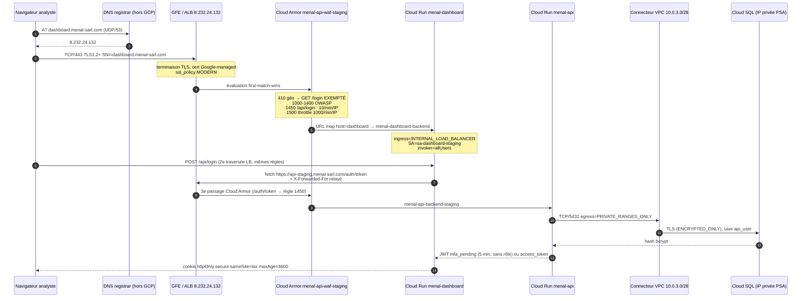

x# DOSSIER TECHNIQUE MENAL — Architecture, logique et défense

**Socle d'hébergement GCP Zero Trust — plateforme MENAL**
Document de référence technique et logique, destiné à l'étude d'ingénierie, à la préparation de soutenance et à l'argumentaire de commercialisation.

| | |
|---|---|
| **Date d'établissement** | 28/08/2026 |
| **Périmètre analysé** | Dépôt `menal-zero-trust-main`, branche `main`, environnement de référence **`staging`** (`menal-zero-trust-staging`, `europe-west1`) |
| **Méthode** | Audit de code en lecture seule par 4 équipes spécialisées, coordonnées par un pilote technique. Aucun fichier modifié, aucune commande GCP/Terraform mutante exécutée |
| **Règle de traçabilité** | Chaque affirmation est ancrée sur `chemin/fichier:ligne`. La mention **NON TROUVÉ DANS LE CODE** signale une absence *vérifiée par recherche explicite*, jamais une omission |
| **Environnements** | `staging` = seul environnement réellement exploité · `dev` = archivé le 19/08 · `prod/` = un `.gitkeep` vide, **la production n'existe pas** |

---

## Comment lire ce document

Trois niveaux de lecture cohabitent, et ils sont signalés :

- **Texte courant** — le fait technique, ancré sur le code.
- > **Encadré ⚠️** — un écart entre ce que la documentation revendique et ce que le code fait. Ces encadrés sont la matière première de la préparation de soutenance : ce sont les points qu'un jury attaquera.
- **Tableaux « Ce qu'il faut dire / Ce qu'il ne faut pas dire »** — la formulation exacte, défendable, à retenir.

Le parti pris est l'**honnêteté technique**. Un dossier qui ne recense que les points forts n'est pas défendable ; un dossier qui nomme ses limites, les chiffre et propose leur remédiation l'est. Les faiblesses recensées ici ne sont pas des reproches : plusieurs d'entre elles sont des choix contraints, assumés et tracés en ADR.

---

# SOMMAIRE

**PARTIE I — SOCLE ET INFRASTRUCTURE**
1. [Inventaire technologique global](#1-inventaire-technologique-global)
2. [Réseau — VPC, connectivité, pare-feu](#2-réseau--vpc-connectivité-pare-feu)
3. [Edge — Load Balancer, Cloud Armor, DNS, TLS](#3-edge--load-balancer-cloud-armor-dns-tls)
4. [Modèle Zero Trust — argumentaire technique](#4-modèle-zero-trust--argumentaire-technique-et-défendable)

**PARTIE II — IDENTITÉ ET ACCÈS**
5. [IAM GCP — comptes de service, WIF, org policies](#5-iam-gcp--comptes-de-service-wif-org-policies)
6. [Identité applicative — MFA, RBAC, sessions](#6-identité-applicative--mfa-rbac-sessions)
7. [Création et récupération des comptes admin / analyste](#7-création-et-récupération-des-comptes-admin--analyste)

**PARTIE III — APPLICATIONS ET DONNÉES**
8. [Application — Cloud Run, conteneurs, jobs](#8-application--cloud-run-conteneurs-jobs)
9. [FastAPI — rôle, justification, endpoints](#9-fastapi--rôle-justification-endpoints)
10. [Dashboard Next.js — fonctionnalités et flux de données](#10-dashboard-nextjs--fonctionnalités-et-flux-de-données)
11. [Données — Cloud SQL, BigQuery, KMS, Storage](#11-données--cloud-sql-bigquery-kms-storage)
12. [Moteur de détection — règles, MITRE, ML](#12-moteur-de-détection--règles-mitre-ml)

**PARTIE IV — EXPLOITATION**
13. [Observabilité — logs, métriques, alertes, SLO](#13-observabilité--logs-métriques-alertes-slo)
14. [CI-SEC-CD applicatif](#14-ci-sec-cd-applicatif)
15. [CI/CD infrastructure](#15-cicd-infrastructure)

**PARTIE V — MULTI-APPLICATIONS ET CLIENT PILOTE**
16. [Ajouter une nouvelle application — procédure technique](#16-ajouter-une-nouvelle-application--procédure-technique)
17. [Maturité multi-tenant et modèle cible](#17-maturité-multi-tenant-et-modèle-cible)
18. [Elson — application cliente hors périmètre](#18-elson--application-cliente-hors-périmètre)

**PARTIE VI — SYNTHÈSE**
19. [Scénarios complets de chaîne de communication](#19-scénarios-complets-de-chaîne-de-communication)
20. [Synthèse des écarts et plan d'action priorisé](#20-synthèse-des-écarts-et-plan-daction-priorisé)
21. [Informations supplémentaires et vigilances de soutenance](#21-informations-supplémentaires-et-vigilances-de-soutenance)

---
---

# PARTIE I — SOCLE ET INFRASTRUCTURE

# 1. Inventaire technologique global

## 1.1 Vue d'ensemble en une image

```
                          ┌─────────────────────────────────────────┐
                          │  UTILISATEURS                            │
                          │  analystes SOC · contributeurs Elson     │
                          └──────────────────┬──────────────────────┘
                                             │ HTTPS 443
┌────────────────────────────────────────────▼──────────────────────────────────────┐
│ L1 · EDGE                                                                          │
│   DNS chez registrar (HORS GCP, hors Terraform)                                    │
│   Global External ALB « classique » — IP anycast 8.232.24.132                      │
│   Cloud Armor menal-api-waf-staging — 9 règles, 4 backends, 0 en preview           │
│   Certificats Google-managed ×3 · SSL policy MODERN / TLS 1.2 min                  │
└────────────────────────────────────────────┬──────────────────────────────────────┘
                                             │ NEG serverless (1 par service)
┌────────────────────────────────────────────▼──────────────────────────────────────┐
│ L2 · APPLICATION — Cloud Run v2, ingress = INTERNAL_LOAD_BALANCER                  │
│   menal-api (FastAPI)   menal-dashboard (Next.js 14)   ml-embed (ONNX, INTERNAL)   │
│   elson-api (Express 5) elson-web (Next.js 16)                                     │
│   Jobs : enrich-job · elson-migrate · elson-sql-isolation-check                    │
└────────────────────────────────────────────┬──────────────────────────────────────┘
                                             │ Serverless VPC Connector 10.0.3.0/28
┌────────────────────────────────────────────▼──────────────────────────────────────┐
│ L3 · RÉSEAU — VPC custom menal-vpc-staging                                         │
│   subnet-public 10.0.1.0/24 · subnet-private 10.0.2.0/24  (les deux VIDES)         │
│   Cloud NAT (AUTO_ONLY, ERRORS_ONLY) · 4 règles firewall · deny-all prio 65534     │
│   Private Service Access → peering servicenetworking                               │
└────────────────────────────────────────────┬──────────────────────────────────────┘
                                             │ TCP 5432 privé
┌────────────────────────────────────────────▼──────────────────────────────────────┐
│ L4 · DONNÉES                                                                       │
│   Cloud SQL PostgreSQL 15 — menal-db-staging, REGIONAL, sans IP publique,          │
│      ssl_mode=ENCRYPTED_ONLY, PITR 7 j — bases menal_db ET elson_db (PARTAGÉE)     │
│   BigQuery menal_security_staging — 1 dataset, 10 tables, 0 vue                    │
│   Secret Manager ×9 (8 en CMEK) · KMS 2 keyrings / 2 clés, rotation 90 j           │
│   GCS menal-…-elson-media (CMEK, PAP enforced, sans versioning)                    │
└────────────────────────────────────────────────────────────────────────────────────┘
                                             ▲
┌────────────────────────────────────────────┴──────────────────────────────────────┐
│ L5 · SIEM & OBSERVABILITÉ                                                          │
│   4 log sinks → BigQuery · 5 requêtes de normalisation (5 min)                     │
│   7 règles de détection R1-R7 (5 min, fenêtre 15 min) → table detections           │
│   Enrichissement ATT&CK-BERT (ONNX fp32, 768-D) toutes les 15 min                  │
│   Cloud Monitoring : 17 alert policies · 2 uptime checks · 4 SLO · 3 log-metrics   │
└────────────────────────────────────────────────────────────────────────────────────┘
```

## 1.2 Tableau exhaustif des technologies

### Infrastructure et plateforme

| Domaine | Technologie | Version / paramètre | Rôle dans MENAL |
|---|---|---|---|
| Cloud | **Google Cloud Platform** | projet `menal-zero-trust-staging`, région `europe-west1` | Unique fournisseur. **Pas d'organisation GCP** — contrainte structurante (§5.5) |
| IaC | **Terraform** | `required_version >= 1.7`, providers `google`/`google-beta` **5.45.2**, `random` 3.9.0, `github` 6.13.0 (verrouillés par `.terraform.lock.hcl` versionné) | 16 modules, 3 racines d'environnement |
| Compute | **Cloud Run v2** | `google_cloud_run_v2_service` uniquement (aucun v1) | 5 services + 3 jobs |
| Réseau | VPC custom, Serverless VPC Access, Cloud NAT, Private Service Access | — | §2 |
| Edge | Global External ALB (**variante classique**), **Cloud Armor Standard** | 9 règles | §3 |
| Base relationnelle | **Cloud SQL PostgreSQL 15** | `db-f1-micro`, `REGIONAL`, PITR 7 j | Utilisateurs, rôles, audit applicatif, base Elson |
| Entrepôt / SIEM | **BigQuery** | 1 dataset, 10 tables, partitionnement DAY | Logs normalisés, détections, enrichissement, CVE, verdicts |
| Secrets | **Secret Manager** | 9 secrets, 8 en CMEK | Mots de passe, clés JWT et Fernet |
| Chiffrement | **Cloud KMS** | 2 keyrings (régional + global), rotation **90 j**, `protection_level = SOFTWARE` | CMEK BigQuery, Secret Manager, GCS |
| Objets | **Cloud Storage** | UBLA, `public_access_prevention = enforced`, CMEK, **sans versioning** | Médias Elson |
| Registre | **Artifact Registry** | `menal-docker-staging`, format DOCKER | **Sans `immutable_tags`, sans cleanup policy, sans Artifact Analysis** |
| Ordonnancement | **BigQuery Data Transfer** (12 requêtes planifiées) + **Cloud Scheduler** (2 jobs) | cadence 5 min / 15 min / quotidienne | Le véritable ordonnanceur du SIEM est BigQuery, pas Cloud Workflows |

### Applications

| Composant | Stack | Version | Rôle |
|---|---|---|---|
| **API MENAL** | Python + **FastAPI** + SQLAlchemy 2.0.36 + `pg8000` + Cloud SQL Python Connector | Python 3.12 | Unique point d'accès aux données de sécurité — 21 endpoints |
| **Dashboard SOC** | **Next.js 14.2.35** App Router, React 18, `output: standalone`, Tailwind, recharts, lucide-react | Node 20 | 12 pages, 7 route handlers d'authentification |
| **ml-embed** | Python + ONNX Runtime CPU + tokenizer HF | modèle **`basel/ATTACK-BERT`**, ONNX **fp32**, 768-D, ~440 Mo | Encodage vectoriel des détections |
| **enrich-job** | Python (Cloud Run Job) | — | Orchestre détection → embedding → `VECTOR_SEARCH` ATT&CK |
| **Elson API** *(hors périmètre)* | Node 22 + **Express 5.1** + `pg` brut (aucun ORM) + helmet + zod | — | ~245 endpoints |
| **Elson Web** *(hors périmètre)* | **Next.js 16.3.1** + React 19.2.4 + Tailwind 4 + three.js | — | PWA installable |

### Sécurité et chaîne de livraison

| Famille | Outil | Version | Bloquant ? |
|---|---|---|---|
| Secret scanning | **Gitleaks** (`gitleaks-action@v2`) | tag flottant | ✅ |
| SAST | **Semgrep CLI** `p/default` | **`semgrep==1.173.0` épinglée** | ✅ (7 exclusions nominatives justifiées) |
| Scan IaC | **Trivy config** | `trivy-action@v0.36.0` | ✅ sur CRITICAL |
| Scan d'image | **Trivy image** | idem | ✅ sur CRITICAL corrigeable |
| Tests API | pytest (31 tests dont 18 MFA) | — | ✅ (échec), ❌ (couverture) |
| Tests dashboard | Jest | — | ✅ (échec), ❌ (couverture **3,00 %**) |
| E2E | pytest + Playwright | — | ✅ post-déploiement |
| SCA / DAST / SBOM / signature / SLSA | ❌ **AUCUN** | — | — |
| Identité CI | **Workload Identity Federation** | contrainte `repository` **ET** `ref` | Aucune clé JSON de SA dans tout le dépôt |

### Ce qui n'existe pas — et qu'un jury pourrait croire présent

| Attendu | État réel | Conséquence |
|---|---|---|
| **Cloud DNS** | ❌ `grep google_dns` = 0. DNS **manuel chez le registrar** | Seul maillon d'exposition hors « tout est Terraform » |
| **Cloud Workflows** | ❌ 0 ressource. Le module `workflow/` ne contient plus que 2 bindings IAM | Le pipeline `menal-security-pipeline` a été supprimé le 02/08 après 60 échecs consécutifs |
| **Dashboards Cloud Monitoring** | ❌ 0 `google_monitoring_dashboard` | Toute la restitution visuelle est applicative (Next.js) |
| **Tracing / OpenTelemetry / Cloud Trace** | ❌ 0 occurrence | Aucune corrélation trace-id ↔ logs |
| **VPC Service Controls** | ❌ 0 ressource | Écart M2 |
| **Org policies** | ❌ 0 ressource (projet personnel sans organisation) | Garanties « par discipline », jamais préventives |
| **IAP** | ❌ Absent — exige Google Workspace | Compensé par `ingress = INTERNAL_LOAD_BALANCER` seul |
| **Vrai Sigma (YAML, pySigma)** | ❌ 0 fichier, 0 dépendance | Voir §12.2 |
| **Détecteur temps réel** | ❌ 0 fichier dans le dépôt | Latence prouvée = **~15 min** |
| **Artifact Analysis (scan GCP)** | ❌ API non activée | Le scan est 100 % externe (Trivy en CI) |
| **Cloud CDN** | ❌ Désactivé partout | Choix correct : aucun risque de cache de réponse API |

---
---

# 2. Réseau — VPC, connectivité, pare-feu

## 2.1 Topologie VPC

| Attribut | Valeur | Preuve |
|---|---|---|
| Nom | `menal-vpc-staging` | `terraform/modules/vpc/main.tf:2` |
| Mode | **Custom** (`auto_create_subnetworks = false`) | `vpc/main.tf:4` |
| `routing_mode` | **NON TROUVÉ DANS LE CODE** → défaut GCP `REGIONAL` | — |
| MTU | **NON TROUVÉ DANS LE CODE** | — |
| Nombre de VPC | **1 seul, partagé entre tous les tenants** (MENAL + Elson) | `staging/main.tf:90-97` |

### Subnets

| Nom | Région | CIDR | Ranges secondaires | Private Google Access | Flow logs | Échantillonnage |
|---|---|---|---|---|---|---|
| `subnet-public-staging` | `europe-west1` | `10.0.1.0/24` | aucun | non déclaré → `false` | activés | **0,5** / `INTERVAL_10_MIN` / `INCLUDE_ALL_METADATA` |
| `subnet-private-staging` | `europe-west1` | `10.0.2.0/24` | aucun | **`true`** | activés | idem |
| *(implicite)* subnet du connecteur | `europe-west1` | `10.0.3.0/28` | — | géré par le service | — | — |
| *(implicite)* plage PSA `google-services-staging` | VPC | `/16` **alloué automatiquement par GCP** | — | — | — | — |

Preuves : `vpc/main.tf:7-19` (public), `:21-34` (privé, PGA ligne 27), `:141-152` (connecteur), `vpc/variables.tf:17-33`, `cloud-sql/main.tf:3-10` (PSA).

**Aucun `secondary_ip_range` nulle part** — cohérent avec l'absence totale de GKE.

> ⚠️ **Constat non documenté ailleurs : les DEUX subnets sont vides.** L'ADR-0006 ne signale que le subnet public. Vérification :
> - aucun `google_compute_instance` dans le dépôt ;
> - `module.vpc.subnet_private_id` (`vpc/outputs.tf:11-14`) **n'est consommé nulle part** ;
> - Cloud SQL prend son IP dans la plage **PSA**, pas dans `subnet-private` ;
> - les workloads Cloud Run sortent par le **connecteur**, dont le `/28` est distinct des deux subnets.
>
> **Conséquence vérifiable :** le Cloud NAT est attaché en `LIST_OF_SUBNETWORKS` **uniquement** à `subnet-private` (`vpc/main.tf:49-54`), c'est-à-dire à un subnet sans aucune ressource, tandis que la plage du connecteur `10.0.3.0/28` — qui porte **la totalité** de l'egress serverless — **n'est pas dans la liste NAT**. Le commentaire `ml-pipeline/main.tf:178-182` (« BigQuery reste joignable via PGA + NAT ») repose sur une hypothèse que le code ne soutient pas. Le pipeline fonctionne en pratique (Google active vraisemblablement PGA sur le subnet du connecteur), mais **à confirmer par `gcloud compute networks vpc-access connectors describe` avant toute affirmation en soutenance**.

## 2.2 Connectivité sortante

### Serverless VPC Access Connector

| Paramètre | Valeur | Preuve |
|---|---|---|
| Nom | `menal-vpc-connector-stg` (abrégé : limite API 25 caractères) | `vpc/main.tf:128-142` |
| CIDR | `10.0.3.0/28` | `:146` |
| Machine type | `e2-micro` | `:147` |
| Min / max instances | **2 / 10** | `:148-149` |
| Throughput min / max | **200 / 1000 Mbps** | `:150-151` |
| Nombre | **1 seul**, partagé par 7 charges de travail tous tenants confondus | `staging/main.tf:198, 299, 316` ; `elson.tf:74, 137, 234, 272` |

> ⚠️ **SPOF réseau total (écart M17).** Sa perte coupe simultanément l'accès Cloud SQL de `menal-api`, `dashboard`, `elson-api`, `elson-web`, `enrich-job` et des jobs de migration. Remédiation recommandée : **Direct VPC egress** (GA sur Cloud Run) — supprime le connecteur, son coût fixe et le SPOF.

### Cloud Router + Cloud NAT

| Paramètre | Valeur | Preuve |
|---|---|---|
| Router | `menal-router-staging` (aucun BGP/ASN) | `vpc/main.tf:36-41` |
| NAT | `menal-nat-staging` | `:44` |
| Allocation d'IP | **`AUTO_ONLY`** → **aucune IP de sortie stable allowlistable** | `:48` |
| Périmètre | `LIST_OF_SUBNETWORKS` → `subnet-private`, `ALL_IP_RANGES` | `:49-54` |
| Logging | `enable = true`, **`filter = "ERRORS_ONLY"`** | `:59-62` |
| Sink des logs NAT | **NON TROUVÉ DANS LE CODE** — aucun des 4 sinks ne capte `nat_gateway` | `modules/logging/main.tf` |

> ⚠️ **Risque résiduel assumé (ADR-0007).** `ERRORS_ONLY` ne capte **aucune connexion sortante réussie** : une exfiltration ou un canal C2 discret ne produirait aucun signal côté NAT.

### Routes et Private Service Connect

- **Routes personnalisées : NON TROUVÉ DANS LE CODE** — aucune `google_compute_route`. Seules les routes implicites GCP existent.
- **Private Service Connect : NON TROUVÉ DANS LE CODE** — aucun `google_compute_service_attachment`. La connectivité aux API Google repose sur Private Google Access et sur les endpoints publics traversés par le connecteur.

### Private Service Access (Cloud SQL)

| Paramètre | Valeur | Preuve |
|---|---|---|
| Plage réservée | `google-services-staging`, `purpose = VPC_PEERING`, `INTERNAL`, `prefix_length = 16` | `cloud-sql/main.tf:3-10` |
| Adresse de début | **NON TROUVÉ DANS LE CODE** — champ `address` absent → allocation automatique. La valeur `10.20.0.0/16` circulant dans les docs internes est notée « non vérifiable » (écart M21) | — |
| Connexion | `google_service_networking_connection` | `:12-16` |

## 2.3 Pare-feu VPC

Quatre règles, **aucune règle EGRESS** → l'egress reste `allow all` par la règle implicite GCP.

| # | Nom | Dir. | Prio | Sources | Cible | Ports | Action | Logging | Lignes |
|---|---|---|---|---|---|---|---|---|---|
| 1 | `allow-health-checks-staging` | INGRESS | 800 | `35.191.0.0/16`, `130.211.0.0/22` | tag `https-server` | TCP 80/443/8080 | ALLOW | non | `:154-168` |
| 2 | `allow-internal-staging` | INGRESS | **900** | `10.0.1.0/24`, `10.0.2.0/24` | **aucune** (= tout le VPC) | **TCP+UDP 0-65535 + ICMP** | ALLOW | non | `:104-126` |
| 3 | `allow-https-ingress-staging` | INGRESS | 1000 | `0.0.0.0/0` | tag `https-server` | TCP 443 | ALLOW | non | `:88-102` |
| 4 | `deny-all-ingress-staging` | INGRESS | **65534** | `0.0.0.0/0` | aucune | `all` | **DENY** | **oui** | `:65-86` |

**Analyse du deny-by-default — réel mais partiel :**

- ✅ **Réel en ingress** : la règle 65534 couvre tout le VPC. Sa journalisation alimente le sink `vpc_to_bq` filtrant `jsonPayload.disposition="DENIED"`. Le choix de ne journaliser **que** la règle DENY (et pas les 3 ALLOW) est motivé par le coût d'ingestion, tracé en commentaire et en ADR-0007.
- ❌ **Inexistant en egress** : aucune règle EGRESS. Le seul garde-fou est `egress = PRIVATE_RANGES_ONLY` au niveau Cloud Run — un contrôle de la plateforme serverless, pas du pare-feu.
- ❌ **Deux règles mortes** : `allow_https` et `allow_health_checks` ciblent le tag `https-server` que **rien n'attache jamais** (écart M21).

> ⚠️ **`allow_internal` annule le discours Zero Trust.** La règle prio 900 ouvre **tout TCP/UDP/ICMP** entre les deux subnets, sans `target_tags` ni `target_service_accounts` : c'est de la **confiance de zone**, exactement ce que NIST 800-207 §2.1 interdit (écarts **H6** + **M1**, ouverts).
> **Nuance honnête à ajouter :** comme les deux subnets sont vides, l'exposition *effective aujourd'hui* est nulle — mais la règle deviendra dangereuse au premier workload posé dans le VPC.

---
---

# 3. Edge — Load Balancer, Cloud Armor, DNS, TLS

## 3.1 Type de Load Balancer — précision importante

**Global External Application Load Balancer, variante CLASSIQUE** — pas la variante moderne :

- ni `google_compute_backend_service` (`load-balancer/main.tf:200`) ni `google_compute_global_forwarding_rule` (`:457`) ne déclarent `load_balancing_scheme` → défaut provider = `EXTERNAL` (classique), et non `EXTERNAL_MANAGED`.
- **Conséquence défendable :** les fonctionnalités d'*advanced traffic management* (pondération de backends, mirroring, retry policies, header actions) **ne sont pas disponibles**. Aucune n'est utilisée — pas d'écart fonctionnel — mais l'affirmation « ALB global advanced » serait fausse.

## 3.2 Point d'entrée

| Composant | Valeur | Preuve |
|---|---|---|
| IP globale réservée | `menal-api-lb-ip-staging` — **`8.232.24.132`** | `load-balancer/main.tf:19-22` ; `staging/terraform.tfvars:12-13` |
| Forwarding rule HTTPS | `menal-api-lb-https-staging`, port 443 | `:457-463` |
| Forwarding rule HTTP | `menal-api-lb-http-staging`, port 80 → proxy de redirection | `:483-489` |
| Target HTTPS proxy | `menal-api-https-proxy-staging`, `ssl_policy = menal-ssl-policy-staging`, **3 certificats** | `:444-454` |
| Redirection HTTP→HTTPS | `https_redirect = true`, **301** (`MOVED_PERMANENTLY_DEFAULT`), `strip_query = false` | `:466-475` |
| QUIC / HTTP3 | **NON TROUVÉ DANS LE CODE** | — |

## 3.3 URL map — routage par hôte

```
menal-api-urlmap-staging
├── default_service ────────────────────► menal-api-backend-staging          (:328)
│      ↑ tout Host non reconnu, y compris https://8.232.24.132, atterrit ICI
│
├── api-staging.menal-sarl.com   → path_matcher "api-matcher-staging"
│      └── default ───────────────────► menal-api-backend-staging            (:331-339)
│
├── dashboard.menal-sarl.com     → path_matcher "dashboard-matcher-staging"
│      └── default ───────────────────► menal-dashboard-backend-staging      (:342-356)
│
└── elson.menal-sarl.com         → path_matcher "extra-elson-matcher-staging"
       ├── /api/*        ─────────────► menal-elson-api-backend-staging      (:375-381)
       ├── /recordings/* ─────────────► menal-elson-api-backend-staging
       └── default       ─────────────► menal-elson-backend-staging (elson-web)
```

> ⚠️ **Observation de sécurité non tracée ailleurs :** le `default_service` de l'URL map est le backend **API MENAL**. Toute requête avec un `Host` inconnu — y compris un scan direct sur l'IP avec SNI arbitraire — est routée vers l'API de la plateforme de sécurité, et non vers un 404 neutre. Cloud Armor s'applique, donc ce n'est pas un contournement, mais un `default_service` renvoyant 404 serait plus propre.

## 3.4 Backend services et NEG

| Nom | Service Cloud Run | Protocole | Security policy | Logs | Sample rate | CDN | IAP |
|---|---|---|---|---|---|---|---|
| `menal-api-backend-staging` | `menal-api-staging` | HTTPS | `menal-api-waf-staging` | ✅ | **1,0** | off | absent |
| `menal-dashboard-backend-staging` | `menal-dashboard-staging` | HTTPS | idem | ✅ | 1,0 | off | absent |
| `menal-elson-backend-staging` | `elson-web-staging` | HTTPS | idem | ✅ | 1,0 | off | absent |
| `menal-elson-api-backend-staging` | `elson-api-staging` | HTTPS | idem | ✅ | 1,0 | off | absent |

Preuves : `:200-216`, `:231-246`, `:269-284`, `:300-315`.

**Trois points à valoriser :**
1. **Un NEG serverless par service**, tous en `network_endpoint_type = "SERVERLESS"`.
2. **100 % des backends derrière la même `security_policy`** — aucun point d'entrée oublié, confirmé par l'audit expert du 18/08.
3. **`log_config.sample_rate = 1,0` sur les 4 backends** : c'est ce qui rend le SIEM possible, les verdicts Cloud Armor n'existant que dans le log `http_load_balancer`. **Aucun angle mort statistique.**

**IAP : absent**, décision explicite et écrite (`load-balancer/main.tf:195-199`) — IAP exige une organisation Google Workspace, indisponible sur un projet personnel. La variable `support_email` est un vestige de cette tentative, **plus consommée par aucune ressource**.

## 3.5 Cloud Armor — la politique complète

Une **seule** politique, `menal-api-waf-staging`, attachée aux **4** backends. Évaluation *first-match-wins*.

| Prio | Action | Matcher | Mode | Objet |
|---|---|---|---|---|
| **410** | `deny(403)` | expression CEL (ci-dessous) | enforced | Géo-blocage |
| **1000** | `deny(403)` | `evaluatePreconfiguredWaf('xss-v33-stable', {'sensitivity': 1})` | enforced | XSS — OWASP A03 |
| **1100** | `deny(403)` | `sqli-v33-stable`, sensitivity 1 | enforced | SQLi — A03 |
| **1200** | `deny(403)` | `lfi-v33-stable`, sensitivity 1 | enforced | LFI — A05 |
| **1300** | `deny(403)` | `rce-v33-stable`, sensitivity 1 | enforced | RCE — A01 |
| **1400** | `deny(403)` | `rfi-v33-stable`, sensitivity 1 | enforced | RFI — A04 |
| **1450** | `rate_based_ban` | `request.path.startsWith(p)` ∀ p ∈ `auth_paths` | enforced | Anti-brute-force |
| **1500** | `throttle` | `SRC_IPS_V1` = `*` | enforced | Anti-DDoS |
| **2147483647** | `allow` | `*` | enforced | Default allow |

Preuves : `load-balancer/main.tf:56-65, 68-77, 80-89, 92-101, 104-113, 116-125, 134-153, 159-178, 181-191`.

> ✅ **Aucune règle en mode preview** — `grep preview` sur tout `terraform/` = 0 résultat. **Toutes les règles bloquent réellement.** C'est un différenciateur face aux projets qui laissent le WAF en observation.

### Règle 410 — géo-blocage, expression exacte

```cel
!(request.path == '/health'
  || (request.method == 'GET' && (request.path == '/' || request.path == '/login')))
&& !origin.region_code.matches('^(?:FR|DE|ES|IT|NL|BE|PT|SE|DK|FI|AT|IE|PL|CZ|GR|HU|RO|BG|SK|SI|LT|LV|EE|HR|LU|MT|CY|TN|DZ|MA|MR)$')
&& !inIpRange(origin.ip, '10.0.0.0/8')
&& !(inIpRange(origin.ip, '41.188.119.111/32') || inIpRange(origin.ip, '41.188.115.140/32'))
```

**30 pays autorisés** : les 27 de l'UE (liste complète, vérifiée) + **TN, DZ, MA, MR**. Les IP admin proviennent de `var.admin_ip_ranges` (`terraform.tfvars:6`).

> ✅ **Choix d'architecture remarquable, à mettre en avant.** L'exemption admin est **repliée à l'intérieur** de la règle de deny (par négation), et non exprimée comme une règle `allow` prioritaire. Le commentaire explique pourquoi : une règle `allow` de priorité inférieure à 410 serait **terminale** et court-circuiterait entièrement le WAF OWASP **et** le rate-limit pour les IP admin. Raisonnement juste, rare, formalisé en ADR-0004.

> ⚠️ **Faiblesse de la même règle :** `/health` est exempté **sans contrainte de méthode** et sur **tous les hôtes** ; `GET /` et `GET /login` sont exemptés sur tous les hôtes également — ce qui, sur le domaine Elson, expose la landing page mondialement.

### Couverture WAF — et ses lacunes

| Ruleset OWASP CRS | Utilisé ? | Sensitivity |
|---|---|---|
| `sqli-v33-stable`, `xss-v33-stable`, `lfi-v33-stable`, `rfi-v33-stable`, `rce-v33-stable` | ✅ | **1** (le plus bas des 4) |
| `scannerdetection-v33-stable` | ❌ | — |
| `protocolattack-v33-stable` | ❌ | — |
| `sessionfixation-v33-stable` | ❌ | — |
| `methodenforcement-v33-stable` | ❌ | — |
| `php` / `java` / `nodejs` -v33-stable | ❌ | — |
| `cve-canary` (Log4Shell) | ❌ | — |

> ⚠️ **Écart H13, à annoncer soi-même.** `sensitivity: 1` ne charge que les signatures paranoïa-level 1 : peu de faux positifs, mais les évasions passent. Test live du 19/08 : SQLi **403 ✅**, XSS **403 ✅**, `.env` **403 ✅**, `.git/config` **403 ✅**, mais **path traversal envoyé brut (`curl --path-as-is`) → 302 au lieu de 403 ⚠️**. Mécanisme non élucidé (hypothèse : normalisation d'URL par le GFE avant évaluation).
> **Formulation à retenir : « 4 patterns sur 5 bloqués, et voici l'explication du 5ᵉ »** — jamais « OWASP Top 10 couvert ».
> L'absence de `protocolattack` et `methodenforcement` est le complément logique de cette faiblesse : ce sont précisément les rulesets qui traitent les anomalies de requête et d'encodage.

### Règle 1450 — anti-brute-force

| Paramètre | Valeur |
|---|---|
| Action | `rate_based_ban` · `conform_action = allow` · `exceed_action = deny(429)` |
| `enforce_on_key` | **`IP`** |
| Seuil | **10 requêtes / 60 s** |
| `ban_duration_sec` | **300** (5 min) |

**Chemins réellement protégés en staging** (`terraform.tfvars:35`) : `/auth/token`, `/api/login`, `/api/auth`, `/auth/mfa/verify`, `/auth/mfa/enable`, `/auth/mfa/disable`.

> ⚠️ **À corriger dans le rapport.** `01_ARCHITECTURE_MENAL.md:329-333` présente encore `/auth/mfa/verify` comme non couvert (« point ouvert », daté 19/08). **C'est faux depuis la correction H3 (19-20/08)** : le `tfvars` le couvre. C'est la valeur *par défaut du module* (`load-balancer/variables.tf:47-51`) qui reste incomplète, pas l'environnement déployé.

**Endpoints d'authentification non couverts au bord :**

| Endpoint | Couvert 1450 ? | Filet applicatif |
|---|---|---|
| `POST /auth/token` | ✅ | slowapi 60/min |
| `POST /auth/mfa/verify` | ✅ | slowapi 60/min, **clé = `mfa_token`** — double protection bien conçue |
| `POST /auth/mfa/enable` / `disable` | ✅ | slowapi 60/min |
| `POST /auth/mfa/setup` | ❌ **non couvert** | **aucun** — génère pourtant un secret TOTP à chaque appel |
| `GET /auth/mfa/status` | ❌ | aucun (lecture, risque nul) |
| `POST /api/login/mfa` (proxy Next.js) | ❌ | couverture **indirecte** via `/auth/mfa/verify` |

> ⚠️ **Faiblesse structurelle de la clé `IP`.** Sur le trajet **dashboard → API**, il y a **double traversée du LB** (`client → LB → Next.js → LB → API`). Pour la seconde traversée, l'IP vue par Cloud Armor est l'**IP de sortie partagée du service Next.js** : le compteur de la règle 1450 sur `/auth/token` devient **commun à tous les analystes**. Le contournement retenu côté applicatif (limite volontairement large à 60/min + clé `mfa_token`) est intelligent, mais **ne restaure pas** un anti-brute-force par client réel sur `/api/login` via le dashboard.

### Règle 1500 — throttle, et le bug qu'elle a corrigé

`throttle`, 1000 requêtes / 60 s par IP, `exceed_action = deny(429)`.

> ✅ **À raconter en soutenance.** Le commentaire `:155-158` documente que cette règle était initialement placée **avant** les règles OWASP. Comme un `throttle` à `conform_action = allow` est **terminal**, elle court-circuitait intégralement les règles 1000-1400 : **le WAF était inerte**. Repositionnée en 1500, elle s'applique après. Excellente démonstration de maîtrise de la sémantique first-match-wins.

### Options avancées

| Contrôle | État |
|---|---|
| Geo-blocking | ✅ règle 410 |
| **Adaptive Protection (L7 DDoS defense)** | ❌ **NON TROUVÉ DANS LE CODE** (requiert Cloud Armor Enterprise) |
| `advanced_options_config` (log level VERBOSE) | ❌ NON TROUVÉ |
| reCAPTCHA / bot management | ❌ NON TROUVÉ |

> **Formulation juste :** protection L7 **statique** (règles + rate-limit), pas de détection d'anomalie **adaptative**. L'anti-DDoS s'arrête à un seuil fixe de 1000 req/min/IP, qu'un botnet distribué franchit trivialement.

## 3.6 DNS et TLS

### DNS — hors Terraform, hors GCP

| Constat | Preuve |
|---|---|
| **Aucune zone Cloud DNS** — `grep google_dns` = **0** | vérifié |
| Enregistrements A créés **manuellement chez le registrar** | `04_EXPLOITATION_DEMO.md:508-509` ; `terraform.tfvars:11-13` |
| Nom du registrar | **NON TROUVÉ DANS LE CODE** |
| DNSSEC | **NON TROUVÉ DANS LE CODE** |

| FQDN | Cible | Statut |
|---|---|---|
| `api-staging.menal-sarl.com` | `8.232.24.132` | actif |
| `dashboard.menal-sarl.com` | `8.232.24.132` | actif depuis le 20/08 |
| `elson.menal-sarl.com` | `8.232.24.132` | actif |
| `dash-staging.menal-sarl.com` | — | **retiré → NXDOMAIN** (écart M23) |

> ⚠️ **Écart de gouvernance à assumer.** `01_ARCHITECTURE_MENAL.md:239` affirme « L1 — EDGE : **Cloud DNS** ». **Cloud DNS n'est pas utilisé.** Le DNS est le seul maillon de la chaîne d'exposition qui échappe à « tout est Terraform ». Risque opérationnel réel : la bascule DNS manuelle du 20/08 a cassé la CI pendant 4 jours sans que personne ne le voie.

### Certificats et politique SSL

Trois certificats Google-managed, un par domaine, nommés avec un suffixe de hash MD5 du domaine et `create_before_destroy` — mécanisme réellement exercé lors de la bascule `dash-staging` → `dashboard` du 20/08 (`:388-433`).

**Politique SSL** : `profile = "MODERN"`, `min_tls_version = "TLS_1_2"` (`:436-441`).

**Terminaison TLS : au GFE.** Le tronçon GFE → Cloud Run est chiffré par Google (transit interne géré). `protocol = "HTTPS"` sur les backend services est cosmétique pour un NEG serverless.

> ⚠️ **Aucune alerte sur l'échec de provisioning/renouvellement des certificats** (`FAILED_NOT_VISIBLE` silencieux si le DNS dérive) — écart **L15**, ouvert.

### HSTS — trois politiques divergentes

| Émetteur | Valeur | Preuve |
|---|---|---|
| API MENAL (FastAPI) | `max-age=31536000; includeSubDomains` (1 an, **sans `preload`**) | `api/main.py:39` |
| Dashboard (Next.js) | `max-age=31536000; includeSubDomains` | `dashboard/next.config.js:22` |
| Elson API (helmet) | `max-age=63072000; includeSubDomains; preload` (2 ans) | `elson-main/backend/src/server.ts:70` |

**HSTS n'est PAS posé par le Load Balancer** — aucun `custom_response_headers`. Autres en-têtes durcis, cohérents API/dashboard : `X-Content-Type-Options: nosniff`, `X-Frame-Options: DENY`, `Referrer-Policy: strict-origin-when-cross-origin`, CSP complète côté dashboard (`frame-ancestors 'none'`, `object-src 'none'`), `Permissions-Policy`.

> ⚠️ L'absence de `preload` sur MENAL signifie qu'une **toute première** requête HTTP en clair est possible (elle recevra un 301, mais elle a lieu). Trois politiques HSTS sur le même LB est aussi une incohérence de gouvernance. **Remédiation : poser HSTS au LB via `custom_response_headers`** — source unique de vérité.

### Chiffrement en transit interne

| Tronçon | Chiffrement | Authentification du pair |
|---|---|---|
| GFE → Cloud Run | ✅ géré par Google | ✅ plateforme |
| Cloud Run → connecteur VPC | trafic VPC interne, **non chiffré applicativement** | — |
| `menal-api` → Cloud SQL | ✅ TLS forcé (`ssl_mode = ENCRYPTED_ONLY`) | dépend du client |
| **Elson → Cloud SQL** | ✅ TLS (`DB_SSL = "true"`) **mais `rejectUnauthorized: false`** | ❌ **certificat serveur jamais vérifié** |
| Cloud Run → BigQuery / Secret Manager | ✅ HTTPS API Google | ✅ |
| `enrich-job` → `ml-embed` | ✅ HTTPS + jeton d'identité | ✅ IAM `run.invoker` |

> ⚠️ **Écart H14 — le plus embarrassant du dossier réseau.** Elson chiffre sa connexion base mais **ne vérifie pas le certificat serveur** (8 occurrences : `elson-main/backend/src/db.ts:18` + 7 scripts) : protection contre l'écoute passive, **aucune** contre un MITM actif à l'intérieur du VPC. Combiné à `allow_internal` qui ouvre tout entre subnets, c'est un « vérifier explicitement » manquant **au cœur exact du discours Zero Trust**. L'instance dispose pourtant d'une CA exploitable (`serverCaMode: GOOGLE_MANAGED_INTERNAL_CA`, vérifié en direct le 24/08). Statut : **ouvert, assumé, tracé**, neutralisé en CI par 8 `nosemgrep` nominatifs.
> **Remédiation :** télécharger la CA de l'instance, la monter en secret, passer `ssl: { ca, rejectUnauthorized: true }`, retirer les 8 `nosemgrep`.

---
---

# 4. Modèle Zero Trust — argumentaire technique et défendable

## 4.1 Mapping sur les 7 tenets NIST SP 800-207 §2.1

| # | Tenet NIST | Implémenté (preuve) | Maturité | Ce qui manque |
|---|---|---|---|---|
| **1** | Toutes les sources de données et services sont des **ressources** | Chaque workload = un service Cloud Run avec **SA dédié** (`staging/main.tf:190-206, 311-322` ; `elson.tf:224-284` ; `ml-pipeline/main.tf:37-130`). BigQuery / Cloud SQL / Secret Manager traités comme ressources distinctes avec IAM propre | **Avancé** | Le VPC n'est pas traité comme une ressource à protéger (pas de VPC-SC, M2) |
| **2** | Toute communication est **sécurisée** quelle que soit la localisation | TLS 1.2 min profil MODERN au bord ; HTTPS-only + 301 ; HSTS applicatif ; Cloud SQL `ENCRYPTED_ONLY` ; appels service-à-service par **jeton d'identité** (`ml-pipeline/main.tf:208-214`) | **Initial → Avancé** | **H14** (Elson ne vérifie pas le cert Cloud SQL). Aucun mTLS interne, aucun service mesh. Le trafic **intra-VPC est en clair et non authentifié** |
| **3** | L'accès est accordé **par session** | JWT court + RBAC 3 rôles (`siem.py:206, 518`) ; MFA TOTP avec JWT intermédiaire `typ:"mfa_pending"` 5 min **sans rôle** ; cookie `httpOnly`+`secure`+`sameSite:lax`, `maxAge 3600` | **Avancé** | Pas de révocation serveur (JWT stateless), pas de ré-évaluation en cours de session |
| **4** | L'accès est déterminé par une **politique dynamique** | Politique **statique** : rôle JWT + géo + IP admin + seuils de débit | **Traditionnel** | ❌ **Aucun signal de posture d'appareil**, aucun score de risque, aucune adaptation dynamique, aucun step-up contextuel. **C'est le tenet le plus faible** |
| **5** | L'entreprise **mesure la posture** de tous les actifs | CI : Gitleaks + Semgrep + Trivy bloquant CRITICAL ; images non-root ; scan IaC ; job quotidien de vérification d'isolation SQL | **Initial** | **Aucune notion d'appareil client** : ni MDM, ni certificat client, ni BeyondCorp. La posture mesurée est celle des *artefacts*, jamais des *terminaux*. `disableServiceAccountKeyCreation` non applicable (H10) |
| **6** | Authentification et autorisation **dynamiques et strictement appliquées avant l'accès** | Cloud Run `ingress = INTERNAL_LOAD_BALANCER` — l'URL `run.app` est injoignable ; `ml-embed` en `INTERNAL_ONLY` + invoker limité à `sa-enrich-job` ; RBAC vérifié **7/7 routes en conditions réelles** | **Avancé** | ⚠️ **`roles/run.invoker` accordé à `allUsers`** sur `menal-api` et le dashboard. L'autorisation d'invocation est **anonyme** ; c'est l'`ingress` qui fait tout le travail. **Contrôle unique, sans défense en profondeur** |
| **7** | Collecte du **maximum d'informations** pour améliorer la posture | 4 sinks BigQuery ; logs LB à **100 %** ; VPC Flow Logs 0,5 ; deny firewall journalisé ; 5 normalisations / 5 min ; 7 règles + enrichissement ATT&CK-BERT | **Avancé** | **H9** : aucune règle d'exfiltration, aucune détection d'abus IAM (`SetIamPolicy`), aucune UEBA. Logs NAT `ERRORS_ONLY` → egress réussi invisible. Data Access logs non centralisés (**M7**) |

## 4.2 Mapping CISA ZTMM v2 — 5 piliers + 3 capacités transverses

| Pilier | Niveau | Justification chiffrée |
|---|---|---|
| **Identity** | **Avancé** | 7 SA distincts, **aucun `roles/editor`/`owner`**, **aucune clé JSON**, WIF avec `attribute_condition` sur repo **et** ref, jetons courts. MFA TOTP RFC 6238 `valid_window=1`. *Manque* : pas de MFA résistant au phishing (WebAuthn), pas de politique d'org, pas de codes de secours (L12) |
| **Devices** | **Traditionnel** | ❌ **Rien.** Aucune notion d'appareil dans toute la chaîne. Le seul attribut « lieu » est le `region_code` géo-IP, qui n'est pas un appareil. **C'est le pilier vide du modèle** |
| **Networks** | **Initial** | Nord-sud solide (WAF enforced, TLS 1.2 MODERN, ingress LB-only, Cloud SQL sans IP publique, egress `PRIVATE_RANGES_ONLY`) — noté 6/10 par l'audit expert. Est-ouest quasi inexistant : `allow_internal` tout-ouvert, VPC/connecteur/instance SQL **partagés entre tenants**, pas de VPC-SC (**H6**, **M1**, **M2**) |
| **Applications & Workloads** | **Avancé** | Ingress LB-only universel, `ml-embed` internal-only, RBAC vérifié en live, CSP/HSTS/X-Frame durcis, conteneurs non-root, Trivy bloquant. *Manque* : `/docs` et `/openapi.json` publics, `allUsers` en invoker, pas de Binary Authorization |
| **Data** | **Initial → Avancé** | CMEK sur BigQuery, Secret Manager, bucket ; séparation d'écriture par table ; rétention 90 j sur `raw_logs`/`access_logs` ; PITR + HA régionale (**RTO mesuré 32 min 45 s, RPO 0**). *Manque* : CMEK Cloud SQL structurellement bloqué (M9), pas de DLP, clé tenant NULL sur 75-90 % des lignes pour R2/R3/R6 (**H7**) |
| *Visibility & Analytics* | **Avancé** | 4 sinks, LB à 100 %, SIEM BigQuery + `VECTOR_SEARCH` ATT&CK, matrice de couverture affichant aussi les **non-détections** |
| *Automation & Orchestration* | **Avancé** | Tout en Terraform sauf le DNS ; CI/CD avec WIF ; requêtes planifiées ; job de dérive quotidien |
| *Governance* | **Initial** | 15 ADR, registre de 49 écarts tenu honnêtement. *Manque* : aucune politique d'organisation GCP, aucun processus de révision de la liste géo |

## 4.3 Où « Zero Trust » est revendiqué mais où la réalité est du périmétrique classique

**C'est la section qui rend l'argumentaire défendable.** Cinq points, tous ancrés :

1. **`allow_internal` = confiance de zone pure.** « Ne jamais faire confiance au réseau » est le tenet fondateur ; la règle prio 900 (`vpc/main.tf:104-126`) autorise **tout TCP/UDP/ICMP** entre subnets sur la seule base de l'adresse source. C'est la définition littérale du modèle périmétrique.

2. **La « micro-segmentation » n'est pas réseau.** `01_ARCHITECTURE_MENAL.md:293` la revendique en précisant lui-même « par identité oui, **par réseau non** ». Concrètement : MENAL et Elson partagent **un VPC, un connecteur `/28`, une instance Cloud SQL**. L'isolation est **applicative** (SA + base logique + `REVOKE cloudsqlsuperuser`), et ce dernier contrôle est un **geste runtime hors Terraform** que seul un job quotidien détecte s'il dérive (**M19**).

3. **L'autorisation d'invocation est anonyme.** `roles/run.invoker` = `allUsers`. Le seul contrôle réel est le **périmètre** `ingress = INTERNAL_LOAD_BALANCER`. C'est un contrôle de frontière, pas une vérification d'identité par requête. **Un seul cran de défense.**

4. **Le géo-blocage est un contrôle périmétrique classique**, pas Zero Trust. Filtrer par pays d'origine est exactement du filtrage par localisation réseau — que NIST 800-207 identifie comme insuffisant. Utile (réduction de surface), mais **ne doit pas** être présenté comme une matérialisation Zero Trust.

5. **« Politique dynamique » (tenet 4) : inexistante.** Aucun signal comportemental, aucune posture d'appareil, aucun score de risque ne participe à une décision d'accès. Toutes les décisions sont des seuils figés dans du HCL. **Le SIEM observe mais ne décide jamais** — il n'y a aucune boucle de rétroaction entre les détections BigQuery et la politique Cloud Armor.

## 4.4 La formulation à retenir

> **« MENAL implémente un Zero Trust nord-sud mature — identité, edge, workloads — sur un socle est-ouest resté périmétrique. C'est un choix contraint : pas d'organisation GCP, donc ni IAP, ni VPC Service Controls, ni politiques d'organisation. Il est assumé, tracé en ADR, et son seuil de rupture est identifié : l'onboarding d'un troisième tenant. »**

| ✅ Ce qu'il faut dire | ❌ Ce qu'il ne faut pas dire |
|---|---|
| « Zero Trust nord-sud mature, est-ouest périmétrique » | « Architecture Zero Trust complète » |
| « Micro-segmentation par identité, pas par réseau » | « Micro-segmentation » sans qualificatif |
| « L'ingress LB-only est le contrôle ; l'invoker est anonyme » | « Chaque appel est authentifié par IAM » |
| « Le pilier Devices de CISA est vide, faute d'organisation » | Passer le pilier Devices sous silence |
| « Politique d'accès statique ; le SIEM observe, il ne décide pas » | « Politique d'accès adaptative » |

---
---

# PARTIE II — IDENTITÉ ET ACCÈS

# 5. IAM GCP — comptes de service, WIF, org policies

## 5.1 Inventaire exhaustif des comptes de service

Le code déclare **7 ressources `google_service_account`** (dont 2 génériques instanciables N fois).

| SA | Rôle IAM | Portée | Justification lisible dans le code | Risque |
|---|---|---|---|---|
| **`sa-api`** *(API FastAPI)* | `roles/cloudsql.client` | Projet | `iam/main.tf:22-26` | Faible |
| | `roles/logging.logWriter` | Projet | `:28-32` | Nul |
| | `roles/bigquery.dataViewer` | **Dataset** | « un tableau de bord ne doit jamais pouvoir modifier les preuves qu'il affiche » (`bigquery/main.tf:38-43`) | Nul — **exemplaire** |
| | `roles/bigquery.jobUser` | Projet | `bigquery/main.tf:45-49` | Faible (obligatoire, aucun accès données) |
| | `roles/bigquery.dataEditor` | **Table `analyst_verdicts` seule** | Seule exception au principe ci-dessus (`:59-65`) | Nul — **exemplaire** |
| | `roles/secretmanager.secretAccessor` | **3 secrets nommés** | `cloud-sql/main.tf:104-109, 139-144, 189-194` | Nul — jamais de binding projet, choix documenté (`iam/main.tf:16-20`) |
| | `roles/cloudkms.cryptoKeyEncrypterDecrypter` | **Clé** | `kms/main.tf:27-31` | Faible |
| **`sa-pipeline`** *(requêtes planifiées SIEM)* | `roles/logging.logWriter` | Projet | `iam/main.tf:76-80` | Nul |
| | `roles/logging.viewer` | Projet | `workflow/main.tf:16-20` | **Moyen** — lit *tous* les logs, `cloudaudit` compris. **Résidu** d'un module supprimé le 02/08 |
| | `roles/bigquery.jobUser` | Projet | `workflow/main.tf:23-27` | Faible |
| | `roles/bigquery.dataEditor` | **Dataset** | `bigquery/main.tf:28-33` | **Moyen** — écrit dans *toutes* les tables (M3) |
| | `roles/run.invoker` | **2 jobs nommés** | `ml-pipeline/main.tf:241-247` ; `elson.tf:158-165` | Nul |
| **`sa-cicd`** *(GitHub Actions)* | `roles/run.developer` | **Projet** | `iam/main.tf:88-92` | **ÉLEVÉ** — §5.4 |
| | `roles/artifactregistry.writer` | **Projet** | `:94-98` | Moyen |
| | `roles/bigquery.jobUser` | Projet | `bigquery/main.tf:87-91` | Faible |
| | `roles/bigquery.dataEditor` | **Table `cve_findings` seule** | Resserré le 07/08 après constat qu'un binding dataset laissait falsifier les preuves (`:67-85`) | Nul — **exemplaire** |
| | `roles/iam.serviceAccountUser` (actAs) | `sa-api`, `sa-dashboard`, `sa-elson` | `iam/main.tf:101-105` ; `dashboard/main.tf:30-34` ; `app-service/main.tf:40-44` | **ÉLEVÉ** — §5.4 |
| **`sa-enrich-job`** *(moteur ML)* | `roles/logging.logWriter` | Projet | `iam/main.tf:168-172` | Nul |
| | `roles/bigquery.dataViewer` | Dataset | `bigquery/main.tf:392-397` | Nul |
| | `roles/bigquery.dataEditor` | **Table `alert_enrichment` seule** | « le moteur de détection ne doit pas pouvoir modifier les preuves qu'il analyse » (`:386-405`), **vérifié par le test E2E T4** qui tente réellement l'`INSERT` interdit (`tests/e2e/test_03_iam_isolation.py:53-89`) | Nul — **le meilleur pattern du dépôt** |
| | `roles/run.invoker` | **Service `ml-embed`** | `ml-pipeline/main.tf:208-214` | Nul |
| **`sa-ml-embed`** | `roles/logging.logWriter` | Projet | **Aucun rôle BigQuery, volontairement** (ADR-0002, `iam/main.tf:174-196`) | Nul — **exemplaire** |
| **`sa-dashboard-<env>`** | `roles/secretmanager.secretAccessor` | Secret `dashboard-password` | `dashboard/main.tf:36-41` | **Moyen — secret mort** (§5.2) |
| | `roles/bigquery.dataViewer` + `jobUser` | Dataset + projet | `:185-197` | **Droits morts** — le Next.js n'a **aucun client BigQuery** |
| **`sa-<app>-<env>`** *(instancié : `sa-elson`)* | `roles/cloudsql.client`, `roles/logging.logWriter` | Projet | `app-service/main.tf:26-36` | Faible |
| | `roles/secretmanager.secretAccessor` | **5 secrets nommés** | `:86-91, :123-129` | Nul — **un secret par usage, exemplaire** |
| | `roles/storage.objectAdmin` | **Bucket** | `:156-161` | Faible (`objectUser` suffirait) |
| | **AUCUN rôle BigQuery** | — | « une application hébergée ne lit pas le SIEM » (`:11`) | Nul — **exemplaire** |

**Identités gérées par Google recevant un rôle :** agent BigQuery Data Transfer et agent Cloud Scheduler → `serviceAccountTokenCreator` sur `sa-pipeline` ; agents GCS / BigQuery / Secret Manager → `cryptoKeyEncrypterDecrypter` sur les clés ; 4 `writer_identity` de sinks → `dataEditor` **scopé au dataset** ; **`allUsers` → `roles/run.invoker`** sur 4 services.

## 5.2 Rôles trop larges et remédiations

> ✅ **Bonne nouvelle vérifiée par recherche exhaustive sur les 53 fichiers `.tf` : aucun `roles/owner`, `roles/editor` ou `roles/viewer` primitif nulle part.**

| # | Écart | Ligne | Pourquoi c'est trop large | Remplacement minimal |
|---|---|---|---|---|
| **1** | `sa-cicd` → **`run.developer` projet** | `iam/main.tf:88-92` | Permet de créer/modifier/supprimer **n'importe quel service ou job Cloud Run**, y compris `menal-api`, `enrich-job`, `ml-embed` que la CI ne déploie jamais | Bindings `run.developer` **par ressource** sur les 4 services réellement déployés + `run.viewer` projet si besoin. **Coût : 4 ressources Terraform** |
| **2** | `sa-cicd` → `artifactregistry.writer` projet | `:94-98` | Écrit dans **tout dépôt AR présent et futur** | `google_artifact_registry_repository_iam_member` sur `menal-docker-staging` |
| **3** | `sa-pipeline` → **`logging.viewer` projet** | `workflow/main.tf:16-20` | Lit **tous** les buckets de logs, **`cloudaudit` Data Access compris** : l'identité du moteur de détection peut lire les journaux d'accès aux secrets. Le module qui portait ce besoin **a été supprimé le 02/08** | **Suppression pure** — les requêtes planifiées lisent BigQuery, pas Cloud Logging |
| **4** | `sa-pipeline` → `bigquery.dataEditor` dataset | `bigquery/main.tf:28-33` | Écrit légitimement dans `detections`, illégitimement dans `analyst_verdicts`, `alert_enrichment`, `cve_findings` (M3) | Bindings par table sur les 5 tables réellement écrites |
| **5** | `sa-elson` → `storage.objectAdmin` | `app-service/main.tf:156-161` | Inclut la gestion des ACL | `roles/storage.objectUser` |
| **6** | `sa-api`/`sa-elson` → `cloudsql.client` projet | — | Portée projet = toutes instances | **Écart structurel GCP** (pas de binding IAM par instance) — à documenter, pas à corriger |
| **7** | `sa-dashboard` → 3 droits morts | `dashboard/main.tf:36-41, 185-197` | Le commentaire l'admet : le secret « ne sert plus qu'à l'ancien dashboard Streamlit (plus déployé) ». **Il est pourtant toujours monté dans le conteneur de production** | Supprimer le secret, son binding, la variable d'env, les 2 bindings BigQuery et l'output |

## 5.3 Workload Identity Federation

> ✅ **WIF est réellement en place et correctement contrainte. Aucune clé JSON de SA n'existe** : recherche exhaustive de `google_service_account_key`, `service-account*.json`, `GOOGLE_APPLICATION_CREDENTIALS` → **0 occurrence**.

| Élément | Valeur | Ligne |
|---|---|---|
| Pool | `menal-github-pool` | `iam/main.tf:108-113` |
| Provider | `menal-github-provider`, OIDC, issuer `https://token.actions.githubusercontent.com` | `:115-138` |
| Attribute mapping | `google.subject ← assertion.sub` ; `attribute.repository` ; `attribute.ref` | `:122-126` |
| **Attribute condition** | `assertion.repository == '<owner>/menal-zero-trust' && assertion.ref == 'refs/heads/main'` | `:133` |
| Principal autorisé | `principalSet://…/attribute.repository/…` → `workloadIdentityUser` sur **`sa-cicd` uniquement** | `:140-144` |

> ✅ **Qualité du durcissement, à souligner en soutenance.** La condition porte sur `repository` **ET** `ref`. Le commentaire (`:128-132`) explique précisément pourquoi : sans la contrainte `ref`, **n'importe quelle branche** obtenait l'identité `sa-cicd`, le garde-fou `if: github.ref == 'refs/heads/main'` de `ci.yml:155` étant côté GitHub et non côté GCP. **Seul le filtre GCP fait autorité.** C'est exactement le raisonnement attendu d'un architecte identité.

**Deux réserves :** (1) le binding `workloadIdentityUser` est posé sur `attribute.repository`, pas sur `attribute.ref` — la restriction de branche ne tient que par `attribute_condition` (suffisant, mais un durcissement en profondeur ciblerait `attribute.ref`) ; (2) `allowed_deploy_ref` a `default = "refs/heads/main"` (`iam/variables.tf:29-33`) → dev et staging partagent la même condition.

## 5.4 Chaînes de délégation — et le risque de concentration

```
① GitHub Actions (OIDC, dépôt + branche contraints)
     └─ workloadIdentityUser ──► sa-cicd
            ├─ actAs ──► sa-api              [iam/main.tf:101]
            ├─ actAs ──► sa-dashboard-<env>  [dashboard/main.tf:30]
            └─ actAs ──► sa-elson            [app-service/main.tf:40]

② Agent BigQuery Data Transfer ── tokenCreator ──► sa-pipeline   [iam/main.tf:57-61]
③ Agent Cloud Scheduler        ── tokenCreator ──► sa-pipeline   [ml-pipeline/main.tf:256-260]
④ Opérateur humain (tests E2E) ── tokenCreator ──► sa-enrich-job  [non provisionné par Terraform]
```

> ⚠️ **Le risque se concentre sur la chaîne ①, et il n'est PAS dans le registre des 49 écarts.**
> `sa-cicd` cumule `run.developer` **projet** et `actAs` sur `sa-api`. Or `sa-api` porte `secretAccessor` sur la **clé de signature JWT** et sur la **clé Fernet du secret TOTP**. Un attaquant capable de pousser sur `main` peut donc :
> 1. déployer une révision arbitraire de `menal-api` tournant sous `sa-api` ;
> 2. lire `jwt-secret-staging` depuis cette révision ;
> 3. **forger un JWT `role=admin`** accepté par l'API (HS256 symétrique, `api/app/auth/jwt.py:6`).
>
> Le code a explicitement fermé la porte adjacente (pas de `secretAccessor` projet pour `sa-api`, avec le raisonnement écrit), mais la chaîne **« dépôt GitHub → JWT admin » reste ouverte** parce que `run.developer` est projet-large. **C'est le principal écart IAM restant.**
> **Remédiation : travail #7 du plan d'action (§20) — effort 0,5 jour.**

## 5.5 Org policies — l'absence structurante

> **NON TROUVÉ DANS LE CODE.** Recherche exhaustive : **0** occurrence de `google_org_policy_policy`, `google_project_organization_policy`, `constraints/`, `access_context_manager`.

| Contrainte attendue | État |
|---|---|
| `constraints/iam.disableServiceAccountKeyCreation` | **Absente** — projet GCP personnel sans organisation. Le test `test_t6_sa_key_creation_blocked_check` est un `pass` vide décoré `@pytest.mark.skip` avec une justification honnête de 11 lignes → écart **H10** |
| `constraints/iam.allowedPolicyMemberDomains` | Absente — **ce qui explique que `member = "allUsers"` soit accepté sans erreur** |
| `constraints/run.allowedIngress` | Absente — or c'est la contrainte qui rendrait l'`ingress = INTERNAL_LOAD_BALANCER` **non contournable** |
| `constraints/compute.requireShieldedVm` | Sans objet (aucune VM) |
| VPC Service Controls | Absents — écart **M2** |

> **À énoncer clairement dans le rapport PFE :** la garantie « pas de clés de SA statiques » est vraie **par discipline de code**, jamais **par contrôle préventif**. Un opérateur disposant des droits projet peut créer une clé JSON à tout instant, sans que rien ne l'en empêche **ni ne le détecte** (aucune règle de détection control-plane — écart M8).

## 5.6 Audit logging — activé, mais orphelin

| Service | `DATA_READ` | `DATA_WRITE` | Ligne |
|---|---|---|---|
| `bigquery.googleapis.com` | ✅ | ✅ | `audit/main.tf:4-14` |
| `cloudkms.googleapis.com` | ✅ | ✅ | `:16-26` |
| `secretmanager.googleapis.com` | ✅ | ✅ | `:28-38` |
| `cloudsql.googleapis.com` | ✅ | ✅ | `:40-50` |

**Ce qui manque, et c'est structurant :**

- **`ADMIN_READ` n'est activé nulle part** ; aucun `audit_log_config` pour `iam.googleapis.com`, `cloudresourcemanager.googleapis.com`, `run.googleapis.com`. Les `SetIamPolicy` sont journalisés par défaut (Admin Activity, non désactivable) mais **aucun sink ni aucune règle ne les exploite** — écart **M8**.
- **Aucun sink dédié aux logs d'audit.** Les 4 sinks filtrent `cloud_run_revision`, `gce_subnetwork`, `cloudsql_database`, `http_load_balancer` — **jamais `logName=~"cloudaudit"`**. Les Data Access logs partent dans `_Default` : **rétention 30 jours, mutable, non exporté** — écart **M7**, ouvert depuis le 07/08.
- **Aucune immuabilité** : pas de `google_logging_project_bucket_config` avec `locked = true`, aucun bucket GCS en Bucket Lock.

> ⚠️ **Piste d'audit applicative — défaut critique.** La table Postgres `audit_logs` est alimentée par un middleware HTTP (`api/main.py:33-66`). L'écriture est enveloppée dans un **`try / except Exception: pass`** (`:63-64`) : **toute panne d'écriture de la piste d'audit est silencieuse**. Une base saturée fait perdre l'audit sans aucun signal. Pour une plateforme qui vend la traçabilité, c'est à corriger — a minima `logger.error` + métrique + alerte.
> Second défaut : `api/main.py:58` enregistre l'en-tête `x-forwarded-for` **brut** dans `audit_log.ip_address`, sans la logique sûre `_real_client_ip()` utilisée ailleurs. Un client peut **empoisonner le champ IP de la piste d'audit**. Non tracé dans les 49 écarts.

---
---

# 6. Identité applicative — MFA, RBAC, sessions

## 6.1 Modèle d'authentification et stockage

**Emplacement :** PostgreSQL 15, base `menal_db`, instance sans IP publique, `ssl_mode = ENCRYPTED_ONLY`.

**Table `users`** (`api/app/models/user.py:10-40`, créée par `001_initial_schema.py:29-39`) :

| Colonne | Type | Contraintes |
|---|---|---|
| `id` | `UUID` | PK, `uuid4()` |
| `email` | `String(255)` | **unique**, NOT NULL, indexé |
| `hashed_password` | `String(255)` | NOT NULL |
| `is_active` | `Boolean` | défaut `true` |
| `mfa_secret` | `String(255)` | nullable — **élargi de 32 → 255** par la migration 003 pour accueillir un token Fernet |
| `mfa_enabled` | `Boolean` | défaut `false`, NOT NULL |
| `role_id` | `UUID` | FK → `roles.id`, NOT NULL |
| `created_at` / `updated_at` | `TIMESTAMPTZ` | `now()` / `onupdate` |

**Hachage : `bcrypt`** (bibliothèque `bcrypt`, pas `passlib`). Coût = **valeur par défaut de `gensalt()`, soit 12 rounds** — jamais spécifié explicitement. *Recommandation : rendre explicite `gensalt(rounds=12)` pour ne pas dépendre d'un défaut de bibliothèque.*

> ✅ **Bon réflexe à citer :** `_verify_password` borne à 72 octets et capture l'exception (`auth/router.py:107-114`). bcrypt ≥ 4.1 **lève** au-delà de 72 octets, ce qui permettait à un appel **non authentifié** avec un mot de passe long de provoquer un **500**. Corrigé en 401.

**Politique de mot de passe** (`users.py:28-33`) : longueur **minimale 12**, maximale 72 octets, email validé par `EmailStr`. **Aucune** exigence de complexité, **aucune** vérification contre une liste de mots de passe compromis, **aucune** expiration, **aucun** historique, **aucun verrouillage de compte** après N échecs. Le commentaire précise honnêtement l'état antérieur : « auparavant aucune contrainte (le mot de passe "1" était accepté) ».

**Absences notables :** pas de table de sessions, pas de `last_login`, pas de `failed_login_count`, pas de `password_changed_at`, pas de flag « changement forcé au premier login ».

## 6.2 Sessions — JWT stateless

| Propriété | Valeur | Ligne |
|---|---|---|
| Mécanisme | **JWT stateless**, pas de session serveur | `auth/jwt.py` |
| Algorithme | **`HS256` figé en constante**, jamais lu depuis l'en-tête | `:6` |
| Clé | `JWT_SECRET` depuis Secret Manager `jwt-secret-<env>` | `cloud-run/main.tf:94-105` |
| **Garde-fou fail-closed** | L'API **refuse de démarrer** hors `dev` si `JWT_SECRET` vaut la valeur par défaut publiée dans le dépôt | `api/app/config.py:44-51` |
| Claims access token | `sub` (UUID), `role`, `typ:"access"`, `exp`, `iat` | `:13-19` |
| Durée de vie | **60 minutes** | `:7` |
| Jeton MFA intermédiaire | `typ:"mfa_pending"`, **5 minutes**, **sans claim `role`** | `:8, 23-37` |
| Validation | `require=["exp","iat","sub"]` — un jeton sans `exp` était auparavant valide indéfiniment | `:44-49` |
| **Séparation des types** | `get_current_user` **rejette tout jeton dont `typ != "access"`** → un `mfa_pending` ne peut jamais servir d'access token | `auth/dependencies.py:20-27` |
| Transport (dashboard) | Cookie `token`, `httpOnly`, `secure` en prod, `sameSite=lax`, `maxAge=3600` | `api/login/route.ts:42-48` |
| Refresh | **Aucun** | — |
| Révocation | **Aucune** | `api/logout/route.ts:3-7` |

**Points forts :**
- ✅ `HS256` **figé en constante** : immunise contre la confusion d'algorithme (`alg: none`, `alg: RS256` avec clé publique).
- ✅ **Le service Next.js ne connaît jamais la clé de signature.** `lib/tokenExpiry.ts` ne fait qu'un décodage base64 de la claim `exp`, avec un docstring de 11 lignes précisant que **ce n'est pas un contrôle d'autorisation**. L'autorité reste l'API.

**Faiblesses :**
- ❌ **Aucune révocation** : un jeton reste valide jusqu'à 60 min après une déconnexion, une désactivation de compte ou un changement de rôle. Le logout est **purement cosmétique**.
- ❌ **`is_active` n'est vérifié qu'à l'émission** et n'est ni dans le JWT ni relu par `get_current_user`. **Désactiver un compte en base ne le déconnecte pas.** Combiné à l'absence d'endpoint de désactivation (§7.3), **il n'existe aucun chemin de révocation d'accès par l'API**.
- ❌ Pas de `jti`, `aud`, `iss` : impossible de tracer ou de blacklister un jeton individuel.
- ⚠️ `dashboard/src/middleware.ts:8-10` : **`if (process.env.NODE_ENV === "development") return NextResponse.next();`** contourne **intégralement** l'authentification. Neutralisé par `ENV NODE_ENV=production` du Dockerfile, mais c'est un interrupteur de désactivation totale à **une variable d'environnement de distance**.

## 6.3 MFA — l'implémentation en détail

**TOTP RFC 6238 via `pyotp`** — `api/app/auth/mfa.py`, 14 lignes.

| Paramètre | Valeur | Ligne |
|---|---|---|
| Génération du secret | `pyotp.random_base32()` → **160 bits, 32 caractères Base32** | `:6-7` |
| Algorithme / pas / chiffres | HMAC-SHA1, 30 s, 6 chiffres (défauts pyotp, jamais surchargés) | `:11, 15` |
| **Fenêtre de dérive** | **`valid_window=1`** → ±30 s, 3 codes acceptés — **conforme NIST SP 800-63B** | `:16` |
| URI de provisionnement | `provisioning_uri(name=email, issuer_name="MENAL Zero Trust")` | `:3, 10-11` |
| Pré-validation | Rejet immédiat si code vide ou non numérique | `:15` |
| **Codes de secours** | **AUCUN** — écart **L12** | — |
| WebAuthn / SMS / push | Aucun | — |

### Stockage du secret : CHIFFRÉ au repos (écart H4, corrigé le 19/08)

- **Chiffrement Fernet** (`cryptography.fernet` = AES-128-CBC + HMAC-SHA256, chiffrement authentifié) — `auth/crypto.py:21, 28-34`.
- Clé `MFA_ENCRYPTION_KEY` : 32 octets aléatoires en base64 URL-safe + padding `=`, générée par Terraform (`cloud-sql/main.tf:163-186`), injectée depuis Secret Manager. Le commentaire (`:151-162`) documente précisément pourquoi `random_password` ne convenait pas et pourquoi le `=` est concaténé à la main — **détail vérifié empiriquement, pas supposé**.
- Garde-fou fail-closed identique au JWT : refus de démarrer hors `dev` avec la clé par défaut.
- **Tolérance « legacy » assumée** (`crypto.py:37-62`) : si la valeur stockée n'est pas un token Fernet valide, elle est traitée comme un secret en clair pré-migration. **Migration opportuniste** : au premier TOTP valide, le secret est re-chiffré et persisté (`router.py:211-216`, testé `test_mfa.py:132-140`). Choix argumenté : rejeter ces comptes aurait cassé le MFA de tous les utilisateurs déjà enrôlés.

> ⚠️ **Limite honnête, écrite dans le code lui-même** (`crypto.py:14-17`) : **ce n'est pas un chiffrement enveloppe KMS.** Un attaquant qui obtient à la fois la base **et** la variable d'environnement du conteneur (donc un accès complet au projet) déchiffre. La menace couverte est le **dump de base seul** (backup volé, injection SQL en lecture, accès DBA non audité).

> ⚠️ **Limite non documentée :** `MFA_ENCRYPTION_KEY` est une **clé unique sans identifiant de version**. Sa rotation rendrait **tous** les secrets TOTP illisibles d'un coup — aucun mécanisme de re-chiffrement en masse n'existe. La clé KMS tourne tous les 90 jours ; **la clé Fernet, elle, n'a aucune rotation possible en l'état**.

### Flux d'enrôlement et de vérification

```
POST /auth/mfa/setup   [JWT access requis, tout rôle]
  ├─ 409 si mfa_enabled déjà true                    (router.py:239-243)
  ├─ secret = pyotp.random_base32()
  ├─ user.mfa_secret = encrypt_mfa_secret(secret)     ← CHIFFRÉ en base
  └─ 200 { secret (CLAIR), otpauth_uri }              ← clair dans la réponse HTTP

POST /auth/mfa/enable  { code }   [JWT access requis]
  ├─ 400 si pas de mfa_secret ("Call /auth/mfa/setup first")
  ├─ verify_totp(decrypt(mfa_secret), code) → 401 si invalide
  └─ user.mfa_enabled = true

POST /auth/token  (email + mot de passe)
  ├─ mot de passe faux   → 401  (identique que MFA actif ou non → PAS D'ORACLE, testé)
  ├─ is_active = false   → 403
  ├─ mfa_enabled = false → 200 { access_token }
  └─ mfa_enabled = true  → 200 { mfa_required: true, mfa_token }   ← typ=mfa_pending, 5 min, SANS role

POST /auth/mfa/verify  { mfa_token, code }
  ├─ typ != "mfa_pending"        → 401   ← un access token normal est REFUSÉ (testé)
  ├─ verify_totp(decrypt(secret)) → 401 si code faux
  ├─ si secret legacy en clair   → re-chiffrement + commit
  └─ 200 { access_token }   (rôle relu EN BASE, jamais depuis le mfa_token)
```

> ✅ **Aucun chemin de contournement identifié**, ni dans l'API ni dans le proxy Next.js. Le proxy `api/login/route.ts:37-39` ne pose **jamais** de cookie quand `mfa_required` est vrai. Confirmé par l'audit expert du 18/08.

> ⚠️ **L'UI n'affiche PAS de QR code** — seulement la clé et l'URI `otpauth` en texte (`settings/security/page.tsx:135-150`). **À corriger dans le rapport si un QR code y est décrit.**

### Anti-brute-force sur `/auth/mfa/verify` — deux couches

| Couche | Seuil | Clé |
|---|---|---|
| **Cloud Armor 1450** (principale) | 10 req/min, `deny(429)`, **ban 300 s** | **IP réelle du client** |
| **slowapi** (filet applicatif) | 60/min | **`mfa_pending:<mfa_token>`** — un compteur **par challenge** |

> ✅ **Le choix de clé mérite d'être cité en soutenance.** `_mfa_verify_key` (`router.py:62-104`) explique sur 40 lignes que `_real_client_ip()` se replie sur l'**IP de sortie partagée du dashboard** dès que la requête est relayée : le compteur applicatif devenait **commun à tous les analystes** — 12 requêtes non authentifiées verrouillaient l'ensemble du SOC. La clé sur le `mfa_token` isole chaque challenge. Le commentaire reconnaît aussi sa propre limite : un attaquant qui réobtient un `mfa_token` via `/auth/token` réobtient un budget de tentatives.

> ⚠️ **Détail fragile :** `_mfa_verify_key` lit `request._body`, **attribut privé de Starlette** (`:96`). Le commentaire l'assume et le date (`fastapi==0.115.0`, vérifié empiriquement) en demandant une revalidation à chaque montée de version.

### Écarts MFA ouverts

| Écart | Gravité | Impact réel |
|---|---|---|
| Aucun code de secours / procédure de récupération | LOW (L12) — mais **opérationnellement bloquant** : un analyste qui perd son téléphone est verrouillé, sans autre sortie qu'un `UPDATE` SQL |
| Aucune notification utilisateur sur `mfa/disable` ou ré-enrôlement | LOW (L12) |
| **Aucun événement SIEM sur échec `mfa/verify` ou `mfa/disable`** | **Non tracé au registre — à ajouter.** `audit_logs` capture la requête générique, mais **aucune règle R1-R7 ne cible ces chemins** |
| Tests E2E MFA inexistants ; `dashboard/tests/e2e/auth.spec.ts` n'est exécuté par **aucun** workflow | MEDIUM (M6) |
| Le MFA ne couvre **que** les comptes MENAL du dashboard, **jamais** les utilisateurs des applications hébergées | Assumé et documenté |

> ✅ **À valoriser : 18 tests unitaires MFA réellement exécutés en CI** (`api/tests/test_mfa.py`, job `test`), couvrant le challenge, le rejet d'un access token comme `mfa_token`, l'expiration, le code faux, et la migration du secret legacy.

## 6.4 RBAC

**Rôles réels : `admin`, `viewer`, `service`** — seedés par la migration Alembic 001 (`:68-74`).

> ⚠️ **Deux corrections de vocabulaire pour le rapport (écart L1) :**
> - La documentation parle de `admin` / **`analyste`** / `utilisateur` ; le code dit `admin` / **`viewer`** / `service`. **Employer les noms réels.**
> - Le rôle **`service` n'est référencé par aucun `require_role()`** : un compte porteur de ce rôle est authentifié mais autorisé **nulle part**. Rôle mort. La table `api_keys` qui devait le porter est elle aussi entièrement morte (§11.1).

**Où le rôle est vérifié :** **uniquement dans l'API FastAPI**, par la dépendance `require_role(*roles)` (`auth/dependencies.py:31-39`), appliquée **par route handler**. Le rôle est lu **depuis le JWT**, jamais relu en base → un changement de rôle ne prend effet qu'après ré-authentification (≤ 60 min).

### Matrice rôle × ressource × action

| Endpoint | Méthode | `admin` | `viewer` | `service` | Anonyme | Contrôle |
|---|---|:--:|:--:|:--:|:--:|---|
| `/health`, `/` | GET | ✅ | ✅ | ✅ | **✅ public** | aucun |
| `/docs`, `/openapi.json` | GET | ✅ | ✅ | ✅ | **✅ public** | **jamais désactivés** |
| `/auth/token` | POST | — | — | — | **✅ public** | rate-limit 60/min + Armor 1450 |
| `/auth/mfa/verify` | POST | — | — | — | **✅** (avec `mfa_token`) | rate-limit par challenge + Armor |
| `/auth/mfa/status` / `setup` / `enable` / `disable` | GET/POST | ✅ | ✅ | ✅ | ❌ | `get_current_user` |
| `/users/` | GET | ✅ | ❌ 403 | ❌ | ❌ | `require_role("admin")` |
| `/users/` | POST | ✅ | ❌ | ❌ | ❌ | `require_role("admin")` |
| `/logs/`, `/alerts/` | GET | ✅ | ✅ | ❌ | ❌ | `require_role("admin","viewer")` |
| `/siem/*` (9 endpoints en lecture) | GET | ✅ | ✅ | ❌ | ❌ | `require_role("admin","viewer")` |
| **`/siem/incidents/{entity}/verdict`** | **POST** | **✅** | **❌ 403** | ❌ | ❌ | `require_role("admin")` (`siem.py:518`) |

> ✅ **Verdict : aucun endpoint métier n'est laissé non protégé.** Les 2 seules actions d'écriture (`create_user`, `set_incident_verdict`) sont réservées à `admin`. Les routes MFA n'exigent que l'authentification, ce qui est **correct** : elles n'agissent que sur le compte de l'appelant (`_user_by_sub(session, current_user["sub"])`) — **aucun paramètre d'identifiant externe, donc pas d'IDOR possible**. Confirmé par un test en conditions réelles sur 7 routes.

**Trois réserves :**
1. **Le dashboard Next.js ne fait AUCUN contrôle de rôle.** Le middleware ne vérifie que la présence et la non-expiration du cookie. Un `viewer` peut naviguer partout ; les appels privilégiés échouent en 403 côté API. **Défense en profondeur correcte** (l'API fait autorité), **ergonomie perfectible**.
2. **`/docs` et `/openapi.json` publics** — `FastAPI(...)` instancié sans `docs_url=None, redoc_url=None, openapi_url=None`. Défendable en staging de démonstration, **à fermer avant toute production**.
3. **`/health` révèle `environment` et `version`** — fingerprinting mineur, et cet endpoint est **exempté du géo-blocage**.

---
---

# 7. Création et récupération des comptes admin / analyste

## 7.1 Créer un compte analyste (`viewer`) — procédure complète

C'est le seul chemin **entièrement supporté par le code**.

```bash
# Pré-requis : un compte admin existant + son mot de passe (+ TOTP si MFA actif)
export API=https://api-staging.menal-sarl.com

# 1) Obtenir un jeton admin
RESP=$(curl -s -X POST "$API/auth/token" \
  -H 'Content-Type: application/x-www-form-urlencoded' \
  --data-urlencode "username=<admin@…>" \
  --data-urlencode "password=$MENAL_PW")

# 1bis) Si MFA actif -> {"mfa_required":true,"mfa_token":"…"} : second appel
TOKEN=$(curl -s -X POST "$API/auth/mfa/verify" \
  -H 'Content-Type: application/json' \
  -d "{\"mfa_token\":\"<mfa_token>\",\"code\":\"<6 chiffres>\"}" \
  | python -c "import sys,json;print(json.load(sys.stdin)['access_token'])")

# 2) Créer l'analyste            (api/app/routers/users.py:52-85)
curl -s -X POST "$API/users/" \
  -H "Authorization: Bearer $TOKEN" -H 'Content-Type: application/json' \
  -d '{"email":"analyste@menal-sarl.mr",
       "password":"<au moins 12 caracteres, max 72 octets>",
       "role_name":"viewer"}'
#  201 -> {"id":"…","email":"…","role":"viewer","is_active":true}
#  422 -> password < 12 caracteres   (Field(min_length=12))
#  409 -> email deja existant
#  400 -> role_name inconnu

# 3) L'analyste active son MFA lui-meme :
#    https://dashboard.menal-sarl.com/settings/security
#    -> POST /api/mfa/setup   (affiche la cle + l'URI otpauth, PAS de QR code)
#    -> POST /api/mfa/enable  (code TOTP de confirmation)
```

**Créer un compte `admin` supplémentaire** : strictement identique avec `"role_name":"admin"`. **Contrainte structurelle : il faut déjà être admin.**

## 7.2 Créer le tout premier compte admin (bootstrap)

> **NON TROUVÉ DANS LE CODE.**
> Vérifications : aucun script `create-admin` côté MENAL (le seul existant appartient à **Elson** et n'a aucun accès à `menal_db`) ; la migration 001 seede **uniquement les rôles**, jamais d'utilisateur ; aucune ressource Terraform ne crée d'utilisateur applicatif ; aucun job Cloud Run de bootstrap ; aucune étape des 4 workflows. `04_EXPLOITATION_DEMO.md:672` mentionne un compte `admin@menal-sarl.mr` **sans jamais dire comment il a été créé**.

> ⚠️ **Écart de reproductibilité réel, à assumer dans le rapport :** le socle revendique « tout est Terraform », mais **la racine de confiance de l'identité applicative n'est ni versionnée, ni scriptée, ni rejouable.**

**Contrainte technique à connaître :** l'instance Cloud SQL **n'a pas d'IP publique**. `cloud-sql-proxy` depuis un poste local **ne peut pas la joindre**. Le seul chemin réseau viable est **un job Cloud Run rattaché au connecteur VPC**.

**Procédure proposée** (à écrire — elle n'existe pas dans le dépôt), calquée sur le pattern déjà employé pour `elson-sql-isolation-check` :

```bash
gcloud run jobs create menal-bootstrap-admin \
  --image "europe-west1-docker.pkg.dev/<projet>/menal-docker-staging/menal-api:latest" \
  --region europe-west1 --project menal-zero-trust-staging \
  --service-account "sa-api@<projet>.iam.gserviceaccount.com" \
  --vpc-connector menal-vpc-connector-stg --vpc-egress private-ranges-only \
  --set-env-vars "ENVIRONMENT=staging,GCP_PROJECT_ID=…,CLOUD_SQL_CONNECTION_NAME=…,DB_NAME=menal_db,DB_USER=api_user,SECRET_NAME=db-password-staging" \
  --set-secrets "JWT_SECRET=jwt-secret-staging:latest,MFA_ENCRYPTION_KEY=mfa-encryption-key-staging:latest" \
  --command python --args -c,"
import os, uuid, bcrypt
from sqlalchemy.orm import Session
from app.database import get_engine
from app.models.user import User
from app.models.role import Role
pw = os.environ['BOOTSTRAP_PW']                # JAMAIS en argument de ligne de commande
with Session(get_engine()) as s:
    if s.query(User).join(Role).filter(Role.name=='admin').first():
        print('admin deja present - aucune action'); raise SystemExit(0)   # idempotent, fail-closed
    r = s.query(Role).filter(Role.name=='admin').one()
    s.add(User(id=uuid.uuid4(), email=os.environ['BOOTSTRAP_EMAIL'],
               hashed_password=bcrypt.hashpw(pw.encode()[:72], bcrypt.gensalt()).decode(),
               role_id=r.id))
    s.commit(); print('admin cree')
"
gcloud run jobs execute menal-bootstrap-admin --region europe-west1 --wait
gcloud run jobs delete  menal-bootstrap-admin --region europe-west1 --quiet   # ephemere
```

**Invariants à respecter** (calqués sur `elson-main/backend/src/scripts/create-admin.ts:1-14`, qui les applique déjà côté Elson) : **jamais de mot de passe en argument** (historique shell), **refus si un admin existe déjà** (idempotent, fail-closed), **affichage unique** du mot de passe généré, **suppression du job** après exécution.

## 7.3 Récupérer un accès perdu

> **NON TROUVÉ DANS LE CODE.** L'API n'expose **aucun** endpoint de changement de mot de passe (`PATCH/PUT /users/{id}` inexistant), **aucun** endpoint de réinitialisation (pas de `/auth/forgot-password`, aucune dépendance SMTP), **aucun** endpoint de suppression ou de désactivation. Le runbook le reconnaît : *« l'impossibilité de révoquer un accès par l'API est un manque à combler avant toute mise en production »*.

Le mot de passe n'existe **nulle part hors de la base** : il n'est pas dans Secret Manager (`dashboard-password-staging` est un **leurre** hérité du Streamlit) et il est stocké en bcrypt, donc irréversible.

| Scénario | Procédure |
|---|---|
| **Mot de passe admin perdu, MFA inactif** | Même job éphémère qu'en §7.2, avec un `UPDATE users SET hashed_password = <nouveau bcrypt> WHERE email = …` |
| **Second facteur perdu, mot de passe connu** | **Aucun chemin applicatif** : `/auth/mfa/disable` exige **le mot de passe ET un code TOTP valide**, et `/auth/mfa/setup` renvoie 409 tant que `mfa_enabled = true`. Seul recours : job éphémère `UPDATE users SET mfa_enabled = false, mfa_secret = NULL WHERE email = …`, puis ré-enrôlement complet. **C'est l'écart L12 sous sa forme opérationnelle** |
| **Perte totale (base corrompue)** | Restauration PITR Cloud SQL — **procédure réellement testée le 03/08 : RTO mesuré 32 min 45 s, RPO 0**. Pièges documentés : timestamp obligatoirement dans le passé, `gcloud` rend la main **avant** la fin du clone, `/health` ne teste pas la base |

---
---

# PARTIE III — APPLICATIONS ET DONNÉES

# 8. Application — Cloud Run, conteneurs, jobs

## 8.1 Inventaire des services

**3 définitions de ressource, 5 instanciations en staging, 100 % `google_cloud_run_v2_service`** (aucun v1).

| Service | Défini dans | SA d'exécution | Ingress | CPU / Mém | min/max | Timeout | Exec. env |
|---|---|---|---|---|---|---|---|
| `menal-api-staging` | `modules/cloud-run/main.tf:1` ← `staging/main.tf:190-206` | `sa-api` | `INTERNAL_LOAD_BALANCER` | 1 / 512Mi | **0 / 3** | 300 s | **GEN2** |
| `menal-dashboard-staging` | `modules/dashboard/main.tf:47` | `sa-dashboard-staging` | `INTERNAL_LOAD_BALANCER` | 1 / 512Mi | **1 / 2** | 300 s | non déclaré |
| `menal-ml-embed-staging` | `modules/ml-pipeline/main.tf:37` | `sa-ml-embed` | **`INTERNAL_ONLY`** | 1 / **2Gi** | 0 / 5 | **60 s** | non déclaré |
| `elson-api-staging` | `staging/elson.tf:224` | `sa-elson` | `INTERNAL_LOAD_BALANCER` | 1 / 1Gi | **1 / 1** | 300 s | GEN2 |
| `elson-web-staging` | `staging/elson.tf:262` | `sa-elson` | `INTERNAL_LOAD_BALANCER` | 1 / 512Mi | **1 / 1** | 300 s | GEN2 |

**Paramètres transverses** (`modules/cloud-run/main.tf`) :
- `vpc_access.egress = PRIVATE_RANGES_ONLY` **codé en dur** (`:199`) ; `ingress` codé en dur (`:203`).
- `traffic = LATEST`, 100 % (`:14-17`) — **pas de déploiement progressif**.
- `cpu_idle = true` par défaut (`:149`), sauf `elson-api` à `false` (workers `setInterval` in-process).
- **`max_instance_request_concurrency` : NON TROUVÉ DANS LE CODE** sur aucun des 5 services → défaut implicite Cloud Run (80), jamais explicité. **Contradiction avec le principe « tout est explicite en Terraform »** invoqué ligne `:32-34` pour justifier `execution_environment`.
- **CMEK (`encryption_key`) : NON TROUVÉ DANS LE CODE** sur aucun service ni job.
- **Annotation `cloudsql-instances` : NON TROUVÉ DANS LE CODE** — la connexion Cloud SQL ne passe pas par socket Unix (§9.4).

### Variables d'environnement de `menal-api-staging`

| Nom | Source | Ligne |
|---|---|---|
| `ENVIRONMENT`, `GCP_PROJECT_ID` | littérales | `:49-54` |
| `CLOUD_SQL_CONNECTION_NAME` | `"${project}:${region}:menal-db-staging"` | `:62-63` |
| `SECRET_NAME` | `db-password-staging` (**nom du secret**, résolu par l'app à l'exécution) | `:83-84` |
| `BQ_DATASET_ID` | `menal_security_staging` | `:90-91` |
| `JWT_SECRET` | **`secret_key_ref`** → `jwt-secret-staging` | `:97-102` |
| `MFA_ENCRYPTION_KEY` | **`secret_key_ref`** → `mfa-encryption-key-staging` | `:109-115` |
| `DB_NAME` / `DB_USER` | **jamais passés** depuis staging | — |

> ⚠️ **Deux régimes de secrets incohérents dans le même service.** `JWT_SECRET` et `MFA_ENCRYPTION_KEY` sont montés **nativement** par Cloud Run, mais le mot de passe base est récupéré **au runtime par un appel applicatif à l'API Secret Manager** (`api/app/config.py:5-9, 34-39`) — donc une dépendance réseau, de la latence et un droit IAM supplémentaire, là où le mécanisme natif était déjà en place. **Aucune justification dans le code.**

> ⚠️ **La configuration fonctionne par coïncidence, pas par câblage.** Le module Cloud SQL crée `menal_db` et `api_user`, mais ces valeurs **ne sont jamais transmises au service**. L'API tombe sur ses défauts codés en dur (`config.py:18-19`) — qui se trouvent coïncider.

### Sondes de santé

`startup_probe` TCP 8080 (budget 40 s) ou HTTP si `startup_probe_path` fourni ; `liveness_probe` HTTP `/health` (`initial_delay=30s`, `period=30s`, `failure_threshold=3`).

- **`menal-dashboard` et `menal-ml-embed` n'ont AUCUNE `liveness_probe`.**
- `ml-embed` a `failure_threshold=14` → budget **150 s**, calibré sur un p99 de démarrage mesuré à **~94 s** (`ml-pipeline/main.tf:97-102`) — les 503 du 05/08 venaient d'un budget de 70 s. **Bon exemple de calibrage sur mesure réelle.**

> ⚠️ **`/health` ne teste rien** (`api/main.py:76-83`) : il retourne un dict statique sans vérifier ni la base ni BigQuery. **La `liveness_probe` pointe dessus** — une API dont Cloud SQL est injoignable reste donc déclarée « saine ». Piège déjà rencontré lors du test PITR.

### IAM d'invocation

`roles/run.invoker` accordé à **`allUsers`** sur `menal-api`, `elson-api`, `elson-web` (`cloud-run/main.tf:237-243`) et `menal-dashboard` (`dashboard/main.tf:176-182`). Seule barrière : `ingress = INTERNAL_LOAD_BALANCER` + Cloud Armor. **Assumé en commentaire** (`:234-236`) : IAP indisponible faute d'organisation Workspace.

## 8.2 Jobs, Scheduler, Workflows

| Job | Défini | SA | Timeout | Retries | Déclencheur |
|---|---|---|---|---|---|
| `menal-enrich-job-staging` | `ml-pipeline/main.tf:133-205` | `sa-enrich-job` | 600 s | **2** | Cloud Scheduler `*/15 * * * *` |
| `elson-migrate-staging` | `app-service/main.tf:168-238` | `sa-elson` | 900 s | 0 | CI (`gcloud run jobs execute --wait`) |
| `elson-sql-isolation-check-staging` | `elson.tf:89-153` | `sa-elson` | 120 s | 0 | Cloud Scheduler `0 4 * * *` |

`enrich-job` est le seul avec `vpc_access.egress = ALL_TRAFFIC` — les URL `*.run.app` résolvent en IP publiques Google, `PRIVATE_RANGES_ONLY` contournerait le VPC et l'ingress interne renverrait 404. **Justification écrite** (`:178-182`).

**2 Cloud Scheduler jobs seulement**, tous deux en `oauth_token` sur `sa-pipeline` (aucun `oidc_token` dans le dépôt).

> ⚠️ **0 `google_workflows_workflow` dans tout le dépôt.** Le module `terraform/modules/workflow/` ne déploie plus aucun workflow : `menal-security-pipeline` et son Scheduler horaire ont été **supprimés le 02/08 après 60 exécutions FAILED d'affilée** (bug d'échappement `$${project}` dans un heredoc, BigQuery recevant la chaîne littérale). Le module ne contient plus que 2 bindings IAM et reçoit 2 variables jamais lues.

> ⚠️ **`workflows/security-pipeline.yaml` = 128 lignes de code mort**, référencé par aucune ressource, **hardcodé sur `menal-dev`/`menal_security_dev`** (7 occurrences littérales) — un projet qui ne correspond même pas au projet dev réel. **Aucun en-tête ne signale qu'il est mort** : un lecteur du dépôt croira que c'est le pipeline de détection. **Recommandation : supprimer ou marquer explicitement.**

**Le véritable ordonnanceur est BigQuery** : **12 `google_bigquery_data_transfer_config`**, toutes à `every 5 minutes` sous `sa-pipeline` — 7 règles de détection + 5 requêtes de normalisation.

## 8.3 Conteneurisation et Artifact Registry

**5 Dockerfiles**, tous **épinglés par digest depuis le 19/08** et tous en **utilisateur non-root** :

| Image | Base (digest épinglé) | Multi-stage | User |
|---|---|---|---|
| API | `python:3.12-slim-bookworm@sha256:a116514e…` | **oui**, 2 étages | `appuser` |
| Dashboard | `node:20-alpine@sha256:fb4cd12c…` | **oui**, 3 étages (deps / builder / runner) | `nextjs` uid 1001 |
| ml-embed | `python:3.12-slim@sha256:2c941e86…` | mono-étage | uid 10001 |
| enrich-job | idem API | mono-étage | uid 10001 |
| dashboard Streamlit (legacy) | idem | mono-étage | uid 10001 |

> ✅ **Deux détails de qualité à valoriser :** `npm ci` avec lockfile copié (corrigeant un `npm install --frozen-lockfile` qui était un flag pnpm/yarn inexistant pour npm), et **suppression de npm/corepack/yarn de l'image finale** pour éliminer node-tar 6.2.1 (CVE CRITICAL bloquée par la porte Trivy).

**Artifact Registry — le module fait 7 lignes :**

| Contrôle | État |
|---|---|
| `repository_id` / `format` / `location` | `menal-docker-staging` / DOCKER / `europe-west1` |
| `docker_config.immutable_tags` | **NON TROUVÉ DANS LE CODE** |
| `cleanup_policies` | **NON TROUVÉ DANS LE CODE** |
| `kms_key_name` (CMEK) | **NON TROUVÉ DANS LE CODE** |
| `containerscanning.googleapis.com` | **NON TROUVÉ DANS LE CODE — 0 occurrence dans TOUT le dépôt** (vérifié deux fois) |

> ⚠️ **Le scanning de vulnérabilités est 100 % externe (Trivy en CI)**, jamais Artifact Analysis GCP.

> ⚠️ **Écart E24 — déploiement par tag, pas par digest.** `menal-api` et `menal-dashboard` sont résolus par digest via `data google_artifact_registry_docker_image`, **mais Elson y échappe entièrement** : `elson-backend:latest` / `elson-frontend:latest` en **tag mutable pur** dans 4 endroits. Combiné à l'absence d'`immutable_tags`, la chaîne d'approvisionnement d'Elson n'a **aucune garantie d'immuabilité**.

---
---

# 9. FastAPI — rôle, justification, endpoints

## 9.1 Pourquoi une API FastAPI, et à quoi elle sert exactement

**Ce que l'API est** : **l'unique point d'accès aux données de sécurité**. Elle est appelée par exactement deux clients :

1. **Le dashboard Next.js, côté serveur uniquement** — chaque page est un React Server Component qui appelle `apiFetch()` (`dashboard/src/lib/api.ts:8-15`) avec le JWT lu dans le cookie httpOnly. **Le navigateur ne parle jamais à l'API.**
2. **La CI**, pour les smoke tests et les tests E2E.

**Ce qu'elle sert** : trois familles de données de trois origines différentes, unifiées derrière **un seul contrat HTTP** :

| Origine | Données | Endpoints |
|---|---|---|
| **Cloud SQL PostgreSQL** | utilisateurs, rôles, journal d'audit | `/users`, `/logs`, `/alerts`, `/auth/*` |
| **BigQuery** | détections, incidents, couverture ATT&CK, CVE, verdicts | `/siem/*` |
| **Secret Manager** | JWT, clé de chiffrement TOTP | (interne) |

## 9.2 L'argumentaire technique honnête

> ⚠️ **L'argument habituel — « FastAPI est async, donc performant » — ne s'applique pas ici, et c'est vérifiable :**
> ```
> grep -c "async def" api/app/ api/main.py  →  1 seule occurrence (api/main.py:34, le middleware)
> ```
> **Aucun des 21 endpoints n'est `async def`.** Tous sont des `def` synchrones, exécutés par FastAPI dans le threadpool anyio.

**Ce n'est pas une négligence, c'est cohérent avec les pilotes retenus** : `pg8000` est un driver PostgreSQL pur-Python **synchrone**, et `google-cloud-bigquery` est un client synchrone. Écrire `async def` par-dessus des appels bloquants aurait **gelé la boucle d'événements**. **Le choix `def` est le bon.**

**Les justifications réelles, celles qui tiennent devant un jury :**

| Argument | Preuve dans le code |
|---|---|
| **Validation déclarative en entrée** | `VerdictIn.verdict` contraint par regex `^(CONFIRMED\|FALSE_POSITIVE\|ACKNOWLEDGED\|IGNORED)$` (`siem.py:145`) ; `severity` par `pattern="^(CRITICAL\|HIGH\|MEDIUM\|LOW)$"` (`:342`) ; bornes `ge=1, le=168` sur les fenêtres (`:341`) ; `password: str = Field(min_length=12, max_length=72)` (`users.py:32`). **Aucune de ces validations n'a été écrite à la main** — elles sont un effet de bord des types Pydantic |
| **Contrat de sortie qui ne peut pas mentir** | Les 15 `response_model` forcent le schéma. Les `float \| None` sont **sémantiquement porteurs** : `false_positive_rate=None` signifie « inconnu », **jamais 0** (`:185-198`) ; idem `kev: bool \| None`. Un dict Python aurait laissé passer un 0 mensonger |
| **Injection de dépendances = RBAC déclaratif** | `require_role("admin")` s'applique en un paramètre. **Le contrôle d'accès est visible dans la signature de chaque endpoint, donc auditable en lecture** |
| **OpenAPI généré** | `/docs` et `/openapi.json` — la documentation existe sans être maintenue à la main |
| **Paramétrage SQL natif** | Les 12 requêtes BigQuery utilisent `bigquery.ScalarQueryParameter` / `ArrayQueryParameter` — **pas de concaténation de chaînes, donc pas d'injection possible sur les paramètres utilisateur** |

**Contre-argument à assumer** : les noms de tables sont interpolés en f-string via `table()` (`api/app/bigquery.py:98-99`), mais les valeurs viennent uniquement de **constantes serveur** (`GCP_PROJECT_ID`, `BQ_DATASET_ID`), jamais d'une entrée utilisateur. Risque nul en pratique, mais le motif est visuellement identique à une injection.

## 9.3 Cartographie exhaustive des 21 endpoints

| # | Méthode | Path | Auth | Entrée | Sortie | Source de données | Statuts |
|---|---|---|---|---|---|---|---|
| 1 | GET | `/health` | aucune | — | dict | statique | 200 |
| 2 | GET | `/` | aucune | — | dict | statique | 200 |
| 3 | POST | `/auth/token` | aucune (60/min) | `OAuth2PasswordRequestForm` | `Token` \| `MfaChallenge` | **SQL** `users`+`roles` | 200/401/403/429 |
| 4 | POST | `/auth/mfa/verify` | mfa_token (60/min, clé=token) | `MfaVerifyRequest` | `Token` | SQL `users` | 200/401/429 |
| 5 | GET | `/auth/mfa/status` | JWT | — | `MfaStatus` | SQL | 200/401/404 |
| 6 | POST | `/auth/mfa/setup` | JWT | — | `MfaSetupResponse` | SQL (écrit) | 200/401/**409** |
| 7 | POST | `/auth/mfa/enable` | JWT (60/min) | `MfaEnableRequest` | `MfaStatus` | SQL (écrit) | 200/400/401 |
| 8 | POST | `/auth/mfa/disable` | JWT (60/min) | `MfaDisableRequest` | `MfaStatus` | SQL (écrit) | 200/401 |
| 9 | GET | `/users/` | **admin** | — | `list[UserOut]` | SQL | 200/401/403 |
| 10 | POST | `/users/` | **admin** | `UserCreate` | `UserOut` | SQL (écrit) | **201**/400/409 |
| 11 | GET | `/logs/` | admin\|viewer | `limit≤500`, `offset≥0` | `list[AuditLogOut]` | SQL `audit_logs` | 200/401/403 |
| 12 | GET | `/alerts/` | admin\|viewer | `limit≤200` | `list[AlertOut]` | SQL `audit_logs` (`status≥400`) | 200/401/403 |
| 13 | GET | `/siem/overview` | admin\|viewer | `hours 1-168`, `tenant` | `OverviewOut` | **BQ ×4** : `detections`, `security_events`, `api_metrics`, `alert_enrichment` | 200 |
| 14 | GET | `/siem/enrichment-quality` | admin\|viewer | `hours` | `EnrichmentQualityOut` | BQ `alert_enrichment` | 200 |
| 15 | GET | `/siem/detections` | admin\|viewer | `hours`,`severity`,`tenant`,`limit≤500` | `list[DetectionOut]` | BQ `detections` | 200 |
| 16 | GET | `/siem/incidents` | admin\|viewer | `hours`,`tenant`,`limit≤200` | `list[IncidentOut]` | BQ `detections` + `analyst_verdicts` | 200 |
| 17 | GET | `/siem/incidents/{entity}` | admin\|viewer | `hours`,`tenant` | `IncidentDetailOut` | idem (LIMIT 200) | 200 |
| 18 | POST | `/siem/incidents/{entity}/verdict` | **admin** | `VerdictIn` | `VerdictOut` | BQ `analyst_verdicts` (**écrit**) | **201**/403 |
| 19 | GET | `/siem/coverage` | admin\|viewer | `days 1-365`,`tenant` | `list[CoverageTacticOut]` | BQ `attack_embeddings` + `detections` | 200 |
| 20 | GET | `/siem/vulnerabilities` | admin\|viewer | `days`,`limit≤500` | `list[VulnerabilityOut]` | BQ `cve_findings` + `detections` | 200 |
| 21 | GET | `/siem/rule-health` | admin\|viewer | `days 1-365` | `list[RuleHealthOut]` | BQ `detections` ⋈ `analyst_verdicts` | 200 |

> ⚠️ **3 endpoints sur 21 ne sont appelés par aucune interface** (vérifié par grep sur `dashboard/src/`) :
> - **`GET /users/` et `POST /users/`** → `getUsers()` et `getHealth()` sont **importées nulle part**. **La gestion des utilisateurs n'existe que par `curl`.**
> - **`GET /siem/enrichment-quality`** → **aucune page ne l'appelle**. Le seul KPI de qualité du modèle ML n'a pas d'écran.
> - **`POST /siem/incidents/{entity}/verdict`** → **aucune UI d'écriture de verdict**. Or c'est de cette table que dépendent la colonne « Verdict » de `/incidents` **et tout le calcul de `false_positive_rate` sur `/rules`**. **En l'état, la page « Santé des règles » affichera "taux inconnu" pour les 7 règles indéfiniment.** C'est une priorité fonctionnelle.
> - `login()` (`lib/api.ts:17-26`) est également du code mort : la page de connexion passe par le route handler `/api/login`.

## 9.4 Middlewares, contrôles et accès base

**Un seul middleware** (`api/main.py:33-66`), qui fait deux choses : poser les **en-têtes de sécurité** (`:36-40`) et écrire une ligne **`audit_logs`** pour toute requête sauf `/health`, `/`, `/docs`, `/openapi.json`.

> ⚠️ **Défaut architectural majeur : le middleware est `async def` mais fait de l'I/O bloquante.** `get_engine()`, `Session(engine)` et `session.commit()` (`:52-62`) sont **synchrones**, exécutés directement dans la boucle d'événements. **Chaque requête bloque l'event loop pendant tout un aller-retour Cloud SQL.** Avec une concurrency implicite de 80 et `min_instances=0`, cela sérialise les requêtes sous charge. **C'est le seul `async def` du projet, et c'est précisément celui qui n'aurait pas dû l'être.**

> ⚠️ **Auto-amplification du journal d'audit.** `AutoRefresh` rappelle chaque page toutes les 10 s, et la page d'accueil déclenche **3 appels API**. Chacun produit une ligne `audit_logs`. **Le KPI « Requêtes totales » de la vue d'ensemble compte donc majoritairement le trafic de supervision du dashboard lui-même**, pas le trafic applicatif. Un onglet ouvert 1 h génère **~1 080 lignes d'audit**. Et la table `audit_logs` **n'a aucune purge** — ni migration, ni job, ni politique de rétention — sur une instance `db-f1-micro`.

**Rate limiting — deux limiteurs slowapi** : global `200/minute` par IP ; auth `60/minute` volontairement large, avec le raisonnement documenté sur 10 lignes (double traversée du LB → IP de sortie partagée → un seuil serré serait devenu un verrou global). **Le vrai contrôle anti-brute-force est au bord, dans Cloud Armor.**

**Absences :** aucun middleware **CORS** (correct : le navigateur ne parle jamais à l'API) ; **aucun logging structuré applicatif** (pas de `logging.basicConfig`, pas de JSON logs) — l'observabilité repose entièrement sur les logs d'accès Cloud Run.

**Accès base** — **SQLAlchemy 2.0.36 ORM synchrone** + **Cloud SQL Python Connector** avec pilote `pg8000` :

```python
Connector().connect(..., ip_type=IPTypes.PRIVATE)     # api/app/database.py:18-27
```

**Ni socket Unix, ni IP publique** — le connecteur ouvre un **tunnel TLS mutuel vers l'IP privée** de l'instance à travers le connecteur VPC. **C'est le mode le plus strict des trois.**

Pool (`:33-40`) : `pool_size=5`, `max_overflow=2`, `pool_timeout=30`, `pool_recycle=1800` → **7 connexions max par instance** ; avec `max_instances=3`, plafond de **21 connexions sur les 100** de `max_connections`. Elson consomme jusqu'à 20 en parallèle.

> ⚠️ **Deux patrons de session coexistent** : `get_db()` en dépendance FastAPI — **jamais utilisée** — et `with Session(engine)` ouvert à la main dans chaque endpoint. Le générateur de dépendance est du code mort.

**Migrations Alembic — 3 révisions linéaires :**

| Rév. | Date | Contenu |
|---|---|---|
| `001` | 2026-06-06 | Crée `roles`, `users`, `api_keys`, `audit_logs` ; index `ix_users_email`, `ix_audit_logs_created_at` ; **seed des 3 rôles** via `gen_random_uuid()` |
| `002` | 2026-07-30 | Ajoute `users.mfa_secret VARCHAR(32)` et `users.mfa_enabled BOOLEAN NOT NULL DEFAULT false` |
| `003` | 2026-08-19 | Élargit `mfa_secret` de 32 → 255 (un token Fernet fait ~140 caractères contre 32 pour le base32 en clair). **Ne touche aucune donnée** — le re-chiffrement est opportuniste |

---
---

# 10. Dashboard Next.js — fonctionnalités et flux de données

## 10.1 Stack et mode de rendu

- **Next.js 14.2.35**, React 18 (`dashboard/package.json:16-18`)
- **App Router** (`src/app/`), pas de `pages/`
- **`output: "standalone"`** → image finale `node server.js`
- Déployé sur Cloud Run, **derrière le même load balancer et la même politique Cloud Armor que l'API** (routage par hôte)
- **10 pages sur 12 sont des React Server Components `async`** qui appellent `cookies()` → **rendu dynamique forcé à chaque requête**, aucun SSG ni ISR
- **2 pages client** : `/login` et `/settings/security`
- **6 composants client** : `AutoRefresh`, `Sidebar`, `TenantFilter`, `ThemeToggle`, `RequestsChart`, `ChartTooltip`
- En-têtes de sécurité par `next.config.js:17-42` : CSP complète (`default-src 'self'`, `frame-ancestors 'none'`, `object-src 'none'`), HSTS, Permissions-Policy. **`'unsafe-eval'` conditionné à `NODE_ENV === "development"`** — nécessaire au dev server webpack, jamais en production

## 10.2 D'où viennent les données — LA réponse

> ## **Règle générale, et réponse à la question centrale :**
> **Aucune page du dashboard n'interroge BigQuery ni Cloud SQL.**
> **Toutes** passent par la même chaîne :
> **Server Component → `cookies()` → `lib/api.ts` → `fetch` HTTP vers l'API FastAPI → l'API interroge BigQuery ou Cloud SQL.**
> Les route handlers `src/app/api/**` ne servent **que** l'authentification.

Chaîne complète, vérifiable ligne à ligne :

```
navigateur
   │  cookie httpOnly "token"  (jamais lu par du JS client)
   ▼
Cloud Run menal-dashboard ── Server Component ── cookies().get("token")
   │                                              page.tsx:45
   ▼  lib/api.ts:9   fetch(`${apiUrl()}${path}`, {Authorization: Bearer, cache:"no-store"})
   │  apiUrl.ts:19   process.env.API_URL  (= https://api-staging.menal-sarl.com)
   ▼
Load Balancer + Cloud Armor        ← 2e traversée complète (cf. auth/router.py:22-45)
   ▼
Cloud Run menal-api ── require_role() ── BigQuery  ou  Cloud SQL
```

### Le flux, page par page

| Page | Fonction | Appel | Endpoint | **Source réelle** | Tenant ? |
|---|---|---|---|---|---|
| `/` | Vue d'ensemble : 5 KPI, donut sévérité, courbe requêtes, 10 dernières requêtes | `getLogs`+`getAlerts`+`getOverview` en `Promise.allSettled` (`page.tsx:47-51`) | `/logs/`, `/alerts/`, `/siem/overview` | **Cloud SQL** `audit_logs` ×2 + **BQ ×4 tables** | oui (overview seul) |
| `/logs` | Journal brut d'audit, 100 entrées | `getLogs(token,0,100)` | `/logs/` | **Cloud SQL** `audit_logs` | non |
| `/alerts` | Erreurs HTTP ≥ 400, sévérité dérivée du code | `getAlerts(token,0,100)` | `/alerts/` | **Cloud SQL** `audit_logs` filtré | non |
| `/detections` | Détections des règles, 200 lignes / 24 h | `getDetections(token,24,200,tenant)` | `/siem/detections` | **BQ `detections`** | oui |
| `/incidents` | Entités agrégées + score + verdict | `getIncidents(token,24,tenant)` | `/siem/incidents` | **BQ** `detections` ⋈ `analyst_verdicts` | oui |
| `/incidents/[entity]` | Fiche incident : jauge, tactiques, chronologie | `getIncident(token,entity,24,tenant)` | `/siem/incidents/{entity}` | idem, LIMIT 200 | oui |
| `/coverage` | Matrice ATT&CK par tactique | `getCoverage(token,30,tenant)` | `/siem/coverage` | **BQ** `attack_embeddings` + `detections` | oui |
| `/vulnerabilities` | CVE priorisées KEV → observée → EPSS | `getVulnerabilities(token,30)` | `/siem/vulnerabilities` | **BQ** `cve_findings` + `detections` | **non** |
| `/rules` | Santé des 7 règles, taux de faux positifs | `getRuleHealth(token,30)` | `/siem/rule-health` | **BQ** `detections` ⋈ `analyst_verdicts` | non |
| `/login` | Client. Formulaire 2 étapes (mot de passe → TOTP) | `fetch("/api/login")` puis `/api/login/mfa` | route handlers → `/auth/token`, `/auth/mfa/verify` | **Cloud SQL** | — |
| `/settings/security` | Client. Enrôlement / désactivation MFA | `fetch("/api/mfa/*")` | route handlers → `/auth/mfa/*` | **Cloud SQL** | — |
| `/settings` | **N'EXISTE PAS** — seul `/settings/security` est implémenté | — | — | — | — |

**Le filtre tenant** est un cookie `tenant-filter` posé côté client (`TenantFilter.tsx:34`) puis relu côté serveur par chaque page. Il n'est appliqué que sur les 4 vues dont l'API accepte `?tenant=` — **`/logs`, `/alerts`, `/vulnerabilities` et `/rules` restent globalement fusionnées MENAL + Elson**, ce que le composant documente honnêtement lui-même (`TenantFilter.tsx:19-22`).

> ⚠️ **Trois colonnes structurellement mortes sur `/vulnerabilities`.** `scripts/load_cve_findings.py:110` écrit **`"mitre_technique": None` en dur** pour chaque CVE. Donc « Technique associée » affiche toujours `—`, « Observée (30 j) » toujours `0`, et la clé de tri `-v.times_observed_30d` est **une constante sans effet**.
> **Le croisement CVE × technique observée — présenté comme « l'argument central qui relie les deux blocs habituellement disjoints d'une architecture » (`01_ARCHITECTURE_MENAL.md:586-587`) — ne produit aucune donnée.** La page l'admet dans son propre sous-titre ; la documentation d'architecture non.

## 10.3 Les 7 route handlers — tous des proxys d'authentification

| Route | Méthode | Rôle | Authentification |
|---|---|---|---|
| `/api/login` | POST | Relaie vers `/auth/token`. **Préserve le 429** au lieu de le réécrire en 401 (`:24-30`) : réécrire aurait fait croire à l'analyste qu'il s'était trompé de mot de passe **et privé le SOC du signal d'attaque**. Relaie `X-Forwarded-For`. Pose le cookie `httpOnly`, `secure` en prod, `sameSite=lax`, `maxAge=3600` | aucune (point d'entrée) |
| `/api/login/mfa` | POST | Relaie vers `/auth/mfa/verify`, pose le même cookie | mfa_token dans le corps |
| `/api/logout` | POST | Supprime le cookie. **Ne révoque rien côté serveur** | aucune |
| `/api/mfa/status` \| `setup` \| `enable` \| `disable` | GET/POST | Relaient `/auth/mfa/*` | cookie `token` → header `Bearer` |

> ✅ **Le patron est constant : lire le cookie httpOnly, le transformer en `Authorization: Bearer`, relayer, retourner. Le JWT ne quitte jamais le serveur — c'est le point fort de cette architecture.**

**Le middleware** (`src/middleware.ts`) redirige vers `/login` si le cookie est absent ou expiré (`isTokenExpired`, **décodage seul, sans vérification de signature** — assumé et documenté, la seule source de vérité restant l'API).

## 10.4 Auto-refresh et « temps réel »

`dashboard/src/components/AutoRefresh.tsx` (62 lignes, `"use client"`) :
- Intervalle **10 000 ms** par défaut
- Appelle `router.refresh()` — **re-exécute le fetch serveur** du Server Component et fusionne le nouveau rendu dans le DOM : ni rechargement, ni perte de scroll ou de focus
- **Pause automatique quand l'onglet est masqué** (`document.hidden`) et rafraîchissement immédiat au retour
- Bouton Live / Pause piloté par l'utilisateur

Présent sur **4 pages** : `/`, `/detections`, `/incidents`, `/incidents/[entity]`.

> 🔴 **DEUX POINTS CRITIQUES À TRAITER AVANT TOUTE DÉMONSTRATION**
>
> **1. `AutoRefresh.tsx` n'est pas versionné.** `git status` le donne en `??` (non suivi), et les 4 pages qui l'importent sont en ` M` (modifiées non commitées). **Le composant temps réel de démonstration n'existe que sur le poste de développement — il n'est ni dans le dépôt, ni reconstructible depuis `main`.** Cela casse directement la revendication « tout est versionné / tout est Terraform ». **Action : committer, ou ne pas le montrer.**
>
> **2. « Temps réel » est un abus de langage.** Le rafraîchissement de l'UI est de **10 s**, mais la donnée sous-jacente est produite par des requêtes planifiées à **5 min** sur une fenêtre de **15 min**. **La latence réelle de détection est de 5 à 15 minutes** (mesurée : ~15 min le 19/08). `04_EXPLOITATION_DEMO.md:1355` écrit « la détection s'affiche en temps réel » **deux lignes après** avoir écrit « Compter jusqu'à 10 min ».
> Recherches menées, toutes négatives : `eventarc`, `pubsub`, `cloudfunctions`, `realtime`, `real-time`, `detector`, `menal-realtime`, `rt-detector` → **0 occurrence dans tout le dépôt**.

## 10.5 Librairies et tests

**Dépendances de production — 5 seulement** : `next@14.2.35`, `react`, `react-dom`, `recharts@^2.12.7`, `lucide-react@^0.378.0`, `clsx@^2.1.1`.

**Aucun client BigQuery, aucun client `pg`, aucune librairie de state management** (ni Redux, ni Zustand, ni React Query, ni SWR) — cohérent : **l'état vit côté serveur, chaque rendu refait le fetch.**

Un seul graphique utilise recharts (avec un contournement documenté du bug `ResponsiveContainer`). `SeverityDonut`, `RadialGauge` et `ScoreGauge` sont du **SVG inline pur**, donc rendus côté serveur sans JS.

### Couverture de tests — le chiffre exact

```
lcov.info :  22 fichiers instrumentés · 367 lignes · 11 couvertes  →  3,00 %
```

| Fichier | Couverture |
|---|---|
| `src/components/StatsCard.tsx` | 3/3 = **100 %** |
| `src/lib/tokenExpiry.ts` | 8/9 = **89 %** |
| **Les 20 autres fichiers** | **0 / 355 = 0 %** |

Les 4 fichiers de test portent sur : `StatsCard` (rendu), `tokenExpiry` (**le seul vrai test unitaire d'une fonction de production**), `alertsSeverity` (teste une fonction **recopiée dans le fichier de test**) et `middleware` (teste des expressions booléennes réécrites à la main, **n'importe jamais `middleware.ts`**). **Deux des quatre suites ne testent aucun code de production.**

`jest.config.js:17-19` déclare un seuil `lines: 70` — **jamais appliqué** : la CI lance `npm test` et non `npm run test:coverage`. Le choix est explicité en commentaire (`ci.yml:271-278`) : activer le seuil bloquerait tout déploiement **pour une dette connue plutôt que pour une régression**.

> ✅ **Point positif** : la CI **exécute désormais réellement** les tests dashboard (job `dashboard-test`, bloquant pour le job `dashboard` via `needs`). Avant, aucun test front n'était exécuté.

**Tests E2E** : 4 specs Playwright + 4 suites pytest, dont `test_04_pipeline_integration.py` qui vérifie l'apparition réelle d'une détection R1 en BigQuery et le taux d'enrichissement.

## 10.6 Le mode démonstration — risque de soutenance

> 🔴 **Le mode démonstration peut afficher des règles qui n'existent pas.**
> `demoModeAllowed()` (`lib/mockData.ts:17-21`) retourne `true` dès que `NODE_ENV !== "production"`, et **chaque page appelle les mocks dans le `catch` de son appel API**. Or le catalogue de `mockData.ts:50-58` est **entièrement fictif et contredit le moteur réel** :

| ID | Mock affiché | Règle réelle |
|---|---|---|
| R2 | « Connexion Depuis Compte à Risque » **T1078** | Pic WAF **T1498** |
| R3 | « Seuil de Limitation Dépassé » **T1499** | Path traversal **T1190** |
| R4 | « Motif d'Injection SQL » **T1190** | User-agent suspect **T1046** |
| R5 | « Escalade de Privilèges » **T1068** | Latence > 5 s **T1499** |
| R6 | « Volume d'Exfiltration Anormal » **T1041** | Patterns d'injection **T1190** |
| R7 | « Mouvement Latéral via API Interne » **T1021** | Accès fichiers sensibles **T1005** |

**Seul R1 coïncide.** La protection repose sur un unique `ENV NODE_ENV=production` dans le Dockerfile — **`DEMO_MODE` n'est défini nulle part en Terraform ni en CI** (grep : 0 occurrence). **Une démonstration lancée hors build production, ou une simple panne API, afficherait à un jury six règles inventées, techniques MITRE comprises.** Un badge « Mode démonstration » est affiché, mais il n'empêche pas la capture d'écran trompeuse.

**Note complémentaire :** c'est très probablement **ce catalogue fictif** qui est à l'origine de la croyance en un « détecteur temps réel T1190 WAF + T1078 RBAC » — T1078 et T1190 y figurent, et **aucun code de production ne leur correspond**.

---
---

# 11. Données — Cloud SQL, BigQuery, KMS, Storage

## 11.1 Cloud SQL

`google_sql_database_instance.postgres` (`modules/cloud-sql/main.tf:25-61`) — **une seule instance pour tout le projet**.

| Attribut | Valeur | Ligne |
|---|---|---|
| Moteur | **`POSTGRES_15`** | `:27` |
| Tier | **`db-f1-micro`** (shared-core) | `:34` |
| `availability_type` | **`REGIONAL`** (HA, depuis le 08/08) | `:35` |
| `deletion_protection` | **`false`** 🔴 | `:31` |
| `ipv4_enabled` | `false` — **aucune IP publique** | `:38` |
| `private_network` | via PSA | `:39` |
| `ssl_mode` | **`ENCRYPTED_ONLY`** | `:41` |
| `enable_private_path_for_google_cloud_services` | `true` | `:40` |
| Backups | `enabled`, `start_time = "02:00"`, `retained_backups = 7` | `:45-51` |
| **PITR** | `point_in_time_recovery_enabled = true`, `transaction_log_retention_days = 7` | `:47-48` |
| `database_flags` | **un seul** : `max_connections = "100"` | `:54-57` |
| `disk_size` / `disk_type` / `disk_autoresize` | **NON TROUVÉ DANS LE CODE** | — |
| `maintenance_window` | **NON TROUVÉ DANS LE CODE** | — |
| `insights_config` | **NON TROUVÉ DANS LE CODE** | — |
| **CMEK** | **NON TROUVÉ — délibérément absent** : champ immuable à la création, un `terraform plan` du 07/08 a donné `must be replaced` = perte de données (`kms/main.tf:88-93`) | — |

> ⚠️ **Trois écarts à corriger dans le rapport :**
> 1. Le code dit **`POSTGRES_15`**, la documentation dit « Cloud SQL PostgreSQL **17** » (`01_ARCHITECTURE_MENAL.md:430`). **Erreur factuelle.** *(Source probable de la confusion : Elson utilise bien Postgres 17 en local et en CI.)*
> 2. Le code dit `ssl_mode = ENCRYPTED_ONLY` (champ moderne), la documentation dit `require_ssl` (déprécié).
> 3. Le code dit **`REGIONAL`** depuis le 08/08, la documentation présente encore l'instance comme **zonale** et en fait le critère n°1 de commercialisation. **La doc est en retard sur le code.**

> 🔴 **`tier = db-f1-micro` + `availability_type = REGIONAL`** est une combinaison incohérente : une machine shared-core que Google déconseille en production, **payée au tarif HA double**.

> 🔴 **`deletion_protection = false`** sur l'instance qui héberge **à la fois `menal_db` et `elson_db`** : un `terraform destroy` accidentel détruit les données des deux applications. **Remédiation à coût nul : passer à `true`.**

**Bases et utilisateurs** : `menal_db`/`api_user` et `elson_db`/`elson_user` **sur la même instance**. Mots de passe générés en `random_password` de 24 caractères avec **`special = false`**.

> ⚠️ **L'isolation inter-bases est appliquée HORS Terraform.** Les utilisateurs Cloud SQL PostgreSQL sont membres de `cloudsqlsuperuser` ; l'étanchéité `menal_db` / `elson_db` repose sur des `REVOKE CONNECT` croisés appliqués **au runtime** par `sql-isolation-harden.ts`, vérifiés quotidiennement par le job `elson-sql-isolation-check` (cron `0 4 * * *`). **Un `google_sql_user` recréé, ou une restauration PITR, annule silencieusement la protection** — elle n'est pas dans le state Terraform (écart **M19**).

### Schéma — 4 tables

| Table | Colonnes | Index / clés |
|---|---|---|
| `roles` | `id` UUID PK, `name` VARCHAR(50) UNIQUE, `description`, `is_active`, `created_at` | PK, UNIQUE(name) |
| `users` | voir §6.1 | PK, UNIQUE+INDEX(email), FK(role_id) |
| `api_keys` | `id` PK, `name`, `key_hash` UNIQUE, `user_id` FK, `is_active`, `expires_at`, `last_used_at`, `created_at` | PK, UNIQUE(key_hash), FK |
| `audit_logs` | `id` PK, `user_id` FK NULL, `action`, `resource`, `ip_address`, `user_agent`, `status_code`, `created_at` INDEX | PK, INDEX(created_at), FK |

> ⚠️ **La table `api_keys` est entièrement morte** : modèle défini, table créée, mais **aucun endpoint ni aucune logique d'authentification par clé API n'existe**. L'authentification machine-à-machine annoncée par le rôle `service` **n'est pas implémentée**.

## 11.2 BigQuery — le SIEM

**Un seul dataset** : `menal_security_staging`, `location = europe-west1` (région, pas multi-région), `delete_contents_on_destroy = false`, **CMEK par défaut**. `default_table_expiration_ms` et `default_partition_expiration_ms` : **NON TROUVÉS DANS LE CODE**. Aucun bloc `access {}` — tout passe par des `*_iam_member` séparés.

**10 tables. 0 vue. 0 vue matérialisée. Toutes en `deletion_protection = false`.**

| Table | Rôle | Partition | Expiration | CMEK explicite |
|---|---|---|---|---|
| `raw_logs` | Journaux bruts (LB/Armor + Cloud Run), `json_payload` JSON | DAY / `timestamp` | **90 j** | non |
| `access_logs` | Requêtes HTTP normalisées | DAY / `timestamp` | **90 j** (justifié RGPD art. 5.1.e, `ip_address` en clair) | non |
| `security_events` | Blocages WAF normalisés | DAY / `timestamp` | aucune | non |
| `api_metrics` | Agrégats horaires | DAY / `hour` | aucune | non |
| **`detections`** | **Sorties des 7 règles — les preuves** | DAY / `timestamp` | **aucune** | **non** |
| `alert_enrichment` | Rattachements MITRE du modèle ML | DAY / `timestamp` | aucune | non |
| `attack_embeddings` | Référentiel ATT&CK vectorisé 768-D | **aucune** | — | non |
| `cve_findings` | Rapport Trivy (`WRITE_TRUNCATE`) | DAY / `scan_date` | aucune | **oui** |
| `analyst_verdicts` | Jugements analystes, **append-only** | DAY / `timestamp` | aucune | **oui** |
| `pending_embeddings` | — | aucune | — | non |

**Aucune table n'a de `clustering`** — NON TROUVÉ DANS LE CODE. Sur `detections`, dont toutes les requêtes API filtrent par `timestamp` puis groupent par `entity` ou `rule_id`, **un clustering sur `entity` réduirait sensiblement les octets scannés**.

**Schémas notables :**
- `detections` (12 colonnes) : `id`, `timestamp`, `rule_id`, `rule_name`, `severity`, `entity`, `message`, `source`, `raw_log`, `mitre_tactic`, `mitre_technique`, **`service`** (la clé de tenant)
- `alert_enrichment` (9 colonnes) : `timestamp`, `detection_id`, `technique_id`, `tactic`, `similarity`, `status`, `model_version`, `input_hash`, et **`alternates` RECORD REPEATED** (rangs 2-3 du `VECTOR_SEARCH`, **volontairement jamais exposés par détection** pour ne pas donner à un attaquant de quoi calibrer une évasion — bon réflexe)
- `analyst_verdicts` : `analyst_sub` stocke **l'UUID du claim JWT `sub`, pas l'email** — l'API SIEM n'a aucun accès à PostgreSQL

> ⚠️ **`pending_embeddings` est une table orpheline.** Créée, citée dans deux documents comme « file d'attente du pipeline ML », avec des droits IAM d'écriture accordés — mais **zéro occurrence dans `api/`, `scripts/`, `dashboard/` et dans les requêtes planifiées**.

> 🔴 **`alert_enrichment` n'a pas de colonne `entity`.** C'est la **cause racine structurelle** du fait que la sortie du modèle ML ne peut pas être corrélée par entité, donc ne peut pas alimenter le scoring d'incident (§12.4).

> 🔴 **`detections` — la table de preuves — n'a ni `deletion_protection`, ni expiration, ni CMEK explicite.** C'est précisément cette table qui a été **vidée par un `DELETE ... WHERE TRUE` administrateur les 24-25/08**, récupérée par *time travel* dans `detections_archive_pre_20260824`. Un `deletion_protection = true` n'aurait pas empêché le DML, mais **l'absence de tout garde-fou sur la table de preuves reste à assumer**.

### IAM BigQuery — le point fort du projet

**11 bindings au moindre privilège :**

| Identité | Rôle | Portée |
|---|---|---|
| `sa-pipeline` | `dataEditor` | dataset entier |
| `sa-api` | `dataViewer` | dataset |
| `sa-api` | `dataEditor` | **table `analyst_verdicts` uniquement** |
| `sa-cicd` | `dataEditor` | **table `cve_findings` uniquement** |
| `sa-enrich-job` | `dataEditor` | **table `alert_enrichment` uniquement** |
| `sa-ml-embed` | **aucun rôle BigQuery** (ADR-0002) | — |

> ✅ **Un tableau de bord ne peut jamais modifier les preuves qu'il affiche.** C'est explicitement le principe posé en tête de `api/app/routers/siem.py:5-9`, et **il est réellement tenu par l'IAM**, avec un **test E2E qui tente réellement l'`INSERT` interdit** (`tests/e2e/test_03_iam_isolation.py:53-89`). **Peu de plateformes en production font aussi bien — à mettre en avant sans réserve.**

> ⚠️ **Sauf pour `sa-dashboard-staging`**, qui reçoit `bigquery.dataViewer` sur tout le dataset **et** `bigquery.jobUser` au niveau projet. Or **le dashboard Next.js n'a aucun client BigQuery** (`package.json` ne contient aucune dépendance Google Cloud ; grep « bigquery » dans `dashboard/src/` ne renvoie que deux chaînes de texte français dans l'UI). **Résidu de l'ancien dashboard Streamlit**, que le module lui-même acte comme « plus déployé » sans que les privilèges aient été retirés. **Écart Zero Trust net et facile à fermer.**

## 11.3 Sinks de logs

**4 `google_logging_project_sink`, 0 `google_logging_organization_sink`.** Tous en `unique_writer_identity = true` + `use_partitioned_tables = true`, tous vers le dataset SIEM. **Aucun bloc `exclusions`.**

| Sink | Filtre exact | Ligne |
|---|---|---|
| `menal-cloudrun-logs-<env>` | `resource.type="cloud_run_revision"` ∧ `service_name ∈ {menal-api, elson-api, elson-web}-staging` ∧ `(httpRequest.status >= 100 OR severity >= DEFAULT)` | `logging/main.tf:16-20` |
| `menal-vpc-logs-<env>` | `resource.type="gce_subnetwork"` ∧ `logName=".../firewall"` ∧ `jsonPayload.disposition="DENIED"` | `:36-40` |
| `menal-cloudsql-logs-<env>` | `resource.type="cloudsql_database"` ∧ `database_id="…:menal-db-staging"` ∧ `severity >= WARNING` | `:56-60` |
| `menal-lb-logs-<env>` | `resource.type="http_load_balancer"` — **sans aucune autre restriction** | `:99-101` |

> ⚠️ **Le sink LB n'a aucun filtre de sévérité ni de statut** — il ingère **100 % du trafic** du load balancer dans `raw_logs`. Avec une expiration de partition à 90 j, **c'est le poste de coût dominant du SIEM**.

> ⚠️ **Écart documentaire :** `01_ARCHITECTURE_MENAL.md:459` annonce des « **filtres d'exclusion au sink** (poste de coût dominant) ». **Aucune exclusion n'est déclarée dans le code.** Le document surestime la maîtrise du coût d'ingestion.

## 11.4 KMS

| Clé | Key ring | Location | Rotation | Protection | `prevent_destroy` |
|---|---|---|---|---|---|
| `menal-api-key-staging` | `menal-keyring-staging` | `europe-west1` | **90 j** | **`SOFTWARE`** | `true` |
| `menal-secrets-key-staging` | `menal-keyring-global-staging` | **`global`** | 90 j | **`SOFTWARE`** | `true` |

La seconde clé existe pour une raison **découverte en apply le 07/08** (`kms/main.tf:50-58`) : la politique de réplication `auto` de Secret Manager **n'accepte que des clés en location `global`** — la clé principale, régionale, était inutilisable pour les secrets. **Bon exemple de contrainte plateforme documentée.**

**Utilisation réelle :**
- *Clé régionale* → dataset BigQuery par défaut, tables `cve_findings` et `analyst_verdicts`, bucket GCS média Elson.
- *Clé globale* → **8 secrets Secret Manager** (`db-password`, `jwt-secret`, `mfa-encryption-key` + les 5 secrets Elson).

**Non couverts par CMEK** : l'instance Cloud SQL (délibéré, immuable), **tous les services Cloud Run**, Artifact Registry, et **le secret `dashboard-password-staging`** — seul secret du projet sans CMEK, **incohérence non justifiée**.

> 🔴 **Le CMEK BigQuery n'est pas rétroactif.** `default_encryption_configuration` ne s'applique qu'aux tables créées **après** son ajout (limite documentée `bigquery/main.tf:15-18`). Les tables `detections`, `access_logs`, `raw_logs`, `security_events`, `alert_enrichment`, `api_metrics` — **c'est-à-dire toutes les tables de preuves** — restent chiffrées en Google-managed. **Seules `cve_findings` et `analyst_verdicts` ont un `encryption_configuration` explicite.**

> ⚠️ **`protection_level = "SOFTWARE"`** sur les deux clés : **pas de HSM** dans une architecture qui se revendique Zero Trust.

> ⚠️ L'environnement `dev` instancie `module.kms` mais **ne passe `kms_key_id` ni à `cloud_sql` ni à `bigquery`** : dev tournait **entièrement sans CMEK tout en facturant les clés**.

## 11.5 Cloud Storage

**Un seul bucket géré par Terraform** : `menal-zero-trust-staging-elson-media`.

| Contrôle | Valeur |
|---|---|
| `uniform_bucket_level_access` | **`true`** |
| `public_access_prevention` | **`"enforced"`** |
| `encryption.default_kms_key_name` | **CMEK régionale** |
| **`versioning.enabled`** | **`false`** 🔴 |
| `lifecycle_rule` | **NON TROUVÉ DANS LE CODE** |
| `retention_policy` | **NON TROUVÉ DANS LE CODE** |
| `storage_class` | **NON TROUVÉ** (→ STANDARD implicite) |
| `logging` | **NON TROUVÉ** |

> 🔴 Un bucket qui stocke des **médias et enregistrements audio applicatifs**, **sans versioning, sans lifecycle, sans politique de rétention** : une suppression accidentelle est **irréversible**.

> ⚠️ **Les buckets de state Terraform (`menal-tf-state-staging`) ne sont pas gérés par Terraform** : leur versioning, leur CMEK et leur lifecycle **ne sont pas vérifiables dans le code**. La documentation affirme le versioning actif depuis le 02/08, mais **« la reprise n'a jamais été testée »**.

## 11.6 Cycle de vie de la donnée

```
 ┌──────────────────────────────────────────────────────────────────────────┐
 │ 1. INGESTION                                                             │
 │  Cloud Run (menal-api, elson-api, elson-web)  ─┐                          │
 │  Load Balancer + Cloud Armor (verdicts WAF)   ─┤                          │
 │  Pare-feu VPC (dispositions DENIED)           ─┼─► Cloud Logging          │
 │  Cloud SQL (severity >= WARNING)              ─┘        │ 4 sinks         │
 │                                                          ▼                │
 │                              BigQuery  menal_security_staging             │
 └──────────────────────────────────┬───────────────────────────────────────┘
 ┌──────────────────────────────────▼───────────────────────────────────────┐
 │ 2. NORMALISATION — 5 requêtes planifiées, every 5 minutes, sa-pipeline    │
 │    fenêtre glissante 15 min, MERGE anti-doublon sur 1 jour                │
 │   run_googleapis_com_requests ──► access_logs                             │
 │   run_googleapis_com_requests ──► raw_logs[cloudrun]                      │
 │   requests (sink LB)          ──► raw_logs[armor]                         │
 │   access_logs + raw_logs      ──► api_metrics                             │
 │   raw_logs                    ──► security_events                         │
 └──────────────────────────────────┬───────────────────────────────────────┘
 ┌──────────────────────────────────▼───────────────────────────────────────┐
 │ 3. DÉTECTION — 7 requêtes planifiées, every 5 min, fenêtre 15 min         │
 │    INSERT INTO detections ... WHERE NOT EXISTS (anti-doublon)             │
 │   access_logs ──► R1 R5 R7    access_logs ∪ raw_logs ──► R3 R6            │
 │   raw_logs    ──► R2 R4                                                   │
 └──────────────────────────────────┬───────────────────────────────────────┘
        ┌───────────────────────────┴────────────────────────────┐
        │ 4. ENRICHISSEMENT — branche INFORMATIONNELLE            │
        │    Cloud Scheduler */15 → enrich-job → ml-embed         │
        │    VECTOR_SEARCH(attack_embeddings, top_k=3, COSINE)    │
        │    seuil 0.60 → alert_enrichment                        │
        │    ✗ PAS de colonne entity → PAS de jointure au scoring  │
        └────────────────────────────────────────────────────────┘
 ┌──────────────────────────────────▼───────────────────────────────────────┐
 │ 5. SCORING — recalculé en Python à CHAQUE requête HTTP, jamais persisté   │
 │    score = min(100, Σ poids_sévérité + 15 si ≥ 2 tactiques distinctes)    │
 │    CRITICAL=40  HIGH=25  MEDIUM=10  LOW=5      (siem.py:52)              │
 │    ⋈ analyst_verdicts (dernier verdict par entité, ROW_NUMBER)           │
 └──────────────────────────────────┬───────────────────────────────────────┘
 ┌──────────────────────────────────▼───────────────────────────────────────┐
 │ 6. AFFICHAGE — FastAPI /siem/* → Next.js Server Component → navigateur    │
 │    AutoRefresh : router.refresh() toutes les 10 s                         │
 └──────────────────────────────────────────────────────────────────────────┘

 BOUCLE F6 (parallèle) :
   CI Trivy ──► load_cve_findings.py (+ CISA KEV, EPSS FIRST.org)
            ──► cve_findings (WRITE_TRUNCATE) ──► /siem/vulnerabilities
   ⚠ croisement CVE × technique observée INERTE : mitre_technique = None
```

> ⚠️ **Point structurant : le score d'incident n'est JAMAIS persisté.** Il est recalculé en Python à chaque appel HTTP à partir des seules lignes de `detections`. **Il n'existe donc aucune table d'incidents, aucun historique de score**, et deux consultations à des instants différents peuvent donner des scores différents pour la même entité **sans qu'aucune trace n'en subsiste**.

---
---

# 12. Moteur de détection — règles, MITRE, ML

## 12.1 Les 7 règles

**Un seul fichier définit toutes les règles** : `terraform/modules/detection/main.tf`. Forme : des objets HCL `{ name, severity, query }` dans un bloc `locals`, où `query` est un **heredoc SQL BigQuery** (`<<-SQL`) contenant un `INSERT INTO ... SELECT`. **Ni YAML, ni DSL, ni Python.**

| ID | Nom | Sév. | Tactique | Technique | Source | Prédicat | Seuil |
|---|---|---|---|---|---|---|---|
| **R1** | Force brute authentification | HIGH | TA0006 | **T1110** | `access_logs` | `status_code IN (401,403)`, `GROUP BY ip_address, service` | **> 5** |
| **R2** | Pic WAF par IP source | MEDIUM | TA0040 | **T1498** | `raw_logs`[armor] | `enforcedSecurityPolicy.outcome = "DENY"`, `GROUP BY src_ip, resource_name` | **> 10** |
| **R3** | Path traversal | HIGH | TA0001 | **T1190** | `access_logs` ∪ `raw_logs` | `path LIKE "%../%"` ∨ `"%..\%"` ∨ `"%..%252f%"` ∨ `"%..%255c%"` | 1 |
| **R4** | User-agent suspect sur `/api/` | MEDIUM | TA0007 | **T1046** | `raw_logs`[cloudrun] | `REGEXP_CONTAINS(LOWER(ua), "^(curl\|python-requests\|python-urllib\|go-http-client\|wget)")` ∧ `url LIKE "%/api/%"` | 1 |
| **R5** | Latence anormale | LOW | TA0040 | **T1499** | `access_logs` | `latency_ms > 5000` | 5000 ms |
| **R6** | Patterns d'injection | **CRITICAL** | TA0001 | **T1190** | `access_logs` ∪ `raw_logs` | `path LIKE "%'%'%"` ∨ `"%1=1%"` ∨ `"%UNION%SELECT%"` ∨ `"%<script%>"` ∨ `"%../../etc/passwd%"` | 1 |
| **R7** | Accès fichiers sensibles | HIGH | TA0009 | **T1005** | `access_logs` | `path LIKE "%.env%"` ∨ `"%.git%"` ∨ `"%/config%"` ∨ `"%/wp-admin%"` ∨ `"%/actuator%"` ∨ `"%/server-status%"` ∨ `"%/console%"` | 1 |

**Fenêtre uniforme : 15 minutes.** Justification documentée sur 12 lignes (`detection/main.tf:8-19`) : avec une fenêtre de 5 min, les événements arrivaient dans `access_logs` **après** être sortis de la fenêtre — *« la règle ne s'est donc jamais déclenchée, même sous attaque réelle avérée »*. **Le `NOT EXISTS` est indissociable de cet élargissement.** C'est un excellent exemple de correction fondée sur une observation, à raconter en soutenance.

**Déduplication** : `NOT EXISTS` sur `detections`, fenêtre 15 min, deux clés selon les règles — `rule_id + entity + service` pour R1/R2, `rule_id + message` pour R3-R7.

> ⚠️ **`CURRENT_TIMESTAMP()` fait partie du hash de l'`id`** (`TO_HEX(SHA256(CONCAT(rule_id,"|",entity,"|",message,"|",CAST(CURRENT_TIMESTAMP() AS STRING))))`). L'`id` est donc unique par ligne insérée, **pas stable pour un même événement re-détecté**. La déduplication ne repose pas sur lui mais sur le `NOT EXISTS`.

> ⚠️ **Duplication manuelle du catalogue** : `api/app/bigquery.py:52-60` (`SIGMA_RULES`) recopie les 7 règles côté API pour que `/siem/rule-health` puisse afficher une règle à 0 déclenchement. Le commentaire l'assume : *« Tenu à jour à la main : ne reflète PAS automatiquement modules/detection/main.tf »*. **Vérification faite : les 7 entrées sont actuellement cohérentes.**

> ⚠️ **Aucun test unitaire par règle** — pas de jeu de logs synthétiques → assertion déclenchement / non-déclenchement.

## 12.2 Verdict Sigma — à trancher sans ambiguïté

> # **Ce n'est pas du Sigma. C'est du SQL BigQuery écrit à la main dans des heredocs HCL.**

**Cinq preuves indépendantes, toutes vérifiables en une commande :**

1. **Zéro fichier de règle YAML.** L'intégralité des `.yml`/`.yaml` du dépôt (hors `node_modules`/`.git`) : les 3 workflows CI, `api/ml-embed/cloudbuild.yaml`, `elson-main/docker-compose.yml`, `workflows/security-pipeline.yaml`. **Aucun ne contient les clés `logsource:` / `detection:` / `condition:` du format SigmaHQ.**
2. **Zéro dépendance de conversion.** `grep -rn "pysigma|sigma-cli|sigmac"` sur tous les `requirements*.txt`, `package.json`, `*.toml`, `*.cfg` → **0 résultat**.
3. **Zéro pipeline de conversion.** `scripts/` ne contient que `hotfix.sh`, `load_attack_catalogue.py`, `load_cve_findings.py`, `produce_evidence.sh`.
4. **Le SQL est manifestement écrit à la main** : commentaires métier **en français à l'intérieur** des blocs SQL. **Aucun backend pySigma n'émet cela.**
5. **Le mot « Sigma » n'est plus qu'un vestige de nommage, et le nettoyage est incomplet :**

| Fichier:ligne | Texte | État |
|---|---|---|
| `dashboard/src/app/detections/page.tsx:34` | « règles SQL (**inspirées Sigma**, BigQuery, réévaluées toutes les 5 min) » | ✅ **honnête** |
| `terraform/modules/detection/main.tf:407` | `display_name = "Regle detection R1: ..."` | ✅ « Sigma » retiré |
| `dashboard/src/app/coverage/page.tsx:53` | « règles **Sigma** R1-R7 » | ❌ **à corriger** |
| `terraform/modules/bigquery/main.tf:202` | « Identifiant de la regle **Sigma** » | ❌ |
| `terraform/modules/logging/main.tf:121` | « 7 regles **Sigma** » | ❌ |
| `api/app/bigquery.py:52` | constante `SIGMA_RULES` | ❌ |
| `api/dashboard/pages/1_Detections.py:16` | « from **Sigma** rules » | ❌ (code mort) |

**Ce qu'un jury attaquera légitimement :**
1. **Aucune portabilité** — les règles sont couplées au schéma BQ interne : impossible de les rejouer sur un autre SIEM. C'est *exactement* la promesse de Sigma.
2. **Aucune compatibilité SigmaHQ** — impossible d'importer une règle communautaire, donc aucun bénéfice de l'écosystème.
3. Le matching est du `LIKE` / `REGEXP_CONTAINS` sur des chaînes, **sans normalisation de champ ni taxonomie de `logsource`**.

**Ce qui sauve la copie :** le point est **déjà tranché honnêtement dans la documentation** (`01_ARCHITECTURE_MENAL.md:554-567` : *« Le nom "Sigma" n'est donc pas justifié au sens du standard »*). **La faille n'est pas dans le rapport — elle est dans le code et l'UI qui n'ont pas suivi.**

> ⚠️ **Écart doc→code inverse à corriger :** `01_ARCHITECTURE_MENAL.md:558` reproche au Terraform un `display_name` du type `"Sigma R1-brute-force: ..."`. **Ce n'est plus vrai** — le code dit `"Regle detection R1-brute-force: ..."`. **La documentation se reproche un défaut déjà corrigé.**

### Formulation défendable en soutenance

> **« J'ai construit un moteur de règles corrélées en SQL BigQuery, inspiré de la structure Sigma — identifiant, sévérité, source de log, mapping ATT&CK, déduplication — mais qui n'implémente pas le standard : ni YAML portable, ni backend de traduction. Le choix est assumé : il évite une dépendance de conversion pour 7 règles. Son coût est l'absence de portabilité et d'accès au corpus SigmaHQ. »**

## 12.3 Latence de détection — le chiffre à retenir

| Segment | Cadence / latence |
|---|---|
| Cloud Armor → Cloud Logging | quelques secondes (natif GCP) |
| Sink → BigQuery | quasi temps réel (natif) |
| Normalisation F4 | **5 min** (plancher BigQuery `min_schedule_interval`, vérifié via l'API) |
| Règles R1-R7 | **5 min** |
| Enrichissement ML | **15 min** |
| Affichage | 10 s |

**Mesure réelle, scénario chronométré du 19/08 :** 13 requêtes malveillantes envoyées à `elson.menal-sarl.com` entre 16:41:xx et 16:41:5x UTC → **13/13 bloquées en 403** par Cloud Armor → 13 lignes confirmées dans `access_logs` avec `service="elson-api-staging"` → **règle R2 déclenchée à 16:56:08 UTC**, soit **~15 minutes après le début de l'attaque**, avec `entity=41.188.105.40`, `mitre_tactic=TA0040`, `mitre_technique=T1498`, **et un comptage exact (13 = 13, pas d'écrasement)**.

> **MTTD instrumental ≈ 15 min** (plancher théorique ~10 min, plafond ~20 min selon la position dans les fenêtres), **+ jusqu'à 15 min pour l'enrichissement MITRE**, **+ un temps de constatation humaine non borné puisque aucune alerte n'est émise** (§13.4).

### Corrélation d'incidents — elle existe, mais en lecture

`GROUP BY entity` sur `detections` (`siem.py:421-441`), `chained = tactic_count >= 2` (`:375`), bonus `_KILLCHAIN_BONUS = 15`, sévérité dérivée du score, verdicts analystes en `ROW_NUMBER()` sur table append-only.

> ⚠️ **Limite arithmétique de la chaîne d'attaque.** Les 7 règles ne produisent que **5 tactiques distinctes**, et **R3/R6 partagent TA0001**. Un attaquant qui enchaîne path traversal **puis** injection SQL obtient `tactic_count = 1` et **n'est donc PAS marqué `chained`**. Le bonus kill-chain ne se déclenche en pratique que si une force brute (TA0006) ou un scan (TA0007) accompagne l'exploitation.

## 12.4 Enrichissement et modèle ML

**`api/enrich-job/main.py` (318 lignes)** — orchestrateur du pipeline ML.

| Aspect | Réalité |
|---|---|
| Déclenchement | Cloud Scheduler `*/15 * * * *` UTC → `oauth_token` `sa-pipeline` → Cloud Run Job |
| Lecture | détections des **2 dernières heures** absentes d'`alert_enrichment`, lot de **50** |
| Texte encodé | `f"{rule_name} {message} {source}"` |
| Appel modèle | `POST {ML_EMBED_URL}/embed`, timeout 120 s, **ID token** du metadata server |
| Recherche | `VECTOR_SEARCH(attack_embeddings, 'embedding', ..., top_k => 3, distance_type => 'COSINE')`, similarité = `1 - distance` |
| Seuil | **`SIMILARITY_THRESHOLD = 0.60`** (variable d'environnement Terraform) |
| **GeoIP** | **NON TROUVÉ DANS LE CODE** |
| **Threat intel** | **NON TROUVÉ** dans enrich-job (KEV/EPSS existent, mais dans `load_cve_findings.py`, **hors moteur de détection**) |

> ✅ **Trois garde-fous à valoriser** : refus si `model_version.startswith("mock")` hors dev ; refus si l'appariement positionnel est rompu (`len(items) != len(texts)`) ; validation de type et de dimension de chaque vecteur. Et le `VECTOR_SEARCH` est **volontairement sans `try/except`** pour ne pas confondre une panne BigQuery avec un non-appariement.

### Le modèle

| Attribut | Valeur |
|---|---|
| Nom / provenance | **`basel/ATTACK-BERT`** (Hugging Face) |
| Version | `attack-bert-onnx-**fp32**@v1.0` |
| Format | ONNX **fp32** (pas int8) |
| Taille | ~440 Mo, service à 2 Gi (pic ~900 Mo) |
| Dimension | **768** |
| Chaîne | tokenizer HF (512 tokens) → `ort.InferenceSession` CPU → mean pool → normalisation L2 |
| Nombre de paramètres | **NON TROUVÉ DANS LE CODE** (« 110 M / MPNet » n'apparaît que dans la doc) |

> ✅ **Le rejet de la quantisation int8 est un excellent argument de soutenance — et il est CODÉ, pas seulement raconté.** Gate d'acceptation : `MIN_COSINE_FLOOR = 0.75`, `MIN_TOP1_AGREEMENT = 4/5`, `MIN_TOP3_OVERLAP_AVG = 2.0`, implémentés dans `check_fidelity()` et `check_ranking_agreement()` avec **`sys.exit(1)` bloquant le build**. Mesure réelle ayant motivé le rejet : cosinus int8/fp32 de **0,83-0,91** et **top-1 MITRE identique sur 0/5 requêtes SOC**.

**Est-ce en production ? Oui — la chaîne est complète, câblée et vérifiable :**

```
Scheduler */15 ──► enrich-job (sa-enrich-job) ──► ml-embed (sa-ml-embed, INTERNAL_ONLY)
                        │  run.invoker scopé
                        ▼
                  VECTOR_SEARCH ──► alert_enrichment ──► /siem/overview, /siem/enrichment-quality
```

**Preuve d'exploitation réelle** : `scripts/produce_evidence.sh:106-124` (preuve K06) exhibe un rattachement daté du 19/08 12:16 UTC — technique **T1556.003**, similarité **0,698**.

> 🔴 **MAIS son résultat est un cul-de-sac fonctionnel — c'est l'angle d'attaque le plus dangereux en soutenance.**
> - `_score_incident` et `list_incidents` lisent **uniquement `detections`**. **`alert_enrichment` n'est JAMAIS jointe.**
> - `/siem/coverage` construit la matrice ATT&CK à partir de `detections.mitre_tactic/mitre_technique`, c'est-à-dire des **étiquettes codées en dur dans le SQL des 7 règles**. Le commentaire le dit lui-même : *« aucun calcul vectoriel ici »*.
> - **Cause racine : `alert_enrichment` n'a pas de colonne `entity`.**
> - Et l'unique endpoint qui expose la qualité du modèle, `/siem/enrichment-quality`, **n'est appelé par aucune page**.

**Formulation défendable :**
> **« ATT&CK-BERT est fonctionnel, en production, avec de vrais poids et un gate d'acceptation sérieux — mais son rôle est *informationnel*, pas décisionnel. Il enrichit chaque détection individuellement sans participer ni à la détection de progression d'attaque, ni à la priorisation d'incident. »**

> ⚠️ **Deux chargeurs d'embeddings coexistent, aux propriétés opposées :**
> - `scripts/load_attack_catalogue.py` écrit **`"embedding": []` vide** avec `model_version = "catalogue-only"` — assez pour faire fonctionner `/siem/coverage` (qui ne lit que `tactic` et `technique_id`), mais **aucune recherche vectorielle possible**. Il tronque la table et refuse d'écraser de vrais embeddings sans `--force`.
> - Les vrais vecteurs viennent du build `api/ml-embed/build/export_and_precompute.py` + `cloudbuild.yaml`, chargés par un **`bq load --replace` manuel** — **pas de ressource Terraform, pas d'étape CI**.
>
> **Contexte à connaître :** le script supprimé `scripts/precompute_attacks.py` **remplissait la colonne `embedding` avec du bruit aléatoire tout en l'étiquetant `attack-bert-onnx-int8@v1.0`**, c'est-à-dire **sous le nom d'un vrai modèle**. Il a été retiré, mais **deux commentaires le référencent encore alors qu'il n'existe plus**.

> ⚠️ **L'index vectoriel n'est pas déployé.** `CREATE VECTOR INDEX idx_attack ... OPTIONS(index_type='IVF', distance_type='COSINE')` n'est **qu'un commentaire** (`ml-pipeline/main.tf:29-34`). Sans index, **chaque `VECTOR_SEARCH` fait un balayage complet** d'`attack_embeddings`.

## 12.5 Couverture MITRE ATT&CK — réelle vs revendiquée

**Réellement couvert : 6 techniques, 5 tactiques.**

| Tactique | Code | Techniques | Règles |
|---|---|---|---|
| Initial Access | TA0001 | T1190 | R3, R6 |
| Credential Access | TA0006 | T1110 | R1 |
| Discovery | TA0007 | T1046 | R4 |
| Collection | TA0009 | T1005 | R7 |
| Impact | TA0040 | T1498, T1499 | R2, R5 |

**Angles morts : 10 tactiques sur 15** n'ont aucune règle — Execution, Persistence, Privilege Escalation, Stealth, Defense Impairment, Lateral Movement, Command and Control, Exfiltration, Reconnaissance, Resource Development. **Aucune détection d'abus IAM, aucune UEBA, aucune détection statistique ou temporelle : uniquement du pattern-matching HTTP/WAF.**

> **Le pourcentage affiché par `/coverage` sera structurellement proche de zéro — et c'est mathématiquement correct.** L'endpoint divise les techniques observées par le catalogue complet chargé dans `attack_embeddings`, tactique par tactique. La page annonce elle-même « ~600 techniques ». Soit **6 / ~600 ≈ 1 %**.
> **À présenter comme tel, en insistant sur le fait que le dénominateur est le référentiel MITRE intégral et non un périmètre choisi.** C'est **l'honnêteté du chiffre qui est défendable, pas sa valeur.**

**Techniques citées ailleurs — à ne surtout pas amalgamer :**

| Contexte | Techniques | Statut |
|---|---|---|
| `alert_enrichment` (ML) | toute la matrice Enterprise, ex. T1556.003 observé | Sortie de modèle, **pas** une couverture de règle |
| `dashboard/src/lib/mockData.ts:50-58` | T1078, T1068, T1041, T1021 | **FICTIF — aucune règle réelle** |
| `cve_findings.mitre_technique` | — | **Toujours `None`** |

> ✅ **Deux corrections de qualité à valoriser :**
> 1. R4 était étiquetée **TA0043** (Reconnaissance, PRE-ATT&CK) au lieu de **TA0007** ; l'erreur la rendait **invisible dans `/coverage`** car la jointure se fait par nom de tactique.
> 2. `MITRE_TACTICS` (`api/app/bigquery.py:26-42`) intègre les **renommages récents d'ATT&CK** — TA0005 devenue « Stealth », TA0112 « Defense Impairment » nouvelle — parce que la jointure avec `attack_embeddings` se fait **par nom**, donc tout écart **vide silencieusement une tactique**.

---
---

# PARTIE IV — EXPLOITATION

# 13. Observabilité — logs, métriques, alertes, SLO

## 13.1 Types de logs collectés

| # | Source | Activation | Champs clés utilisés en détection | Rétention |
|---|---|---|---|---|
| L1 | **Cloud Run request logs** | sink `logging/main.tf:10-27` | `httpRequest.{requestMethod,requestUrl,status,userAgent,remoteIp,latency}`, `insertId`, `resource.labels.service_name` | `_Default` **30 j** ; copie BigQuery **90 j** |
| L2 | **Cloud Run application logs** (stdout) | idem, via `severity >= DEFAULT` | `jsonPayload.message` — exploité **uniquement** pour `enrichment_backlog` | idem |
| L3 | **LB request logs + verdicts Cloud Armor** | `load-balancer/main.tf:212, 242, 280, 311` | `jsonpayload_type_loadbalancerlogentry.enforcedsecuritypolicy.{outcome,name}`, `resource.labels.backend_service_name` | idem |
| L4 | **VPC firewall DENY logs** | `vpc/main.tf:83-85` — **uniquement** sur `deny_all_ingress` | `jsonPayload.disposition="DENIED"` | idem |
| L5 | **VPC Flow Logs** | `vpc/main.tf:14-18, 29-33` | `flow_sampling = 0.5` (**50 %**), `INTERVAL_10_MIN`, `INCLUDE_ALL_METADATA` | `_Default` 30 j — **jamais exportés** |
| L6 | **Cloud NAT logs** | `vpc/main.tf:59-62` — `filter = "ERRORS_ONLY"` | erreurs NAT | `_Default` 30 j — non exportés |
| L7 | **Cloud SQL logs** | sink `logging/main.tf:50-67`, `severity >= WARNING` | severity, textPayload | `_Default` + BigQuery |
| L8 | **Data Access audit logs** (BQ, KMS, Secret Manager, Cloud SQL) | `audit/main.tf:4-50` | `protoPayload.{authenticationInfo,methodName,resourceName}` | **`_Default` 30 j, mutable, AUCUN sink** (M7) |
| L9 | **Admin Activity audit logs** | défaut GCP — **aucune ressource Terraform** | — | `_Required` 400 j, non exportés |

### Sample rates — les chiffres exacts

- ✅ **Logs LB / Cloud Armor : `sample_rate = 1,0` (100 %)** sur les 4 backends. **C'est le choix correct** : un verdict WAF échantillonné à 50 % rendrait la règle R2 **arithmétiquement fausse**.
- ⚠️ **VPC Flow Logs : `flow_sampling = 0,5` (50 %)** — acceptable pour de la métrologie réseau, **inexploitable comme preuve** dans une investigation (un flux sur deux est invisible). Sans conséquence pratique aujourd'hui puisque **ces logs ne sont de toute façon jamais exportés**.

**Volume et coût** — une seule mesure existe dans le dépôt, et elle porte sur le **calcul**, pas sur l'ingestion : *« ~78 Go/jour facturés pour un dataset de 24 Mo, plus de 99 % du volume étant le minimum forfaitaire par table multiplié par les exécutions »*. Coût global estimé « quelques dizaines d'€/mois, poste dominant = ingestion de logs ». **Aucune métrique de volume de logs (Go/jour ingérés) n'est mesurée** — NON TROUVÉ DANS LE CODE.

## 13.2 Log buckets et verrouillage — l'angle mort structurel

> 🔴 **`google_logging_project_bucket_config` : NON TROUVÉ DANS LE CODE.** Conséquences directes :
> 1. Tous les logs restent dans le bucket **`_Default`, rétention 30 jours, non verrouillée**. Un opérateur disposant de `roles/logging.admin` peut modifier la rétention ou supprimer des entrées.
> 2. **Aucune rétention verrouillée (`locked = true`) n'existe nulle part.** **L'exigence de non-répudiation — qu'un journal de sécurité ne puisse pas être altéré, même par l'administrateur de la plateforme — n'est donc PAS satisfaite au niveau de Cloud Logging** (écart **M7**, ouvert depuis le 07/08).
> 3. La seule immuabilité réelle est **applicative et IAM**, pas cryptographique. Elle est bonne (§11.2) — mais **un identifiant `bigquery.admin` peut toujours vider une table. Cela s'est effectivement produit** : `detections` a été vidée par un `DELETE` administrateur les 24-25/08, 646 lignes n'ayant été sauvées que par *time travel* BigQuery vers `detections_archive_pre_20260824`.

**Rétention effective des tables BigQuery** : `access_logs` et `raw_logs` = **90 j** ; **toutes les autres (dont `detections`, `security_events`, `analyst_verdicts`) = illimitée**.

## 13.3 Métriques

**3 log-based metrics au total :**

| Nom | Filtre | Type / extracteur |
|---|---|---|
| `menal-bq-transfer-failures-<env>` | `resource.type="bigquery_dts_config" AND severity >= ERROR` | `DELTA`/`INT64` (comptage) — **couvre les 12 transferts d'un coup** |
| `menal-enrichment-backlog-<env>` | `cloud_run_job` + `jsonPayload.message="enrichment_backlog"` | `DELTA`/**`DISTRIBUTION`**, `EXTRACT(jsonPayload.menal_backlog)`, 16 buckets exponentiels |
| `menal-enrichment-oldest-age-<env>` | idem | `DELTA`/`DISTRIBUTION`, unité `s`, bornes 1 s → ~9 h |

Le choix `DISTRIBUTION` plutôt que `GAUGE` est **contraint et documenté** : Cloud Logging n'autorise un `value_extractor` que sur une distribution.

> ⚠️ **Aucune métrique ne porte de `labels` personnalisés** — il est donc **impossible de ventiler ces métriques par application (MENAL / Elson)**.

> ⚠️ **Aucune métrique métier ni de sécurité applicative n'est exportée vers Cloud Monitoring** (pas de compteur « détections créées », « blocages WAF », « échecs MFA »). **Ces grandeurs n'existent que dans BigQuery, donc hors du chemin d'alerting** — c'est la cause racine du §13.4.

## 13.4 Alerting

**Canaux de notification** : `MENAL Alertes Email` → une adresse Gmail personnelle ; `MENAL Alertes Email (secondaire)` → une adresse ESPRIT, conditionnelle.

> 🔴 **Deux adresses e-mail personnelles. Aucun canal PagerDuty, Slack, SMS ou webhook** — NON TROUVÉ DANS LE CODE. **Il n'existe donc aucune astreinte** : la détection d'un incident hors heures ouvrées dépend de la consultation d'une boîte mail personnelle. **Bloquant pour toute commercialisation avec engagement de service.**

### Les 17 politiques d'alerte

| # | Nom | Condition | Seuil | Durée | Auto-close |
|---|---|---|---|---|---|
| A1 ×2 | Taux d'erreur > 10 % | `request_count`, `response_code_class="5xx"` | > 0,1 | 300 s | 1800 s |
| A2 ×2 | Latence P99 > 2 s | `request_latencies`, `ALIGN_PERCENTILE_99` | > 2000 ms | 300 s | 1800 s |
| A3 ×2 | **Échecs auth > 20 / 5 min** | `request_count`, `response_code IN (401,403)` | > 20 | 300 s | 1800 s |
| A4 ×1 | Cloud SQL CPU > 80 % | `cpu/utilization` | > 0,8 | 300 s | 1800 s |
| A5 ×2 | Pics 5xx > 30 / 5 min | `request_count` 5xx | > 30 | 300 s | 1800 s |
| A6 ×2 | Health check échoue | `uptime_check/check_passed` | < 1 | 60 s | 1800 s |
| A7 ×1 | Job d'enrichissement ML en échec | `completed_execution_count{result="failed"}` | > 0 | 0 s | 3600 s |
| A8 ×1 | Requête planifiée BigQuery en échec | log-metric `bq_transfer_failures` | > 0 | 0 s | 3600 s |
| A9 ×2 | **Ingestion des journaux à l'arrêt** | `condition_absent` sur `request_count` | absence | **1800 s** | 3600 s |
| A10 ×1 | Enrichissement en retard (> 30 min) | log-metric `enrichment_oldest_age` | > 1800 s | 0 s | 3600 s |
| A11 ×1 | **Dérive de l'isolation SQL Elson/MENAL** | job `elson-sql-isolation-check` `result="failed"` | > 0 | 0 s | 86400 s |

**Total : 17 politiques, 2 uptime checks, 4 SLO.**

> ⚠️ **Tout le monde reçoit tout.** Les 17 politiques pointent sur les deux mêmes adresses. Aucune notion de sévérité, de routage par équipe, ni d'escalade. Pour une plateforme mono-opérateur c'est cohérent ; **pour une plateforme commercialisée, le client hébergé (Elson) ne reçoit aucune alerte sur sa propre application** — les alertes instanciées pour `elson-api-staging` partent chez MENAL.

### 🔴 L'écart le plus important de tout le dossier observabilité

| Événement de sécurité | Alerté ? | Preuve |
|---|---|---|
| Échecs d'authentification en masse (401/403) | ✅ **Oui** — A3 | `monitoring/main.tf:131-164` |
| **Blocages Cloud Armor / pics WAF** | ❌ **NON** | Aucune alert policy ne référence `http_load_balancer`, `enforcedSecurityPolicy` ni `security_events`. Le pic WAF est détecté par **R2**, qui écrit dans `detections` — **une table BigQuery, pas un canal d'alerte. Personne n'est notifié** |
| **Escalade / modification IAM** | ❌ **NON** | Aucune règle control-plane (écart M8) |
| Accès anormal à Secret Manager / KMS | ❌ **NON** | Data Access logs générés, **jamais consommés** |
| Path traversal, injection, UA suspect (R3/R4/R6) | ❌ **NON alerté** — détecté seulement | — |
| **Détection CRITICAL (R6) apparue dans le SIEM** | ❌ **NON** | **Aucune alerte n'est branchée sur la table `detections`** |
| Dérive de l'isolation multi-tenant SQL | ✅ Oui — A11, quotidienne | `elson.tf:189-222` |

> # **Constat critique**
> **Il existe DEUX chaînes d'observabilité disjointes :**
> - une chaîne **opérationnelle** (Cloud Monitoring → e-mail) **qui alerte** ;
> - une chaîne **sécurité** (logs → BigQuery → règles → dashboard SOC) **qui n'alerte pas**.
>
> **Une attaque détectée par R6 en sévérité CRITICAL n'envoie aucune notification : elle attend qu'un analyste ouvre le tableau de bord.** La seule alerte de sécurité au sens strict est A3, portée par la métrique Cloud Run, pas par le SIEM.
> **Le MTTD réel dépend donc de la présence humaine devant l'écran, pas de l'outillage.**
> **C'est la lacune n°1 du plan d'action (§20) — et sa remédiation est légère.**

## 13.5 Dashboards, uptime checks, SLO

> **`google_monitoring_dashboard` : NON TROUVÉ DANS LE CODE. Zéro dashboard Cloud Monitoring défini en IaC.**
> Attention à ne pas confondre : `terraform/modules/dashboard/` **n'est pas** un module de dashboards Cloud Monitoring — c'est le déploiement Cloud Run du **tableau de bord SOC Next.js**.
> **Conséquence :** un incident Cloud Monitoring (latence, SLO, error budget) n'est visible que dans la console GCP, jamais dans le dashboard SOC ; et réciproquement, aucune détection SIEM n'apparaît dans Cloud Monitoring. **Les deux mondes ne se croisent nulle part.**

**Uptime checks — 2 seulement :**

| Service | Hôte | Chemin | Période | TLS |
|---|---|---|---|---|
| `menal-api-staging-health` | `api-staging.menal-sarl.com` | `/health` | 300 s | `use_ssl`, `validate_ssl` |
| `elson-api-staging-health` | `elson.menal-sarl.com` | `/api/health` | 300 s | idem |

> ✅ Ces deux chemins sont **explicitement exemptés du géo-blocage Cloud Armor** : sans cela, les sondes hors zone autorisée renverraient 403 et le check serait **aveugle à une panne réelle**. Raisonnement documenté — bon réflexe.

> ⚠️ **Couverture partielle** : `menal-dashboard`, `elson-web` et `ml-embed` **ne sont couverts par aucun uptime check** (écart M18).

**SLO — 4, sur un service custom `menal-platform-<env>` :**

| SLO | Objectif | Fenêtre | SLI | Error budget |
|---|---|---|---|---|
| Disponibilité MENAL API | **99 %** | 30 j glissants | `good_total_ratio`, « bon » = `response_code_class != "5xx"` | **~7 h 18 / 30 j** |
| Disponibilité Elson | 99 % | 30 j | idem | idem |
| Latence MENAL API | **95 % < 1 s** | 30 j | `distribution_cut`, `range.max = 1000` ms | 5 % des requêtes |
| Latence Elson | 95 % < 1 s | 30 j | idem | idem |

> ✅ **Deux décisions de conception à citer, toutes deux justifiées dans le code :**
> 1. **Les 4xx sont exclus du numérateur** : *« compter un 401 comme une indisponibilité ferait chuter le SLO à chaque tentative d'intrusion, c'est-à-dire précisément quand la plateforme fait son travail »*.
> 2. **Le seuil de latence est 1 s et non 800 ms** parce que `min_instance_count = 0` sur l'API rend les démarrages à froid (~2 s mesurés) inévitables : *« Un seuil que l'on sait déjà intenable ne mesure rien — il apprend seulement à ignorer l'alerte »*.

> ⚠️ **Aucune alerte sur la consommation d'error budget (burn rate)** — NON TROUVÉ DANS LE CODE. **Les SLO sont mesurés mais pas actionnés : c'est la moitié d'une pratique SRE.**

> ⚠️ **Aucun SLO de sécurité** (temps de détection, taux de faux positifs, fraîcheur du SIEM), alors que **la brique de mesure existe** : la métrique `enrichment_oldest_age` est exactement un SLI de fraîcheur, mais elle n'est câblée qu'à une alerte, pas à un objectif.

## 13.6 Tracing et profiling — totalement absent

| Capacité | Résultat de recherche |
|---|---|
| OpenTelemetry | **NON TROUVÉ DANS LE CODE** |
| Cloud Trace | **NON TROUVÉ** |
| Corrélation trace-id ↔ logs (`X-Cloud-Trace-Context`) | **NON TROUVÉ** |
| Cloud Profiler | **NON TROUVÉ** |
| Error Reporting | **NON TROUVÉ** |
| Côté Elson | « Tracing distribué (OpenTelemetry) — **Absent** » ; « Corrélation de requêtes — **Absent** » |

**La seule corrélation possible est manuelle et fragile** : joindre `insertId` (Cloud Logging) ↔ `request_id` (`access_logs`) ↔ `insert_id` (`raw_logs`). **Une requête traversant le LB puis Cloud Run produit deux entrées de log sans identifiant commun** — le champ `X-Cloud-Trace-Context` que GCP injecte pourtant nativement **n'est exploité nulle part**. Reconstituer le parcours d'une requête suspecte à travers le WAF puis l'application est **un travail de rapprochement par IP + horodatage, pas une jointure**.

## 13.7 Angles morts — ce qui n'est pas loggué et devrait l'être

| # | Angle mort | Pourquoi c'est grave |
|---|---|---|
| **A1** | 🔴 **Identité de l'appelant absente du SIEM.** `access_logs` **déclare** `user_id` et `user_role` (`bigquery/main.tf:121-122`), mais la requête de normalisation **ne les renseigne JAMAIS** : elle ne lit que `httpRequest.*`, où l'identité n'existe pas | **Toutes les détections sont attribuées à une IP, jamais à un utilisateur.** Un compte légitime compromis agissant depuis une IP autorisée est **invisible**. **C'est l'angle mort principal d'une plateforme Zero Trust** — « vérifier explicitement » suppose de savoir *qui* |
| **A2** | **VPC Flow Logs collectés et facturés, jamais exportés.** Le sink VPC ne capte que `logName=".../firewall"` ; les flow logs portent `logName=".../vpc_flows"` | Aucune visibilité sur les flux est-ouest. Combiné à H6 (VPC partagé), **un mouvement latéral entre tenants ne laisserait aucune trace exploitable** |
| **A3** | **Le sink VPC est probablement vide.** La seule règle avec `log_config` est `deny_all_ingress`, et l'architecture est 100 % serverless : **il n'y a pratiquement aucune VM dont le trafic entrant serait refusé** | Un sink qui donne **l'apparence** d'une couverture réseau sans en produire. **À vérifier par `SELECT COUNT(*)` avant de l'annoncer en soutenance** |
| **A4** | **Data Access audit logs générés mais orphelins** — aucun sink, aucune métrique, aucune alerte, rétention 30 j mutable | Un accès anormal à un secret ou une exfiltration BigQuery **est journalisé et expire silencieusement au bout de 30 jours**. **Le pire des deux mondes : on paie l'ingestion sans obtenir la capacité** |
| **A5** | **Aucun audit SQL.** Un seul `database_flag` (`max_connections`). Pas de `pgaudit`, pas de `log_connections`, pas de `log_statement`. Le sink filtre à `severity >= WARNING` | **Une connexion croisée `elson_user → menal_db` ne produirait AUCUN log.** L'isolation est vérifiée **une fois par jour** par un job — c'est de la détection périodique, pas de la journalisation |
| **A6** | **Journal d'audit applicatif MENAL non exporté.** La table `audit_logs` **ne quitte jamais Postgres** | C'est **la seule source qui contient l'identité** (A1), et elle est **hors SIEM**. Pire : l'écriture est en `except Exception: pass` — **un échec d'audit est silencieux et sans télémétrie**. Et la table vit dans la base que l'API peut écrire : **elle n'est pas immuable, donc sans valeur de non-répudiation** |
| **A7** | **Logs applicatifs Elson ingérés puis jetés.** `console.*` non structuré ; la normalisation ne conserve que `httpRequest.*` | **~40 actions métier journalisées par Elson** — dont `refresh_token_reuse_detected`, `collusion_auto_detected`, `[ADMIN-DENY]` — **toutes invisibles du SOC** |
| **A8** | **Aucune détection sur le plan de contrôle.** Les 7 règles lisent `access_logs` et `raw_logs` uniquement | Création d'une clé de SA, ajout d'un binding `roles/owner`, désactivation d'un sink : **rien n'est détecté**. **Un attaquant ayant obtenu un accès IAM opère à l'aveugle du SOC** |
| **A9** | **Aucune rétention verrouillée nulle part** | La non-répudiation revendiquée n'est pas techniquement garantie ; **l'épisode d'effacement de `detections` en est la démonstration empirique** |
| **A10** | **Aucun tracing, aucune corrélation** | Investigation multi-service par rapprochement IP + horodatage |

## 13.8 MTTD / MTTR — sont-ils mesurables ?

**MTTD — partiellement, et seulement pour la partie machine :**
- ✅ Le délai *log → détection* est **instrumenté par construction** (`detections.timestamp` vs `access_logs.timestamp`) et a été mesuré une fois, à la main (§12.3).
- ❌ **Aucune métrique automatique de MTTD.** Aucune log-metric, aucun SLO, aucun tableau de bord ne calcule ce délai en continu.
- ❌ Le MTTD *humain* est **structurellement non mesurable** : aucune alerte n'est émise sur les détections. `analyst_verdicts` enregistre pourtant l'horodatage du verdict — **la matière première d'un MTTA existe** — mais **aucune requête n'exploite `analyst_verdicts.timestamp − detections.timestamp`**. **C'est la lacune la plus facile à combler et la plus rentable en soutenance.**

**MTTR — non, sauf pour un cas particulier :**
- ✅ **RTO base de données réellement mesuré : 32 min 45 s pour un clone PITR, RPO = 0** (314 lignes attendues, 314 restaurées). Le document est honnête : *« Le RTO réel à annoncer est supérieur à 32 min […] compter 45 min à 1 h de bout en bout tant que ces étapes ne sont pas elles-mêmes chronométrées »*.
- ❌ **Aucun MTTR de sécurité** (détection → remédiation). **Aucun mécanisme de réponse automatique** : pas de blocage d'IP dynamique, pas de mise à jour de la politique Cloud Armor depuis une détection. **La boucle s'arrête à l'affichage.**

---
---

# 14. CI-SEC-CD applicatif

## 14.1 Métadonnées du workflow `ci.yml`

| Élément | Valeur |
|---|---|
| Déclencheurs | `push` sur `main` **et** `pull_request` vers `main`, filtrés par `paths` : `api/**`, `dashboard/**`, `frontend/**`, `scripts/**`, `tests/**`, `.github/workflows/ci.yml` |
| Rationnel du filtre | Avant le 07/08, **tout push sur `main` — commit Elson ou documentation compris — reconstruisait et redéployait MENAL** |
| **`permissions` du `GITHUB_TOKEN`** | **`contents: read`, `id-token: write`** — déclarées **au niveau workflow**, donc héritées par les 6 jobs |
| Variables | 100 % issues des **variables GitHub du dépôt** (`vars.GCP_REGION`, `vars.GCP_PROJECT_ID`, …) + `TRIVY_DB_REPOSITORY=ghcr.io/aquasecurity/trivy-db:2` (contournement d'un `BLOB_UNKNOWN`) |
| Choix d'architecture | *« basculer d'environnement = changer les variables, pas ce fichier »* — **staging est l'environnement de référence du pipeline** |
| **`concurrency`** | ❌ **ABSENTE** — deux pushes rapprochés déploient en parallèle, **ordre d'arrivée non garanti** |
| **`environment:` (GitHub Environments)** | ❌ **ABSENT sur les 6 jobs** → **aucune approbation manuelle, aucune règle de protection, aucun secret scopé** |

```
security ─┐
test ─────┼──► build ─────────┐
          │                   ├──► e2e
dashboard-test ──► dashboard ─┘
                              └──► e2e-gcp   (continue-on-error: true)
```

## 14.2 Job `security` — et l'histoire du faux-vert

| # | Étape | Outil | Configuration | Bloquant | Sortie |
|---|---|---|---|---|---|
| 1 | `checkout@v4` **`fetch-depth: 0`** | — | clone complet, **nécessaire** : gitleaks scanne la plage `before^..after`, impossible en clone superficiel | — | — |
| 2 | **Gitleaks** | `gitleaks-action@v2` | aucune config `.gitleaks.toml` → **jeu de règles par défaut** | ✅ | **Journaux du job — aucun SARIF** |
| 3 | **Semgrep** | **CLI direct, `semgrep==1.173.0` épinglée** | `semgrep scan --config=p/default --error` + **7 `--exclude-rule` nominatives** | ✅ | **Journaux du job — aucun SARIF** |

> ### 🔴 **H12 — le « faux-vert », diagnostiqué et daté. À raconter en soutenance : c'est le meilleur argument sur les limites de la relecture de code.**
> `semgrep/semgrep-action@v1` embarque un Python figé **incompatible avec le registre `p/default` actuel** (`ValueError: invalid rule severity value: MEDIUM`). **Il crashait à chaque exécution depuis au moins le 02/08 sans jamais faire échouer le job** — GitHub Actions rapportait « success ». **Zéro règle SAST n'a été évaluée pendant au moins deux semaines, sous une porte annoncée bloquante.**
> **Découvert uniquement en lisant les journaux de ~100 runs réels (`gh run view --log-failed`) — invisible à la relecture du YAML.** Corrigé le 19/08 par l'appel CLI direct, dont le code de sortie est fiable.
>
> **H15 — le même bug dans `elson-ci.yml`, jamais reporté** : corrigé dans `ci.yml` le 19/08, **resté cassé ici jusqu'au 24/08**. Corollaire direct de **M12** (duplication des workflows sans `workflow_call`).
>
> **Épinglage de version (24/08)** : avec `pip install --upgrade semgrep`, le verdict de la CI **dépendait du jour d'exécution**. Limite reconnue de cet épinglage : **`p/default` est lui-même distant et mutable** — mesuré en direct, **612 règles le 20/08, 606 le 24/08 à version de CLI identique**.

**Les 7 exclusions, avec leur justification :**

| Règle exclue | Justification écrite | Vérifiable ? |
|---|---|---|
| `express-path-join-resolve-traversal` + `path-join-resolve-traversal` | Aucun segment externe n'entre dans le `path.join` ; extension contrainte à deux littéraux | ✅ ancrée fichier:ligne |
| `detect-non-literal-regexp` | Construite depuis un nom de cookie littéral | ✅ |
| `unsafe-formatstring` | 3 occurrences interpolant des valeurs **internes** dans `console.error` | ✅ les 3 nommées |
| `dynamic-urllib-use-detected` | Scripts hors runtime, URL de configuration | ✅ |
| `gcp-sql-database-ssl-insecure-value` | **Règle obsolète** : cherche `require_ssl` (déprécié). Chiffrement imposé par `ssl_mode` — **vérifié en direct le 24/08** | ✅ vérifié sur l'infra |
| `github-actions-mutable-action-tag` | Tags flottants `@v4` **assumés** — écart **M22, ouvert** | ⚠️ dette reconnue |

> ✅ **Le point le plus fort du dispositif :** la règle **`bypass-tls-verification` est volontairement NON écartée**. Le finding est réel (H14) et il est neutralisé par des **`nosemgrep` nominatifs ligne à ligne**, pas par une exclusion globale : **toute nouvelle occurrence ailleurs fera échouer la CI**. C'est la bonne façon de traiter une dette assumée.
> La discipline énoncée dans le code est la bonne : *« Une exclusion sans justification écrite ici est un bug, pas une configuration. »*

## 14.3 Jobs `test`, `build`, `dashboard-test`, `dashboard`, `e2e`, `e2e-gcp`

**`test`** — Python 3.12, `pytest tests/ -v` depuis `api/`. Bloquant. **31 tests dont 18 MFA.** **Sans seuil de couverture** (`pytest-cov` installé mais jamais invoqué avec `--cov-fail-under`). **La base est entièrement mockée** (`conftest.py:5-14`) — écart **M14** : aucun test « from-zero » du schéma Alembic.

**`build` (API)** — `needs: [security, test]`, `if: github.ref == 'refs/heads/main'` :

| # | Étape | Bloquant |
|---|---|---|
| 2 | **Auth GCP** — `google-github-actions/auth@v2`, **WIF, aucune clé** | ✅ |
| 4 | **`docker build` puis `docker push`** `menal-api:${{ github.sha }}` | ✅ |
| 5 | **Trivy CVE CRITICAL** — `exit-code: 1`, `ignore-unfixed: true` | **✅ BLOQUANT** |
| 6 | Trivy HIGH (`exit-code: 0`, `if: always()`) | ℹ️ informatif |
| 7-8 | Trivy JSON → `load_cve_findings.py` → **BigQuery `cve_findings`** (**boucle F6**) | ✅ |
| 9 | **Deploy Cloud Run** (`deploy-cloudrun@v2`, image = tag SHA) | ✅ |
| 10 | Tag `:latest` (`\|\| true`) | ❌ |
| 11 | **Smoke test via le domaine public** — `curl https://${{ vars.LB_DOMAIN }}/health` | ✅ |

> 🔴 **Défaut d'ordonnancement à signaler.** L'étape 4 **pousse l'image dans Artifact Registry AVANT** le scan Trivy de l'étape 5. **Une image porteuse d'une CVE CRITICAL corrigeable est donc publiée dans le registre de confiance** ; seul son *déploiement* est bloqué. **`elson-ci.yml` fait l'inverse — build local, scan, puis push conditionnel — et c'est le bon ordre. À aligner.**

> ⚠️ Le paramètre `--image-digest "${{ github.sha }}"` porte en réalité **un SHA de commit Git, pas un digest d'image**. **La colonne `cve_findings.image_digest` est donc nommée de façon trompeuse** — corrélation impossible avec le digest réel de l'artefact.

**`dashboard-test`** — Node 20, `npm ci`, **`npm test`**. Bloquant sur un test **qui échoue**, **pas sur la couverture** (§10.5).

**`dashboard`** — même structure que `build` : **même inversion push/scan**. Pas de rapport JSON vers le SIEM ici — **les CVE du dashboard ne remontent pas dans `cve_findings`**.

**`e2e`** — `pytest tests/e2e/ -v -x -m "not slow and not gcp" --timeout=30`, JUnit XML uploadé 7 j. **Bloquant — mais s'exécute APRÈS le déploiement : c'est une vérification post-déploiement, pas une porte de livraison. Un échec E2E ne défait rien (aucun rollback automatique).**

**`e2e-gcp`** — `pytest -m "gcp" --timeout=1200` sur le pipeline BigQuery réel. **`continue-on-error: true`** avec justification datée : première automatisation de T13/T14, dépendantes de la cadence des schedulers (12-20 min de polling), à retirer une fois une fenêtre de référence observée.

## 14.4 Classement des contrôles par famille

| Famille | Outil | Bloquant | Destination des résultats |
|---|---|---|---|
| **Secrets scanning** | Gitleaks | ✅ | Journaux CI seulement |
| **SAST** | Semgrep CLI 1.173.0, `p/default` | ✅ (7 exclusions justifiées) | Journaux CI seulement |
| **SCA / dépendances** | ❌ **AUCUN** — pas de `dependabot.yml`, pas de `pip-audit`, pas de `npm audit`, pas de Dependency Review | — | — |
| **IaC scanning** | Trivy `config` sur `terraform/` | ✅ sur CRITICAL | Journaux CI |
| **Container image scanning** | Trivy `image` ×4 images | ✅ sur CRITICAL corrigeable | Journaux + **JSON → BigQuery `cve_findings`** |
| **Tests unitaires** | pytest (31) ; Jest | ✅ (échec) ❌ (couverture) | — |
| **Tests E2E** | pytest `tests/e2e/` | ✅ / ❌ (`e2e-gcp`) | JUnit XML, 7 j |
| **DAST** | ❌ **AUCUN** — pas de ZAP, pas de Nuclei. Les smoke tests n'en tiennent pas lieu | — | — |
| **Signature d'image** | ❌ **AUCUNE** — pas de cosign, pas de Binary Authorization | — | — |
| **Provenance SLSA / attestations** | ❌ **AUCUNE** | — | — |
| **SBOM** | ❌ **AUCUN** — Trivy sait pourtant produire du CycloneDX/SPDX, jamais activé | — | — |
| **Policy gates** | ❌ **AUCUN** — pas d'OPA/Conftest, **pas d'environnement GitHub protégé** | — | — |
| **Centralisation SARIF** | ❌ **AUCUNE** — **0 occurrence de `upload-sarif`** dans les 4 workflows. **Rien n'alimente l'onglet Security / Code scanning de GitHub** | — | — |

> **Lecture synthétique :** la chaîne couvre solidement **4 familles sur 12** (secrets, SAST, IaC, image) et **rien** côté SCA, DAST, signature, provenance, SBOM et policy gates.
>
> ✅ **En revanche, la boucle CVE image → BigQuery → page `/vulnerabilities` du dashboard SOC est un différenciateur réel** : le pipeline ne se contente pas de scanner, **il restitue le résultat dans l'outil de supervision**. Peu de pipelines de PFE ferment cette boucle. **Sans cette étape, `cve_findings` restait vide et la page n'affichait rien.**

## 14.5 Stratégie de déploiement

```
git push main (paths filtrés)
   └─ security + test  ────────────► (portes bloquantes)
        └─ docker build -t …:<github.sha>
             └─ docker push  ← 🔴 AVANT le scan
                  └─ Trivy CRITICAL (bloquant) → CVE JSON → BigQuery
                       └─ deploy-cloudrun  → 100 % du trafic, immédiat
                            └─ tag :latest (|| true)
                                 └─ smoke test HTTPS via domaine public
                                      └─ e2e (post-déploiement, informatif de fait)
```

| Question | Réponse |
|---|---|
| **Tags immuables ?** | **Non au sens strict.** Tag = `github.sha` — **immuable par construction en pratique** (un tag par commit), **mutable en théorie**. Le commentaire du code **corrige explicitement une affirmation antérieure fausse** : *« ce n'est PAS un digest cryptographique @sha256 »* (écart **M10**) |
| **Résolution par digest ?** | Uniquement sur le chemin `terraform apply` (bootstrap / reprise) : `data google_artifact_registry_docker_image` résout `:latest` en `self_link` réel |
| **Canary / traffic splitting ?** | **Non.** `traffic { type = LATEST, percent = 100 }` — **100 % instantanément**. Le bloc a été rendu explicite et placé dans `ignore_changes` **pour préparer** un rollout progressif, **jamais exploité** (écart L8) |
| **Rollback ?** | **Manuel**, documenté : `gcloud run services update-traffic --to-revisions=<précédente>=100`. **Aucun rollback automatique** sur échec du smoke test ou des E2E |
| **Approbations manuelles ?** | ❌ **AUCUNE** |
| **Guerre d'états CI ↔ Terraform ?** | ✅ **Résolue** : `lifecycle.ignore_changes` sur `containers[0].image`, `labels`, `traffic`, `client` — la CI est seule maîtresse du champ image une fois le service créé |
| **Migrations de schéma ?** | **MENAL : aucune automatisation.** Alembic existe mais **n'est invoqué par aucun workflow**. **Elson : correctement traité** — job `elson-migrate` exécuté avec `--wait` **avant** le déploiement, et service en `MIGRATE_MODE=off` pour éviter l'anti-pattern *N instances = N runners concurrents sans verrou DDL* |

## 14.6 `e2e.yml` et `elson-ci.yml`

**`e2e.yml` — fichier mort (37 lignes).** `on: workflow_dispatch: {}` uniquement. **0 exécution depuis sa création.** Duplique exactement le job `e2e` de `ci.yml`. **Repli par défaut sur `api.menal-sarl.com` — un domaine qui n'est pas celui de staging** : si quelqu'un le déclenchait sans variable, il testerait la mauvaise cible. Écart **L6**. **Recommandation : supprimer.**

**`elson-ci.yml` — 4 jobs, 296 lignes.**

| Job | Étapes clés | Bloquant |
|---|---|---|
| `security` | Gitleaks + **Semgrep CLI 1.173.0**, mêmes 7 exclusions | ✅ |
| `backend` | `npm ci` → **`npm run lint` en `continue-on-error: true`** (80 erreurs eslint de dette assumée) → **`npm run build` (tsc) BLOQUANT** → `npm run test:unit` (**13 tests anti-usurpation d'IP client**) → **Postgres 17 éphémère en Docker** → `db:migrate --from-zero` puis **second passage pour tester l'idempotence** → vérification `to_regclass` de 4 objets de référence | ✅ |
| `docker` | Build backend + frontend → **Trivy CRITICAL bloquant ×2** → rapport JSON → auth WIF (**`if: main` seulement**) → chargement CVE → **push AR** | ✅ |
| `deploy` | Gate `main` **ET** `vars.ELSON_DEPLOY_ENABLED == 'true'` → **`gcloud run jobs execute --wait` du job de migration** → deploy API → deploy Web → tag `:latest` → **smoke test sur 3 chemins** exigeant strictement 200 | ✅ |

> ✅ **Deux points où `elson-ci.yml` est MEILLEUR que `ci.yml` :**
> 1. **L'ordre build → scan → push est correct.**
> 2. **Le test de reconstruction complète du schéma depuis zéro, avec vérification d'idempotence** — exactement ce qui manque à MENAL (M14).
>
> ✅ **Meilleure hygiène de permissions** : `id-token: write` élevé **uniquement sur les jobs `docker` et `deploy`**, là où `ci.yml` l'accorde à ses 6 jobs.

## 14.7 Écarts honnêtes — ce qui est déclaré mais ne s'exécute pas

| # | Écart | Impact réel | Statut |
|---|---|---|---|
| **H12** | Gate SAST de `ci.yml` **morte ≥ 2 semaines** | **Théâtre de sécurité pur**, invisible à la relecture du YAML | ✅ Résolu 19/08 |
| **H15** | Même bug dans `elson-ci.yml`, **jamais reporté** | 5 jours de plus | ✅ Résolu 24/08 |
| **M24** | 🔴 **Porte `ELSON_DEPLOY_ENABLED = false` PÉRIMÉE.** Sa condition de levée (`elson_enabled = true`) est remplie **depuis le 07/08**. Chaque push construit, scanne et pousse les images Elson **puis s'arrête** : ni migration, ni déploiement, ni smoke test | **Ce qui tourne en staging dérive silencieusement de `main`**, et le garde-fou `--wait` sur `elson-migrate` — censé faire échouer le pipeline si une migration casse — **ne s'exécute jamais**. **Le CD Elson est déclaré mais inactif : à dire tel quel devant le jury** | **Ouvert** (différé après le tournage vidéo) |
| **M23** | `DASH_DOMAIN` resté sur `dash-staging.…` après la bascule → **NXDOMAIN**. Le smoke test dashboard visait une URL inexistante ; **masqué parce que `ci.yml` n'avait plus tourné sur `main` depuis le 20/08** | Porte cassée non détectée 4 jours | ✅ Résolu 24/08 |
| **M6** | Job `dashboard-test` **vert par construction** avant l'ajout de vrais tests (`jest --passWithNoTests`) ; seuil 70 % déclaré jamais appliqué ; `auth.spec.ts` Playwright **exécuté par aucun workflow** | Couverture affichée ≠ couverture appliquée | Ouvert |
| **M14** | Aucun test « from-zero » du schéma Alembic MENAL | Une migration cassée n'est détectée qu'en production | Ouvert |
| **M22** | Actions par **tag flottant** (`@v4`, `@v2`). Seul `trivy-action@v0.36.0` est épinglé | Un tag redirigé fait exécuter du code différent **sans qu'une ligne du dépôt change** | Ouvert — **écartée nominativement avec justification** |
| **M12** | `ci.yml` / `elson-ci.yml` dupliquent Gitleaks/Semgrep/Trivy **quasi mot pour mot**, sans `workflow_call` | **Cause racine de H15** | Ouvert |
| **L6** | `e2e.yml` : 0 exécution, jamais supprimé | Code mort trompeur | Ouvert |

---
---

# 15. CI/CD infrastructure

## 15.1 `.github/workflows/terraform.yml`

**64 lignes, 2 jobs, aucune authentification GCP.** Le titre du fichier est explicite : *« Infra — Terraform Checks (F7) »*, **pas** « Terraform CD ».

| Élément | Valeur |
|---|---|
| Déclencheurs | `push`/`pull_request` sur `main`, `paths: ["terraform/**"]` |
| **Permissions** | **`contents: read` uniquement — PAS de `id-token: write`** → le workflow **ne peut structurellement pas s'authentifier à GCP** |
| Job `validate` | **`terraform fmt -check -recursive` (bloquant)** → boucle sur `dev` et `staging` : `init -backend=false -input=false` puis `validate` |
| Job `iac-scan` | `trivy-action@v0.36.0`, `scan-type: config`, `scan-ref: terraform/`, **`exit-code: 1` sur CRITICAL** ; second passage HIGH/MEDIUM informatif |

### 🔴 Ce qui n'existe pas — et c'est l'essentiel

| Étape attendue d'un pipeline IaC | État |
|---|---|
| `terraform plan` | ❌ **Absent** |
| Commentaire de plan sur la PR | ❌ **Absent** |
| `terraform apply` | ❌ **Absent** |
| Approbation manuelle / environnement protégé | ❌ Absent (sans objet) |
| **Détection de dérive planifiée** | ❌ **Absent** — aucun `schedule:`, aucun `plan -detailed-exitcode` |
| Protection contre les `destroy` | ⚠️ Partielle, **au niveau du code uniquement** |
| tflint / tfsec / checkov | ❌ Absents — **seul Trivy `config`** |

Le rationnel est écrit en en-tête : *« Les étapes plan/apply automatisées viendront ensuite : elles exigent d'accorder des rôles de lecture étendus à `sa-cicd` (décision IAM à valider). »*

> **C'est un arbitrage IAM assumé et défendable — mais il faut en énoncer la conséquence :**
> **L'infrastructure est appliquée manuellement, par l'administrateur, avec ses propres identifiants. Il n'y a aucune trace CI d'un `apply`, aucune détection de dérive, et rien n'empêche un `apply` local depuis un poste. C'est le maillon le moins mature de toute la chaîne.**

## 15.2 Backend d'état

| Propriété | Valeur |
|---|---|
| Type | **GCS** |
| Bucket | `menal-tf-state-staging` — **détenu par le projet staging lui-même** |
| Préfixe | `env/staging` |
| Rationnel de la migration (19/08) | L'ancien bucket `menal-tf-state` appartenait au **projet dev**, dont la coupure de facturation **bloquait tout accès au state staging (403 sur init/plan)** |
| Séparation des environnements | **Par préfixe** : `env/staging` vs `archive/dev` ; **`terraform/environments/prod/` contient uniquement un `.gitkeep` — la production n'existe pas** |
| **Verrouillage** | **Natif GCS** (lock objet) — automatique |
| **Versioning du bucket** | **NON TROUVÉ DANS LE CODE.** Aucune ressource `google_storage_bucket` ne le crée — **provisionné hors Terraform**. La doc affirme le versioning actif depuis le 02/08, mais **« la reprise n'a jamais été testée »** |
| **CMEK sur le state** | Absent |

## 15.3 Protection contre les destructions

| Mécanisme | Portée |
|---|---|
| `lifecycle { prevent_destroy = true }` | **Les 2 clés KMS — les 2 SEULES ressources protégées de tout le dépôt** |
| `prevent_destroy = false` **explicite** | Cloud Run, jobs, dashboard, ml-pipeline |
| `deletion_protection = false` | 🔴 **Instance Cloud SQL** — rien n'empêche un `terraform destroy` de détruire la base |
| `deletion_protection = false` | 🔴 **Les 8-10 tables BigQuery**, y compris **les preuves** |
| `delete_contents_on_destroy = false` | Dataset SIEM — seul garde-fou : le dataset refuse de partir s'il contient des tables |

> 🔴 **Recommandation prioritaire, coût nul (10 minutes) :** passer `deletion_protection = true` sur `google_sql_database_instance.postgres` et sur les tables portant des preuves (`detections`, `analyst_verdicts`, `security_events`). **Le contexte le rend urgent : `detections` a réellement été vidée par un `DELETE` administrateur les 24-25/08.**

## 15.4 Structure Terraform

```
terraform/
├── environments/
│   ├── dev/       (ARCHIVÉ 19/08, backend prefix archive/dev)
│   ├── staging/   (main.tf 322 l. · elson.tf 284 l. · variables.tf 104 l. ·
│   │               outputs.tf 12 l. · terraform.tfvars · .terraform.lock.hcl)
│   └── prod/      (.gitkeep — VIDE)
└── modules/  (16)
    app-service · artifact-registry · audit · bigquery · cloud-run · cloud-sql
    dashboard · detection · iam · kms · load-balancer · logging · ml-pipeline
    monitoring · vpc · workflow
```

| Propriété | Valeur |
|---|---|
| `required_version` | **`>= 1.7`** — **borne basse uniquement**, pas de borne haute → un Terraform 1.15 pourrait modifier le comportement sans que le code s'y oppose |
| Providers | `google ~> 5.0`, `google-beta ~> 5.0`, `random ~> 3.6`, `github ~> 6.0` |
| Épinglage réel | **`~>` = majeur seulement.** Le verrouillage précis vient du **`.terraform.lock.hcl` désormais versionné** (M13 résolu le 19/08) : google/google-beta **5.45.2**, random **3.9.0**, github **6.13.0**, identiques sur dev et staging |
| Provider `google-beta` | Utilisé **uniquement** pour `google_project_service_identity` (agent BigQuery DTS, pas encore GA sur le provider standard) |
| Provider `github` | Déclaré mais **aucune ressource `github_*` n'existe** — provider inutile |
| Activation d'API | **19-20 APIs** via `for_each`, `disable_on_destroy = false` |
| Variables sensibles | **Seule `github_token`** porte `sensitive = true`. **Aucun mot de passe n'est jamais passé en variable** : `random_password`/`random_id` génèrent, Secret Manager stocke, Cloud Run injecte par référence |
| Marqueurs de dette | **0 occurrence de `TODO`/`FIXME`/`XXX`/`HACK`** dans les 53 fichiers `.tf` — les écarts connus sont documentés **en prose datée dans les commentaires** |

> 🔴 **`terraform.tfvars` n'est PAS versionné.** `.gitignore:5` contient `*.tfvars` ; seul `terraform.tfvars.example` est suivi. **La configuration réelle de staging** — `elson_enabled`, `cloud_run_services`, `auth_paths`, `extra_services`, `monitored_services`, `r4_excluded_services`, `admin_ip_ranges`, `dashboard_domain_name` — **n'est dans aucun dépôt.**
> **Or ces variables portent des DÉCISIONS DE SÉCURITÉ** : chemins protégés par Cloud Armor 1450, services ingérés dans le SIEM, IP admin exemptées du géo-blocage. **Elles ne contiennent aucun secret — rien ne justifie de les exclure.**
> **Un `terraform apply` depuis un poste neuf ne reproduit pas l'environnement réel.**
> **Recommandation : versionner `terraform.tfvars`** en n'ignorant que `*.auto.tfvars` / `secrets.tfvars`. **C'est le correctif de reproductibilité le plus rentable du projet (0,5 j).**

> ⚠️ **Fichier hors dépôt à surveiller :** `credentials.txt` existe à la racine, **non suivi par git et non couvert par `.gitignore`** (la règle est `credentials*.json`). **Un `git add -A` le committerait.** **Recommandation : ajouter `credentials*` à `.gitignore`.** Gitleaks servirait de dernier filet, mais un filet ne remplace pas une règle d'exclusion.

---
---

# PARTIE V — MULTI-APPLICATIONS ET CLIENT PILOTE

# 16. Ajouter une nouvelle application — procédure technique

Procédure reconstituée à partir du **cas Elson réellement déployé**. Les prérequis non négociables côté application sont énoncés dans le runbook : **sans état sur le disque local**, configuration **par variables d'environnement**, **un secret par usage**, écoute sur `$PORT` avec **healthcheck sans dépendance externe**, **schéma reconstructible depuis le dépôt**.

## Étape 0 — Prérequis externes (avant tout `apply`)

1. **Enregistrement DNS A** `<app>.menal-sarl.com` → **IP du LB** (`8.232.24.132`). **Impératif AVANT l'apply**, sinon le certificat managé reste indéfiniment en `PROVISIONING`.
2. **Variables GitHub** du workflow de l'application.
3. **Premier push des images par la CI** : le module `cloud-run` référence `:latest`, et **Cloud Run refuse de créer un service sur une image inexistante**.

## Étape 1 — Fichier `terraform/environments/staging/<app>.tf`

Exemple réaliste, calqué ligne à ligne sur `elson.tf` :

```hcl
# ══════════════════════════════════════════════════════════════════════
# APP2 — deuxieme application hebergee par le socle.
# ══════════════════════════════════════════════════════════════════════
locals {
  app2_registry = "europe-west1-docker.pkg.dev/${var.project_id}/menal-docker-${var.environment}"
  app2_base_url = "https://${var.app2_domain}"

  # Un secret PAR USAGE — jamais un secret partage.
  app2_secret_env = var.app2_enabled ? {
    DB_PASSWORD  = module.app2_app[0].db_password_secret_id
    JWT_SECRET   = module.app2_app[0].secret_ids["jwt-secret"]
    SESSION_SALT = module.app2_app[0].secret_ids["session-salt"]
  } : {}

  app2_db_env = {
    DB_HOST = module.cloud_sql.private_ip
    DB_PORT = "5432"
    DB_NAME = "app2_db"
    DB_USER = "app2_user"
    DB_SSL  = "true"        # instance ENCRYPTED_ONLY : TCP en clair rejete par pg_hba
  }
}

# ── 1. Identite + secrets + base + bucket + job de migration ──────────
module "app2_app" {
  count  = var.app2_enabled ? 1 : 0
  source = "../../modules/app-service"

  project_id                 = var.project_id
  region                     = var.region
  environment                = var.environment
  app_name                   = "app2"                    # 2-21 car., [a-z0-9-]
  cicd_service_account_email = module.iam.cicd_service_account_email
  service_account_id         = "sa-app2"                 # optionnel : nom "production"

  sql_instance_name = "menal-db-${var.environment}"      # instance PARTAGEE (ADR-0012)
  db_name           = "app2_db"
  db_user           = "app2_user"
  secret_usages     = ["jwt-secret", "session-salt"]

  create_bucket      = true
  kms_key_id         = module.kms.crypto_key_id          # CMEK regional (bucket)
  secrets_kms_key_id = module.kms.crypto_key_id_secrets  # CMEK GLOBAL (Secret Manager)

  migrate_image      = "${local.app2_registry}/app2-backend:latest"
  migrate_command    = ["npm", "run", "db:migrate"]
  migrate_env        = merge(local.app2_db_env, { NODE_ENV = "production", MIGRATE_MODE = "auto" })
  migrate_secret_env = local.app2_secret_env
  vpc_connector_id   = module.vpc.vpc_connector_id

  depends_on = [google_project_service.apis, module.iam, module.cloud_sql, module.kms]
}

# ── 2. Service Cloud Run (ingress LB-only, egress VPC prive) ──────────
module "app2_api" {
  count  = var.app2_enabled ? 1 : 0
  source = "../../modules/cloud-run"

  project_id                = var.project_id
  region                    = var.region
  environment               = var.environment
  service_name              = "app2-api-${var.environment}"
  container_image           = "${local.app2_registry}/app2-backend:latest"
  api_service_account_email = module.app2_app[0].service_account_email   # JAMAIS sa-api
  vpc_connector_id          = module.vpc.vpc_connector_id

  health_check_path  = "/health"   # liveness : process vivant, SANS la base
  startup_probe_path = "/ready"    # readiness : base incluse

  extra_env = merge(local.app2_db_env, {
    NODE_ENV        = "production"
    TRUSTED_PROXY   = "gclb"       # JAMAIS "cloudflare" : CF-Connecting-IP serait forgeable
    MIGRATE_MODE    = "off"        # migrations par le job, pas au boot
    PUBLIC_BASE_URL = local.app2_base_url
  })
  extra_secret_env = local.app2_secret_env

  depends_on = [google_project_service.apis, module.vpc, module.app2_app]
}
```

## Étape 2 — `terraform.tfvars` : 5 variables, toutes à mettre à jour ENSEMBLE

> 🔴 **Le piège documenté du socle :** renseigner l'une de ces listes **écrase le repli historique**. **Toujours réinclure les valeurs `menal-api`**, sinon **on coupe le SIEM et l'anti-brute-force de MENAL en croyant ajouter une application.**

```hcl
app2_enabled = true

# 1) SIEM : sans cette ligne, l'app est ABSENTE du SIEM — SANS AUCUNE ERREUR VISIBLE
cloud_run_services = [
  "menal-api-staging",                            # REINCLURE
  "elson-api-staging", "elson-web-staging",
  "app2-api-staging",                             # <-- nouveau
]

# 2) Cloud Armor regle 1450 (10/min/IP + ban 300 s) sur les chemins d'auth
auth_paths = [
  "/auth/token", "/api/login",                                 # REINCLURE (menal-api)
  "/auth/mfa/verify", "/auth/mfa/enable", "/auth/mfa/disable", # REINCLURE (MFA MENAL)
  "/api/auth",                                                 # Elson
  "/app2/login",                                               # <-- nouveau
]

# 3) Routage LB : NEG + backend + host_rule + certificat, generes par le module
extra_services = {
  elson = { service_name = "elson-web-staging", domain = "elson.menal-sarl.com",
            api_service_name = "elson-api-staging", api_paths = ["/api/*", "/recordings/*"] }
  app2  = { service_name = "app2-api-staging",   domain = "app2.menal-sarl.com" }   # <-- nouveau
}

# 4) Monitoring : alertes + uptime + SLO par service
monitored_services = {
  "menal-api" = { service_name = "menal-api-staging", domain = "api-staging.menal-sarl.com",
                  uptime_path = "/health", slo_prefix = "api" }        # REINCLURE
  "elson"     = { service_name = "elson-api-staging", domain = "elson.menal-sarl.com",
                  uptime_path = "/api/health", slo_prefix = "elson" }
  "app2"      = { service_name = "app2-api-staging",  domain = "app2.menal-sarl.com",
                  uptime_path = "/health", slo_prefix = "app2" }       # <-- nouveau
}

# 5) Detection : exclure de R4 si toute la surface de l'app est sous /api
r4_excluded_services = ["elson-api-staging"]
```

**Ce que le module `load-balancer` génère automatiquement pour chaque entrée d'`extra_services`, SANS modification du module :**
- `google_compute_region_network_endpoint_group.extra["app2"]` → `menal-app2-neg-staging`
- `google_compute_backend_service.extra["app2"]` → `menal-app2-backend-staging`, **rattaché à la même `security_policy`**
- `host_rule` + `path_matcher` sur le domaine
- certificat managé `menal-app2-cert-staging-<md5>` avec `create_before_destroy`
- **ajout automatique du certificat au proxy HTTPS**
- **logs LB à 100 %** (`sample_rate = 1.0`)

## Étape 3 — Ordre d'application (impératif)

```bash
terraform plan                             # LIRE LE PLAN EN ENTIER : tout destroy d'une
                                           # ressource MENAL = arret immediat
terraform apply -target=module.app2_app    # SA + secrets + base + bucket + job de migration
terraform apply                            # le reste (services, LB, monitoring, detection)
```

> ⚠️ **Rappel d'expérience :** un plan `-target` peut malgré tout inclure des remplacements destructifs sans rapport. **Lire le plan intégralement, jamais seulement la fin.**

## Étape 4 — Isolation SQL (manuelle, une seule fois) — le point le plus fragile

Les utilisateurs Postgres de Cloud SQL sont membres de `cloudsqlsuperuser` : **sans ces `REVOKE`, chaque application lit la base de l'autre.**

```sql
REVOKE CONNECT ON DATABASE menal_db FROM PUBLIC;
REVOKE CONNECT ON DATABASE menal_db FROM app2_user;
REVOKE CONNECT ON DATABASE app2_db  FROM PUBLIC;
REVOKE CONNECT ON DATABASE app2_db  FROM api_user;
GRANT  CONNECT ON DATABASE app2_db  TO   app2_user;
GRANT  ALL ON SCHEMA public TO app2_user;   -- sur app2_db, pour les migrations futures
REVOKE cloudsqlsuperuser FROM app2_user;    -- sans ca, l'acces croise persiste PAR HERITAGE
```

**Exécution obligatoire via un job Cloud Run sur le connecteur VPC** — `cloud-sql-proxy` local ne joint pas l'instance (pas d'IP publique). **Cloner aussi le contrôle quotidien de dérive** : job à 4 h UTC + **alerte Cloud Monitoring sur exécution échouée**.

> 🔴 **C'est l'écart M19.** Cette isolation est un **geste applicatif sans garde-fou Terraform natif**. Un `google_sql_user` recréé (restauration PITR, changement de mot de passe) **régénère l'utilisateur avec `cloudsqlsuperuser` par défaut et rouvre l'accès croisé**. Le job quotidien **détecte** la dérive ; il ne la **prévient** pas.

## Étape 5 — Workflow CI dédié

Copier `elson-ci.yml` (296 lignes, **non factorisé** — écart M12) : security → build/test → docker+Trivy → migrate `--wait` → deploy → smoke test. **Ne pas oublier la porte `<APP>_DEPLOY_ENABLED` — ET LA LEVER** une fois l'infra en place (piège M24).

## Étape 6 — Filtrage tenant du dashboard (manuel, sans garde-fou)

Ajouter l'entrée dans `tenant_services()` (`api/app/bigquery.py:73-88`) — **en listant les DEUX conventions** : noms Cloud Run (`app2-api-<env>`) **et** noms de backend LB (`menal-app2-backend-<env>`). Puis ajouter l'option dans `OPTIONS` (`dashboard/src/components/TenantFilter.tsx:8-12`).

> ⚠️ **Aucun test ne vérifie que cette table est à jour** — écart **L11**.

## Récapitulatif : coût d'onboarding d'une 3ᵉ application

| Nature | Détail | Automatisé ? |
|---|---|---|
| 1 fichier `.tf` (~120 lignes) | modèle `elson.tf` | Copier-coller |
| 5 variables `tfvars` | avec le piège des replis | ⚠️ manuel, **non versionné** |
| 1 workflow CI (~296 lignes) | duplication intégrale | ⚠️ manuel (M12) |
| **7 ordres SQL** | isolation `cloudsqlsuperuser` | 🔴 **hors Terraform** (M19) |
| 1 job + 1 scheduler + 1 alerte | contrôle de dérive quotidien | ⚠️ à recopier |
| 2 modifications de code | `tenant_services()` + `TenantFilter` | 🔴 **manuel, sans test** (L11) |
| 1 enregistrement DNS | **avant** l'apply | 🔴 manuel |

---
---

# 17. Maturité multi-tenant et modèle cible

## 17.1 Évaluation axe par axe

| Axe | État vérifié dans le code | Note |
|---|---|---|
| **Isolation d'identité (IAM)** | **Excellente.** SA dédié par app, **aucun rôle BigQuery** (« une application hébergée ne lit pas le SIEM »), `actAs` de `sa-cicd` **ciblé sur ce seul SA**, secrets à accès individuel par usage. **Rien à redire** | **9/10** |
| **Isolation des secrets** | **Excellente.** Un secret par usage, binding par secret, jamais projet, CMEK global sur Secret Manager | **9/10** |
| **Isolation des données applicatives** | **Faible et fragile.** Base + utilisateur dédiés **sur une instance partagée**. L'isolation repose sur des `REVOKE` **hors Terraform**, réversibles par une restauration PITR (M19). Le module `cloud-sql` **n'est pas réinstanciable** (peering VPC câblé en dur — M16) | **4/10** |
| **Ségrégation réseau** | 🔴 **Inexistante.** **Un VPC, un connecteur serverless, une instance Cloud SQL** partagés. `allow_internal` autorise **tout TCP/UDP/ICMP** entre subnets. **Aucun VPC-SC.** Écarts H6 + M1 + M2. Le connecteur unique est en outre un **SPOF** (M17) | **1/10** |
| **Clé de tenant traversant les données** | 🔴 **Partielle et non fiable** — voir §17.2 | **3/10** |
| **Cloisonnement du SIEM** | 🔴 **Aucun.** **Un seul dataset** pour tous les tenants. **Aucune row-level security**, aucune vue autorisée par tenant, aucune table par tenant. Le filtre est un `WHERE service IN UNNEST(@tenant_services)` **appliqué par l'API** — donc côté applicatif, **jamais côté stockage** | **2/10** |
| **Filtrage tenant du dashboard** | 🔴 **Confort de lecture, pas frontière de sécurité.** Le tenant est un **simple cookie non signé** posé côté navigateur. **Aucune claim `tenant` dans le JWT, aucun rôle par tenant** : tout analyste authentifié peut basculer sur n'importe quel tenant, ou retirer le filtre pour tout voir. **L'ADR-0013 le dit explicitement** : *« le filtre reste un raffinement de lecture, pas une frontière de sécurité »* | **2/10** |
| **Isolation du plan de contrôle** | 🔴 **Aucune.** Une **unique `security_policy` Cloud Armor** pour tous les backends : un changement de règle affecte tous les tenants simultanément. Un **unique `sa-cicd`**. Un **unique projet GCP** | **2/10** |
| **Reproductibilité de l'onboarding** | Moyenne. Module `app-service` réutilisable et bien documenté, mais **4 gestes manuels non versionnés** persistent | **5/10** |
| **Attribution d'un incident à un tenant** | Moyenne. Fiable à 100 % pour R1 ; dégradée pour R2/R3/R6 (source LB, tous les backends préfixés `menal-`) | **5/10** |

## 17.2 La clé de tenant, table par table — le cœur du problème

| Table | Colonne tenant | Fiabilité |
|---|---|---|
| `access_logs` | **`service`** — `REQUIRED` | ✅ **100 %** — alimentée depuis `resource.labels.service_name` |
| `raw_logs` | `resource_name` — `NULLABLE` | ⚠️ **Deux conventions incompatibles** : `service_name` Cloud Run pour la source `cloudrun`, `backend_service_name` LB pour la source `armor` — **tous les backends sont préfixés `menal-`, y compris ceux d'Elson** |
| **`detections`** | **`service`** — **`NULLABLE`** | 🔴 **NULL sur 75-90 % des lignes pour R2/R3/R6** ; **seule R1 est fiable à 100 %** (écart **H7**). Explicitement **jamais recalculée rétroactivement** |
| `security_events` | ❌ **AUCUNE** | 🔴 Les blocages WAF **ne sont pas attribuables** à un tenant |
| `api_metrics` | ❌ **AUCUNE** | 🔴 Toutes les métriques agrégées sont **globales** |
| `alert_enrichment` | ❌ **AUCUNE** (ni `entity`, ni `service`) | 🔴 Enrichissement ML exposé **en agrégat global uniquement** |
| `cve_findings` | ❌ **AUCUNE** | 🔴 Les CVE Elson et MENAL sont **mélangées** dans `/siem/vulnerabilities` |
| `analyst_verdicts` | ❌ **AUCUNE** (clé = `entity`) | 🔴 Un verdict posé sur une IP **vaut pour tous les tenants** |

> # **Bilan : 1 table sur 8 porte une clé de tenant fiable.**
> Le préambule de `api/app/routers/siem.py:27-39` documente cette réalité **avec une honnêteté exemplaire — c'est ce texte qu'il faut citer dans le rapport.**
>
> **Conséquence concrète :** les pages *Vue d'ensemble*, *Vulnérabilités* et *Règles* du dashboard **restent globalement fusionnées MENAL + Elson quel que soit le sélecteur de tenant affiché à l'écran.**
> **À présenter comme une isolation PARTIELLE, jamais comme une capacité acquise.**
>
> ✅ **Contre-preuve positive à citer :** le 19/08, la détection R2 déclenchée par l'attaque contre Elson porte bien `service = menal-elson-api-backend-staging` — **pas fusionné avec MENAL**.

## 17.3 Note de maturité multi-tenant : **4 / 10**

> **Argumentaire.** Le socle a résolu — remarquablement — le **plan d'identité et de déploiement** : chaque application a son SA sans droit sur le SIEM, ses secrets par usage, son `actAs` ciblé, son routage LB généré sans toucher au module. **C'est un vrai socle multi-app, pas un modèle copié-collé**, et l'ADR-0012 le formalise correctement.
>
> Il n'a en revanche **pas commencé** le plan de **données** ni le plan **réseau** : une clé de tenant absente de 7 tables sur 8, un dataset unique sans row-level security, un filtre porté par un cookie non signé, un VPC/connecteur/instance SQL partagés, et une isolation SQL qui n'est qu'un geste manuel réversible.
>
> **Le socle est prêt pour héberger N applications d'un même éditeur** — ce qu'il fait, correctement, avec Elson. **Il n'est PAS prêt pour héberger les données de deux clients distincts sous engagement contractuel.**
>
> Le projet le dit lui-même : *« l'isolation purement applicative suffit pour un cas unique (Elson) mais ne passe pas l'argumentaire Zero Trust devant un auditeur externe au-delà »*. **Cette analyse le confirme.**

## 17.4 Travaux nécessaires, par ordre de rentabilité

| # | Travail | Effort | Impact | Écart fermé |
|---|---|---|---|---|
| **1** | **Introduire un `tenant_id` explicite à l'ingestion** : label GCP `tenant` sur chaque service Cloud Run et backend LB, propagé par la normalisation, colonne `tenant_id` **`REQUIRED`** sur les 8 tables. **Supprime la table de correspondance codée en dur** | **M** (2-3 j) | **Fondation de tout le reste** | H7, L11 |
| **2** | **Lier le tenant à l'identité** : claim `tenant` dans le JWT, `require_tenant()` côté API, **filtre serveur imposé** au lieu du cookie client. Rôles `admin@tenant` / `viewer@tenant` | **M** (2 j) | **Transforme le filtre en frontière de sécurité** | nouveau |
| **3** | **Row-level security BigQuery** (`CREATE ROW ACCESS POLICY … FILTER USING (tenant_id = …)`) ou vues autorisées par tenant | **M** (1-2 j) | **Isolation au stockage**, plus seulement à la lecture | nouveau |
| **4** | **Rendre l'isolation SQL déclarative** : `google_sql_user` + `postgresql_grant` (provider `cyrilgdn/postgresql`) ou job Terraform-déclenché post-`apply` | **M** (2 j) | Ferme la réversibilité par PITR | M19 |
| **5** | **Segmenter le réseau** : remplacer `allow_internal` par des règles ciblées par `target_service_account` et ports explicites ; **un connecteur VPC par tenant** | **M** (2-3 j) | Premier vrai contrôle réseau inter-tenant | H6, M1, M17 |
| **6** | **Versionner `terraform.tfvars`** ; **factoriser les workflows** en `workflow_call` | **S** (0,5 j) | Reproductibilité + ferme la cause racine de H15 | M12, M15 |
| **7** | **Resserrer `sa-cicd`** : `run.developer` par ressource, `artifactregistry.writer` par dépôt | **S** (0,5 j) | **Casse la chaîne dépôt GitHub → JWT admin** | §5.4 |
| **8** | **`deletion_protection = true`** sur Cloud SQL et les tables de preuves | **XS** (10 min) | Protège les preuves d'un `destroy` | §15.3 |
| **9** | **VPC Service Controls** autour de Secret Manager, BigQuery, Cloud SQL Admin | **L** (**nécessite une organisation GCP**) | Prérequis d'un argumentaire Zero Trust auditable | M2 |
| **10** | **Organisation GCP + org policies** | **L** (administratif) | Transforme les garanties « par discipline » en garanties **préventives** | H10 |
| **11** | **Un projet GCP par tenant** (modèle silo) | **XL** | Isolation forte native | — |

## 17.5 Modèles d'isolation : silo / pool / bridge

| Modèle | Définition appliquée à MENAL | Coût mensuel | Effort | Isolation |
|---|---|---|---|---|
| **Silo** | **1 projet GCP par tenant** : VPC, Cloud SQL, dataset, KMS, LB, SA propres | **~× N** la facture actuelle (poste dominant : Cloud SQL + connecteur) | **XL** — refonte des racines Terraform, un `sa-cicd` par projet, N pipelines, SIEM à agréger cross-projet | **Maximale.** Frontière IAM native GCP |
| **Pool** (**état actuel**) | Tout partagé : 1 projet, 1 VPC, 1 instance SQL, 1 dataset, 1 politique Armor. Isolation **applicative uniquement** | **Minimal** | Nul (déjà en place) | **Faible.** Une faille applicative ou un `REVOKE` perdu expose les données croisées |
| **Bridge** | Partage ce qui est **coûteux et sans donnée client** (LB + Armor, Artifact Registry, KMS, CI, dashboard SOC), **silotise ce qui porte la donnée** (dataset BigQuery, base/instance SQL, connecteur VPC, SA) | **+40 à +60 %** vs pool (un dataset par tenant est quasi gratuit ; un connecteur ≈ 2×e2-micro ≈ 12 €/mois) | **M-L**, **incrémental** | **Bonne, proportionnée** |

### Recommandation : modèle BRIDGE, en deux phases

**Pourquoi ni pool ni silo.** Le pool est ce qui existe, et il vient d'être noté 4/10 — **il ne tiendra pas devant un auditeur au troisième client**. Le silo est structurellement supérieur mais **inatteignable ici** : il exige une **organisation GCP** (absente — c'est la cause racine de H10, M2 et de l'impossibilité d'utiliser IAP), il multiplie la facture par N, et **il casse la proposition de valeur du produit** : un SOC unique qui voit toutes les applications. **Siloter jusqu'au SIEM revient à vendre N SIEM, pas une plateforme.**

Le bridge tranche **exactement là où l'analyse place la frontière** : le socle est déjà **excellent sur l'identité et le déploiement (9/10)** et **quasi nul sur la donnée et le réseau (1-3/10)**. Il faut donc **siloter la donnée et le réseau, et continuer à mutualiser le reste**.

**Phase 1 — « Bridge données » (≈ 6-8 jours, sans organisation GCP)**

| Mutualisé | Silotisé |
|---|---|
| LB global + Cloud Armor (**une politique, N `host_rule`** — le module le fait déjà) | **1 dataset BigQuery par tenant** + 1 dataset agrégé pour la vue SOC globale |
| Artifact Registry, clés KMS | **1 base + 1 utilisateur SQL** par tenant, **rendus déclaratifs** (travail #4) |
| Pipeline CI, `sa-cicd` (resserré, #7) | **1 SA par tenant** (déjà en place) |
| Dashboard SOC unique | **Tenant dans le JWT**, filtre imposé côté serveur (#2) + **row-level security** (#3) |
| Monitoring, alerting | `tenant_id` `REQUIRED` sur toutes les tables (#1) |

**Coût marginal réel : quasi nul** (les datasets BigQuery ne se facturent qu'au stockage et au calcul, déjà consommés). **Impact : la note passe de 4/10 à ~7/10** — l'isolation de la donnée devient une propriété du **stockage**, plus une propriété du code applicatif.

**Phase 2 — « Bridge réseau » (≈ 5 jours + prérequis organisationnel)**

Connecteur VPC par tenant (**lève aussi le SPOF M17**), `allow_internal` remplacé par des règles ciblées par `target_service_account` (M1), instance Cloud SQL dédiée dès qu'un tenant l'exige contractuellement (**nécessite de lever M16** : sortir le peering VPC du module `cloud-sql`), et — **quand une organisation GCP existera** — VPC-SC + org policies.
**Coût : ~12-15 €/mois par tenant** pour le connecteur, plus le prix de l'instance SQL dédiée le cas échéant. **Impact : ~8,5/10**, seuil crédible pour un engagement contractuel d'hébergement.

> **Ce que le bridge ne résoudra JAMAIS, et qu'il faut dire :** tant qu'il n'y a **qu'un seul projet GCP**, un binding IAM erroné ou un opérateur avec `roles/owner` sur le projet **traverse toutes les frontières logiques d'un coup**. **La séparation par projet reste la seule frontière que GCP garantit nativement.** Le bridge est le meilleur rapport isolation/coût **sous la contrainte « pas d'organisation GCP »** — et **lever cette contrainte est le prérequis n°1 de toute commercialisation.**

---
---

# 18. Elson — application cliente hors périmètre

## 18.1 Ce qu'est Elson exactement

**Elson est une plateforme web de crowdsourcing linguistique gamifiée, installable en PWA, destinée à constituer le premier corpus texte + voix de l'arabe hassaniya (Mauritanie).**

Preuve par le README : *« A gamified crowdsourcing platform for building parallel **text + audio** datasets for Mauritania's national languages, starting with **Hassaniya Arabic**. Contributors translate, record, and validate phrases; the best data feeds ASR, MT, and TTS models. An initiative by **ADST** in partnership with **RIM AI**. »* Licence : **propriétaire**.

**Public visé** : locuteurs hassanophones de Mauritanie et de la diaspora, motivés par une **compétition dotée de prix en ouguiyas**.

### Web ou mobile ? — la nuance à ne pas rater

La communication institutionnelle dit « site web **et application mobile** ». **Le code dit autre chose, et il faut le corriger dans le rapport :**

| Hypothèse | Vérification | Verdict |
|---|---|---|
| Application native / hybride (Capacitor) | `grep "capacitor"` sur les 2 `package.json` → aucun résultat ; **aucun dossier `android/` ni `ios/`** | **ABSENT** |
| React Native | `grep "react-native"` → aucun résultat | **ABSENT** |
| Expo | `grep "expo"` → aucun résultat ; **pas d'`app.json`** | **ABSENT** |
| **PWA installable** | `public/manifest.json` (`display: "standalone"`, `orientation: "portrait-primary"`, icônes 192/512 `purpose: "any maskable"`), référencé par `layout.tsx:20` ; **service worker écrit à la main** `public/sw.js:3`, enregistré par `sw-registrar.tsx` ; `next-pwa` **absent** | **PRÉSENT** |

> ### **Formulation correcte pour le rapport :**
> **« Elson est une application web progressive (PWA) installable sur mobile, servie par un frontend Next.js ; il n'existe aucune application native ni hybride. »**
>
> **Cette précision compte** : elle explique pourquoi **toute la surface d'attaque d'Elson passe par HTTP** — donc **pourquoi un WAF au bord est pertinent**, et **pourquoi il n'y a pas de canal mobile hors périmètre du socle**.

## 18.2 Stack technique

| Couche | Technologie | Version |
|---|---|---|
| **Frontend** | Next.js **App Router**, `output: "standalone"` | **16.3.1** |
| | React / React-DOM | **19.2.4** |
| | TypeScript strict, Tailwind CSS 4, lucide-react, three.js | ^5 / ^4 / ^0.577 / ^0.184 |
| **Backend** | Node.js 22, **Express 5.1**, ESM | `^5.1.0` |
| | `pg` (**pool brut, aucun ORM**) | `^8.13.0` |
| | `jsonwebtoken` HS256, `bcryptjs` **coût 12**, `helmet` 8, `cors`, `express-rate-limit` 7, `multer` 2, `zod` 3, `nodemailer` 6, `archiver` 7, `ipaddr.js` | — |
| | `@google-cloud/storage` | `^7.21.0` — **ajouté pour l'onboarding MENAL** |
| **Base** | **PostgreSQL 17** *(à ne pas confondre avec le PG 15 de l'instance Cloud SQL MENAL)* | — |
| **Migrations** | runner maison, table `schema_migrations` | **85 migrations** `v2…v76` + `init.sql`, `schema.sql`, `seed.sql` |
| **Médias** | `ffmpeg`, `ffprobe`, `python3`, **`yt-dlp` téléchargé depuis GitHub `latest`, non épinglé, sans checksum** | — |

### Deux régimes de déploiement coexistent dans le dépôt

**(a) Historique — Hetzner + Docker Compose** : Caddy 2 en reverse-proxy TLS, PostgreSQL 17, backend en cluster 4 workers, frontend Next, conteneur WAHA (passerelle WhatsApp), `pg-backup`. Provisionnement par script (serveur Hetzner `cx32`, Ubuntu 24.04, UFW, fail2ban, SSH 2222). **Abandonné à la bascule.**

**(b) Actuel — GCP Cloud Run derrière le socle MENAL, depuis le 07/08 :**
- `elson-api-staging` : `min = max = 1`, **`cpu_idle = false`** (les workers de fond sont des `setInterval` in-process), `WEB_CONCURRENCY=1`, `CLUSTER=off`, **`TRUSTED_PROXY=gclb`**, `MIGRATE_MODE=off`, `STORAGE_DRIVER=gcs`
- `elson-web-staging` : `min = 1` (**démarrage à froid Next mesuré > 10 s**)
- SA dédié **`sa-elson`** (renommé le 20/08 sans coupure), base `elson_db` / user `elson_user` sur l'instance **partagée**, **5 secrets « un par usage »** tous en CMEK, bucket `${project}-elson-media` en CMEK avec `public_access_prevention = "enforced"`
- Migrations par job Cloud Run, exécuté par la CI **avant** le déploiement
- Vérification d'isolation SQL quotidienne à 04:00 UTC

## 18.3 Cartographie fonctionnelle

**21 écrans** : `/` (landing) · `/login` · `/onboarding` · `/verify-email` · `/reset-password` · `/contribute` · `/validate` · `/studio` · `/dashboard` · `/leaderboard` · `/community` · `/credits` · `/my-agenda` · `/rules` · `/faq` · **`/admin`** (+ 10 panneaux) · **`/reviewer`** · **`/media-studio`** · **`/eval-control`** · **`/news-bot`**

**~245 endpoints Express** répartis en 11 routeurs :

| Routeur | Préfixe | Endpoints | Garde |
|---|---|---|---|
| `auth.ts` | `/api/auth` | 14 | `authLimiter` |
| **`users.ts`** | `/api/users` | **129** | `authMiddleware` + `adminMiddleware` (~100) |
| `community.ts` | `/api/community` | 42 | `authMiddleware`, sauf `/flash/active` public |
| `media.ts` | `/api/media` | 29 | `authMiddleware` + admin sauf 4 routes |
| `phrases.ts` | `/api/phrases` | 9 | chaîne auth → email → onboarding → gate compétition → `scheduleGuard` → `starterQuotaGuard` |
| `validate.ts` | `/api/validate` | 5 | chaîne équivalente |
| `reviews.ts` / `news.ts` / `eval-admin.ts` | — | 8 / 6 / 3 | **admin, routeur entier** |
| `credits.ts` | `/api/credits` | 3 | `authMiddleware` |
| `dataset-export.ts` | `/api/dataset-zip` | 1 | **jeton signé uniquement, hors auth** |

### Fonctionnalités manipulant des données sensibles

| Fonctionnalité | Donnée sensible |
|---|---|
| **Inscription** | **NNI** (identité nationale mauritanienne), WhatsApp, nom, prénom, date de naissance, e-mail, **IP + géo + empreinte de device**, `fraud_score` → **rejet automatisé si ≥ 0,8** |
| **Authentification** | identifiant = WhatsApp **ou NNI** ou e-mail |
| **Contribution vocale** | **enregistrement de la voix du contributeur = donnée biométrique**, ≤ 10 Mo, magic-bytes validés, dédup SHA-256 |
| **Upload média communautaire** | images, notes vocales, vidéos ≤ 30 Mo — **servis publiquement sans authentification**, contrôle limité au mimetype et à l'extension, **sans vérification magic-bytes** |
| **Ingestion média** | `/upload-chunk` **n'a aucun `fileFilter` multer** |
| **Export du corpus** | **l'intégralité du corpus validé + audio en un seul ZIP** ; jeton signé à usage unique consommé atomiquement |
| **Crédits contributeurs** | **nom et numéro WhatsApp de TIERS**, jusqu'à 60 par utilisateur, avec un champ `consent` **saisi par le contributeur, pas par la personne concernée** |
| **Diffusion WhatsApp** | numéro de destination par défaut **codé en dur** |

> ✅ **Paiement : ABSENT.** Aucune colonne `payment`, `iban`, `card_number`, `stripe`. Les prix en ouguiyas sont mentionnés dans le marketing, **jamais traités en base**. Bonne nouvelle pour le périmètre de conformité — **mais l'incitation financière reste réelle, donc la motivation d'attaque aussi.**

## 18.4 Argumentaire sécurité — pourquoi cette application a besoin d'un hôte sécurisé

### (a) Surface d'attaque réellement constatée

1. **~245 endpoints HTTP**, dont **~165 endpoints d'administration** protégés par un seul contrôle réellement fort : `adminMiddleware` = **rôle relu en base + liste blanche d'IP fail-closed**.
2. 🔴 **La liste blanche d'IP admin dépend d'un en-tête de proxy.** Le code lisait historiquement `CF-Connecting-IP`. **Derrière le GCLB, cet en-tête devient FORGEABLE par le client — le contrôle admin s'effondrerait.** C'est exactement ce que la synthèse de sécurité annonçait : *« la protection des accès admin repose aujourd'hui sur une liste d'adresses IP qui s'effondre si l'on retire le bord »*.
   ✅ **Corrigé pendant l'onboarding** : `utils/client-ip.ts` arbitre selon `TRUSTED_PROXY` (`cloudflare` | `gclb`), **avec un test unitaire dédié érigé en porte dure de CI**.
   > **C'est la démonstration la plus nette de la thèse du PFE : *changer d'hôte peut casser un contrôle de sécurité, et seul un socle qui l'a anticipé le rattrape*.**
3. **Un actif exfiltrable en une requête** : `GET /api/dataset-zip` renvoie le corpus complet + audio. *« Un unique lien mal protégé suffit à le perdre. »*
4. **Un répertoire média public sans authentification ni modération**.
5. **Une primitive de type SSRF** : `yt-dlp` reçoit une URL fournie par un administrateur (pas d'injection shell — `execFile` en forme tableau).

### (b) Nature des données traitées — l'argument décisif

Déjà écrit noir sur blanc dans le dépôt :

> *« **La voix** — les enregistrements des contributeurs sont des **données biométriques** : c'est la donnée la plus sensible du projet. Aucune durée de conservation ni procédure de suppression n'existe aujourd'hui. **Le NNI** — le numéro d'identité nationale, identifiant officiel, unique par compte, **stocké sans chiffrement**. […] **Une fuite ici n'est pas réparable : on ne change ni de voix ni de numéro national.** »*

| Champ | Table | Sensibilité | Protection constatée |
|---|---|---|---|
| `nni` | `users` | **Identifiant national officiel** | **Aucun chiffrement au repos**, unique, immuable par trigger |
| `audio_url` → `.webm`/`.wav` | `contributions` | **Biométrie vocale** | URL signée HMAC 10 min liée à l'utilisateur ; **aucune politique de conservation ni de suppression** |
| `whatsapp`, `first_name`, `last_name`, `birthdate`, `email` | `users` | Contact direct + état civil | normalisés, immuables |
| `signup_ip`, `signup_geo`, `signup_ua`, `device_fingerprint` | `profiles` | Traçage inter-comptes | indexés pour clustering anti-fraude |
| `fraud_score` | `profiles` | **Décision automatisée** | — |
| `whatsapp`, nom | `contributor_credits` | **PII de tiers non consentants** | `consent` saisi par le contributeur |
| `details` JSONB | `audit_log` | PII en clair | **aucune purge, aucune rétention** |

### (c) Faiblesses constatées — état au 28/08/2026

**✅ Corrigées pendant / grâce à l'onboarding MENAL :**

| Faiblesse initiale | État aujourd'hui |
|---|---|
| Compte admin par défaut, mot de passe en clair dans `init.sql` | ✅ Supprimé — `create-admin.ts` |
| `JWT_SECRET` unique gouvernant 7 mécanismes | ✅ **4 secrets indépendants**, échec au démarrage si absents en prod |
| PgBouncer `AUTH_TYPE=trust` | ✅ Entièrement retiré |
| Codes OTP via `Math.random()` | ✅ `crypto.randomInt` + **HMAC poivré** |
| Jeton d'export corpus non lié à un utilisateur | ✅ Lié + **usage unique atomique** |
| `ipaddr.js` non déclaré (risque de verrouillage admin total) | ✅ Déclaré |
| `npm install` / images `:latest` | ✅ `npm ci` + images épinglées par digest |
| État fichier sur disque local | ✅ `STORAGE_DRIVER=gcs` |
| Aucun CI, aucun test, aucun scan | ✅ Gitleaks, Semgrep épinglé, ESLint, `tsc`, tests unitaires, reconstruction de schéma, 2× Trivy bloquant |

> ⚠️ **La documentation d'audit d'Elson (`DOCUMENTATION_ELSON.md`) date des 29-30/07 et plusieurs de ses constats les plus spectaculaires sont PÉRIMÉS.** **Citer ces points au présent serait une erreur factuelle.**

**🔴 Toujours ouvertes :**

| # | Faiblesse | OWASP 2021 |
|---|---|---|
| **E1** | **Aucune CSP en production GCP.** `server.ts:69` : `contentSecurityPolicy: false, // Handled by Caddy`. **Or Caddy n'existe plus dans le déploiement GCP** — le GCLB n'injecte aucun en-tête et `next.config.ts` n'a aucun bloc `headers()`. **Le commentaire décrit une architecture disparue** | **A05** |
| **E2** | **Vérification du certificat TLS PostgreSQL désactivée** — 8 occurrences (`rejectUnauthorized: false`). Le VPC est partagé avec MENAL (H6) | **A02** |
| **E3** | **Mot de passe à 6 caractères**, sans complexité, **sans verrouillage de compte**. Seul plafond : `authLimiter` **200 échecs / 15 min / IP**, avec `skipSuccessfulRequests: true` | **A07** |
| **E4** | **Aucun MFA**, ni utilisateur ni administrateur (`grep totp\|otplib\|speakeasy\|authenticator` → aucun résultat) | **A07** |
| **E5** | **Les administrateurs sont exemptés du limiteur global sur la base du claim JWT** (`security.ts:63`), alors que **partout ailleurs le rôle est relu en base**. **Un jeton admin volé est illimité** | **A01** |
| **E6** | **Rate-limit en mémoire, non partagé.** Atténué sur Cloud Run par `WEB_CONCURRENCY=1` + `max_instances=1` — **atténuation qui disparaît dès qu'Elson passe à l'échelle** | **A04** |
| **E7** | **Validation Zod sur 12 endpoints sur ~245.** Le reste valide ad-hoc par `String()`, `parseInt()`, `.slice()` | **A03/A04** |
| **E8** | **Chaîne d'approvisionnement** : `yt-dlp` téléchargé au build depuis `releases/latest`, **sans version ni checksum** | **A08** |
| **E9** | **Identifiants de test en clair, embarqués dans l'image de production** (`Dockerfile:39` copie tout `src/`) | **A05/A07** |
| **E10** | **PII dans les journaux et les e-mails d'alerte**, sans rédaction ni rétention (`username, email, nni, whatsapp, IP, pays, ville, ISP`) | Minimisation |
| **E11** | **Numéro WhatsApp personnel codé en dur** comme cible par défaut de diffusion | Fuite de PII |
| **E12** | **Géolocalisation IP en HTTP NON CHIFFRÉ** vers `ip-api.com`, **alimentant une décision de sécurité** (`fraud_score` → rejet automatique) | **A02/A08** |
| **E13** | **Conformité** : politique de confidentialité, base légale, registre, durée de conservation, droit à l'effacement, DPA — **tous ABSENTS** ; chiffrement au repos du NNI et de l'audio — **ABSENT** | réglementaire |
| **E14** | **Gate SAST silencieusement morte pendant des semaines** (H15) | **A08** |

> ✅ **Points forts objectifs à ne pas taire — l'honnêteté de l'argumentaire en dépend :**
> **aucune injection SQL** (les ~9 sites d'interpolation dynamique portent uniquement sur des identifiants issus de **listes blanches fermées**, toutes les valeurs passent par `$n`) ; **aucun `eval()` ni `new Function()`** ; `child_process` uniquement via `execFile` en forme tableau ; **rôle toujours relu en base, jamais depuis le JWT** ; **algorithme JWT épinglé `["HS256"]`** ; refresh tokens **hachés en base avec rotation et détection de réutilisation** ; session unique par compte ; **bcrypt factice pour égaliser les temps de réponse** ; handler d'erreur global sans fuite de stack ; **CSRF en défense à 4 niveaux** ; conteneurs non-root.

> ### **La formule juste, et défendable devant un jury :**
> **« Elson n'est pas une application mal écrite — son métier est mûr : anti-fraude substantiel, anonymisation, gestion de sessions, zéro injection. Ce qui lui manque est l'industrialisation et le périmètre : identité forte, rate-limit distribué, journalisation exploitable, conformité, et un bord qui filtre. C'est exactement le périmètre d'un socle d'hébergement — pas celui d'un refactoring applicatif. »**

### (d) Référentiels applicables

- **OWASP Top 10 2021** — correspondances E1→E14 ci-dessus. Le WAF Cloud Armor couvre **nominativement** A03 (XSS, SQLi), A05 (LFI), A01 (RCE), A04 (RFI). **Avec la réserve mesurée H13** : path traversal brut → **302 au lieu de 403**, mécanisme non confirmé, **non résolu**.
- **OWASP ASVS** — le dépôt ne le référence pas ; l'auto-évaluation d'Elson conclut à **« 22 critères non prêts sur 41 »** et **« quatre points bloquants »**. **Le niveau L2 (applications traitant des données personnelles) n'est PAS atteint** sur V2 (pas de MFA, mot de passe 6 caractères), V7 (pas de rédaction PII, pas de rétention), V8 (NNI et audio non chiffrés).
- **RGPD** — le traitement s'exécute en `europe-west1` (Belgique) et concerne des personnes en Mauritanie **et dans la diaspora européenne** : le règlement s'applique **au moins par le lieu du traitement**, et pour la diaspora par l'art. 3. Manquements documentés :
  - **art. 5.1.c** (minimisation) — PII en clair dans les journaux et e-mails d'alerte
  - **art. 5.1.e** (limitation de conservation) — aucune durée pour l'audio, `audit_log`, `signup_ip`
  - **art. 9** — **la voix constitue une donnée biométrique** ; le consentement `disclaimer_enabled` existe mais est **désactivé par défaut**
  - **art. 17** (droit à l'effacement) — **aucun endpoint de suppression de compte**
  - **art. 22** (décision individuelle automatisée) — **le rejet d'inscription si `fraud_score ≥ 0,8` en relève**
  - **art. 28** — aucun DPA avec OpenAI, ip-api, Zoho, Meta
  - **art. 30** — aucun registre
  - **art. 35** — **une AIPD/DPIA est nécessaire : biométrie + identifiant national + décision automatisée, trois critères cumulés**
- **Loi tunisienne n° 2004-63 du 27 juillet 2004** relative à la protection des données à caractère personnel — pertinente au titre de l'ancrage institutionnel du PFE. Ses exigences structurantes (déclaration/autorisation préalable auprès de l'INPDP pour les traitements sensibles, consentement écrit, droits d'accès et de rectification, encadrement des transferts hors territoire) **ne sont satisfaites par aucun élément du dépôt**.
- **Droit mauritanien** : les personnes concernées sont mauritaniennes et le NNI est un identifiant d'État. Le dépôt lui-même laisse la question ouverte.
  > ⚠️ **Aucune référence normative mauritanienne n'existe dans le dépôt. Ne pas en citer une dans le rapport sans vérification externe.** **À traiter comme une question ouverte assumée, pas comme une lacune à combler par une citation approximative.**

## 18.5 Si Elson est commercialisée : quel niveau de défense ?

### Les trois actifs qui commandent le niveau d'exigence

L'analyse d'Elson identifie **trois actifs, pas un** :

1. **Le corpus** — l'actif économique. **Exfiltrable en un ZIP.**
2. **L'équité de la compétition** — points → classement → prix. *« Si l'on peut tricher, le prix est faux et le corpus est pollué. »*
3. **L'identité des contributeurs** — voix + NNI. *« Une fuite ici n'est pas réparable. »*

**Face à chaque actif se tient un adversaire distinct : un concurrent qui veut le corpus, un participant qui veut le prix, un tiers qui veut une identité.** C'est cette mise en regard — et non une liste de bonnes pratiques — qui justifie le niveau de défense.

### Exigences par domaine

| Domaine | Exigence en régime commercial | Couvert par MENAL ? |
|---|---|---|
| **Contractuel / réglementaire** | AIPD, registre, base légale de la voix, DPA, politique de conservation, droit à l'effacement | ❌ **Non — reste intégralement à la charge d'Elson.** MENAL fournit CMEK et une rétention de 90 j sur les logs bruts, **pas une gouvernance de données** |
| **Disponibilité** | SLA opposable, HA, astreinte | 🟡 **Partiel.** Cloud SQL `REGIONAL` ; **RTO mesuré 32 min 45 s / RPO 0**. Mais SLO à 99 % (budget ~7 h 18 / 30 j), **aucune alerte de burn rate**, **connecteur VPC unique = SPOF pour 7 charges**, **canal d'alerte = 2 e-mails personnels**. **Non opposable en l'état** |
| **Traçabilité / non-répudiation** | Journal inaltérable, horodaté, conservé | 🟡 **Partiel et fragile.** Cloisonnement IAM réel et **vérifié par test E2E**, append-only sur `analyst_verdicts`. Mais **aucune rétention verrouillée**, `_Default` 30 j mutable, Data Access logs non routés (M7), **et un effacement administrateur de `detections` a réellement eu lieu** |
| **Réponse à incident** | Runbook, astreinte, containment | 🟡 Runbook réel et détaillé, procédure PITR validée. Mais **aucune alerte sur les détections de sécurité**, **aucune réponse automatique** |
| **Isolation multi-tenant** | Séparation réseau et données | 🟡 **Applicative oui, réseau non.** Isolation SQL **prouvée en direct** (connexion croisée `elson_user → menal_db` réellement tentée et rejetée), SA minimal confirmé. Mais VPC, connecteur et instance SQL **partagés**, `allow_internal` tout-ouvert — **seuil explicitement identifié avant l'onboarding d'un 3ᵉ client** |

### Ce que MENAL apporte réellement — et ce qu'il n'apporte pas

**✅ Apporté automatiquement, sans modification de l'application** : TLS managé + redirection HTTP→HTTPS + IP anycast ; Cloud Armor (géo-blocage, OWASP XSS/SQLi/LFI/RCE/RFI, rate limit anti-DDoS, anti-brute-force avec ban) ; journalisation centralisée vers BigQuery et normalisation ; règles R1-R7 avec étiquetage MITRE ; enrichissement sémantique ATT&CK-BERT ; restitution dans le dashboard SOC ; surveillance et alertes **opérationnelles** ; identité dédiée, secrets « un par usage » en CMEK, base et bucket dédiés ; chaîne CI/CD avec Gitleaks, SAST, 2× Trivy bloquant.

**❌ Non apporté — reste à la charge d'Elson** :
- **L'authentification et l'autorisation applicatives** — *« le MFA de la plateforme protège les comptes MENAL du tableau de bord, pas les utilisateurs de l'application hébergée »*
- **La validation des entrées** — *« Cloud Armor filtre les charges connues, il ne remplace pas un contrôle applicatif »*
- **La sécurité de la logique métier**
- Les sauvegardes applicatives
- **La segmentation réseau entre applications hébergées**

> ### 🔴 **Un WAF ne corrige pas une faille de logique métier — démonstration sur le cas réel**
> Le risque le plus concret d'Elson est **`POST /api/phrases/report`** : *« le signalement d'une phrase la désactive aussitôt sans quorum »* (gravité Moyenne-Élevée, OWASP A01/A04).
> **Un contributeur authentifié, dans son quota, envoyant des requêtes parfaitement bien formées, peut désactiver le corpus phrase par phrase.**
> - Cloud Armor voit du **trafic légitime**.
> - **Aucune des règles R1-R7 ne se déclenche** : ni 401/403 (R1), ni blocage WAF (R2), ni `../` (R3), ni user-agent scripté (R4 — dont `elson-api-staging` est de toute façon **explicitement exclu**), ni latence (R5), ni pattern injectif (R6), ni fichier sensible (R7).
> - **La plateforme est structurellement AVEUGLE à cette attaque.**
>
> Le correctif est **applicatif** (migration `v75_phrase_report_quorum`) et **il appartient à Elson**.
> **C'est l'argument le plus solide et le plus honnête à porter devant un jury : il montre qu'on connaît la limite de son propre produit.**

**Seconde limite du même ordre :** **le rate-limit au bord voit l'IP, pas le compte.** `enforce_on_key = "IP"` est efficace contre une salve depuis une IP ; **sans effet contre un adversaire distribué**, et — dans le contexte **CGNAT mauritanien explicitement anticipé par Elson** — **il risque de bannir des utilisateurs légitimes partageant une IP de sortie**.

### Verdict pour une commercialisation

| Axe | Prêt ? | Bloquant |
|---|---|---|
| Bord (WAF, TLS, rate limit, géo) | ✅ Oui, avec la réserve H13 | — |
| Identité machine, secrets, chiffrement | ✅ Oui | — |
| Chaîne de livraison | ✅ Oui depuis la correction H15 | — |
| Détection et attribution multi-app | 🟡 Partiel | **H7** — `detections.service` NULL à 75-90 % ; 4 tables **sans aucune colonne tenant** |
| **Isolation réseau** | ❌ **Non** | **H6** — VPC / connecteur / Cloud SQL partagés |
| **Alerting sécurité** | ❌ **Non** | **Aucune notification sur détection** ; 2 e-mails personnels |
| **Non-répudiation** | ❌ **Non** | **M7** — aucune rétention verrouillée |
| Conformité des données | ❌ Non | Côté Elson : AIPD, base légale, rétention, effacement |
| Sécurité applicative Elson | ❌ Non | Pas de MFA, mot de passe 6 caractères, pas de verrouillage |

> ### **Conclusion défendable**
> **Le socle est prêt pour un environnement de démonstration et de pré-production multi-tenant. Il ne l'est PAS pour une commercialisation avec engagement contractuel.**
> **Les trois seuils à franchir, dans l'ordre :**
> **(1) alerter réellement sur les détections de sécurité — (2) verrouiller la rétention des journaux d'audit — (3) segmenter le réseau entre tenants**, ce dernier point étant explicitement posé par le dépôt comme **la condition d'accueil d'un troisième client**.

## 18.6 Frontière de responsabilité MENAL ↔ Elson

| Couche | **MENAL (hébergeur)** | **Elson (éditeur)** |
|---|---|---|
| DNS, TLS, certificats | ✅ **Intégral** | — |
| Edge / WAF | ✅ **Intégral** | Déclare ses chemins d'auth dans `auth_paths` |
| Réseau (périmètre) | ✅ VPC, NAT, ingress LB-only, deny-by-default | — |
| **Réseau (segmentation inter-tenants)** | ❌ **Non couvert (H6)** | ❌ Ne peut rien y faire |
| Runtime conteneur | ✅ Cloud Run, quotas, sondes, scaling, révisions | Fournit une image conforme (non-root, port, health) |
| Identité machine (SA) | ✅ SA dédié à moindre privilège, `actAs` limité | — |
| Secrets | ✅ Provision, CMEK, binding par secret | Consomme, ne journalise pas |
| Base (instance) | ✅ Cloud SQL REGIONAL, IP privée, CMEK, PITR 7 j | — |
| **Base (schéma, isolation logique)** | 🟡 **Vérifie quotidiennement** | ✅ **Applique le durcissement** — geste applicatif **non modélisé en Terraform (M19)** |
| Stockage média | ✅ Bucket CMEK, PAP enforced, UBLA | ✅ Sert les objets, gère les URL signées **et la publication du répertoire communautaire** |
| **Chiffrement au repos** | ✅ CMEK infrastructure | ❌ **Chiffrement applicatif du NNI et de l'audio — ABSENT** |
| **Code applicatif, logique métier** | ❌ **Aucune responsabilité** | ✅ **Intégral** |
| **Validation des entrées** | 🟡 Filtre les charges *connues* | ✅ **Responsable du contrôle réel** (Zod sur 12/245) |
| **Identités des utilisateurs finaux (authn/authz, MFA)** | ❌ **Aucune** | ✅ **Intégral — et actuellement SANS MFA** |
| Journalisation d'infrastructure | ✅ 4 sinks, normalisation, 90 j | — |
| **Journalisation applicative métier** | ❌ **Ingérée mais non exploitée** | ✅ Émet ~40 actions — **invisibles du SOC** |
| Détection | ✅ R1-R7 + MITRE + enrichissement ML | 🟡 Déclare ses exclusions (R4) |
| **Alerting sécurité** | ❌ **Aucune notification sur détection**, et **Elson ne reçoit aucune alerte la concernant** | ✅ Conserve son propre alerting e-mail applicatif |
| Sauvegarde / restauration | ✅ Instance (PITR, RTO mesuré) — ⚠️ **le clone restaure les DEUX bases** | ✅ Cohérence applicative, données hors base |
| Chaîne CI/CD, scan d'image | ✅ WIF sans clé, AR, Trivy, boucle CVE→SIEM | ✅ Corrige ses CVE |
| **Conformité, base légale, droits des personnes** | ❌ **Aucune** — fournit des moyens techniques, **pas une gouvernance** | ✅ **Intégral — actuellement non couvert** |

## 18.7 Intégration technique d'Elson dans MENAL

**Un seul domaine, `elson.menal-sarl.com`**, avec **routage same-origin** :

```hcl
extra_services = {
  elson = {
    service_name     = "elson-web-staging"          # defaut : tout le reste -> front Next
    domain           = "elson.menal-sarl.com"
    api_service_name = "elson-api-staging"
    api_paths        = ["/api/*", "/recordings/*"]  # -> backend Express
  }
}
```

**Chaîne complète** : `Internet → ALB 8.232.24.132 → Cloud Armor (MÊME politique) → NEG → Cloud Run ingress = INTERNAL_LOAD_BALANCER → connecteur VPC partagé → Cloud SQL IP privée`.

> ✅ **Point d'intégration critique :** `TRUSTED_PROXY = "gclb"`, avec le commentaire *« jamais cloudflare ici : CF-Connecting-IP serait forgeable »*. **Sans ce réglage, la liste blanche d'IP administrateur d'Elson serait contournable par un simple en-tête.**

> 🔴 **Piège d'exploitation documenté, à citer :** *« le sink Cloud Run ne capte que les services listés dans `cloud_run_services` : oublier d'y ajouter le nouveau service = **app absente du SIEM, sans aucune erreur visible** »*. **Une défaillance silencieuse d'observabilité — la pire catégorie.**

**Ce que contrôle `elson-ci.yml`** : voir §14.6. **Réserves honnêtes** : le lint est non bloquant ; le déploiement se fait **par tag `github.sha`, pas par digest** ; **`ignore-unfixed: true` sur Trivy laisse passer les CVE critiques sans correctif amont** ; et **l'étape SAST n'a produit un verdict honnête qu'à partir du 24/08**.

---
---

# PARTIE VI — SYNTHÈSE

# 19. Scénarios complets de chaîne de communication

## 19.a Utilisateur externe → dashboard Next.js (connexion)



| Saut | Composant | Proto/port | Identité | Contrôle de sécurité |
|---|---|---|---|---|
| 1 | Résolution DNS | UDP/53 | anonyme | **aucun** (hors GCP, pas de DNSSEC connu) |
| 2 | Client → GFE | TCP/443 | anonyme | TLS 1.2 min, profil MODERN |
| 3 | GFE → Cloud Armor | interne | **IP source réelle** | 410 (exemption `GET /login`), 1000-1400, 1500 |
| 4 | URL map → backend | interne | — | routage par hôte |
| 5 | Backend → NEG serverless | HTTPS | GFE | `ingress = INTERNAL_LOAD_BALANCER` |
| 6 | **Next.js → API (rebond)** | TCP/443 **via Internet/GFE** | SA `sa-dashboard` (invoker `allUsers`) | **2ᵉ passage complet Cloud Armor**, règle 1450 avec **IP de sortie PARTAGÉE** |
| 7 | API → connecteur | TCP/5432 | SA `sa-api` | `egress = PRIVATE_RANGES_ONLY` |
| 8 | Connecteur → Cloud SQL | TCP/5432 TLS | user PG `api_user` | `ipv4_enabled=false`, PSA, `ENCRYPTED_ONLY` |

> 🔴 **Le rebond du saut 6 est le point architectural le plus discutable de la chaîne.**
> Le dashboard appelle l'API **par son domaine public**, ressortant sur Internet et re-traversant le GFE, **alors que les deux services sont dans le même projet et la même région**.
> **Coût : latence doublée, facturation LB doublée, et surtout PERTE de l'IP réelle du client** pour tout contrôle en aval — **c'est la cause racine du verrouillage collectif documenté**.
> **Remédiation : URL interne (`http://menal-api-staging….run.app` avec jeton d'identité) ou Direct VPC egress.**

## 19.b Requête d'attaque (XSS/SQLi) bloquée par Cloud Armor

```
Attaquant (FR, dans la zone autorisée)
   │  GET /siem/logs?q=<script>alert(1)</script>   HTTPS/443
   ▼
┌──────────────────────────────────────────────────────────────────┐
│ GFE 8.232.24.132 — terminaison TLS (cert managé, MODERN/TLS1.2)  │
└───────────────────────────┬──────────────────────────────────────┘
                            ▼   Cloud Armor (first-match-wins)
   ┌────────────────────────────────────────────────────────────────┐
   │ 410  géo-block  → origine FR ∈ liste ⇒ pas de match, on continue│
   │ 1000 xss-v33-stable sensitivity=1 ⇒ ★ MATCH ★  action deny(403) │
   │ 1100..1500 ─────────── JAMAIS ÉVALUÉES (terminal)               │
   └────────────────────────────────────────────────────────────────┘
                            │  403 renvoyé AU BORD — Cloud Run n'est JAMAIS atteint
                            ▼
   log http_load_balancer { enforcedSecurityPolicy:{outcome:"DENY",
                            name:"menal-api-waf-staging"},
                            httpRequest:{remoteIp, requestUrl, status:403} }
                            │  sample_rate = 1.0  (aucune perte)
                            ▼
   sink menal-lb-logs-staging  →  BigQuery ... .requests
                            │  requête planifiée "normalize-raw-logs-armor" (/5 min)
                            ▼
   raw_logs (log_source="armor")
        ├──► "normalize-security-events" → security_events (waf_block, MEDIUM, mitigated=TRUE)
        ├──► "aggregate-api-metrics"     → api_metrics.waf_blocks
        └──► règles R2 (pic WAF), R3 (path traversal), R6 (injection) → detections
                            ▼
        enrich-job (/15 min) → ml-embed → VECTOR_SEARCH ATT&CK → alert_enrichment
                            ▼
                       Dashboard SOC     ⚠️ AUCUNE ALERTE N'EST ÉMISE
```

| Élément | Valeur |
|---|---|
| Règle déclenchée | **prio 1000, `deny(403)`, enforced** |
| Journalisation | `sample_rate = 1,0` sur les 4 backends |
| Normalisation | colonne réelle `jsonpayload_type_loadbalancerlogentry.enforcedsecuritypolicy.*` — le sink **aplatit et met en minuscules** le nom du payload. **Bug corrigé : R2 était structurellement incapable de se déclencher avant** |
| Clé tenant | `resource.labels.backend_service_name` (= `menal-*-backend-staging`), **distincte du nom de service Cloud Run côté logs applicatifs** (écart L11) |
| **Résultat live du 19/08** | SQLi **403 ✅** · XSS **403 ✅** · `.env` **403 ✅** · `.git/config` **403 ✅** · **path traversal brut → 302 ⚠️ (H13)** |

## 19.c Dashboard → API FastAPI → Cloud SQL

```
Cloud Run menal-dashboard (SA sa-dashboard-staging)
   │
   │ ① HTTPS/443 vers https://api-staging.menal-sarl.com  ← SORT SUR INTERNET
   │    egress = PRIVATE_RANGES_ONLY ⇒ ce trafic PUBLIC ne passe PAS par le connecteur
   ▼
GFE → Cloud Armor (passage complet) → menal-api-backend-staging
   ▼
Cloud Run menal-api (SA sa-api, ingress INTERNAL_LOAD_BALANCER)
   │  Authorization: Bearer <JWT> → require_role("admin","viewer")
   │
   ├─② TCP/5432 vers IP privée PSA
   │     egress = PRIVATE_RANGES_ONLY ⇒ CE trafic passe par le connecteur
   ▼
Connecteur menal-vpc-connector-stg (10.0.3.0/28, 2×e2-micro)
   ▼   peering servicenetworking
Cloud SQL menal-db-staging — ipv4_enabled=false, ssl_mode=ENCRYPTED_ONLY
   user api_user / base menal_db (mot de passe : Secret Manager, CMEK)

   ③ Lectures SIEM : menal-api → BigQuery menal_security_staging
      (HTTPS API Google ; dataViewer scopé dataset, écriture limitée à analyst_verdicts)
```

| Saut | Contrôle |
|---|---|
| ① | Cloud Armor complet (**2ᵉ fois** pour une requête utilisateur) ; ingress LB-only côté API |
| ① | **JWT + RBAC `require_role` sur TOUTES les routes `/siem/*`** (9 occurrences) |
| ② | `egress = PRIVATE_RANGES_ONLY` |
| ② | Cloud SQL **sans IP publique** + TLS forcé |
| ② | Mot de passe **jamais en clair** : `SECRET_NAME` → Secret Manager, binding `secretAccessor` **par secret**, CMEK |
| ③ | Journalisation de chaque requête en table `audit_log` (`user_id` extrait du JWT, **IP = `x-forwarded-for` BRUT ⚠️**) |

## 19.d Trafic applicatif Elson → ingestion des logs

```
Contributeur Elson ──HTTPS/443──► GFE (SNI elson.menal-sarl.com)
                                     ▼ Cloud Armor (MÊME politique que MENAL)
                                       410 géo (GET / exempté) · 1000-1400 OWASP
                                       1450 sur /api/auth · 1500 throttle
                      URL map host_rule elson.menal-sarl.com
                      ┌──────────────┴───────────────────────────┐
             /api/*, /recordings/*                    tout le reste
                      ▼                                          ▼
      Cloud Run elson-api-staging                  Cloud Run elson-web-staging
      SA sa-elson · min=max=1 · cpu_idle=false     SA sa-elson · min=max=1
      TRUSTED_PROXY="gclb"                         ingress=LB-only
                      │ TCP/5432 via connecteur (PRIVATE_RANGES_ONLY)
                      ▼
      Cloud SQL menal-db-staging — base elson_db / user elson_user
      DB_SSL=true MAIS rejectUnauthorized:false  ⚠️ H14

── INGESTION SIEM ────────────────────────────────────────────────────────
 Cloud Logging (resource.type="cloud_run_revision")
   filtre : service_name ∈ ["menal-api","elson-api","elson-web"]-staging
   ET (httpRequest.status >= 100 OR severity >= DEFAULT)
        │  sink menal-cloudrun-logs-staging, unique_writer_identity
        ▼
 BigQuery run_googleapis_com_requests
        │  requêtes planifiées /5 min : normalize-access-logs + normalize-raw-logs-cloudrun
        ▼
 access_logs (service = resource.labels.service_name)  +  raw_logs (log_source="cloudrun")
        ├─ R1 brute-force ─────────── clé tenant FIABLE 100 %
        ├─ R4 user-agent scripté ──── elson-api-staging EXCLU (r4_excluded_services)
        ├─ R5 latence, R7 fichiers sensibles
        └─ R2/R3/R6 : source "armor", clé tenant = backend_service_name (≠ service_name)
```

> 🔴 **Piège majeur :** la liste `cloud_run_services` est **explicite**. **Oublier un service = application absente du SIEM, SANS ERREUR VISIBLE.**

## 19.e Job / scheduler interne → BigQuery

```
Cloud Scheduler menal-enrich-trigger-staging  (cron */15 * * * *, UTC)
   │ POST .../jobs/menal-enrich-job-staging:run
   │ Authorization: Bearer <OAuth token de sa-pipeline>
   │ ↳ pré-requis IAM : agent Cloud Scheduler a serviceAccountTokenCreator sur sa-pipeline
   │ ↳ sa-pipeline a run.invoker sur le job
   ▼  (trafic Google-to-Google, HORS VPC MENAL)
Cloud Run Job menal-enrich-job-staging
   template.service_account = sa-enrich-job   ← DÉCLENCHER ≠ S'EXÉCUTER EN TANT QUE
   timeout 600s, max_retries 2
   vpc_access { connector = menal-vpc-connector-stg ; egress = ALL_TRAFFIC }
   │
   ├─① HTTPS vers ML_EMBED_URL (*.run.app) — jeton d'identité sa-enrich-job
   │     ⇒ ALL_TRAFFIC car les URL run.app résolvent vers des IP publiques Google :
   │       avec PRIVATE_RANGES_ONLY l'appel contourne le VPC ⇒ 404 ingress
   │     ▼
   │   Cloud Run menal-ml-embed-staging
   │     ingress = INGRESS_TRAFFIC_INTERNAL_ONLY
   │     SA sa-ml-embed — AUCUN rôle BigQuery
   │     invoker = sa-enrich-job UNIQUEMENT (pas allUsers)
   │
   └─② HTTPS BigQuery — sa-enrich-job :
         dataViewer sur detections · dataEditor UNIQUEMENT sur alert_enrichment
         ⇒ le moteur d'enrichissement NE PEUT PAS modifier les preuves qu'il analyse

Second scheduler : elson-sql-isolation-check-trigger-staging (0 4 * * *)
   → job SA sa-elson, egress PRIVATE_RANGES_ONLY
   → alerte Cloud Monitoring sur completed_execution_count{result="failed"}
```

> ⚠️ **Zone d'ombre à vérifier avant le jury (§2.1) :** `enrich-job` en `ALL_TRAFFIC` fait transiter *tout* son trafic par le connecteur `10.0.3.0/28`, **qui n'est pas dans la liste NAT**. Le commentaire du code affirme « BigQuery reste joignable via Private Google Access + NAT », mais **PGA est activé sur `subnet-private`, pas sur le subnet implicite du connecteur**. Le pipeline fonctionne en pratique — **mais le code ne le prouve pas**. À confirmer par `gcloud compute networks vpc-access connectors describe`.

---
---

# 20. Synthèse des écarts et plan d'action priorisé

## 20.1 Les 12 écarts qu'un jury attaquera en premier

| # | Écart | Ancrage | §|
|---|---|---|---|
| **1** | **« Sigma » n'est pas du Sigma** — 0 YAML, 0 pySigma, 0 conversion. Documentation honnête, **code et UI non alignés** | `coverage/page.tsx:53`, `SIGMA_RULES` | §12.2 |
| **2** | **Le ML est un cul-de-sac** — `alert_enrichment` jamais jointe au scoring, faute de colonne `entity` ; `/siem/enrichment-quality` sans UI | `siem.py:374-377` | §12.4 |
| **3** | **Aucune alerte sur les détections de sécurité** — deux chaînes d'observabilité disjointes ; une détection CRITICAL ne notifie personne | §13.4 | §13.4 |
| **4** | **Le croisement CVE × technique est inerte** — `mitre_technique = None` en dur, alors que c'est présenté comme « l'argument central » de l'architecture | `load_cve_findings.py:110` | §10.2 |
| **5** | **Aucune UI de verdict** — `POST /siem/incidents/{entity}/verdict` inaccessible → `false_positive_rate` **inconnu en permanence** | §9.3 | §9.3 |
| **6** | **Aucun détecteur temps réel** ; latence réelle **5-15 min** alors que la documentation de démo écrit « temps réel » | §12.3 | §10.4 |
| **7** | **`AutoRefresh.tsx` non versionné** — le composant de démonstration n'existe que sur le poste de dev | `git status` | §10.4 |
| **8** | **Mode démo = 6 règles fictives** avec techniques MITRE inventées, protégé par un seul `NODE_ENV` | `mockData.ts:17-21, 50-58` | §10.6 |
| **9** | **1 table sur 8 porte une clé de tenant fiable** ; le filtre tenant est un **cookie non signé** | §17.2 | §17.2 |
| **10** | **`terraform.tfvars` non versionné** — la configuration de sécurité réelle n'est dans aucun dépôt | `.gitignore:5` | §15.4 |
| **11** | **Chaîne `sa-cicd` → JWT admin** ouverte (`run.developer` projet + `actAs` sur `sa-api`) — **non tracée au registre** | `iam/main.tf:88-105` | §5.4 |
| **12** | **`deletion_protection = false`** sur Cloud SQL **et** sur les tables de preuves, dans un contexte où `detections` **a réellement été vidée** | `cloud-sql/main.tf:31` | §15.3 |

## 20.2 Erreurs factuelles à corriger dans la documentation AVANT impression

| Documentation actuelle | Réalité du code | Fichier à corriger |
|---|---|---|
| « Cloud SQL PostgreSQL **17** » | **`POSTGRES_15`** *(le 17 vient d'Elson)* | `01_ARCHITECTURE_MENAL.md:430` |
| « `require_ssl` » | **`ssl_mode = ENCRYPTED_ONLY`** | idem |
| Instance présentée comme **zonale** | **`REGIONAL`** depuis le 08/08 | `04_EXPLOITATION_DEMO.md` §2.5 |
| « L1 — EDGE : **Cloud DNS** » | **Cloud DNS n'existe pas** — DNS manuel chez le registrar | `01_ARCHITECTURE_MENAL.md:239` |
| « `/auth/mfa/verify` non couvert (point ouvert) » | **Couvert depuis le 19-20/08** | `01_ARCHITECTURE_MENAL.md:329-333` |
| « **filtres d'exclusion au sink** » | **Aucune exclusion déclarée** | `01_ARCHITECTURE_MENAL.md:459` |
| Reproche un `display_name` « Sigma R1-… » | **Déjà corrigé** en `"Regle detection R1-…"` | `01_ARCHITECTURE_MENAL.md:558` |
| Rôles « admin / **analyste** / utilisateur » | **`admin` / `viewer` / `service`** | tout le rapport |
| « MFA avec **QR code** » | **Clé + URI en texte, aucun QR code rendu** | selon rédaction |
| « la détection s'affiche **en temps réel** » | **~15 min mesurés** | `04_EXPLOITATION_DEMO.md:1355` |
| Seuil ML « `DECLARE threshold` en SQL » | **Variable d'environnement** → modifiable **uniquement par redéploiement** | `01_ARCHITECTURE_MENAL.md:460` |
| « ELSON application pilote » **vs** « Elson deuxième tenant » (2 entités distinctes) | **Le code ne contient qu'UNE entité** — artefact d'un remplacement de nom. **Un jury attentif le relèvera** | `01_ARCHITECTURE_MENAL.md:3, 25-32, 73` |

## 20.3 Plan d'action priorisé

### Tier 0 — avant la soutenance (coût quasi nul, impact maximal)

| # | Action | Effort |
|---|---|---|
| **0.1** | **Committer `AutoRefresh.tsx` et les 4 pages modifiées** — ou retirer la revendication « temps réel » de la démonstration | 15 min |
| **0.2** | **Corriger les 12 erreurs factuelles du §20.2** dans la documentation et le rapport | 2 h |
| **0.3** | **`deletion_protection = true`** sur Cloud SQL et sur `detections`, `analyst_verdicts`, `security_events` | 10 min |
| **0.4** | **Ajouter `credentials*` à `.gitignore`** | 2 min |
| **0.5** | **Aligner l'UI et le code sur le verdict Sigma** (4 occurrences restantes) | 20 min |
| **0.6** | **Vérifier par `SELECT COUNT(*)` que le sink VPC n'est pas vide** avant de l'annoncer | 5 min |
| **0.7** | **Confirmer le chemin réseau du connecteur** (`gcloud … connectors describe`) avant d'affirmer PGA+NAT | 10 min |

### Tier 1 — avant toute commercialisation (les 3 seuils bloquants)

| # | Action | Effort | Écart |
|---|---|---|---|
| **1.1** | 🔴 **Alerter réellement sur les détections de sécurité** — log-metric ou requête planifiée déclenchant une alerte sur toute détection `severity IN ('CRITICAL','HIGH')`. **Aujourd'hui la chaîne se termine par un écran ; elle doit se terminer par une notification** | **S** | §13.4 |
| **1.2** | 🔴 **Verrouiller la rétention des journaux d'audit** — 5ᵉ sink `logName=~"cloudaudit"` vers un `google_logging_project_bucket_config` avec `locked_retention_days ≥ 365`. **C'est la brique de non-répudiation manquante, et elle tient en 15 lignes de Terraform** | **S** | M7 |
| **1.3** | 🔴 **Segmenter le réseau entre tenants** — remplacer `allow_internal` par des règles `target_service_account` + ports explicites ; règle EGRESS deny-all ; un connecteur par tenant | **M** (2-3 j) | H6, M1, M17 |
| **1.4** | **Resserrer `sa-cicd`** (`run.developer` par ressource) — casse la chaîne dépôt GitHub → JWT admin | **S** (0,5 j) | §5.4 |
| **1.5** | **Versionner `terraform.tfvars`** + **factoriser les workflows** en `workflow_call` | **S** (0,5 j) | M12, M15 |
| **1.6** | **Corriger `rejectUnauthorized: false` côté Elson** — monter la CA de l'instance, retirer les 8 `nosemgrep` | **S** | H14 |
| **1.7** | **Lever la porte `ELSON_DEPLOY_ENABLED`** — le CD Elson est déclaré mais inactif depuis le 07/08 | **XS** | M24 |
| **1.8** | **Canal d'astreinte** (webhook / PagerDuty) à la place des 2 e-mails personnels | **S** | §13.4 |

### Tier 2 — maturité produit

| # | Action | Effort | Impact |
|---|---|---|---|
| **2.1** | **`tenant_id` explicite à l'ingestion**, `REQUIRED` sur les 8 tables | M (2-3 j) | **Fondation du multi-tenant** |
| **2.2** | **Tenant dans le JWT** + filtre serveur imposé | M (2 j) | Transforme le filtre en **frontière de sécurité** |
| **2.3** | **Row-level security BigQuery** | M (1-2 j) | Isolation **au stockage** |
| **2.4** | **Isolation SQL déclarative** en Terraform | M (2 j) | Ferme la réversibilité par PITR (M19) |
| **2.5** | **Identité dans `access_logs`** — log structuré JSON avec `user_id`/`user_role` | M | **Ferme l'angle mort A1 : aujourd'hui, un compte compromis est invisible** |
| **2.6** | **2-3 règles de détection control-plane** (`SetIamPolicy`, `CreateServiceAccountKey`, `DeleteSink`) | M | Ferme M8 + comble une partie de H9 |
| **2.7** | **Vue MTTD/MTTA** — `AVG(analyst_verdicts.timestamp − detections.timestamp)`. **La donnée existe déjà, seule la requête manque** | S | **Très rentable en soutenance** |
| **2.8** | **UI de verdict analyste** — débloque `false_positive_rate` sur `/rules` | M | Rend la page « Santé des règles » fonctionnelle |
| **2.9** | **Colonne `entity` dans `alert_enrichment`** — débloque la jointure ML ↔ scoring | S | Sort le ML du cul-de-sac |
| **2.10** | **Rulesets OWASP manquants** (`protocolattack`, `methodenforcement`) **en preview 7 jours** puis enforced | S | Ferme H13 |
| **2.11** | **Inverser build/scan/push** dans `ci.yml` (aligner sur `elson-ci.yml`) | S | Cesse de publier des images CRITICAL |
| **2.12** | **SBOM + signature d'image** (Trivy CycloneDX + cosign) | M | Comble 2 des 8 familles CI manquantes |
| **2.13** | **HSTS posé au LB** via `custom_response_headers` — source unique de vérité | S | Ferme l'incohérence des 3 politiques |
| **2.14** | **Cloud DNS + DNSSEC en Terraform** | S | Ferme le dernier maillon hors IaC |
| **2.15** | **Alerte sur burn rate d'error budget** | S | Rend les 4 SLO actionnables |

### Tier 3 — nécessite une organisation GCP

| # | Action | Impact |
|---|---|---|
| **3.1** | **Créer une organisation GCP** | **Prérequis n°1 de toute commercialisation** — débloque 3.2, 3.3, 3.4 |
| **3.2** | **Org policies** (`disableServiceAccountKeyCreation`, `allowedPolicyMemberDomains`, `run.allowedIngress`) | Transforme les garanties « par discipline » en garanties **préventives** (H10) |
| **3.3** | **VPC Service Controls** | Argumentaire Zero Trust auditable (M2) |
| **3.4** | **IAP** à la place de `allUsers` + ingress | Défense en profondeur sur l'invocation |

---
---

# 21. Informations supplémentaires et vigilances de soutenance

## 21.1 Chiffres clés à connaître par cœur

| Élément | Valeur |
|---|---|
| Services Cloud Run v2 / Jobs / Schedulers / Workflows | **5 / 3 / 2 / 0** |
| Endpoints FastAPI | **21** (dont **3 jamais appelés par l'UI**) |
| Endpoints `async def` | **0** — seul le middleware est async (**et c'est le problème**) |
| Pages Next.js | **12** (10 Server Components, 2 client) ; **`/settings` n'existe pas** |
| Route handlers `src/app/api/**` | **7**, tous des proxys d'authentification |
| **Couverture tests dashboard** | **3,00 %** (11/367 lignes, 22 fichiers) |
| Tests API | **31** dont **18 MFA** |
| Migrations Alembic / tables Cloud SQL | **3 / 4** (dont `api_keys` **entièrement morte**) |
| Requêtes planifiées BigQuery | **12** (7 détection + 5 normalisation), **toutes à 5 min** |
| Datasets / tables / vues BigQuery | **1 / 10 / 0** |
| Log sinks (project / organization) | **4 / 0** |
| Key rings / clés KMS | **2 / 2** (rotation 90 j, **`SOFTWARE`, pas de HSM**) |
| Secrets Secret Manager | **9** (8 avec CMEK, **1 sans**) |
| Buckets GCS gérés par Terraform | **1** (**sans versioning ni lifecycle**) |
| Règles de détection | **7** (R1-R7), **SQL BigQuery en heredoc HCL** |
| Règles Cloud Armor | **9**, **toutes enforced, 0 en preview** |
| Rulesets OWASP utilisés | **5 sur ~11**, **sensitivity 1** (le plus bas des 4) |
| Techniques MITRE couvertes / tactiques | **6 / 5 sur 15** |
| Cadence / fenêtre de détection | **5 min / 15 min** → **MTTD ≈ 15 min mesuré** |
| Modèle ML | `basel/ATTACK-BERT`, ONNX **fp32**, **768-D**, ~440 Mo, seuil **0,60** |
| **RTO / RPO Cloud SQL mesurés** | **32 min 45 s / RPO 0** (test réel du 03/08) |
| SLO / uptime checks / alert policies | **4 / 2 / 17** |
| Comptes de service | **7** — **0 rôle primitif, 0 clé JSON** |
| Environnements Terraform avec code | **2 / 3** (`prod/` = un `.gitkeep` vide) |
| Modules Terraform | **16** |
| Providers verrouillés | google/google-beta **5.45.2**, random **3.9.0**, github **6.13.0** |

## 21.2 Les 8 points forts à défendre sans aucune réserve

| # | Point fort | Preuve |
|---|---|---|
| **1** | **`sa-enrich-job` scopé à la SEULE table `alert_enrichment`** — matérialise « un moteur de détection ne modifie jamais les preuves qu'il analyse », **avec un test E2E qui tente réellement l'`INSERT` interdit**. **Peu de plateformes en production font aussi bien** | `bigquery/main.tf:386-405` ; `test_03_iam_isolation.py:53-89` |
| **2** | **WIF contrainte sur dépôt ET branche**, avec le raisonnement écrit expliquant pourquoi le garde-fou `if: github.ref` côté GitHub ne suffit pas. **Aucune clé JSON de SA dans tout le dépôt** | `iam/main.tf:128-144` |
| **3** | **La boucle CVE → BigQuery → dashboard SOC** : le pipeline ne se contente pas de scanner, **il restitue dans l'outil de supervision** | `ci.yml:203-224` → `siem.py:611` |
| **4** | **Cloud Armor : 9 règles toutes enforced, 0 en preview, 4 backends sans exception**, et **deux bugs de sémantique first-match-wins réellement corrigés** (exemption admin repliée dans le deny ; throttle repositionné après le WAF, qu'il rendait inerte) | `load-balancer/main.tf:7-11, 155-158` |
| **5** | **Logs LB à 100 % (`sample_rate = 1,0`)** — aucun angle mort statistique, et c'est ce qui rend le SIEM arithmétiquement juste | `load-balancer/main.tf:212-215` |
| **6** | **Le rejet de la quantisation int8 est CODÉ, pas raconté** : gate d'acceptation `MIN_COSINE_FLOOR = 0.75`, `MIN_TOP1_AGREEMENT = 4/5`, avec `sys.exit(1)` bloquant le build. Mesure réelle : **top-1 MITRE identique sur 0/5 requêtes SOC** | `export_and_precompute.py:50-53, 166-224` |
| **7** | **Le faux-vert SAST (H12/H15) diagnostiqué et daté** — découvert en lisant les journaux de ~100 runs réels, **invisible à la relecture du YAML**. **C'est le meilleur argument du dossier sur les limites de la relecture de code** | `ci.yml:66-129` |
| **8** | **Fenêtre de détection élargie à 15 min sur observation empirique** : *« avec 5 min, la règle ne s'est jamais déclenchée, même sous attaque réelle avérée »*. **Correction fondée sur une mesure, pas sur une intuition** | `detection/main.tf:8-19` |

## 21.3 Tableau « Ce qu'il faut dire / Ce qu'il ne faut pas dire »

| ❌ Affirmation à NE PAS faire | ✅ Formulation exacte à retenir |
|---|---|
| « Architecture Zero Trust complète » | « **Zero Trust nord-sud mature, est-ouest resté périmétrique** — choix contraint, assumé, tracé en ADR, seuil de rupture identifié : le 3ᵉ tenant » |
| « Micro-segmentation » | « Micro-segmentation **par identité, pas par réseau** » |
| « Règles Sigma » | « **Moteur de règles corrélées en SQL BigQuery, inspiré de la structure Sigma**, mais qui n'implémente pas le standard — ni YAML portable, ni backend de traduction » |
| « Détection en temps réel » | « **MTTD instrumental ≈ 15 minutes, mesuré le 19/08** ; le rafraîchissement d'écran est de 10 s » |
| « OWASP Top 10 couvert » | « **4 patterns sur 5 bloqués en test live**, et voici l'explication du 5ᵉ (H13) » |
| « Le pipeline applique l'infrastructure » | « `terraform.yml` fait **fmt + validate + scan IaC uniquement**. Ni `plan`, ni `apply`, ni détection de dérive — **l'apply est manuel, par choix IAM assumé et écrit** » |
| « Les rôles sont admin / analyste / utilisateur » | « Les rôles réels sont **`admin` / `viewer` / `service`**, et `service` n'est utilisé nulle part » |
| « MFA protégé par un QR code » | « L'UI affiche **la clé et l'URI otpauth en texte** ; aucun QR code n'est rendu » |
| « Le secret TOTP est chiffré par KMS » | « **Fernet applicatif** (AES-128-CBC + HMAC-SHA256), clé unique en variable d'environnement. **Le code dit lui-même que ce n'est pas une enveloppe KMS** » |
| « Le tenant est isolé » | « **1 table sur 8** porte une clé de tenant fiable ; le filtre est un **cookie non signé** ; l'ADR-0013 dit que **ce n'est pas une frontière de sécurité** » |
| « Images déployées par digest » | « Par **tag de commit SHA** — immuable en pratique, mutable en théorie. Le code corrige explicitement une affirmation antérieure fausse » |
| « Le CD Elson est automatisé » | « `ELSON_DEPLOY_ENABLED = false` : le pipeline **construit, scanne et pousse, puis s'arrête. Le déploiement Elson est manuel** » |
| « Aucune clé de SA statique n'est possible » | « **Vrai par discipline de code, jamais par contrôle préventif** — aucune org policy n'existe, et le test T6 est un `pass` vide » |
| « La CI bloque sur les findings SAST » | « **Vrai depuis le 19/08 seulement.** Avant, la gate crashait silencieusement — **0 règle évaluée pendant ≥ 2 semaines** » |
| « Elson est une application mobile » | « **Elson est une PWA installable** — ni Capacitor, ni React Native, ni Expo » |
| « Chaque appel est authentifié par IAM » | « `roles/run.invoker` = `allUsers` ; **c'est l'ingress LB-only qui fait tout le travail** » |
| « MENAL sécurise Elson » | « MENAL sécurise **le bord, le réseau, le runtime, l'identité machine et la chaîne de livraison**. **La logique métier, les identités des utilisateurs finaux et la conformité restent à la charge d'Elson** » |

## 21.4 Trois questions de jury à préparer spécifiquement

**Q1 — « Votre WAF a-t-il déjà bloqué une vraie attaque ? »**
Oui, et c'est chronométré : 13 requêtes malveillantes le 19/08 entre 16:41:xx et 16:41:5x UTC, **13/13 bloquées en 403**, 13 lignes confirmées dans `access_logs`, **règle R2 déclenchée à 16:56:08 UTC avec un comptage exact (13 = 13)**. Ce qu'il faut ajouter spontanément : **aucune alerte n'a été envoyée** — la détection existe, la notification non.

**Q2 — « Que se passe-t-il si un contributeur Elson attaque la logique métier ? »**
**Rien.** Démonstration : `POST /api/phrases/report` désactive une phrase sans quorum. Requêtes bien formées, utilisateur authentifié, dans son quota → **Cloud Armor voit du trafic légitime, aucune des 7 règles ne se déclenche**. C'est la démonstration qu'**un WAF ne corrige pas une faille de logique métier**, et que la frontière de responsabilité est réelle.

**Q3 — « Comment savez-vous que vos contrôles s'exécutent vraiment ? »**
C'est **exactement** la leçon H12/H15 : une porte SAST annoncée bloquante a crashé silencieusement pendant ≥ 2 semaines, GitHub affichant « success ». **Elle n'a été découverte qu'en lisant les journaux de ~100 exécutions réelles.** Conclusion à porter : **un contrôle non vérifié en exécution est un contrôle inexistant** — et c'est pourquoi le projet a ensuite systématisé la vérification en conditions réelles (tests live WAF, test E2E d'isolation IAM tentant réellement l'écriture interdite, mesure RTO/RPO effective).

## 21.5 Vigilances méthodologiques

1. **La documentation d'Elson (`DOCUMENTATION_ELSON.md`, 29-30/07) est datée.** Plusieurs de ses constats les plus spectaculaires sont **corrigés**. Le tableau de réconciliation à utiliser est `04_EXPLOITATION_DEMO.md:1024-1032`. **Citer ces points au présent serait une erreur factuelle.**

2. **Incohérence de nomenclature à trancher** : la documentation distingue « **ELSON**, application pilote » et « **Elson**, organisation distincte, deuxième tenant ». **Le code ne contient qu'une seule entité.** Artefact probable d'un remplacement de nom — **un jury attentif le relèvera**.

3. **Ne pas citer de référence normative mauritanienne sans vérification externe.** Le dépôt laisse la juridiction non tranchée. RGPD et loi tunisienne 2004-63 sont solides ; le droit mauritanien est **une question ouverte assumée**.

4. **Vérifier avant d'affirmer** : que le sink VPC n'est pas vide (`SELECT COUNT(*)`), et que le connecteur VPC est bien joignable via PGA/NAT (`gcloud … connectors describe`). **Deux affirmations que le code ne prouve pas.**

5. **`detections` a été vidée les 24-25/08** par un `DELETE` administrateur, 646 lignes sauvées par time travel dans `detections_archive_pre_20260824`. **La preuve K21 n'est pas lue dans la table de production.** À savoir si un chiffre est contesté.

## 21.6 Code mort recensé — à supprimer ou à marquer

| Élément | Statut |
|---|---|
| `workflows/security-pipeline.yaml` | **128 lignes**, hardcodé sur un projet inexistant, **sans aucun avertissement** |
| `.github/workflows/e2e.yml` | 0 exécution, repli sur un domaine hors staging |
| `terraform/modules/workflow/` | Plus aucun workflow ; 2 variables jamais lues ; **1 rôle IAM résiduel dangereux** (`logging.viewer`) |
| Table BigQuery `pending_embeddings` | Orpheline — 0 occurrence dans tout le code |
| Table Cloud SQL `api_keys` | Entièrement morte |
| Rôle `service` | Référencé par aucun `require_role()` |
| Dashboard Streamlit (`api/dashboard/`) | « plus deploye » — **mais son secret est toujours monté en production et son SA garde ses droits BigQuery** |
| `login()`, `getUsers()`, `getHealth()` (`lib/api.ts`) | Importées nulle part |
| `get_db()` (`api/app/database.py:51-57`) | Générateur de dépendance jamais utilisé |
| Variable `support_email` (`load-balancer/variables.tf:25-28`) | Vestige IAP, jamais référencée |
| Provider `github` | Déclaré, aucune ressource `github_*` |
| Règles firewall `allow_https` / `allow_health_checks` | Ciblent un tag `https-server` que **rien n'attache** |
| Subnets `subnet-public` et `subnet-private` | **Entièrement vides** |
| Références à `scripts/precompute_attacks.py` | Le script **n'existe plus** ; 2 commentaires le citent encore |

---
---

## Colophon

**Établi le 28/08/2026** par une équipe de 4 spécialistes en lecture seule du dépôt, sous coordination d'un pilote technique :

| Équipe | Périmètre | Volume d'analyse |
|---|---|---|
| **E1** | Réseau, Edge, Cloud Armor, DNS/TLS, Zero Trust, scénarios de communication | 45 outils, ~203 k jetons |
| **E2** | Cloud Run, FastAPI, dashboard Next.js, Cloud SQL, BigQuery, KMS, moteur de détection, ML | 62 outils, ~256 k jetons |
| **E3** | IAM, WIF, MFA, RBAC, comptes, CI-SEC-CD applicatif, CI/CD infra, multi-tenant | 77 outils, ~278 k jetons |
| **E4** | Observabilité, logs, métriques, alertes, SLO, Elson (nature, sécurité, commercialisation, responsabilité partagée) | 63 outils, ~272 k jetons |

**Arbitrages du pilote** (points où les équipes se croisaient ou contredisaient la documentation) : version PostgreSQL (15, le 17 venant d'Elson) · détection « temps réel » (non étayable, ~15 min prouvés) · `availability_type` (`REGIONAL`, doc en retard) · verdict Sigma (unanime, 5 preuves) · couverture tests dashboard (3,00 % mesuré) · nature d'Elson (PWA, pas d'app native).

**Aucun fichier du dépôt n'a été modifié, créé ou supprimé pendant l'analyse.** Vérification par comparaison de `git status` avant et après.

> **Ce document est daté. Il décrit l'état du code au 28/08/2026, branche `main`, environnement `staging`. Toute affirmation doit être re-vérifiée avant réutilisation dans un contexte contractuel.**


